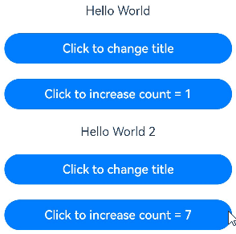

# \@State装饰器：组件内状态

被@State装饰的变量称为状态变量，使普通变量具备状态属性。当状态变量改变时，会触发其直接绑定的UI组件渲染更新。

在状态变量相关装饰器中，@State是最基础的装饰器，也是大部分状态变量的数据源。

在阅读\@State文档前，建议开发者对状态管理框架有基本的了解。建议提前阅读：[状态管理概述](./arkts-state-management-overview.md)。最佳实践请参考[状态管理最佳实践](https://developer.huawei.com/consumer/cn/doc/best-practices/bpta-status-management)。

> **说明：**
>
> 从API version 9开始，该装饰器支持在ArkTS卡片中使用。
>
> 从API version 11开始，该装饰器支持在原子化服务中使用。

## 概述

\@State装饰的变量与声明式范式中的其他被装饰变量一样，是私有的，只能从组件内部访问，在声明时必须指定其类型并完成本地初始化；若需从父组件初始化，也可选择使用命名参数机制完成赋值。

\@State装饰的变量拥有以下特点：

- \@State装饰的变量与子组件中的\@Prop装饰变量之间建立单向数据同步，与\@Link、\@ObjectLink装饰变量之间建立双向数据同步。

- \@State装饰的变量生命周期与其所属自定义组件的生命周期相同。

## 装饰器使用规则说明

| \@State变量装饰器  | 说明                                                         |
| ------------------ | ------------------------------------------------------------ |
| 装饰器参数         | 无                                                           |
| 同步类型           | 不与父组件中任何类型的变量同步。                             |
| 允许装饰的变量类型 | Object、class、string、number、boolean、enum类型，以及这些类型的数组。<br/>支持Date类型。<br/>API version 11及以上支持[Map](#装饰map类型变量)、[Set](#装饰set类型变量)类型。<br/>支持undefined和null类型。<br/>支持ArkUI框架定义的联合类型[Length](../../reference/apis-arkui/arkui-ts/ts-types.md#length)、[ResourceStr](../../reference/apis-arkui/arkui-ts/ts-types.md#resourcestr)、[ResourceColor](../../reference/apis-arkui/arkui-ts/ts-types.md#resourcecolor)类型。 <br/>类型必须指定。<br/>支持类型的场景见[观察变化](#观察变化)。<br/>不支持any。<br/>API version 11及以上支持上述支持类型的联合类型，比如string \| number, string \| undefined 或者 ClassA \| null，示例见[@State支持联合类型实例](#state支持联合类型实例)。 <br/>**注意：**<br/>当使用undefined和null的时候，建议显式指定类型，遵循TypeScript类型校验。比如：支持`@State a : string \| undefined = undefined`；不支持`@State a: string = undefined`。|
| 被装饰变量的初始值 | 必须本地初始化。                                               |

## 变量的传递/访问规则说明

| 传递/访问          | 说明                                                         |
| ------------------ | ------------------------------------------------------------ |
| 从父组件初始化     | 可以从父组件或本地初始化。<br/>从父组件初始化，传入的值非undefined时，将会覆盖本地初始化；传入的值为undefined时，则初始值为@State装饰变量的本地初始值。<br/>支持父组件中常规变量（常规变量对@State赋值，只是数值的初始化，常规变量的变化不会触发UI刷新，只有状态变量才能触发UI刷新）、\@State、[\@Link](arkts-link.md)、[\@Prop](arkts-prop.md)、[\@Provide](arkts-provide-and-consume.md)、[\@Consume](arkts-provide-and-consume.md)、[\@ObjectLink](arkts-observed-and-objectlink.md)、[\@StorageLink](arkts-appstorage.md#storagelink)、[\@StorageProp](arkts-appstorage.md#storageprop)、[\@LocalStorageLink](arkts-localstorage.md#localstoragelink)和[\@LocalStorageProp](arkts-localstorage.md#localstorageprop)装饰的变量，初始化子组件的\@State。 |
| 用于初始化子组件   | \@State装饰的变量支持初始化子组件的常规变量、\@State、\@Link、\@Prop、\@Provide。 |
| 是否支持组件外访问 | 不支持，只能在组件内访问。                                   |

  **图1** 初始化规则图示


## 观察变化和行为表现

并不是状态变量的所有更改都会引起UI的刷新，只有可以被框架观察到的修改才会引起UI刷新。本小节将介绍什么样的修改才能被观察到，以及观察到变化后，框架是怎么引起UI刷新的，即框架的行为表现是什么。

### 观察变化

- 当装饰的数据类型为boolean、string、number类型时，可以观察到数值的变化。

  ```ts
  // 简单类型
  @State count: number = 0;
  // 可以观察到值的变化
  this.count = 1;
  ```

- 当装饰的数据类型为class或Object时，可以观察到自身的赋值和属性赋值的变化，即Object.keys(observedObject)返回的所有属性。示例如下：
  
  声明Person和Model类。

  ```ts
  class Person {
    public value: string;
  
    constructor(value: string) {
      this.value = value;
    }
  }
  
  class Model {
    public value: string;
    public name: Person;
    constructor(value: string, person: Person) {
      this.value = value;
      this.name = person;
    }
  }
  ```

  \@State装饰的类型是Model。

  ```ts
  // class类型
  @State title: Model = new Model('Hello', new Person('World'));
  ```

  对\@State装饰变量的赋值。

  ```ts
  // class类型赋值
  this.title = new Model('Hi', new Person('ArkUI'));
  ```

  对\@State装饰变量的属性赋值。

  ```ts
  // class属性的赋值
  this.title.value = 'Hi';
  ```

  嵌套属性的赋值观察不到。

  ```ts
  // 嵌套的属性赋值观察不到
  this.title.name.value = 'ArkUI';
  ```
- 当装饰的对象是array时，可以观察到数组本身的赋值和添加、删除、更新数组的变化。例子如下。
  声明Model类。

  ```ts
  class Model {
    public value: number;
    constructor(value: number) {
      this.value = value;
    }
  }
  ```

  \@State装饰的对象为Model类型数组时。

  ```ts
  // 数组类型
  @State title: Model[] = [new Model(11), new Model(1)];
  ```

  数组自身的赋值可以观察到。

  ```ts
  // 数组赋值
  this.title = [new Model(2)];
  ```

  数组项的赋值可以观察到。

  ```ts
  // 数组项赋值
  this.title[0] = new Model(2);
  ```

  删除数组项可以观察到。

  ```ts
  // 数组项更改
  this.title.pop();
  ```

  新增数组项可以观察到。

  ```ts
  // 数组项更改
  this.title.push(new Model(12));
  ```

  数组项中属性的赋值观察不到。

  ```ts
  // 嵌套的属性赋值观察不到
  this.title[0].value = 6;
  ```

- 当装饰的对象是Date时，可以观察到Date的赋值，以及通过调用Date的接口`setFullYear`, `setMonth`, `setDate`, `setHours`, `setMinutes`, `setSeconds`, `setMilliseconds`, `setTime`, `setUTCFullYear`, `setUTCMonth`, `setUTCDate`, `setUTCHours`, `setUTCMinutes`, `setUTCSeconds`, `setUTCMilliseconds`更新Date的属性。

  ```ts
  @Entry
  @Component
  struct DatePickerExample {
    @State selectedDate: Date = new Date('2021-08-08');
  
    build() {
      Column() {
        Button('set selectedDate to 2023-07-08')
          .margin(10)
          .onClick(() => {
            this.selectedDate = new Date('2023-07-08');
          })
        Button('increase the year by 1')
          .margin(10)
          .onClick(() => {
            this.selectedDate.setFullYear(this.selectedDate.getFullYear() + 1);
          })
        Button('increase the month by 1')
          .margin(10)
          .onClick(() => {
            this.selectedDate.setMonth(this.selectedDate.getMonth() + 1);
          })
        Button('increase the day by 1')
          .margin(10)
          .onClick(() => {
            this.selectedDate.setDate(this.selectedDate.getDate() + 1);
          })
        DatePicker({
          start: new Date('1970-1-1'),
          end: new Date('2100-1-1'),
          selected: this.selectedDate
        })
      }.width('100%')
    }
  }
  ```

- 当装饰的变量是Map时，可以观察到Map整体的赋值，以及通过调用Map的接口`set`, `clear`, `delete`更新Map的值。详见[装饰Map类型变量](#装饰map类型变量)。

- 当装饰的变量是Set时，可以观察到Set整体的赋值，以及通过调用Set的接口`add`, `clear`, `delete`更新Set的值。详见[装饰Set类型变量](#装饰set类型变量)。

### 框架行为

- 当状态变量改变时，查询依赖该状态变量的组件。

- 执行依赖该状态变量的组件更新方法，实现组件更新渲染。

## 限制条件

1. \@State装饰的变量必须初始化，否则编译期会报错。

  ```ts
  // 错误写法，编译报错
  @State count: number;

  // 正确写法
  @State count: number = 10;
  ```

2. \@State不支持装饰Function类型的变量，框架会抛出运行时错误。

## 使用场景

### 装饰简单类型的变量

以下示例为\@State装饰的简单类型，count被\@State装饰成为状态变量，count的改变引起Button组件的刷新：

- 当状态变量count改变时，只能查询到Button组件与之关联。

- 执行Button组件的更新方法，实现按需刷新。

```ts
@Entry
@Component
struct MyComponent {
  @State count: number = 0;

  build() {
    Button(`click times: ${this.count}`)
      .onClick(() => {
        this.count += 1;
      })
  }
}
```


### 装饰class对象类型的变量

- 自定义组件MyComponent定义了被\@State装饰的状态变量count和title，其中title的类型为自定义类Model。如果count或title的值发生变化，则查询MyComponent中使用该状态变量的UI组件，并进行重新渲染。

- EntryComponent中有多个MyComponent组件实例，第一个MyComponent内部状态的更改不会影响第二个MyComponent。

```ts
class Model {
  public value: string;

  constructor(value: string) {
    this.value = value;
  }
}

@Entry
@Component
struct EntryComponent {
  build() {
    Column() {
      // 此处指定的参数都将在初始渲染时覆盖本地定义的默认值，并不是所有的参数都需要从父组件初始化
      MyComponent({ count: 1, increaseBy: 2 })
        .width(300)
      MyComponent({ title: new Model('Hello World 2'), count: 7 })
    }
  }
}

@Component
struct MyComponent {
  @State title: Model = new Model('Hello World');
  @State count: number = 0;
  increaseBy: number = 1;

  build() {
    Column() {
      Text(`${this.title.value}`)
        .margin(10)
      Button(`Click to change title`)
        .onClick(() => {
          // @State变量的更新将触发上面的Text组件内容更新
          this.title.value = this.title.value === 'Hello ArkUI' ? 'Hello World' : 'Hello ArkUI';
        })
        .width(300)
        .margin(10)

      Button(`Click to increase count = ${this.count}`)
        .onClick(() => {
          // @State变量的更新将触发该Button组件的内容更新
          this.count += this.increaseBy;
        })
        .width(300)
        .margin(10)
    }
  }
}
```



从该示例中，我们可以了解到\@State变量的初始化机制：

1. 没有外部传入的情况下，使用默认的值进行本地初始化：

   ```ts
   // title没有外部传入，使用本地的值new Model('Hello World')进行初始化
   MyComponent({ count: 1, increaseBy: 2 })
   // increaseBy没有外部传入，使用本地的值1进行初始化
   MyComponent({ title: new Model('Hello World 2'), count: 7 })
   ```

2. 在有外部传入的情况下，使用外部传入的值进行初始化：

   ```ts
   // count和increaseBy均有外部传入，分别使用传入的1和2进行初始化
   MyComponent({ count: 1, increaseBy: 2 })
   // title和count均有外部传入，分别使用传入的new Model('Hello World 2')和7进行初始化
   MyComponent({ title: new Model('Hello World 2'), count: 7 })
   ```

### 装饰Map类型变量

> **说明：**
>
> 从API version 11开始，\@State支持Map类型。

在下面的示例中，message类型为Map\<number, string\>，点击Button改变message的值，视图会随之刷新。

```ts
@Entry
@Component
struct MapSample {
  @State message: Map<number, string> = new Map([[0, "a"], [1, "b"], [3, "c"]]);

  build() {
    Row() {
      Column() {
        ForEach(Array.from(this.message.entries()), (item: [number, string]) => {
          Text(`${item[0]}`).fontSize(30)
          Text(`${item[1]}`).fontSize(30)
          Divider()
        })
        Button('init map').onClick(() => {
          this.message = new Map([[0, "a"], [1, "b"], [3, "c"]]);
        })
        Button('set new one').onClick(() => {
          this.message.set(4, "d");
        })
        Button('clear').onClick(() => {
          this.message.clear();
        })
        Button('replace the first one').onClick(() => {
          this.message.set(0, "aa");
        })
        Button('delete the first one').onClick(() => {
          this.message.delete(0);
        })
      }
      .width('100%')
    }
    .height('100%')
  }
}
```

### 装饰Set类型变量

> **说明：**
>
> 从API version 11开始，\@State支持Set类型。

在下面的示例中，message类型为Set\<number\>，点击Button改变message的值，视图会随之刷新。

```ts
@Entry
@Component
struct SetSample {
  @State message: Set<number> = new Set([0, 1, 2, 3, 4]);

  build() {
    Row() {
      Column() {
        ForEach(Array.from(this.message.entries()), (item: [number]) => {
          Text(`${item[0]}`).fontSize(30)
          Divider()
        })
        Button('init set').onClick(() => {
          this.message = new Set([0, 1, 2, 3, 4]);
        })
        Button('set new one').onClick(() => {
          this.message.add(5);
        })
        Button('clear').onClick(() => {
          this.message.clear();
        })
        Button('delete the first one').onClick(() => {
          this.message.delete(0);
        })
      }
      .width('100%')
    }
    .height('100%')
  }
}
```

## State支持联合类型实例

\@State支持联合类型和undefined和null，在下面的示例中，count类型为number | undefined，点击Button改变count的属性或者类型，视图会随之刷新。

```ts
@Entry
@Component
struct EntryComponent {
  build() {
    Column() {
      MyComponent()
    }
  }
}

@Component
struct MyComponent {
  @State count: number | undefined = 0;

  build() {
    Column() {
      Text(`count(${this.count})`)
      Button('change')
        .onClick(() => {
          this.count = undefined;
        })
    }
  }
}
```


## 常见问题

### 使用箭头函数改变状态变量未生效

箭头函数体内的`this`对象，就是定义该函数时所在的作用域指向的对象，而不是使用时所在的作用域指向的对象。所以在该场景下，`changeCoverUrl`的`this`指向`PlayDetailViewModel`，而不是被装饰器\@State代理的状态变量。

反例：

```ts

export default class PlayDetailViewModel {
  coverUrl: string = '#00ff00';

  changeCoverUrl= ()=> {
    this.coverUrl = '#00F5FF';
  }

}
```

```ts
import PlayDetailViewModel from './PlayDetailViewModel';

@Entry
@Component
struct PlayDetailPage {
  @State vm: PlayDetailViewModel = new PlayDetailViewModel();

  build() {
    Stack() {
      Text(this.vm.coverUrl).width(100).height(100).backgroundColor(this.vm.coverUrl)
      Row() {
        Button('点击改变颜色')
          .onClick(() => {
            this.vm.changeCoverUrl();
          })
      }
    }
    .width('100%')
    .height('100%')
    .alignContent(Alignment.Top)
  }
}
```

将当前this.vm传入，调用代理状态变量的属性赋值。

正例：

```ts

export default class PlayDetailViewModel {
  coverUrl: string = '#00ff00';

  changeCoverUrl= (model:PlayDetailViewModel)=> {
    model.coverUrl = '#00F5FF';
  }

}
```

```ts
import PlayDetailViewModel from './PlayDetailViewModel';

@Entry
@Component
struct PlayDetailPage {
  @State vm: PlayDetailViewModel = new PlayDetailViewModel();

  build() {
    Stack() {
      Text(this.vm.coverUrl).width(100).height(100).backgroundColor(this.vm.coverUrl)
      Row() {
        Button('点击改变颜色')
          .onClick(() => {
            let self = this.vm;
            this.vm.changeCoverUrl(self);
          })
      }
    }
    .width('100%')
    .height('100%')
    .alignContent(Alignment.Top)
  }
}
```

### 类的构造函数中通过捕获this修改变量无法观察

在状态管理中，类会被一层“代理”进行包装。当在组件中改变该类的成员变量时，会被该代理进行拦截，在更改数据源中值的同时，也会将变化通知给绑定的组件，从而实现观测变化与触发刷新。

当在构造函数中初始化修改`success`的箭头函数时，`TestModel`实例尚未被代理封装，`this`指向`TestModel`实例本身。因此，后续触发`query`事件时，状态管理无法观测到变化。

当开发者将修改`success`的箭头函数放在`query`中时，已完成`TestModel`对象初始化和代理封装。通过`this.viewModel.query()`调用`query`时，`query`函数中的`this`指向`viewModel`代理对象，对代理对象成员属性`isSuccess`的更改能够被观测到，因此触发`query`事件可以被状态管理观测到变化。

【反例】

```ts
@Entry
@Component
struct Index {
  @State viewModel: TestModel = new TestModel();

  build() {
    Row() {
      Column() {
        Text(this.viewModel.isSuccess ? 'success' : 'failed')
          .fontSize(50)
          .fontWeight(FontWeight.Bold)
          .onClick(() => {
            this.viewModel.query();
          })
      }.width('100%')
    }.height('100%')
  }
}

export class TestModel {
  isSuccess: boolean = false;
  model: Model

  constructor() {
    this.model = new Model(() => {
      this.isSuccess = true;
      console.log(`this.isSuccess: ${this.isSuccess}`);
    })
  }

  query() {
    this.model.query();
  }
}

export class Model {
  callback: () => void

  constructor(cb: () => void) {
    this.callback = cb;
  }

  query() {
    this.callback();
  }
}
```

上述示例代码中，状态变量的修改在构造函数内。界面刚开始时显示“failed”，点击后日志打印“this.isSuccess: true”，表明修改成功，但界面仍然显示“failed”，这说明UI未刷新。

【正例】

```ts
@Entry
@Component
struct Index {
  @State viewModel: TestModel = new TestModel();

  build() {
    Row() {
      Column() {
        Text(this.viewModel.isSuccess ? 'success' : 'failed')
          .fontSize(50)
          .fontWeight(FontWeight.Bold)
          .onClick(() => {
            this.viewModel.query();
          })
      }.width('100%')
    }.height('100%')
  }
}

export class TestModel {
  isSuccess: boolean = false;
  model: Model = new Model(() => {
  })

  query() {
    this.model.callback = () => {
      this.isSuccess = true;
    }
    this.model.query();
  }
}

export class Model {
  callback: () => void

  constructor(cb: () => void) {
    this.callback = cb;
  }

  query() {
    this.callback();
  }
}
```

上文示例代码将状态变量的修改放在类的普通方法中，界面开始时显示“failed”，点击后显示“success”。

### 状态变量只能影响其直接绑定的UI组件的刷新

【示例1】

```ts
class Info {
  address: string = '杭州';
}

@Entry
@Component
struct Test {
  @State message: string = '上海';
  @State info: Info = new Info();

  aboutToAppear(): void {
    this.info.address = this.message;
  }

  build() {
    Column() {
      Text(`${this.message}`);
      Text(`${this.info.address}`);
      Button('change')
        .onClick(() => {
          this.info.address = '北京';
        })
    }
  }
}
```

点击`Button('change')`只会触发第二个`Text`组件的刷新，因为`message`是字符串类型。字符串是值类型，点击按钮时，改变的是`info`中的`address`值，而不会影响`this.message`的值，因此第一个Text组件不会刷新。

【示例2】

```ts
class Info {
  address: string = '杭州';

  constructor(address: string) {
    this.address = address;
  }
}

class User {
  info: Info = new Info('天津');
}

@Entry
@Component
struct Test {
  @State info: Info = new Info('上海');
  @State user: User = new User();

  aboutToAppear(): void {
    this.user.info = this.info;
  }

  build() {
    Column() {
      Text(`${this.info.address}`);
      Text(`${this.user.info.address}`);
      Button('change')
        .onClick(() => {
          this.user.info.address = '北京';
        })
    }
  }
}
```

在`aboutToAppear`中，`info`的引用被赋值给了`user`的成员属性`info`。因此，点击按钮改变`info`中的属性时，会触发第一个`Text`组件的刷新。第二个`Text`组件由于观测能力仅有一层，无法检测到二层属性的变化，所以不会刷新。

【示例3】

```ts
class Info {
  address: string = '杭州';

  constructor(address: string) {
    this.address = address;
  }
}

class User {
  info: Info = new Info('天津');
}

@Entry
@Component
struct Test {
  @State info: Info = new Info('上海');
  @State user: User = new User();

  aboutToAppear(): void {
    this.user.info = this.info;
  }

  build() {
    Column() {
      Text(`${this.info.address}`);
      Text(`${this.user.info.address}`);
      Button('change')
        .onClick(() => {
          this.user.info = new Info('广州');
          this.user.info.address = '北京';
        })
    }
  }
}
```

上述示例中，点击Button('change')，只会触发第二个Text组件的刷新。这是因为点击按钮后，首先执行`this.user.info = new Info('广州')`，会创建一个新的Info对象。再执行`this.user.info.address = '北京'`，改变的是这个新创建的Info对象中的address值，而原始的Info对象中的address值不会受到影响。

### 复杂类型常量重复赋值给状态变量触发刷新

```ts
class DataObj {
  name: string = 'default name';

  constructor(name: string) {
    this.name = name;
  }
}

@Entry
@Component
struct Index {
  list: DataObj[] = [new DataObj('a'), new DataObj('b'), new DataObj('c')];
  @State dataObjFromList: DataObj = this.list[0];

  build() {
    Column() {
      ConsumerChild({ dataObj: this.dataObjFromList })
      Button('change to self').onClick(() => {
        this.dataObjFromList = this.list[0];
      })
    }
  }
}

@Component
struct ConsumerChild {
  @Link @Watch('onDataObjChange') dataObj: DataObj;

  onDataObjChange() {
    console.log("dataObj changed");
  }

  getContent() {
    console.log(`this.dataObj.name change: ${this.dataObj.name}`);
    return this.dataObj.name;
  }

  build() {
    Column() {
      Text(this.getContent()).fontSize(30)
    }
  }
}
```

以上示例每次点击Button('change to self')，把相同的类常量赋值给一个Class类型的状态变量，会触发刷新并输出`this.dataObj.name change: a`日志。原因是在状态管理V1中，会给被\@Observed装饰的类对象以及使用状态变量装饰器如@State装饰的Class、Date、Map、Set、Array类型的对象添加一层代理用于观测一层属性或API调用产生的变化。  
当再次赋值`list[0]`时，`dataObjFromList`已经是`Proxy`类型，而`list[0]`是`Object`类型，因此判断两者不相等，会触发赋值和刷新。 
为了避免这种不必要的赋值和刷新，可以通过用\@Observed装饰类，或者使用[UIUtils.getTarget()](./arkts-new-getTarget.md)获取原始对象提前进行新旧值的判断，如果相同则不执行赋值。  
方法一：增加\@Observed

```ts
@Observed
class DataObj {
  name: string = 'default name';

  constructor(name: string) {
    this.name = name;
  }
}

@Entry
@Component
struct Index {
  list: DataObj[] = [new DataObj('a'), new DataObj('b'), new DataObj('c')];
  @State dataObjFromList: DataObj = this.list[0];

  build() {
    Column() {
      ConsumerChild({ dataObj: this.dataObjFromList })
      Button('change to self').onClick(() => {
        this.dataObjFromList = this.list[0];
      })
    }
  }
}

@Component
struct ConsumerChild {
  @Link @Watch('onDataObjChange') dataObj: DataObj;

  onDataObjChange() {
    console.log("dataObj changed");
  }

  build() {
    Column() {
      Text(this.dataObj.name).fontSize(30)
    }
  }
}
```

以上示例，给对应的类增加了\@Observed装饰器后，list[0]已经是Proxy类型了，这样再次赋值时，相同的对象，就不会触发刷新。

方法二：使用[UIUtils.getTarget()](./arkts-new-getTarget.md)获取原始对象

```ts
import { UIUtils } from '@ohos.arkui.StateManagement';

class DataObj {
  name: string = 'default name';

  constructor(name: string) {
    this.name = name;
  }
}

@Entry
@Component
struct Index {
  list: DataObj[] = [new DataObj('a'), new DataObj('b'), new DataObj('c')];
  @State dataObjFromList: DataObj = this.list[0];

  build() {
    Column() {
      ConsumerChild({ dataObj: this.dataObjFromList })
      Button('change to self').onClick(() => {
        // 获取原始对象来和新值做对比
        if (UIUtils.getTarget(this.dataObjFromList) !== this.list[0]) {
          this.dataObjFromList = this.list[0];
        }
      })
    }
  }
}

@Component
struct ConsumerChild {
  @Link @Watch('onDataObjChange') dataObj: DataObj;

  onDataObjChange() {
    console.log("dataObj changed");
  }

  build() {
    Column() {
      Text(this.dataObj.name).fontSize(30)
    }
  }
}
```

以上示例，在赋值前，使用getTarget获取了对应状态变量的原始对象，经过对比后，如果和当前对象一样，就不赋值，不触发刷新。

### 不允许在build里改状态变量

不允许在build里改变状态变量，状态管理框架会在运行时报出Error级别日志。

下面的示例，渲染的流程是：

1. 创建Index自定义组件。

2. 执行Index的build方法：

    1. 创建Column组件。

    2. 创建Text组件。创建Text组件的过程中，触发this.count++。

    3. count的改变再次触发Text组件的刷新。

    4. Text最终显示为2。

```ts
@Entry
@Component
struct Index {
  @State count: number = 1;

  build() {
    Column() {
      // 应避免直接在Text组件内改变count的值
      Text(`${this.count++}`)
        .width(50)
        .height(50)
    }
  }
}
```

在首次创建的过程中，Text组件被多渲染了一次，最终显示为2。

框架识别到在build里改变状态变量会打error日志，error日志为：

```ts
FIX THIS APPLICATION ERROR: @Component 'Index'[4]: State variable 'count' has changed during render! It's illegal to change @Component state while build (initial render or re-render) is on-going. Application error!
```

在上述示例中，Text组件多渲染了一次。这个错误行为不会造成严重的后果，所以许多开发者忽略了这个日志。

但是，此行为是严重错误的，随着工程的复杂度升级，隐患将逐渐增大。见下一个例子。

```ts
@Entry
@Component
struct Index {
  @State message: number = 20;

  build() {
    Column() {
      Text(`${this.message++}`)

      Text(`${this.message++}`)
    }
    .height('100%')
    .width('100%')
  }
}
```
上面示例渲染过程：

1. 创建第一个Text组件，触发this.message改变。

2. this.message改变又触发第二个Text组件的刷新。

3. 第二个Text组件的刷新又触发this.message的改变，触发第一个Text组件刷新。

4. 循环重新渲染……

5. 系统长时间无响应，appfreeze。

因此，在build方法中改变状态变量是完全错误的。当发现“FIX THIS APPLICATION ERROR: @Component ... has changed during render! It's illegal to change @Component state while build (initial render or re-render) is on-going. Application error!”日志时，即使当前没有带来严重后果，也应该警惕并修改错误写法。

### 使用a.b(this.object)形式调用，不会触发UI刷新

在build方法内，当\@State装饰的变量是Object类型、且通过a.b(this.object)形式调用时，b方法内传入的是this.object的原始对象，修改其属性，无法触发UI刷新。如下例中，通过静态方法Balloon.increaseVolume或者this.reduceVolume修改balloon的volume时，UI不会刷新。

【反例】

```ts
class Balloon {
  volume: number;
  constructor(volume: number) {
    this.volume = volume;
  }

  static increaseVolume(balloon:Balloon) {
    balloon.volume += 2;
  }
}

@Entry
@Component
struct Index {
  @State balloon: Balloon = new Balloon(10);

  reduceVolume(balloon:Balloon) {
    balloon.volume -= 1;
  }

  build() {
    Column({space:8}) {
      Text(`The volume of the balloon is ${this.balloon.volume} cubic centimeters.`)
        .fontSize(30)
      Button(`increaseVolume`)
        .onClick(()=>{
          // 通过静态方法调用，无法触发UI刷新
          Balloon.increaseVolume(this.balloon);
        })
      Button(`reduceVolume`)
        .onClick(()=>{
          // 使用this通过自定义组件内部方法调用，无法触发UI刷新
          this.reduceVolume(this.balloon);
        })
    }
    .width('100%')
    .height('100%')
  }
}
```

可以通过以下步骤为this.balloon保留Proxy代理，以实现UI刷新。

1. 先将this.balloon赋值给临时变量。
2. 再使用临时变量完成原本的调用逻辑。

【正例】

```ts
class Balloon {
  volume: number;
  constructor(volume: number) {
    this.volume = volume;
  }

  static increaseVolume(balloon:Balloon) {
    balloon.volume += 2;
  }
}

@Entry
@Component
struct Index {
  @State balloon: Balloon = new Balloon(10);

  reduceVolume(balloon:Balloon) {
    balloon.volume -= 1;
  }

  build() {
    Column({space:8}) {
      Text(`The volume of the balloon is ${this.balloon.volume} cubic centimeters.`)
        .fontSize(30)
      Button(`increaseVolume`)
        .onClick(()=>{
          // 通过赋值给临时变量保留Proxy代理
          let balloon1 = this.balloon;
          Balloon.increaseVolume(balloon1);
        })
      Button(`reduceVolume`)
        .onClick(()=>{
          // 通过赋值给临时变量保留Proxy代理
          let balloon2 = this.balloon;
          this.reduceVolume(balloon2);
        })
    }
    .width('100%')
    .height('100%')
  }
}
```

### 用注册回调的方式更改状态变量需要执行解注册

开发者可以在aboutToAppear中注册箭头函数，以此改变组件中的状态变量。

>**注意：**
>
> 需要在aboutToDisappear中将注册的函数置空，以避免箭头函数捕获自定义组件的this实例，导致自定义组件无法被释放，从而造成内存泄漏。

```ts
class Model {
  private callback: (() => void) | undefined = () => {};

  add(callback: () => void): void {
    this.callback = callback;
  }

  delete(): void {
    this.callback = undefined;
  }

  call(): void {
    if (this.callback) {
      this.callback();
    }
  }
}

let model: Model = new Model();

@Entry
@Component
struct Test {
  @State count: number = 10;

  aboutToAppear(): void {
    model.add(() => {
      this.count++;
    })
  }

  build() {
    Column() {
      Text(`count值: ${this.count}`)
      Button('change')
        .onClick(() => {
          model.call();
        })
    }
  }

  aboutToDisappear(): void {
    model.delete();
  }
}
```

此外，也可以使用 LocalStorage在[自定义组件外改变状态变量](./arkts-localstorage.md#自定义组件外改变状态变量)。