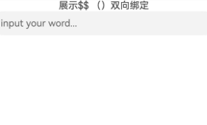

# \$$()函数：系统组件双向同步

\$$()函数为系统组件提供ArkTS变量的双向绑定能力，使得ArkTS变量和系统组件的内部状态保持同步。

内部状态具体指什么取决于组件。例如，[TextInput](../../reference/apis-arkui/arkui-ts/ts-basic-components-textinput.md)组件的text参数。

>**说明：**
>
>从API version 20开始，该接口仅支持在ArkTS1.2上使用。
>
>

## 使用规则

- 当前\$$()函数支持基础类型变量，以及[\@State](arkts-state.md)和[\@Link](arkts-link.md)装饰的变量。

- 当前支持$$()的组件属性如下：

| 组件                                                         | 支持的参数/属性 | 起始API版本 |
  | ------------------------------------------------------------ | --------------- | ----------- |
  | [Checkbox](../../reference/apis-arkui/arkui-ts/ts-basic-components-checkbox.md) | select          | 20          |
  | [CheckboxGroup](../../reference/apis-arkui/arkui-ts/ts-basic-components-checkboxgroup.md) | selectAll       | 20          |
  | [DatePicker](../../reference/apis-arkui/arkui-ts/ts-basic-components-datepicker.md) | selected        | 20          |
  | [TimePicker](../../reference/apis-arkui/arkui-ts/ts-basic-components-timepicker.md) | selected        | 20          |
  | [MenuItem](../../reference/apis-arkui/arkui-ts/ts-basic-components-menuitem.md) | selected        | 20          |
  | [Panel](../../reference/apis-arkui/arkui-ts/ts-container-panel.md)         | mode            | 20          |
  | [Radio](../../reference/apis-arkui/arkui-ts/ts-basic-components-radio.md)  | checked         | 20          |
  | [Rating](../../reference/apis-arkui/arkui-ts/ts-basic-components-rating.md) | rating          | 20          |
  | [Search](../../reference/apis-arkui/arkui-ts/ts-basic-components-search.md) | value           | 20          |
  | [SideBarContainer](../../reference/apis-arkui/arkui-ts/ts-container-sidebarcontainer.md) | showSideBar     | 20          |
  | [Slider](../../reference/apis-arkui/arkui-ts/ts-basic-components-slider.md) | value           | 20          |
  | [Stepper](../../reference/apis-arkui/arkui-ts/ts-basic-components-stepper.md) | index           | 20          |
  | [Swiper](../../reference/apis-arkui/arkui-ts/ts-container-swiper.md)       | index       | 20          |
  | [Tabs](../../reference/apis-arkui/arkui-ts/ts-container-tabs.md)           | index           | 20          |
  | [TextArea](../../reference/apis-arkui/arkui-ts/ts-basic-components-textarea.md) | text            | 20          |
  | [TextInput](../../reference/apis-arkui/arkui-ts/ts-basic-components-textinput.md) | text            | 20          |
  | [TextPicker](../../reference/apis-arkui/arkui-ts/ts-basic-components-textpicker.md) | selected、value | 20          |
  | [Toggle](../../reference/apis-arkui/arkui-ts/ts-basic-components-toggle.md) | isOn            | 20          |
  | [AlphabetIndexer](../../reference/apis-arkui/arkui-ts/ts-container-alphabet-indexer.md) | selected        | 20          |
  | [Select](../../reference/apis-arkui/arkui-ts/ts-basic-components-select.md) | selected、value | 20          |
  | [BindSheet](../../reference/apis-arkui/arkui-ts/ts-universal-attributes-sheet-transition.md#bindsheet) | isShow | 20          |
  | [BindContentCover](../../reference/apis-arkui/arkui-ts/ts-universal-attributes-modal-transition.md#bindcontentcover) | isShow | 20          |
  | [Refresh](../../reference/apis-arkui/arkui-ts/ts-container-refresh.md) | refreshing | 20 |
  | [GridItem](../../reference/apis-arkui/arkui-ts/ts-container-griditem.md) | selected | 20 |
  | [ListItem](../../reference/apis-arkui/arkui-ts/ts-container-listitem.md) | selected | 20 |

- \$$()函数中绑定的状态变量变化时，会触发UI的同步刷新。

## 使用示例

以[TextInput](../../reference/apis-arkui/arkui-ts/ts-basic-components-textinput.md)方法的text参数为例：


```ts
// xxx.ets
import { Text, Entry, Column, Component, $$, TextInput } from '@ohos.arkui.component';
import { State } from '@ohos.arkui.stateManagement';

@Entry
@Component
struct MyStateSample {
  @State stateVar: string = '';

  build() {
    Column() {
      Text('展示$$ （）双向绑定')
      Text(this.stateVar)
      TextInput({ text: $$(this.stateVar), placeholder: 'input your word...' })
    }.width(`100%`).height(`100%`)
  }
}
```



