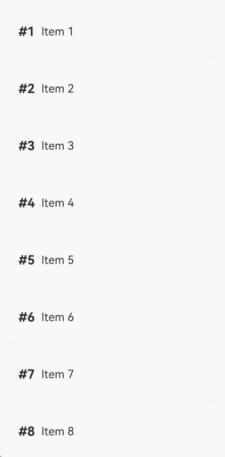

# 组件复用迁移
<!--Kit: ArkUI--> 
<!--Subsystem: ArkUI--> 
<!--Owner: @jiyujia926--> 
<!--Designer: @zhangboren--> 
<!--Tester: @zhangwenhan12--> 
<!--Adviser: @zhang_yixin13-->

本文档主要介绍组件复用从V1向V2的迁移，涉及如下装饰器。


| V1装饰器名称 | V2装饰器名称 |
| -------- | -------- |
| [@Reusable](./arkts-reusable.md) | [@ReusableV2](./arkts-new-reusableV2.md) |


## \@Reusable->\@ReusableV2迁移规则


### V1->V2组件迁移

**迁移规则**

- 将\@Component装饰的父自定义组件迁移至\@ComponentV2装饰。

- 将\@Reusable装饰的子自定义组件迁移为\@ReusableV2装饰。

- 涉及组件内状态变量的迁移可参考[组件内状态变量迁移指导](./arkts-v1-v2-migration-inner-component.md)。


### aboutToRecycle与aboutToReuse迁移

**迁移规则**

- [aboutToRecycle](../../reference/apis-arkui/arkui-ts/ts-custom-component-lifecycle.md#abouttorecycle10)生命周期无需改动，可保留原实现。

- [aboutToReuse](../../reference/apis-arkui/arkui-ts/ts-custom-component-lifecycle.md#abouttoreuse18)生命周期在组件复用V2中进行了优化，去除了参数的同时，在复用前会自动重置各状态变量（详情参考[复用前的组件内状态变量重置](./arkts-new-reusableV2.md#复用前的组件内状态变量重置)），无需开发者在aboutToReuse中手动赋值回初始值。

``` TypeScript
// V1原组件
@Reusable
@Component
struct ReusableComponent {
  // 存在外部传值的可能性，可迁移为@Local或@Param @Once
  @State val: string = 'Hello World';
  aboutToRecycle(): void {
    // 这里可以释放比较占内存的内容或其他非必要资源引用，避免一直占用内存
    console.info('ReusableComponent aboutToRecycle called');
  }
  aboutToReuse(params: ESObject): void {
    console.info('ReusableComponent aboutToReuse called');
    this.val = params.val ?? 'Hello World'; // 对@State变量重新赋值
  }
  build() {
    Column() {
      Text(`val: ${this.val}`)
    }
  }
}

// V2迁移后组件
@ReusableV2
@ComponentV2
struct ReusableV2Component {
  // 当不存在外部传入值时，可迁移为@Local
  @Local val: string = 'Hello World';
  // 当存在外部传入值时，可迁移为@Param @Once
  @Require @Param @Once param: string;
  aboutToRecycle(): void {
    // aboutToRecycle无需改动
    console.info('ReusableV2Component aboutToRecycle called');
  }
  aboutToReuse(): void { // aboutToReuse不再有参数
    // aboutToReuse执行时@Local已重置回'Hello World'，@Param @Once已经重置回外部传入值
    console.info('ReusableV2Component aboutToReuse called');
    this.val = 'Hello ArkUI'; // 可以在复用阶段修改为其他值
    this.param = 'Hello ArkUI'; // @Param @Once可本地修改
  }
  build() {
    Column() {
      Text(`val: ${this.val}`)
      Text(`param: ${this.param}`)
    }
  }
}
```


### reuseId->reuse

**迁移规则**

在组件复用V1中，使用[reuseId](../../reference/apis-arkui/arkui-ts/ts-universal-attributes-reuse-id.md#reuseid)属性标记组件的复用组。迁移到组件复用V2后，需更换使用[reuse](../../reference/apis-arkui/arkui-ts/ts-universal-attributes-reuse.md#reuse)属性。

``` TypeScript
// V1原写法
ReusableComponent().reuseId('groupA')
// V2迁移后写法
ReusableV2Component().reuse({reuseId: () => 'groupA'})
```


### 组件冻结

**迁移规则**

组件复用V1中，当开发者打开复用组件的冻结开关freezeWhenInactive时，才会冻结复用池中的组件，详细规则参考[自定义组件冻结功能](./arkts-custom-components-freeze.md)。而在组件复用V2中，会自动开启冻结，详细规则参考[复用阶段的冻结](./arkts-new-reusableV2.md#复用阶段的冻结)。


### LazyForEach->Repeat

**迁移规则**

组件复用V1中，经常使用LazyForEach配合组件复用实现高性能懒加载。在组件复用V2中，推荐使用[Repeat](../rendering-control/arkts-new-rendering-control-repeat.md)替代[LazyForEach](../rendering-control/arkts-rendering-control-lazyforeach.md)。Repeat自身能够对组件进行复用，相比LazyForEach具有更简洁的API以及更好的性能。由LazyForEach迁移至Repeat可参考[LazyForEach迁移Repeat](./arkts-v1-v2-migration-rendering-control-repeat.md#lazyforeach迁移repeat)。


## @Reusable->@ReusableV2迁移示例


### if使用场景

\@Reusable使用示例请参考[动态布局更新](./arkts-reusable.md#动态布局更新)。

\@ReusableV2的if使用场景示例代码如下：

<!-- @[reusable_if_scene](https://gitcode.com/openharmony/applications_app_samples/blob/master/code/DocsSample/ArkUISample/StateMigrationProject/entry/src/main/ets/pages/reusablemigration/ReusableIfScene.ets) -->

``` TypeScript
// 数据模型，使用@ObservedV2和@Trace实现深度观察
@ObservedV2
class Message {
  // 使用@Trace装饰需要观察变化的属性
  @Trace public value: string | undefined;

  constructor(value: string) {
    this.value = value;
  }
}

@Entry
@ComponentV2
struct ReusableIfScene {
  // 控制子组件显示与隐藏的开关
  @Local isSwitch: boolean = true;

  build() {
    Column() {
      // 点击按钮切换子组件的显示与隐藏，触发组件的创建与复用
      Button('Hello')
        .fontSize(24)
        .fontWeight(FontWeight.Bold)
        .onClick(() => {
          this.isSwitch = !this.isSwitch;
        })
      if (this.isSwitch) {
        // 如果只有一个复用的组件，可以不用设置reuse
        Child({ message: new Message('Child') })
          .reuse({ reuseId: () => 'Child' })
      }
    }
    .height('100%')
    .width('100%')
  }
}

// 复用组件
@ReusableV2
@ComponentV2
struct Child {
  // @Param @Once接收外部传入值，仅初始化时同步一次
  @Require @Param @Once message: Message = new Message('AboutToReuse');

  // 组件复用时回调，如无需对状态变量做额外修改可移除
  aboutToReuse() {
    console.info('Recycle====Child==');
  }

  build() {
    Column() {
      // 显示当前消息内容
      Text(this.message.value)
        .fontSize(30)
        .margin(20)
    }
    .borderWidth(1)
    .margin({ top: 10 })
    .height(100)
  }
}
```


### 列表滚动-Repeat使用场景

\@Reusable使用示例请参考[列表滚动配合LazyForEach使用](./arkts-reusable.md#列表滚动配合lazyforeach使用)。

\@ReusableV2的列表滚动-Repeat使用场景示例代码如下：

<!-- @[reusable_repeat_scene](https://gitcode.com/openharmony/applications_app_samples/blob/master/code/DocsSample/ArkUISample/StateMigrationProject/entry/src/main/ets/pages/reusablemigration/ReusableRepeatScene.ets) -->

``` TypeScript
@Entry
@ComponentV2
struct ReuseV2Demo {
  // 列表数据源
  private data: string[] = [];

  // 初始化列表数据
  aboutToAppear() {
    for (let i = 1; i < 1000; i++) {
      this.data.push(i + '');
    }
  }

  build() {
    Column() {
      List({ space: 10 }) {
        // 使用Repeat的virtualScroll模式实现懒加载，配合复用组件提升滚动性能
        Repeat(this.data)
          .virtualScroll()
          .each((ri) => {
            ListItem() {
              CardViewV2({ item: ri.item })
            }
          })
      }
      .width('100%')
      .height('100%')
      .padding(10)
    }
  }
}

// 复用组件
@ReusableV2
@ComponentV2
export struct CardViewV2 {
  // 使用@Param接收外部传入变量并观察变化
  @Param item: string = '';

  // Repeat自身能够进行复用，不会走到自定义组件复用的生命周期
  aboutToReuse(): void {
  }

  build() {
    Row() {
      // 显示当前列表项序号
      Text(`#${this.item}`)
        .fontSize(20)
        .fontColor('#007dffa')
        .fontWeight(FontWeight.Bold)

      // 显示列表项内容
      Text(`Item ${this.item}`)
        .fontSize(18)
        .fontColor('#333333')
        .margin({ left: 10 })
    }
    .width('100%')
    .height(80)
    .padding({ left: 20, right: 20 })
    .borderRadius(12)
    .backgroundColor('#ffffff')
    .shadow({
      radius: 4,
      color: '#1a000000',
      offsetX: 0,
      offsetY: 2
    })
  }
}
```


### 列表滚动-if使用场景

\@Reusable使用示例请参考[列表滚动-if使用场景](./arkts-reusable.md#列表滚动-if使用场景)。

\@ReusableV2的列表滚动-if使用场景示例代码如下：

<!-- @[reusable_list_if_scene](https://gitcode.com/openharmony/applications_app_samples/blob/master/code/DocsSample/ArkUISample/StateMigrationProject/entry/src/main/ets/pages/reusablemigration/ReusableListIfScene.ets) -->

``` TypeScript
@Entry
@ComponentV2
struct ReusableListIfScene {
  // 列表数据源
  private dataSource: FriendMoment[] = [];

  // 初始化数据源，包含有图片和无图片两种类型
  aboutToAppear(): void {
    for (let i = 0; i < 20; i++) {
      let title = i + 1 + 'test_if';
      // 开发者可自行替换显示图片的内容，此处以app.media.startIcon为例
      this.dataSource.push(new FriendMoment(i.toString(), title, 'app.media.startIcon'));
    }

    for (let i = 0; i < 50; i++) {
      let title = i + 1 + 'test_if';
      this.dataSource.push(new FriendMoment(i.toString(), title, ''));
    }
  }

  build() {
    Column() {
      List({ space: 3 }) {
        Repeat(this.dataSource)
          .virtualScroll()
          .each((ri) => {
            ListItem() {
              // 根据是否有图片选择不同的复用组
              if (ri.item.image) {
                OneMoment({ moment: ri.item })
                  .reuse({ reuseId: () => 'withImage' })
              } else {
                OneMoment({ moment: ri.item })
                  .reuse({ reuseId: () => 'noImage' })
              }
            }
          })
      }
      .cachedCount(0)
    }
  }
}

// 数据模型
@ObservedV2
class FriendMoment {
  @Trace public id: string = '';
  @Trace public text: string = '';
  @Trace public title: string = '';
  @Trace public image: string = '';
  @Trace public answers: Array<ResourceStr> = [];

  constructor(id: string, title: string, image: string) {
    this.text = id;
    this.title = title;
    this.image = image;
  }
}

// 复用组件
@ReusableV2
@ComponentV2
export struct OneMoment {
  // 接收外部传入的数据对象
  @Require @Param moment: FriendMoment;

  // 复用id相同的组件才能触发复用，如无需对状态变量做额外修改可移除
  aboutToReuse(): void {
    console.info(`=====aboutToReuse====OneMoment==复用了==${this.moment.text}`);
  }

  build() {
    Column() {
      // 显示文本内容
      Text(this.moment.text)
      // if分支判断，有图片时显示图片区域
      if (this.moment.image !== '') {
        // 使用Flex包裹实现自动换行布局
        Flex({ wrap: FlexWrap.Wrap }) {
          Image($r(this.moment.image))
            .height(50)
            .width(50)
          Image($r(this.moment.image))
            .height(50)
            .width(50)
          Image($r(this.moment.image))
            .height(50)
            .width(50)
          Image($r(this.moment.image))
            .height(50)
            .width(50)
        }
      }
    }
  }
}
```


### 列表滚动-Repeat全量加载使用场景

状态管理V2推荐使用[Repeat全量加载模式](../rendering-control/arkts-new-rendering-control-repeat.md#懒加载能力说明)替代[ForEach](../rendering-control/arkts-rendering-control-foreach.md)实现循环渲染。

\@Reusable使用示例请参考[列表滚动-ForEach使用场景](./arkts-reusable.md#列表滚动-foreach使用场景)。

\@ReusableV2的列表滚动-Repeat全量加载使用场景示例代码如下：

<!-- @[reusable_repeat_all_load_scene](https://gitcode.com/openharmony/applications_app_samples/blob/master/code/DocsSample/ArkUISample/StateMigrationProject/entry/src/main/ets/pages/reusablemigration/ReusableRepeatAllLoadScene.ets) -->

``` TypeScript
// xxx.ets
@Entry
@ComponentV2
struct ReusableRepeatAllLoadScene {
  // 列表数据源
  @Local dataSource: ListItemObject[] = [];

  build() {
    Column() {
      Row() {
        // 点击clear清空列表数据，触发组件销毁
        Button('clear')
          .onClick(() => {
            for (let i = 1; i < 50; i++) {
              this.dataSource.pop();
            }
          })
          .height(40)

        // 点击update重新填充数据，触发组件创建或复用
        Button('update')
          .onClick(() => {
            for (let i = 1; i < 50; i++) {
              let obj = new ListItemObject();
              obj.id = i;
              obj.uuid = Math.random().toString();
              obj.isExpand = false;
              this.dataSource.push(obj);
            }
          })
          .height(40)
      }

      List({ space: 10 }) {
        // 不使用virtualScroll，采用Repeat全量加载模式
        Repeat(this.dataSource)
          .each((ri) => {
            ListItem() {
              ListItemView({
                obj: ri.item
              })
            }
          })
      }
      .cachedCount(0)
      .width('100%')
      .height('100%')
    }
  }
}

// 复用组件
@ReusableV2
@ComponentV2
struct ListItemView {
  // 接收外部传入的数据对象
  @Require @Param obj: ListItemObject;

  // 首次创建时回调
  aboutToAppear(): void {
    // 点击update，首次进入，上下滑动，由于Repeat全量加载属性，无法复用
    console.info('=====aboutToAppear=====ListItemView==创建了==');
  }

  // 组件复用时回调
  aboutToReuse() {
    // 点击clear，再次update，复用成功
    // 符合一帧内重复创建多个已被销毁的自定义组件
    // 如无需对状态变量做额外修改可移除
    console.info('=====aboutToReuse====ListItemView==复用了==');
  }

  build() {
    Column({ space: 10 }) {
      // 显示标题文本
      Text(`${this.obj.id}.标题`)
        .fontSize(16)
        .fontColor('#000000')
        .padding({
          top: 20,
          bottom: 20,
        })

      // 根据展开状态显示额外内容
      if (this.obj.isExpand) {
        Text('expand')
          .fontSize(14)
          .fontColor('#999999')
      }
    }
    .width('100%')
    .borderRadius(10)
    .backgroundColor(Color.White)
    .padding(15)
    // 点击切换展开/折叠状态
    .onClick(() => {
      this.obj.isExpand = !this.obj.isExpand;
    })
  }
}

// 数据模型
@ObservedV2
class ListItemObject {
  @Trace public uuid: string = '';
  @Trace public id: number = 0;
  @Trace public isExpand: boolean = false;
}
```


### Grid使用场景

\@Reusable使用示例请参考[Grid使用场景](./arkts-reusable.md#grid使用场景)。

\@ReusableV2的Grid使用场景示例代码如下：

<!-- @[reusable_grid_scene](https://gitcode.com/openharmony/applications_app_samples/blob/master/code/DocsSample/ArkUISample/StateMigrationProject/entry/src/main/ets/pages/reusablemigration/ReusableGridScene.ets) -->

``` TypeScript
@Entry
@ComponentV2
struct MyComponent {
  // 数据源
  @Local data: number[] = [];

  // 初始化网格数据
  aboutToAppear() {
    for (let i = 1; i < 1000; i++) {
      this.data.push(i);
    }
  }

  build() {
    Column({ space: 5 }) {
      Grid() {
        // 使用Repeat的virtualScroll模式配合Grid实现懒加载
        Repeat(this.data)
          .virtualScroll()
          .each((ri) => {
            GridItem() {
              ReusableV2ChildComponent({ item: ri.item })
            }
          })
      }
      .cachedCount(2) // 设置GridItem的缓存数量
      .columnsTemplate('1fr 1fr 1fr') // 三列等宽布局
      .columnsGap(10)
      .rowsGap(10)
      .margin(10)
      .height(500)
      .backgroundColor(0xFAEEE0)
    }
  }
}

// 复用组件
@ReusableV2
@ComponentV2
struct ReusableV2ChildComponent {
  // 接收外部传入的序号
  @Param item: number = 0;

  build() {
    Column() {
      // 开发者可自行替换显示图片的内容，此处以app.media.startIcon为例
      Image($r('app.media.startIcon'))
        .objectFit(ImageFit.Fill)
        .layoutWeight(1)
      // 显示图片序号
      Text(`图片${this.item}`)
        .fontSize(16)
        .textAlign(TextAlign.Center)
    }
    .width('100%')
    .height(120)
    .backgroundColor(0xF9CF93)
  }
}
```


### WaterFlow使用场景

\@Reusable使用示例请参考[WaterFlow使用场景](./arkts-reusable.md#waterflow使用场景)。

\@ReusableV2的WaterFlow使用场景示例代码如下：

<!-- @[reusable_waterflow_scene](https://gitcode.com/openharmony/applications_app_samples/blob/master/code/DocsSample/ArkUISample/StateMigrationProject/entry/src/main/ets/pages/reusablemigration/ReusableWaterFlowScene.ets) -->

``` TypeScript
// 复用组件
@ReusableV2
@ComponentV2
struct ReusableV2FlowItem {
  // 接收外部传入的序号
  @Param item: number = 0;

  build() {
    Column() {
      // 显示瀑布流子项序号
      Text('N' + this.item)
        .fontSize(24)
        .height(26)
        .margin(10)
      // 开发者可自行替换显示图片的内容，此处以app.media.startIcon为例
      Image($r('app.media.startIcon'))
        .objectFit(ImageFit.Cover)
        .width(50)
        .height(50)
    }
  }
}

@Entry
@ComponentV2
struct ReusableWaterFlowScene {
  // 流式布局子项最小尺寸
  @Local minSize: number = 50;
  // 流式布局子项最大尺寸
  @Local maxSize: number = 80;
  @Local fontSize: number = 24;
  @Local colors: number[] = [0xFFC0CB, 0xDA70D6, 0x6B8E23, 0x6A5ACD, 0x00FFFF, 0x00FF7F];
  // 瀑布流滚动控制器
  scroller: Scroller = new Scroller();
  // 瀑布流数据源
  @Local dataSource: number[] = [];
  private itemWidthArray: number[] = [];
  private itemHeightArray: number[] = [];

  // 计算flow item宽/高
  getSize() {
    let ret = Math.floor(Math.random() * this.maxSize);
    return (ret > this.minSize ? ret : this.minSize);
  }

  // 保存flow item宽/高
  getItemSizeArray() {
    for (let i = 0; i < 100; i++) {
      this.itemWidthArray.push(this.getSize());
      this.itemHeightArray.push(this.getSize());
    }
  }

  // 初始化瀑布流数据
  aboutToAppear() {
    for (let i = 0; i <= 60; i++) {
      this.dataSource.push(i);
    }
    this.getItemSizeArray();
  }

  build() {
    Stack({ alignContent: Alignment.TopStart }) {
      Column({ space: 2 }) {
        // 点击按钮回到瀑布流顶部
        Button('back top')
          .height('5%')
          .onClick(() => {
            // 点击后回到顶部
            this.scroller.scrollEdge(Edge.Top);
          })
        WaterFlow({ scroller: this.scroller }) {
          // 使用Repeat的virtualScroll模式配合WaterFlow实现懒加载
          Repeat(this.dataSource)
            .virtualScroll()
            .each((ri) => {
              FlowItem() {
                ReusableV2FlowItem({ item: ri.item })
              }
              .onAppear(() => {
                // 滚动到底部时加载更多数据
                if (ri.item + 20 == this.dataSource.length) {
                  for (let i = 0; i < 50; i++) {
                    this.dataSource.splice(this.dataSource.length, 0, this.dataSource.length);
                  }
                }
              })
            })
        }
        .margin({ left: 160, top: 10 })
      }
    }
  }
}
```


### Swiper使用场景

\@Reusable使用示例请参考[Swiper使用场景](./arkts-reusable.md#swiper使用场景)。

\@ReusableV2的Swiper使用场景示例代码如下：

<!-- @[reusable_swiper_scene](https://gitcode.com/openharmony/applications_app_samples/blob/master/code/DocsSample/ArkUISample/StateMigrationProject/entry/src/main/ets/pages/reusablemigration/ReusableSwiperScene.ets) -->

``` TypeScript
@Entry
@ComponentV2
struct ReusableSwiperScene {
  // 轮播数据源
  private dataSource: Question[] = [];

  // 初始化轮播数据
  aboutToAppear(): void {
    for (let i = 0; i < 1000; i++) {
      let title = i + 1 + 'test_swiper';
      let answers = ['test1', 'test2', 'test3', 'test4'];
      // 开发者可自行替换显示图片的内容，此处以app.media.startIcon为例
      this.dataSource.push(new Question(i.toString(), title, $r('app.media.startIcon'), answers));
    }
  }

  build() {
    Column({ space: 5 }) {
      Swiper() {
        // 使用Repeat的virtualScroll模式配合Swiper实现懒加载
        Repeat(this.dataSource)
          .virtualScroll()
          .each((ri) => {
            QuestionSwiperItem({ itemData: ri.item })
          })
      }
    }
    .width('100%')
    .margin({ top: 5 })
  }
}

// 数据模型
@ObservedV2
class Question {
  @Trace public id: string = '';
  @Trace public title: ResourceStr = '';
  @Trace public image: ResourceStr = '';
  @Trace public answers: Array<ResourceStr> = [];

  constructor(id: string, title: ResourceStr, image: ResourceStr, answers: Array<ResourceStr>) {
    this.id = id;
    this.title = title;
    this.image = image;
    this.answers = answers;
  }
}

// 复用组件
@ReusableV2
@ComponentV2
struct QuestionSwiperItem {
  // 接收外部传入的题目数据
  @Param itemData: Question | null = null;

  build() {
    Column() {
      // 显示题目标题
      Text(this.itemData?.title)
        .fontSize(18)
        .fontColor($r('sys.color.ohos_id_color_primary'))
        .alignSelf(ItemAlign.Start)
        .margin({
          top: 10,
          bottom: 16
        })
      // 显示题目图片
      Image(this.itemData?.image)
        .width('100%')
        .borderRadius(12)
        .objectFit(ImageFit.Contain)
        .margin({
          bottom: 16
        })
        .height(80)
        .width(80)

      // 使用Repeat遍历显示选项列表
      Column({ space: 16 }) {
        Repeat(this.itemData?.answers)
          .each((ri) => {
            Text(ri.item)
              .fontSize(16)
              .fontColor($r('sys.color.ohos_id_color_primary'))
          })
      }
      .width('100%')
      .alignItems(HorizontalAlign.Start)
    }
    .width('100%')
    .padding({
      left: 16,
      right: 16
    })
  }
}
```


### 列表滚动-ListItemGroup使用场景

\@Reusable使用示例请参考[列表滚动-ListItemGroup使用场景](./arkts-reusable.md#列表滚动-listitemgroup使用场景)。

\@ReusableV2的列表滚动-ListItemGroup使用场景示例代码如下：

<!-- @[reusable_listitemgroup_scene](https://gitcode.com/openharmony/applications_app_samples/blob/master/code/DocsSample/ArkUISample/StateMigrationProject/entry/src/main/ets/pages/reusablemigration/ReusableListItemGroupScene.ets) -->

``` TypeScript
@Entry
@ComponentV2
struct ListItemGroupAndReusable {
  // 列表分组数据源
  private dataSource: DataSrc[] = [];

  // 列表分组头部构建器
  @Builder
  itemHead(text: string) {
    Text(text)
      .fontSize(20)
      .backgroundColor(0xff519db4)
      .width('100%')
      .padding(10)
  }

  // 初始化分组数据
  aboutToAppear() {
    for (let i = 0; i < 10000; i++) { // 循环10000次
      let data = new DataSrc();
      for (let j = 0; j < 12; j++) { // 每组12条数据
        data.dataScr1.push(`测试条目数据: ${i} - ${j}`);
      }
      this.dataSource.push(data);
    }
  }

  build() {
    Stack() {
      List() {
        // 外层Repeat遍历分组数据
        Repeat(this.dataSource)
          .virtualScroll()
          .each((ri) => {
            ListItemGroup({ header: this.itemHead(ri.index.toString()) }) {
              // 内层Repeat遍历每组中的子项数据
              Repeat(ri.item.dataScr1)
                .virtualScroll()
                .each((ri) => {
                  ListItem() {
                    Inner({ str: ri.item })
                  }
                })
            }
          })
      }
    }
    .width('100%')
    .height('100%')
  }
}

// 复用组件
@ReusableV2
@ComponentV2
struct Inner {
  // 接收外部传入的文本内容
  @Param str: string = '';

  build() {
    // 显示文本内容
    Text(this.str)
  }
}

// 分组数据模型
@ObservedV2
class DataSrc {
  @Trace public dataScr1: string[] = [];
}
```


### 多种条目类型使用场景

\@Reusable使用示例请参考[多种条目类型使用场景](./arkts-reusable.md#多种条目类型使用场景)。

\@ReusableV2的多种条目类型使用场景示例代码如下：

**标准型**

复用组件的布局相同，示例参见本文列表滚动部分用例。

**有限变化型**

复用组件间存在差异，但类型有限。例如，可以通过显式设置两个reuse选项或使用两个自定义组件来实现复用。

<!-- @[reusable_limit_type_scene](https://gitcode.com/openharmony/applications_app_samples/blob/master/code/DocsSample/ArkUISample/StateMigrationProject/entry/src/main/ets/pages/reusablemigration/ReusableLimitTypeScene.ets) -->

``` TypeScript
@Entry
@ComponentV2
struct ReusableLimitTypeScene {
  // 列表数据源
  private data: number[] = [];

  // 初始化列表数据
  aboutToAppear() {
    for (let i = 0; i < 1000; i++) {
      this.data.push(i);
    }
  }

  build() {
    Column() {
      List({ space: 10 }) {
        Repeat(this.data)
          .virtualScroll()
          .each((ri) => {
            ListItem() {
              // 根据奇偶性选择不同的复用组
              if (ri.item % 2 === 0) {
                // 偶数项使用ReusableV2ComponentOne复用组
                ReusableV2Component({ item: ri.item })
                  .reuse({ reuseId: () => 'ReusableV2ComponentOne' })
              } else {
                ReusableV2Component({ item: ri.item })
                  .reuse({ reuseId: () => 'ReusableV2ComponentTwo' })
              }
            }
          })
      }
      .cachedCount(2)
    }
  }
}

// 复用组件
@ReusableV2
@ComponentV2
struct ReusableV2Component {
  // 接收外部传入的序号
  @Param item: number = 0;

  // 组件复用时回调，如无需对状态变量做额外修改可移除
  aboutToReuse() {
    console.info(`ReusableComponent aboutToReuse called${this.item}`);
  }

  build() {
    Column() {
      // 组件内部根据类型差异渲染不同内容
      if (this.item % 2 === 0) {
        // 偶数项渲染样式一
        Text(`Item ${this.item} ReusableComponentOne`)
          .fontSize(20)
          .margin({ left: 10 })
      } else {
        // 奇数项渲染样式二
        Text(`Item ${this.item} ReusableComponentTwo`)
          .fontSize(20)
          .margin({ left: 10 })
      }
    }
    .margin({ left: 10, right: 10 })
  }
}
```


**组合型**

复用组件间存在多种差异，但通常具备共同的子组件。将三种复用组件以组合型方式转换为[@Builder](./arkts-builder.md)函数后，内部的共享子组件将统一置于父组件MyComponentV2之下。复用这些子组件时，缓存池在父组件层面实现共享，减少组件创建过程中的资源消耗。

<!-- @[reusable_group_type_scene](https://gitcode.com/openharmony/applications_app_samples/blob/master/code/DocsSample/ArkUISample/StateMigrationProject/entry/src/main/ets/pages/reusablemigration/ReusableGroupTypeScene.ets) -->

``` TypeScript
@Entry
@ComponentV2
struct MyComponentV2 {
  // 列表数据源
  private data: string[] = [];

  // 初始化列表数据
  aboutToAppear() {
    for (let i = 0; i < 1000; i++) {
      this.data.push(i.toString());
    }
  }

  // itemBuilderOne作为复用组件的写法未展示，以下为转为Builder之后的写法
  // 组合一：包含子组件A、B、C
  @Builder
  itemBuilderOne(item: string) {
    Column() {
      ChildComponentA({ item: item })
      ChildComponentB({ item: item })
      ChildComponentC({ item: item })
    }
  }

  // itemBuilderTwo转为Builder之后的写法
  // 组合二：包含子组件A、C、D
  @Builder
  itemBuilderTwo(item: string) {
    Column() {
      ChildComponentA({ item: item })
      ChildComponentC({ item: item })
      ChildComponentD({ item: item })
    }
  }

  // itemBuilderThree转为Builder之后的写法
  // 组合三：包含子组件A、B、D
  @Builder
  itemBuilderThree(item: string) {
    Column() {
      ChildComponentA({ item: item })
      ChildComponentB({ item: item })
      ChildComponentD({ item: item })
    }
  }

  build() {
    List({ space: 40 }) {
      Repeat(this.data)
        .virtualScroll()
        .each((ri) => {
          ListItem() {
            // 根据索引选择不同的组合型布局
            if (ri.index % 3 === 0) {
              this.itemBuilderOne(ri.item)
            } else if (ri.index % 5 === 0) {
              this.itemBuilderTwo(ri.item)
            } else {
              this.itemBuilderThree(ri.item)
            }
          }
        })
    }
    .width('100%')
    .height('100%')
    .cachedCount(0)
  }
}

// 复用组件A，包含文本和图片网格
@ReusableV2
@ComponentV2
struct ChildComponentA {
  // 接收外部传入的序号
  @Param item: string = '';

  // 组件复用时回调，如无需对状态变量做额外修改可移除
  aboutToReuse() {
    console.info(`ChildComponentA Reuse ${this.item}`);
  }

  // 组件被回收时回调
  aboutToRecycle(): void {
    console.info(`ChildComponentA ${this.item} Recycle`);
  }

  build() {
    Column() {
      // 显示组件标识文本
      Text(`Item ${this.item} Child Component A`)
        .fontSize(20)
        .margin({ left: 10 })
        .fontColor(Color.Blue)
      // 使用网格展示多张图片
      Grid() {
        ForEach((new Array(20)).fill(''), (item: string, index: number) => {
          GridItem() {
            // 开发者可自行替换显示图片的内容，此处以app.media.startIcon为例
            Image($r('app.media.startIcon'))
              .height(20)
          }
        })
      }
      .columnsTemplate('1fr 1fr 1fr 1fr 1fr') // 五列等宽布局
      .rowsTemplate('1fr 1fr 1fr 1fr') // 四行等高布局
      .columnsGap(10)
      .width('90%')
      .height(160)
    }
    .margin({ left: 10, right: 10 })
    .backgroundColor(0xFAEEE0)
  }
}

// 复用组件B，显示红色文本
@ReusableV2
@ComponentV2
struct ChildComponentB {
  // 接收外部传入的序号
  @Param item: string = '';

  build() {
    Row() {
      Text(`Item ${this.item} Child Component B`)
        .fontSize(20)
        .margin({ left: 10 })
        .fontColor(Color.Red)
    }
    .margin({ left: 10, right: 10 })
  }
}

// 复用组件C，显示绿色文本
@ReusableV2
@ComponentV2
struct ChildComponentC {
  // 接收外部传入的序号
  @Param item: string = '';

  build() {
    Row() {
      Text(`Item ${this.item} Child Component C`)
        .fontSize(20)
        .margin({ left: 10 })
        .fontColor(Color.Green)
    }
    .margin({ left: 10, right: 10 })
  }
}

// 复用组件D，显示橙色文本
@ReusableV2
@ComponentV2
struct ChildComponentD {
  // 接收外部传入的序号
  @Param item: string = '';

  build() {
    Row() {
      Text(`Item ${this.item} Child Component D`)
        .fontSize(20)
        .margin({ left: 10 })
        .fontColor(Color.Orange)
    }
    .margin({ left: 10, right: 10 })
  }
}
```

