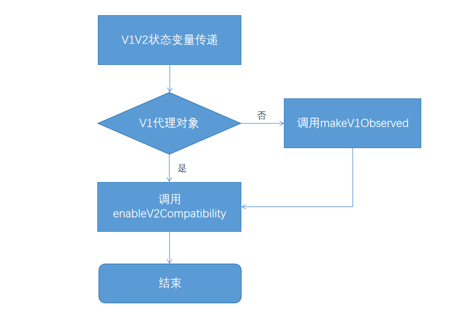

# 状态管理V1V2混用文档
<!--Kit: ArkUI-->
<!--Subsystem: ArkUI-->
<!--Owner: @liwenzhen3-->
<!--Designer: @s10021109-->
<!--Tester: @TerryTsao-->
<!--Adviser: @zhang_yixin13-->

## 概述

在状态管理框架的演进过程中，分别于API version 7和API version 12推出了状态管理V1和V2两个版本。对于已经使用状态管理V1的应用，如果有诉求向状态管理V2迁移，可参考[状态管理V1和V2迁移文档](./arkts-v1-v2-migration.md)。

对于大型应用，迁移过程中会遇到V1V2混用的场景，在API version 19之前，混用场景有相对严格的校验，主要表现在复杂对象的传递上，具体规则可参考[自定义组件混用场景指导](./arkts-custom-component-mixed-scenarios.md)。为了帮助开发者顺利地向V2迁移，从API version 19开始，减少了对V1V2混用场景的约束。具体变更可参考下表。同时提供新的方法[enableV2Compatibility](../../reference/apis-arkui/js-apis-StateManagement.md#enablev2compatibility19)和[makeV1Observed](../../reference/apis-arkui/js-apis-StateManagement.md#makev1observed19)来帮助开发者解决在迁移过程中遇到的混用问题。

> **说明：**
>
> 本文档中使用“->”表示变量的传递，比如“V1->V2”，表示V1状态变量向V2状态变量传递。


## 校验规则
在API version 19以前，状态管理V1V2的混用规则可以总结为：
1. V1装饰器不能和@ObserveV2一起使用。
2. V2装饰器不能和@Observed一起使用。
3. V1->V2只能传简单类型，不允许传复杂类型，包括built-in类型Array、Map、Set、Date。
4. V2->V1可以传简单类型和普通class，不允许传built-in类型Array、Map、Set、Date。

从API version 19开始，仅第1条规则依旧禁止，第2-4条规则均放开校验。具体编译期校验见下表。

| 场景  | API version 19以前 | API version 19及以后  |
|------|----|------|
| V1装饰器和\@ObservedV2同时使用   | 报错 | 报错 |
| V2装饰器和\@Observed同时使用 | 报错 | 不报错 |
| V1->V2 普通class  | 报错 | 不报错 |
| V1->V2 built-in类型Array、Map、Set、Date  | 报错 | 不报错 |
| V1->V2 \@Observed装饰的class  | 报错 | 不报错 |
| V2->V1 \@ObservedV2装饰的class  | 报错 | 报错 |
| V2->V1 built-in类型Array、Map、Set、Date  | 报错 | 不报错 |
| \@ObjectLink被非\@Observed装饰的class初始化  | 报错 | 不报错 |

依旧禁止第1条，是因为\@ObservedV2/\@Trace有自己独立的观察能力，不仅可以在\@ComponentV2中使用，也可以独立在\@Component中使用，状态管理框架不希望其观察能力和V1的观察能力混合使用，所以依旧维持禁止现状。

## 新增接口
### makeV1Observed

static makeV1Observed\<T extends object\>(source: T): T

[makeV1Observed](../../reference/apis-arkui/js-apis-StateManagement.md#makev1observed19)将不可观察的对象包装成状态管理V1可观察的对象，能力等同于@Observed，其返回值可初始化@ObjectLink。

>**说明：**
>
>从API version 19开始，开发者可以使用UIUtils中的makeV1Observed接口将不可观察的对象包装成状态管理V1可观察的对象。

**接口说明**
- makeV1Observed主要和enableV2Compatibility搭配使用，实现V2->V1的传递。
- makeV1Observed可将普通class、Array、Map、Set、Date类型转换为V1的状态变量，其能力等同于\@Observed，所以其返回值可以初始化\@ObjectLink。
- 如果makeV1Observed接受的数据已经是V1的状态变量，则返回自身，不做任何改变。
- makeV1Observed不会递归执行，仅会将第一层包装成V1的状态变量。

**限制条件**
- 不支持[collections类型](../../reference/apis-arkts/arkts-apis-arkts-collections.md)和[\@Sendable](../../arkts-utils/arkts-sendable.md)装饰的class。
- 不支持非object类型。
- 不支持undefined、null。
- 不支持\@ObservedV2、[makeObserved](../../reference/apis-arkui/js-apis-StateManagement.md#makeobserved)的返回值和V2装饰器装饰的built-in类型的变量（Array、Map、Set和Date）。


### enableV2Compatibility

static enableV2Compatibility\<T extends object\>(source: T): T

[enableV2Compatibility](../../reference/apis-arkui/js-apis-StateManagement.md#enablev2compatibility19)将V1的状态变量使能V2的观察能力，即让V1状态变量可以在\@ComponentV2中观察到变化。

>**说明：**
>
>从API version 19开始，开发者可以使用UIUtils中的enableV2Compatibility接口将V1的状态变量兼容V2中使用。

**接口说明**
- 该接口主要应用于V1->V2的场景，V1的状态变量调用该接口后，传递到\@ComponentV2中，则可以在V2中观察到变化，从而实现数据的联动刷新。
- enableV2Compatibility只能作用于V1的状态变量。V1状态变量为V1装饰器装饰的变量，即\@Observed装饰的变量，或\@State、\@Prop、\@Link、\@Provide、\@Consume和\@ObjectLink（\@ObjectLink需是\@Observed装饰的实例或者makeV1Observed的返回值）装饰的变量。否则，将返回入参自身。
- enableV2Compatibility会递归遍历class的所有属性，Array/Set/Map的所有子项，直到遇到非V1状态变量的数据，则停止当前分支的遍历。

**限制条件**
- 不支持非object类型。
- 不支持undefined、null。
- 不支持非V1的状态变量数据。
- 不支持\@ObservedV2、[makeObserved](../../reference/apis-arkui/js-apis-StateManagement.md#makeobserved)的返回值和V2装饰器装饰的built-in类型的变量（Array、Map、Set和Date）。

## 混用范式

基于[enableV2Compatibility](../../reference/apis-arkui/js-apis-StateManagement.md#enablev2compatibility19)和[makeV1Observed](../../reference/apis-arkui/js-apis-StateManagement.md#makev1observed19)接口，V1V2混用范式如下：

### V1->V2
- V1的状态变量传递给V2的\@Param，调用`UIUtils.enableV2Compatibility`使V1的状态变量可在\@ComponentV2中有观察能力。完整例子见[常见场景](#常见场景)。
```ts
import { UIUtils } from '@kit.ArkUI';

@Observed
class ObservedClass {
}

@Entry
@Component
struct CompV1 {
  @State observedClass: ObservedClass = new ObservedClass();

  build() {
    Column() {
      CompV2({ observedClass: UIUtils.enableV2Compatibility(this.observedClass) })
    }
  }
}

@ComponentV2
struct CompV2 {
  @Param observedClass: ObservedClass = new ObservedClass();

  build() {
  }
}
```
- V1状态变量可观察第一层属性，在调用`UIUtils.enableV2Compatibility`传递给\@Param后，\@Param也可观察第一层属性的变化。

具体场景能力可见下表。

| \@Component(父) -> \@ComponentV2（子）  | 调用enableV2Compatibility后观察行为 |
|------|----|
| 常规变量| 无观察能力，因为enableV2Compatibility仅支持V1状态变量。 |
| \@Observed装饰class   | 可观察第一层属性。 |
| V1装饰器装饰的变量，其类型为Array、Map、Set和Date  | 可观察API调用。 |
| V1装饰器装饰的变量，其类型为非\@Observed装饰的class  | 可观察第一层属性。需注意，如果数据源是\@ObjectLink，则其需要为\@Observed装饰class的实例或者makeV1Observed的返回值。 |
| 普通Array，其数组项为\@Observed装饰的class  | 不可观察，因为enableV2Compatibility检查外层数组为非V1状态变量，所以接口不生效，返回数据源本身。 |
| V1装饰器装饰的变量，其类型为普通Array，其数组项为\@Observed装饰的class  | 在\@Component中仅可观察第一层，如果想深度观察，则需搭配\@ObjectLink使用。在\@ComponentV2中可深度观察。 |
| \@ObservedV2装饰的class  | 在V1和V2中可观察，其观察能力源于\@ObservedV2和\@Trace的能力，enableV2Compatibility不生效。 |
| V1装饰器装饰的变量，其类型为普通Array，其数组项为\@ObservedV2装饰的class | 可观察，因为enableV2Compatibility会使外层的Array在V2中可观察。\@ObservedV2装饰的class的属性观察能力源自于\@ObservedV2和\@Trace，和enableV2Compatibility无关。 |

### V2->V1

在V2->V1时，推荐联合使用`UIUtils.enableV2Compatibility(UIUtils.makeV1Observed())`。如果当前对象已经是V1的可观察数据了，则仅调用`UIUtils.enableV2Compatibility`即可，完整例子见[常见场景](#常见场景)。

```ts
import { UIUtils } from '@kit.ArkUI';

@Observed
class ObservedClass {}

@Entry
@ComponentV2
struct CompV2 {
  @Local observedClass: ObservedClass = UIUtils.enableV2Compatibility(new ObservedClass());
  build() {
    Column() {
      CompV1({ observedClass: this.observedClass })
    }
  }
}

@Component
struct CompV1 {
  @ObjectLink observedClass: ObservedClass;
  build() {}
}
```

具体场景如下表。

| \@ComponentV2(父) -> \@Component（子）  | 调用enableV2Compatibility后观察行为 |
|------|----|
| \@Observed装饰class的嵌套类 | 在\@ComponentV2可深度观察嵌套属性的变化。 |
| 普通class  | 可以观察，需要调用`makeV1Observed`使得`enableV2Compatibility`正常工作。 |
| Array\<number\>，或其他简单类型数组  | 可以观察，需要调用`makeV1Observed`。</br>例子： `@Local local : Array<number> = UIUtils.enableV2Compatibility(UIUtils.makeV1Observed([1, 2, 3]))`。 |
| Array\<ObservedClass\>，即数组项是\@Observed装饰的class  | 可以观察，需要调用`makeV1Observed`。</br>例子： `@Local local : Array<ObservedClass> = UIUtils.enableV2Compatibility(UIUtils.makeV1Observed([new ObservedClass()]))`。 |
|  Array\<Array\<number\>\>，二维数组，数组项或为其他简单类型 | 可以观察，需要调用`makeV1Observed`。</br>例子： `@Local local : Array<Array<number>>> = UIUtils.enableV2Compatibility(UIUtils.makeV1Observed([UIUtils.makeV1Observed([1, 2, 3])]))`。|


## 混用规则
- V1->V2传递复杂类型数据，需要调用`enableV2Compatibility`，否则无法实现V1和V2的数据联动，推荐在V2组件的构造处调用，否则当变量被整体赋值时，需要再次手动调用`enableV2Compatibility`。

```ts
// 推荐，this.state = new ObservedClass()时无需再调用UIUtils.enableV2Compatibility，减少代码量
SubComponentV2({param: UIUtils.enableV2Compatibility(this.state)})

// 不推荐，state做整体赋值时，需要再次调用UIUtils.enableV2Compatibility
// 否则传递给SubComponentV2的V1变量是无法在V2中观察的
// @State state: ObservedClass = UIUtils.enableV2Compatibility(new ObservedClass());
// this.state = UIUtils.enableV2Compatibility(new ObservedClass())
SubComponentV2({param: this.state})
```

- V2->V1传递复杂类型数据，在V2中优先声明成V1的状态变量数据，并调用`UIUtils.enableV2Compatibility`。因为在状态管理V1中，状态变量默认有观察第一层的能力，而状态管理V2仅有观察自身的能力，如果希望双方数据联动，则需要调用`UIUtils.enableV2Compatibility(UIUtils.makeV1Observed())`拉齐双方的观察能力。

```ts
// 推荐
@Local unObservedClass: UnObservedClass = UIUtils.enableV2Compatibility(UIUtils.makeV1Observed(new UnObservedClass()));

// 推荐，ObservedClass时@Observed装饰的class
@Local observedClass: ObservedClass = UIUtils.enableV2Compatibility(new ObservedClass());
```
- `UIUtils.enableV2Compatibility(UIUtils.makeV1Observed())`不会改变V1和V2本身观察能力。
    - 在V1中，`UIUtils.enableV2Compatibility(UIUtils.makeV1Observed())`等于V1的观察能力，观察数据本身的赋值和第一层属性的赋值，无法深度观察，如果需要深度观察，则需要配合\@ObjectLink。
    - 在V2中，`UIUtils.enableV2Compatibility(UIUtils.makeV1Observed())`可以深度观察，但是需要每一层都是\@Observed装饰的class，或者是`makeV1Observed`的返回值。
- 当数据已使能V2观察能力，即调用`UIUtils.enableV2Compatibility`后，会将新的数据默认使能V2观察能力，但需要开发者保证新增数据也是\@Observed装饰的class，或者是`makeV1Observed`的返回值。完整例子可见[常见场景](#嵌套类型)。
```ts
let arr: Array<ArrayItem> = UIUtils.enableV2Compatibility(UIUtils.makeV1Observed(new ArrayItem()));

arr.push(new ArrayItem()); // 新增数据不是V1状态变量，所以不会具有V2观察能力
arr.push(UIUtils.makeV1Observed(new ArrayItem())); // 新增数据是V1的状态变量，默认在V2中可观察
```
- 对于built-in类型，如Array、Map、Set和Date，V1和V2都可以观察自身赋值和其API的调用所带来的变化。虽然开发者在不调用`UIUtils.enableV2Compatibility`时，也可以在一些简单场景下实现数据刷新，但是会带来双重代理导致性能较差的问题，所以推荐开发者使用`UIUtils.enableV2Compatibility(UIUtils.makeV1Observed())`，具体例子见[常见场景](#内置类型)。
- 对于有\@Track装饰属性的类，非\@Track装饰的属性在\@ComponentV2中使用不会崩溃，在\@Component中使用仍会崩溃。具体例子见[常见场景](#observed装饰的class)。

开发者在使用这两个接口混用V1V2时，可遵循下图逻辑。




## 常见场景
### 普通JS Object

**V1->V2**

**推荐写法**

```ts
import { UIUtils } from '@kit.ArkUI';

@Observed
class ObservedClass {
  name: string = 'Tom';
}

@Entry
@Component
struct CompV1 {
  @State observedClass: ObservedClass = new ObservedClass();

  build() {
    Column() {
      Text(`@State observedClass: ${this.observedClass.name}`)
        .onClick(() => {
          this.observedClass.name += '!'; // 刷新
        })
      // 调用UIUtils.enableV2Compatibility使V1的状态变量可在@ComponentV2中有观察能力。
      CompV2({ observedClass: UIUtils.enableV2Compatibility(this.observedClass) })
    }
  }
}

@ComponentV2
struct CompV2 {
  @Param observedClass: ObservedClass = new ObservedClass();

  build() {
    // V1状态变量在使能V2观察能力后，可以在V2观察第一层的变化
    Text(`@Param observedClass: ${this.observedClass.name}`)
      .onClick(() => {
        this.observedClass.name += '!'; // 刷新
      })
  }
}
```
**不推荐写法**

在下面的例子中，V1的状态变量在传递给V2时，未调用`enableV2Compatibility`接口，未使能V2的观察能力，则`observedClass`在CompV2中无法观察属性`name`的变化。同一个状态变量在`CompV1`和`CompV2`中观察能力不一致。

```ts
@Observed
class ObservedClass {
  name: string = 'Tom';
}

@Entry
@Component
struct CompV1 {
  @State observedClass: ObservedClass = new ObservedClass();

  build() {
    Column() {
      Text(`@State observedClass: ${this.observedClass.name}`)
        .onClick(() => {
          this.observedClass.name += '!'; // 刷新
        })
      // 未调用enableV2Compatibility接口，V1的状态变量在CompV2中无观察能力
      // 在CompV2不可观察name的变化
      CompV2({ observedClass: this.observedClass })
    }
  }
}

@ComponentV2
struct CompV2 {
  @Param observedClass: ObservedClass = new ObservedClass();

  build() {
    Text(`@Param observedClass: ${this.observedClass.name}`)
      .onClick(() => {
        this.observedClass.name += '!'; // 不刷新
      })
  }
}
```
**V2->V1**

**推荐写法**

在V2->V1传递的场景中，为了拉齐V2和V1的观察能力，需要在V2中调用makeV1Observed接口，同时也需要使能V2的观察能力，调用enableV2Compatibility接口，所以推荐写法如下。

```ts
import { UIUtils } from '@kit.ArkUI';

class ObservedClass {
  name: string = 'Tom';
}

@Entry
@ComponentV2
struct CompV2 {
  @Local observedClass: ObservedClass = UIUtils.enableV2Compatibility(UIUtils.makeV1Observed(new ObservedClass()));

  build() {
    Column() {
      // @Local原本能力仅可观察自身
      // 但是调用了UIUtils.makeV1Observed使其变成V1的状态变量，V1状态变量可观察第一层变化
      // 又调用UIUtils.enableV2Compatibility使其在V2中可观察，使其在V2中可观察
      // 所以当前可观察第一层属性的变化
      Text(`@Local observedClass: ${this.observedClass.name}`)
        .onClick(() => {
          this.observedClass.name += '!'; // 刷新
        })
      // @ObjectLink可接收@Observed装饰class的实例或者makeV1Observed的返回值
      CompV1({ observedClass: this.observedClass })
    }
  }
}

@Component
struct CompV1 {
  @ObjectLink observedClass: ObservedClass;

  build() {
    // 在CompV1中可观察第一层的变化
    Text(`@ObjectLink observedClass: ${this.observedClass.name}`)
      .onClick(() => {
        this.observedClass.name += '!'; // 刷新
      })
  }
}
```
**不推荐写法**

因为V1和V2观察能力不同，如果不调用`UIUtils.enableV2Compatibility(UIUtils.makeV1Observed())`直接进行数据传递，则会造成不刷新或者刷新行为不一致的问题。

```ts
class ObservedClass {
  name: string = 'Tom';
}

@Entry
@ComponentV2
struct CompV2 {
  @Local observedClass: ObservedClass = new ObservedClass();

  build() {
    Column() {
      // @Local原本能力仅可观察自身，此处不可观察属性的变化
      Text(`@Local observedClass: ${this.observedClass.name}`)
        .onClick(() => {
          this.observedClass.name += '!'; // 不刷新
        })
      // @ObjectLink不可接收非@Observed装饰class的实例或者makeV1Observed的返回值
      // 日志提示开发者当前ObjectLink被不合法赋值
      CompV1({ observedClass1: this.observedClass, observedClass2: this.observedClass })
    }
  }
}

@Component
struct CompV1 {
  @ObjectLink observedClass1: ObservedClass;
  @State observedClass2: ObservedClass = new ObservedClass();

  build() {
    Column() {
      // @ObjectLink被不合法赋值，不会响应UI刷新
      Text(`@ObjectLink observedClass: ${this.observedClass1.name}`)
        .onClick(() => {
          this.observedClass1.name += '!'; // 不刷新
        })

      // 不同于@ObjectLink，@State会默认将不可观察的对象包装成V1可观察的对象，可观察到自身和属性的变化
      Text(`@State observedClass: ${this.observedClass2.name}`)
        .onClick(() => {
          this.observedClass2.name += '!'; // 刷新
        })
    }
  }
}
```
### \@Observed装饰的class

**V1->V2**

下面的例子中：
- `ObservedClass`是\@Observed装饰的class，并在传递给V2时使能了在V2中观察的能力。
- `name`是`@Track`装饰的属性，其在V1和V2均是可观察的。
- `count`是非`@Track`装饰的属性，其在V1和V2的UI中使用均是非法的。
    - 在V1中，如果将非`@Track`装饰的属性使用在UI中，是非法行为，会有运行时报错。
    - 在V2中，非`@Track`装饰的属性使用在UI不会有运行时报错，但不会响应更新。

```ts
import { UIUtils } from '@kit.ArkUI';

@Observed
class ObservedClass {
  @Track name: string = 'a';
  count: number = 0;
}

@Entry
@Component
struct CompV1 {
  @State observedClass: ObservedClass = new ObservedClass();
  build() {
    Column() {
      Text(`name: ${this.observedClass.name}`).onClick(() => {
        // 触发刷新
        this.observedClass.name += 'a';
      })
      // 使用非@Track的变量在V1中会崩溃
      // Text(`count: ${this.observedClass.count}`)

      CompV2({ observedClass: UIUtils.enableV2Compatibility(this.observedClass) })
    }
  }
}

@ComponentV2
struct CompV2 {
  @Param observedClass: ObservedClass = new ObservedClass();
  build() {
    // 使用非@Track的变量在V2中不会崩溃，但不会响应更新
    Text(`count: ${this.observedClass.count}`).onClick(() => {
      // 不触发刷新
      this.observedClass.count++;
    })
  }
}
```
**V2->V1**

- `ObservedClass`是\@Observed装饰的class，所以传递给V1调用`UIUtils.enableV2Compatibility`时，无需再调用`UIUtils.makeV1Observed`。
- 只有\@Track装饰的变量在V1和V2中可观察。非\@Track的变量在V1中使用在UI上会有运行时报错，在V2中不会报错，但不会响应刷新。
```ts
import { UIUtils } from '@kit.ArkUI';

@Observed
class ObservedClass {
  @Track name: string = 'a';
  count: number = 0;
}

@Entry
@ComponentV2
struct CompV1 {
  @Local observedClass: ObservedClass = UIUtils.enableV2Compatibility(new ObservedClass());

  build() {
    Column() {
      Text(`name: ${this.observedClass.name}`).onClick(() => {
        // 触发刷新
        this.observedClass.name += 'a';
      })
      // 使用非@Track的变量在V2中不会崩溃，但不触发刷新
      Text(`count: ${this.observedClass.count}`).onClick(() => {
        this.observedClass.count++;
      })

      CompV2({ observedClass: this.observedClass })
    }
  }
}

@Component
struct CompV2 {
  @ObjectLink observedClass: ObservedClass;

  build() {
    Column() {
      Text(`count: ${this.observedClass.name}`).onClick(() => {
        // 触发刷新
        this.observedClass.name += 'a';
      })
      // 使用非@Track的变量在V1中会崩溃
      // Text(`count: ${this.observedClass.count}`)
    }
  }
}
```

### 内置类型
以Array为例。

**V1->V2**

**推荐写法**

```ts
import { UIUtils } from '@kit.ArkUI';

@Entry
@Component
struct ArrayCompV1 {
  @State arr: Array<number> = UIUtils.makeV1Observed([1, 2, 3]);

  build() {
    Column() {
      Text(`V1 ${this.arr[0]}`).onClick(() => {
        // 点击触发ArrayCompV1和ArrayCompV2变化
        this.arr[0]++;
      })
      // 传递给V2时，发现当前代理是makeV1Observed包装的，且使能V2观察能力
      // 在ArrayCompV2中Param不会再次包装代理，避免双重代理的问题
      ArrayCompV2({ arr: UIUtils.enableV2Compatibility(this.arr) })
    }
    .height('100%')
    .width('100%')
  }
}

@ComponentV2
struct ArrayCompV2 {
  @Param arr: Array<number> = [1, 2, 3];

  build() {
    Column() {
      Text(`V2 ${this.arr[0]}`).onClick(() => {
        // 点击触发ArrayCompV1和ArrayCompV2变化
        this.arr[0]++;
      })
    }
  }
}
```
**不推荐写法**

在下面的例子中，没有调用enableV2Compatibility和makeV1Observed，则有V1和V2双重代理和刷新不一致的问题。
```ts
@Entry
@Component
struct ArrayCompV1 {
  @State arr: Array<number> = [1, 2, 3];

  build() {
    Column() {
      Text(`V1 ${this.arr[0]}`).onClick(() => {
        // V1代理，可触发ArrayCompV1的刷新，但无法触发ArrayCompV2的刷新
        this.arr[0]++;
      })
      // 传递给ArrayCompV2，被再次包装V2的代理
      ArrayCompV2({ arr: this.arr })
    }
    .height('100%')
    .width('100%')
  }
}

@ComponentV2
struct ArrayCompV2 {
  @Param arr: Array<number> = [1, 2, 3];

  build() {
    Column() {
      Text(`V2 ${this.arr[0]}`).onClick(() => {
        // V1V2双重代理，可触发ArrayCompV1，也可触发ArrayCompV2的刷新
        this.arr[0]++;
      })
    }
  }
}
```
**V2->V1**

**推荐写法**

```ts
import { UIUtils } from '@kit.ArkUI';

@Entry
@ComponentV2
struct ArrayCompV2 {
  @Local arr: Array<number> = UIUtils.enableV2Compatibility(UIUtils.makeV1Observed([1, 2, 3]));

  build() {
    Column() {
      Text(`V2 ${this.arr[0]}`).fontSize(20).onClick(() => {
        // 点击触发V2变化，且同步给V1 @ObjectLink
        this.arr[0]++;
      })
      ArrayCompV1({ arr: this.arr })
    }
    .height('100%')
    .width('100%')
  }
}

@Component
struct ArrayCompV1 {
  @ObjectLink arr: Array<number>;

  build() {
    Column() {
      Text(`V1 ${this.arr[0]}`).fontSize(20).onClick(() => {
        // 点击触发V1变化，且双向同步回给V2
        this.arr[0]++;
      })
    }
  }
}

```
**不推荐写法**

在下面的例子中，没有调用enableV2Compatibility和makeV1Observed，且对\@ObjectLink非法初始化，使其无法观察属性的变化。
但因为传递给\@ObjectLink是V2的状态变量，所以可以触发V2的刷新。
```ts
@Entry
@ComponentV2
struct ArrayCompV2 {
  @Local arr: Array<number> = [1, 2, 3];

  build() {
    Column() {
      Text(`V2 ${this.arr[0]}`).fontSize(20).onClick(() => {
        // 点击触发V2变化
        this.arr[0]++;
      })
      // 传递给@ObjectLink为非@Observed和makeV1Observed数据
      // 非法操作，@ObjectLink将不能观察属性变化
      ArrayCompV1({ arr: this.arr })
    }
    .height('100%')
    .width('100%')
  }
}

@Component
struct ArrayCompV1 {
  @ObjectLink arr: Array<number>;

  build() {
    Column() {
      Text(`V1 ${this.arr[0]}`).fontSize(20).onClick(() => {
        // V1不刷新，但可以触发V2的刷新
        this.arr[0]++;
      })
    }
  }
}
```
### 二维数组

**V1->V2**

下面的例子中：
- 使用makeV1Observed将二维数组的内层数组变成V1的状态变量。
- 在传递给V2子组件时，调用enableV2Compatibility，使其具有V2的观察能力，也避免V1V2的双重代理。

```ts
import { UIUtils } from '@kit.ArkUI';

@ComponentV2
struct Item {
  @Require @Param itemArr: Array<string>;

  build() {
    Row() {
      ForEach(this.itemArr, (item: string, index: number) => {
        Text(`${index}: ${item}`)
      }, (item: string) => item + Math.random())

      Button('@Param push')
        .onClick(() => {
          this.itemArr.push('Param');
        })
    }
  }
}

@Entry
@Component
struct IndexPage {
  @State arr: Array<Array<string>> =
    [UIUtils.makeV1Observed(['apple']), UIUtils.makeV1Observed(['banana']), UIUtils.makeV1Observed(['orange'])];

  build() {
    Column() {
      ForEach(this.arr, (itemArr: Array<string>) => {
        Item({ itemArr: UIUtils.enableV2Compatibility(itemArr) })
      }, (itemArr: Array<string>) => JSON.stringify(itemArr) + Math.random())
      Divider()
      Button('@State push two-dimensional array item')
        .onClick(() => {
          this.arr[0].push('strawberry');
        })

      Button('@State push array item')
        .onClick(() => {
          this.arr.push(UIUtils.makeV1Observed(['pear']));
        })

      Button('@State change two-dimensional array first item')
        .onClick(() => {
          this.arr[0][0] = 'APPLE';
        })

      Button('@State change array first item')
        .onClick(() => {
          this.arr[0] = UIUtils.makeV1Observed(['watermelon']);
        })
    }
  }
}
```

**V2->V1**

下面的例子中：
- 使用makeV1Observed将二维数组的内层数组变成V1的状态变量。调用enableV2Compatibility，使其具有V2的观察能力，也避免V1V2的双重代理。
- 在V1中，使用\@ObjectLink接收二维数组的内层数组，因为其为makeV1Observed的返回值，所以点击`Button('@ObjectLink push')`，会正常响应刷新。

```ts
import { UIUtils } from '@kit.ArkUI';

@Component
struct Item {
  @ObjectLink itemArr: Array<string>;

  build() {
    Row() {
      ForEach(this.itemArr, (item: string, index: number) => {
        Text(`${index}: ${item}`)
      }, (item: string) => item + Math.random())

      Button('@ObjectLink push')
        .onClick(() => {
          this.itemArr.push('ObjectLink');
        })
    }
  }
}

@Entry
@ComponentV2
struct IndexPage {
  @Local arr: Array<Array<string>> =
    UIUtils.enableV2Compatibility(UIUtils.makeV1Observed([UIUtils.makeV1Observed(['apple']),
      UIUtils.makeV1Observed(['banana']), UIUtils.makeV1Observed(['orange'])]));

  build() {
    Column() {
      ForEach(this.arr, (itemArr: Array<string>) => {
        Item({ itemArr: itemArr })
      }, (itemArr: Array<string>) => JSON.stringify(itemArr) + Math.random())
      Divider()
      Button('@Local push two-dimensional array item')
        .onClick(() => {
          this.arr[0].push('strawberry');
        })

      Button('@Local push array item')
        .onClick(() => {
          this.arr.push(UIUtils.makeV1Observed(['pear']));
        })

      Button('@Local change two-dimensional array first item')
        .onClick(() => {
          this.arr[0][0] = 'APPLE';
        })

      Button('@Local change array first item')
        .onClick(() => {
          this.arr[0] = UIUtils.makeV1Observed(['watermelon']);
        })
    }
  }
}
```

### 嵌套类型

**V1->V2**

结合上面的基本场景后，来看下面嵌套场景的例子。
下面的例子的行为可以总结为：
- \@State仅能观察第一层的变化，如果要深度观察，需要传递给\@ObjectLink。
- 数据源\@State的第二层的改变，虽然不能带来本层的刷新，但会被\@ObjectLink和\@Param观察到，并触发它们关联组件的刷新。
- \@ObjectLink和\@Param是同一个对象的引用，其属性改变也会带来其他引用的刷新。
- 开启`enableV2Compatibility`后，V2有了深度观察能力。
- 如果开发者在传递给V2时没有调用`enableV2Compatibility`，则Param无法观察对象的属性。
```ts
// 不推荐写法
NestedClassV2({ outer: this.outer })
```
完整例子如下。
```ts
import { UIUtils } from '@kit.ArkUI';

class ArrayItem {
  value: number = 0;

  constructor(value: number) {
    this.value = value;
  }
}

class Inner {
  innerValue: string = 'inner';
  arr: Array<ArrayItem>;

  constructor(arr: Array<ArrayItem>) {
    this.arr = arr;
  }
}

class Outer {
  @Track outerValue: string = 'out';
  @Track inner: Inner;

  constructor(inner: Inner) {
    this.inner = inner;
  }
}

@Entry
@Component
struct NestedClassV1 {
  // 需保证每一层都是V1的状态变量
  @State outer: Outer =
    UIUtils.makeV1Observed(new Outer(
      UIUtils.makeV1Observed(new Inner(UIUtils.makeV1Observed([
        UIUtils.makeV1Observed(new ArrayItem(1)),
        UIUtils.makeV1Observed(new ArrayItem(2))
      ])))
    ));

  build() {
    Column() {
      Text(`@State outer.outerValue can update ${this.outer.outerValue}`)
        .fontSize(20)
        .onClick(() => {
          // @State可以观察第一层的变化
          // 变化会通知@ObjectLink和@Param刷新
          this.outer.outerValue += '!';
        })

      Text(`@State outer.inner.innerValue cannot update ${this.outer.inner.innerValue}`)
        .fontSize(20)
        .onClick(() => {
          // @State无法观察第二层的变化
          // 但该变化会被@ObjectLink和@Param观察
          this.outer.inner.innerValue += '!';
        })
      // 将inner传递给@ObjectLink可观察inner属性的变化
      NestedClassV1ObjectLink({ inner: this.outer.inner })
      // 将开启enableV2Compatibility的数据传给V2
      NestedClassV2({ outer: UIUtils.enableV2Compatibility(this.outer) })
    }
    .height('100%')
    .width('100%')
  }
}

@Component
struct NestedClassV1ObjectLink {
  @ObjectLink inner: Inner;

  build() {
    Text(`@ObjectLink inner.innerValue can update ${this.inner.innerValue}`)
      .fontSize(20)
      .onClick(() => {
        // 可以触发刷新，和@Param是同一个对象的引用，@Param也会进行刷新
        this.inner.innerValue += '!';
      })
  }
}

@ComponentV2
struct NestedClassV2 {
  @Require @Param outer: Outer;

  build() {
    Column() {
      Text(`@Param outer.outerValue can update ${this.outer.outerValue}`)
        .fontSize(20)
        .onClick(() => {
          // 可以观察第一层的变化
          this.outer.outerValue += '!';
        })
      Text(`@Param outer.inner.innerValue can update ${this.outer.inner.innerValue}`)
        .fontSize(20)
        .onClick(() => {
          // 可以观察第二层的变化，和@ObjectLink是同一个对象的引用，也会触发刷新
          this.outer.inner.innerValue += '!';
        })

      Repeat(this.outer.inner.arr)
        .each((item: RepeatItem<ArrayItem>) => {
          Text(`@Param outer.inner.arr index: ${item.index} item: ${item.item.value}`)
        })

      Button('@Param push').onClick(() => {
        // outer已经使能了V2观察能力，对于新增加的数据，则默认开启V2观察能力
        this.outer.inner.arr.push(UIUtils.makeV1Observed(new ArrayItem(20)));
      })

      Button('@Param change the last Item').onClick(() => {
        // 可以观察最后一个数组项的属性变化
        this.outer.inner.arr[this.outer.inner.arr.length - 1].value++;
      })
    }
  }
}
```

**V2->V1**

- 下面的例子中，`NestedClassV2`中`outer`调用了`UIUtils.enableV2Compatibility`，且每一层都是`UIUtils.makeV1Observed`，所以`outer`在V2中有了深度观察的能力。
- V1中仅能观察第一层的变化，所以需要多层自定义组件，且每层都配合使用\@ObjectLink来接收，从而实现深度观察能力。

```ts
import { UIUtils } from '@kit.ArkUI';

class ArrayItem {
  value: number = 0;

  constructor(value: number) {
    this.value = value;
  }
}

class Inner {
  innerValue: string = 'inner';
  arr: Array<ArrayItem>;

  constructor(arr: Array<ArrayItem>) {
    this.arr = arr;
  }
}

class Outer {
  @Track outerValue: string = 'out';
  @Track inner: Inner;

  constructor(inner: Inner) {
    this.inner = inner;
  }
}

@Entry
@ComponentV2
struct NestedClassV2 {
  // 需保证每一层都是V1的状态变量
  @Local outer: Outer = UIUtils.enableV2Compatibility(
    UIUtils.makeV1Observed(new Outer(
      UIUtils.makeV1Observed(new Inner(UIUtils.makeV1Observed([
        UIUtils.makeV1Observed(new ArrayItem(1)),
        UIUtils.makeV1Observed(new ArrayItem(2))
      ])))
    )));

  build() {
    Column() {
      Text(`@Local outer.outerValue can update ${this.outer.outerValue}`)
        .fontSize(20)
        .onClick(() => {
          // 可观察第一层的变化
          this.outer.outerValue += '!';
        })

      Text(`@Local outer.inner.innerValue can update ${this.outer.inner.innerValue}`)
        .fontSize(20)
        .onClick(() => {
          // 可观察第二层的变化
          this.outer.inner.innerValue += '!';
        })
      // 将inner传递给@ObjectLink可观察inner属性的变化
      NestedClassV1ObjectLink({ inner: this.outer.inner })
    }
    .height('100%')
    .width('100%')
  }
}

@Component
struct NestedClassV1ObjectLink {
  @ObjectLink inner: Inner;

  build() {
    Column() {
      Text(`@ObjectLink inner.innerValue can update ${this.inner.innerValue}`)
        .fontSize(20)
        .onClick(() => {
          // 可以触发刷新
          this.inner.innerValue += '!';
        })
      NestedClassV1ObjectLinkArray({ arr: this.inner.arr })
    }
  }
}

@Component
struct NestedClassV1ObjectLinkArray {
  @ObjectLink arr: Array<ArrayItem>;

  build() {
    Column() {
      ForEach(this.arr, (item: ArrayItem) => {
        NestedClassV1ObjectLinkArrayItem({ item: item })
      }, (item: ArrayItem, index: number) => {
        return item.value.toString() + index.toString();
      })

      Button('@ObjectLink push').onClick(() => {
        this.arr.push(UIUtils.makeV1Observed(new ArrayItem(20)));
      })

      Button('@ObjectLink change the last Item').onClick(() => {
        // 在NestedClassV1ObjectLinkArrayItem中可以观察最后一个数组项的属性变化
        this.arr[this.arr.length - 1].value++;
      })
    }
  }
}

@Component
struct NestedClassV1ObjectLinkArrayItem {
  @ObjectLink item: ArrayItem;

  build() {
    Text(`@ObjectLink outer.inner.arr item: ${this.item.value}`)
  }
}

```