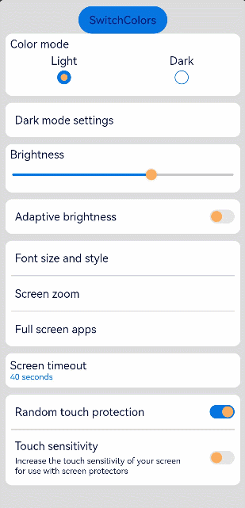

# 设置主题换肤

### 概述

针对Theme主题换肤方案，本文描述应用如下场景的开发指导：
- 自定义品牌色
- 局部页面自定义主题风格
- 局部深浅色


### 自定义品牌色
CustomTheme接口用于自定义Theme。CustomTheme的属性是可选的，只需要复写需要的修改的部分，其余部分会继承自系统。详情参考：
>UX鸿蒙色彩设计原色介绍

  ```ts
    // xxx.ets
    import { CustomColors, CustomTheme } from '@ohos.arkui.theme'

    export class AppColors implements CustomColors {
      fontPrimary: ResourceColor = '#FF030F3B'
      fontOnPrimary: ResourceColor = '#FF06207C'
      iconOnPrimary: ResourceColor = '#FFFCAD60'
      iconFourth: ResourceColor = '#FF0775E0'
      compBackgroundTertiary: ResourceColor = '#FFAFD3F6'
      compBackgroundEmphasize: ResourceColor = '#FF0775E0'
      backgroundEmphasize: ResourceColor = '#FF0775E0'
      interactiveFocus: ResourceColor = '#FF06207C'
      compBackgroundPrimary: ResourceColor = '#FFFCAD60'
      compBackgroundSecondary: ResourceColor = '#FFCAC9C9'
    }

    export class AppTheme implements CustomTheme {
      public colors: AppColors = new AppColors()
    }

    export class AppColorsSec implements CustomColors {
      fontOnPrimary = '#ff111111'
      backgroundEmphasize = '#ff26d000'
      interactivePressed = '#ffd41010'
      interactiveFocus = '#ffff0000'
      fontPrimary: ResourceColor = '#ffff0000'
      iconOnPrimary: ResourceColor = '#ffff0000'
      iconFourth: ResourceColor = '#ffff0000'
      compBackgroundTertiary: ResourceColor = '#FFAFD3F6'
      compBackgroundEmphasize: ResourceColor = '#FF0775E0'
      compBackgroundPrimary: ResourceColor = '#FFFCAD60'
      compBackgroundSecondary: ResourceColor = '#FFCAC9C9'
    }

    export class AppTheme1 implements CustomTheme {
      public colors: AppColors = new AppColorsSec()
    }
    
    export let gAppTheme: CustomTheme = new AppTheme()
    
    export let gAppThemeSec: CustomTheme = new AppTheme1()
    
    export let gAppColor: AppColors = new AppColors()
    
    export let gAppColorSec: AppColorsSec = new AppColorsSec()
  ```

### 设置应用级全局风格
- 方法一：在ability中设置ThemeControl
- 约束：如果在ability中设置，需要在onWindowStageCreate()方法中setDefaultTheme。


| 接口名          | 方法/属性名                                    | 是否必填 | 描述（说明默认值）                                                       | 所属文件                   |
|--------------|-------------------------------------------|------|-----------------------------------------------------------------|------------------------|
| ThemeControl | setDefaultTheme(theme: CustomTheme): void | 是    | 将自定义Theme应用于APP组件，实现APP组件风格跟随Theme切换。Theme后续可扩展shape, typograph | @ohos.arkui.theme.d.ts |

参考示例：

  ```ts
    xxx.ts
    import AbilityConstant from '@ohos.app.ability.AbilityConstant';
    import hilog from '@ohos.hilog';
    import UIAbility from '@ohos.app.ability.UIAbility';
    import Want from '@ohos.app.ability.Want';
    import window from '@ohos.window';
    import { CustomColors, ThemeControl } from '@ohos.arkui.theme'
    
    class RedColors implements CustomColors {
      fontEmphasize = 0xFFD53032
      iconEmphasize = 0xFFD53032
      backgroundEmphasize = 0xFFD53032
    }
    const abilityThemeColors = new RedColors();
    // the invoking here does not have effect
    // ThemeControl.setDefaultTheme({ colors: abilityThemeColors })
    
    export default class EntryAbility extends UIAbility {
      onCreate(want: Want, launchParam: AbilityConstant.LaunchParam) {
        hilog.info(0x0000, 'testTag', '%{public}s', 'Ability onCreate');
      }
    
      onDestroy() {
        hilog.info(0x0000, 'testTag', '%{public}s', 'Ability onDestroy');
      }
    
      onWindowStageCreate(windowStage: window.WindowStage) {
        // Main window is created, set main page for this ability
        hilog.info(0x0000, 'testTag', '%{public}s', 'Ability onWindowStageCreate');
      
        windowStage.loadContent('pages/Index', (err, data) => {
          if (err.code) {
            hilog.error(0x0000, 'testTag', 'Failed to load the content. Cause: %{public}s', JSON.stringify(err) ?? '');
            return;
          }
          hilog.info(0x0000, 'testTag', 'Succeeded in loading the content. Data: %{public}s', JSON.stringify(data) ?? '');
          // invoking here works good
          ThemeControl.setDefaultTheme({ colors: abilityThemeColors })
          hilog.info(0x0000, 'testTag', '%{public}s', 'ThemeControl.setDefaultTheme done');
        });
      }
    
      onWindowStageDestroy() {
        // Main window is destroyed, release UI related resources
        hilog.info(0x0000, 'testTag', '%{public}s', 'Ability onWindowStageDestroy');
      }
    
      onForeground() {
        // Ability has brought to foreground
        hilog.info(0x0000, 'testTag', '%{public}s', 'Ability onForeground');
      }
    
      onBackground() {
        // Ability has back to background
        hilog.info(0x0000, 'testTag', '%{public}s', 'Ability onBackground');
      }
    }
  ```
- 方法二：在页面入口处统一设置
- 约束：要在页面build前执行ThemeControl。

参考示例：

  ```ts
    // xxx.ets
    import { ThemeControl } from '@ohos.arkui.theme'
    import { gAppThemeSec } from './AppTheme'
    
    //在页面build前执行ThemeControl
    ThemeControl.setDefaultTheme(gAppThemeSec)

    @Entry
    @Component
    struct DisplayPage {
      brightnessValue: number = 40
      brightnessMax: number = 100
      fontSize = '16fp'
      marginLeft = '14fp'
      fontSizeAndStyle = 'Font size and style'
      fullScreenApps = 'Full screen apps'
      darkModeSettings = 'Dark mode settings'
      screenZoom = 'Screen zoom'
      screenTimeout = 'Screen timeout'
      randomTouchProtection = 'Random touch protection'
      touchSensitivity = 'Touch sensitivity'
      menuItemColor = '#ffffff'
      pageBackgroundColor = '#dcdcdc'

      build() {
          Column() {
            List({ space: 10 }) {
              ListItem() {
                Column({ space: '5vp' }) {
                  Text('Color mode')
                    .margin({ top: '5vp', left: this.marginLeft })
                    .width('100%')
                  Row() {
                    Column() {
                      Text('Light')
                        .fontSize(this.fontSize)
                        .textAlign(TextAlign.Start)
                        .alignSelf(ItemAlign.Center)
                      Radio({ group: 'light or dark', value: 'light'})
                        .checked(true)
                    }
                    .width('50%')
    
                    Column() {
                      Text('Dark')
                        .fontSize(this.fontSize)
                        .textAlign(TextAlign.Start)
                        .alignSelf(ItemAlign.Center)
                      Radio({ group: 'light or dark', value: 'dark'})
                    }
                    .width('50%')
                  }
                }
                .width('100%')
                .height('90vp')
                .borderRadius('10vp')
                .backgroundColor(this.menuItemColor)
              }
    
              ListItem() {
                Row() {
                  Text(this.darkModeSettings)
                    .fontSize(this.fontSize)
                    .textAlign(TextAlign.Start)
                    .alignSelf(ItemAlign.Center)
                    .margin({ left: this.marginLeft })
                    .width('100%')
                }
                .width('100%')
                .height('50vp')
                .borderRadius('10vp')
                .backgroundColor(this.menuItemColor)
                .onClick((event: ClickEvent) => {
                  console.log(`Pressed ${this.darkModeSettings}`)
                })
              }
    
              ListItem() {
                Column() {
                  Text('Brightness')
                    .width('100%')
                    .margin({ top: '5vp', left: this.marginLeft })
                  Slider({ value: this.brightnessValue, max: this.brightnessMax })
                    .onChange((value) => {
                      this.brightnessValue = value
                      console.log(`Set brightness value: ${this.brightnessValue}`)
                    })
                }
                .width('100%')
                .height('70vp')
                .borderRadius('10vp')
                .backgroundColor(this.menuItemColor)
              }
    
              ListItem() {
                Row() {
                  Text('Adaptive brightness')
                    .fontSize(this.fontSize)
                    .textAlign(TextAlign.Start)
                    .margin({ left: this.marginLeft })
                    .alignSelf(ItemAlign.Center)
                    .width('75%')
                  Toggle({ type: ToggleType.Switch })
                    .margin({ right: this.marginLeft })
                    .alignSelf(ItemAlign.Center)
                    .width('25%')
                }
                .width('100%')
                .height('50vp')
                .borderRadius('10vp')
                .backgroundColor(this.menuItemColor)
              }
    
              ListItem() {
                Column() {
                  Row() {
                    Text(this.fontSizeAndStyle)
                      .fontSize(this.fontSize)
                      .textAlign(TextAlign.Start)
                      .alignSelf(ItemAlign.Center)
                      .margin({ left: this.marginLeft })
                  }
                  .width('100%')
                  .height('50vp')
                  .onClick((event: ClickEvent) => {
                    console.log(`Pressed ${this.fontSizeAndStyle}`)
                  })
    
                  Divider()
                    .strokeWidth('1.5vp')
                    .width('95%')
                  Row() {
                    Text(this.screenZoom)
                      .fontSize(this.fontSize)
                      .textAlign(TextAlign.Start)
                      .alignSelf(ItemAlign.Center)
                      .margin({ left: this.marginLeft })
                  }
                  .width('100%')
                  .height('50vp')
                  .onClick((event: ClickEvent) => {
                    console.log(`Pressed ${this.screenZoom}`)
                  })
    
                  Divider()
                    .strokeWidth('1.5vp')
                    .width('95%')
                  Row() {
                    Text(this.fullScreenApps)
                      .fontSize(this.fontSize)
                      .textAlign(TextAlign.Start)
                      .alignSelf(ItemAlign.Center)
                      .margin({ left: this.marginLeft })
                  }
                  .width('100%')
                  .height('50vp')
                  .onClick((event: ClickEvent) => {
                    console.log(`Pressed ${this.fullScreenApps}`)
                  })
                }
                .width('100%')
                .borderRadius('10vp')
                .backgroundColor(this.menuItemColor)
              }
    
              ListItem() {
                Row() {
                  Column() {
                    Text(this.screenTimeout)
                      .fontSize(this.fontSize)
                      .textAlign(TextAlign.Start)
                      .margin({ left: this.marginLeft })
                      .width('100%')
                    Text('40 seconds')
                      .fontColor(Color.Blue)
                      .textAlign(TextAlign.Start)
                      .fontSize('12fp')
                      .fontColor('#FF0775E0')
                      .width('100%')
                      .margin({ left: this.marginLeft })
                  }
                  .alignSelf(ItemAlign.Center)
                  .width('100%')
                }
                .width('100%')
                .height('50vp')
                .borderRadius('10vp')
                .backgroundColor(this.menuItemColor)
                .onClick((event: ClickEvent) => {
                  console.log(`Pressed ${this.fullScreenApps}`)
                })
              }
    
              ListItem() {
                Column() {
                  Row() {
                    Text(this.randomTouchProtection)
                      .fontSize(this.fontSize)
                      .textAlign(TextAlign.Start)
                      .alignSelf(ItemAlign.Center)
                      .margin({ left: this.marginLeft })
                      .width('75%')
                    Toggle({ type: ToggleType.Switch, isOn: true })
                      .margin({ right: this.marginLeft })
                      .alignSelf(ItemAlign.Center)
                      .width('25%')
                  }
                  .width('100%')
                  .height('50vp')
                  .onClick((event: ClickEvent) => {
                    console.log(`Pressed ${this.randomTouchProtection}`)
                  })
    
                  Divider()
                    .strokeWidth('1.5vp')
                    .width('95%')
                  Row() {
                    Column({ space: '5vp' }) {
                      Text(this.touchSensitivity)
                        .fontSize(this.fontSize)
                        .textAlign(TextAlign.Start)
                        .width('100%')
                      Text('Increase the touch sensitivity of your screen' +
                        ' for use with screen protectors')
                        .fontSize('12fp')
                        .textAlign(TextAlign.Start)
                        .width('100%')
                    }
                    .alignSelf(ItemAlign.Center)
                    .margin({ left: this.marginLeft })
                    .width('75%')
    
                    Toggle({ type: ToggleType.Switch })
                      .margin({ right: this.marginLeft })
                      .alignSelf(ItemAlign.Center)
                      .width('25%')
                  }
                  .width('100%')
                  .height('80vp')
                  .onClick((event: ClickEvent) => {
                    console.log(`Pressed ${this.touchSensitivity}`)
                  })
                }
                .width('100%')
                .borderRadius('10vp')
                .backgroundColor(this.menuItemColor)
              }
            }
          }
          .padding('10vp')
          .backgroundColor(this.pageBackgroundColor)
          .width('100%')
          .height('100%')
      }
    }
  ```


### 设置应用页面局部换肤  
- 将自定义Theme的配色通过设置WithTheme作用于内组件缺省样式，WithTheme作用域内组件配色跟随Theme的配色生效。
在下面示例中，通过WithTheme({ theme: this.myTheme })将作用域内的组件配色设置为自定义redCustomTheme的配色。


| 组件名                                  | 方法/属性名                                                                                      | 是否必填 | 描述（说明默认值）                          | 所属文件            |
|--------------------------------------|---------------------------------------------------------------------------------------------|------|------------------------------------|-----------------|
| WithTheme(options: WithThemeOptions) | WithThemeOptions? {<br/>theme?: CustomTheme // 自定义Theme<br/>colorMode?: ColorMode // 深浅色模式<br/>} | 是    | WithThemeOptions为自定义Theme或指定的深浅色模式 | with_theme.d.ts |


  ```ts
    // xxx.ets
    import { CustomTheme } from '@ohos.arkui.theme'
    import { gAppTheme, gAppThemeSec } from './AppTheme'
    
    @Entry
    @Component
    struct DisplayPage {
      brightnessValue: number = 40
      brightnessMax: number = 100
      fontSize = '16fp'
      marginLeft = '14fp'
      fontSizeAndStyle = 'Font size and style'
      fullScreenApps = 'Full screen apps'
      darkModeSettings = 'Dark mode settings'
      screenZoom = 'Screen zoom'
      screenTimeout = 'Screen timeout'
      randomTouchProtection = 'Random touch protection'
      touchSensitivity = 'Touch sensitivity'
      menuItemColor = '#ffffff'
      pageBackgroundColor = '#dcdcdc'
      fontPrimary: ResourceColor | undefined = gAppTheme?.colors?.fontPrimary
      @State myTheme: CustomTheme = gAppTheme
      count = 0
    
      build() {
        WithTheme({ theme: this.myTheme }) {
          Column() {
            Button('SwitchColors').onClick(() => {
              this.count++;
              if (this.count > 1) {
                this.count = 0;
              }
              switch (this.count) {
                case 0:
                  this.myTheme = gAppTheme;
                  break;
                case 1:
                  this.myTheme = gAppThemeSec;
                break;
              }
            })
    
            List({ space: 10 }) {
              ListItem() {
                Column({ space: '5vp' }) {
                  Text('Color mode')
                    .margin({ top: '5vp', left: this.marginLeft })
                    .width('100%')
                  Row() {
                    Column() {
                      Text('Light')
                        .fontSize(this.fontSize)
                        .textAlign(TextAlign.Start)
                        .alignSelf(ItemAlign.Center)
                      Radio({ group: 'light or dark', value: 'light'})
                        .checked(true)
                    }
                    .width('50%')
    
                    Column() {
                      Text('Dark')
                        .fontSize(this.fontSize)
                        .textAlign(TextAlign.Start)
                        .alignSelf(ItemAlign.Center)
                      Radio({ group: 'light or dark', value: 'dark'})
                    }
                    .width('50%')
                  }
                }
                .width('100%')
                .height('90vp')
                .borderRadius('10vp')
                .backgroundColor(this.menuItemColor)
              }
    
              ListItem() {
                Row() {
                  Text(this.darkModeSettings)
                    .fontSize(this.fontSize)
                    .textAlign(TextAlign.Start)
                    .alignSelf(ItemAlign.Center)
                    .margin({ left: this.marginLeft })
                    .width('100%')
                }
                .width('100%')
                .height('50vp')
                .borderRadius('10vp')
                .backgroundColor(this.menuItemColor)
                .onClick((event: ClickEvent) => {
                  console.log(`Pressed ${this.darkModeSettings}`)
                })
              }
    
              ListItem() {
                Column() {
                  Text('Brightness')
                    .width('100%')
                    .margin({ top: '5vp', left: this.marginLeft })
                  Slider({ value: this.brightnessValue, max: this.brightnessMax })
                    .onChange((value) => {
                      this.brightnessValue = value
                      console.log(`Set brightness value: ${this.brightnessValue}`)
                    })
                }
                .width('100%')
                .height('70vp')
                .borderRadius('10vp')
                .backgroundColor(this.menuItemColor)
              }
    
              ListItem() {
                Row() {
                  Text('Adaptive brightness')
                    .fontSize(this.fontSize)
                    .textAlign(TextAlign.Start)
                    .margin({ left: this.marginLeft })
                    .alignSelf(ItemAlign.Center)
                    .width('75%')
                  Toggle({ type: ToggleType.Switch })
                    .margin({ right: this.marginLeft })
                    .alignSelf(ItemAlign.Center)
                    .width('25%')
                }
                .width('100%')
                .height('50vp')
                .borderRadius('10vp')
                .backgroundColor(this.menuItemColor)
              }
    
              ListItem() {
                Column() {
                  Row() {
                    Text(this.fontSizeAndStyle)
                      .fontSize(this.fontSize)
                      .textAlign(TextAlign.Start)
                      .alignSelf(ItemAlign.Center)
                      .margin({ left: this.marginLeft })
                  }
                  .width('100%')
                  .height('50vp')
                  .onClick((event: ClickEvent) => {
                    console.log(`Pressed ${this.fontSizeAndStyle}`)
                  })
    
                  Divider()
                    .strokeWidth('1.5vp')
                    .width('95%')
                  Row() {
                    Text(this.screenZoom)
                      .fontSize(this.fontSize)
                      .textAlign(TextAlign.Start)
                      .alignSelf(ItemAlign.Center)
                      .margin({ left: this.marginLeft })
                  }
                  .width('100%')
                  .height('50vp')
                  .onClick((event: ClickEvent) => {
                    console.log(`Pressed ${this.screenZoom}`)
                  })
    
                  Divider()
                    .strokeWidth('1.5vp')
                    .width('95%')
                  Row() {
                    Text(this.fullScreenApps)
                      .fontSize(this.fontSize)
                      .textAlign(TextAlign.Start)
                      .alignSelf(ItemAlign.Center)
                      .margin({ left: this.marginLeft })
                  }
                  .width('100%')
                  .height('50vp')
                  .onClick((event: ClickEvent) => {
                    console.log(`Pressed ${this.fullScreenApps}`)
                  })
                }
                .width('100%')
                .borderRadius('10vp')
                .backgroundColor(this.menuItemColor)
              }
    
              ListItem() {
                Row() {
                  Column() {
                    Text(this.screenTimeout)
                      .fontSize(this.fontSize)
                      .textAlign(TextAlign.Start)
                      .margin({ left: this.marginLeft })
                      .width('100%')
                    Text('40 seconds')
                      .fontColor(Color.Blue)
                      .textAlign(TextAlign.Start)
                      .fontSize('12fp')
                      .fontColor('#FF0775E0')
                      .width('100%')
                      .margin({ left: this.marginLeft })
                  }
                  .alignSelf(ItemAlign.Center)
                  .width('100%')
                }
                .width('100%')
                .height('50vp')
                .borderRadius('10vp')
                .backgroundColor(this.menuItemColor)
                .onClick((event: ClickEvent) => {
                  console.log(`Pressed ${this.fullScreenApps}`)
                })
              }
    
              ListItem() {
                Column() {
                  Row() {
                    Text(this.randomTouchProtection)
                      .fontSize(this.fontSize)
                      .textAlign(TextAlign.Start)
                      .alignSelf(ItemAlign.Center)
                      .margin({ left: this.marginLeft })
                      .width('75%')
                    Toggle({ type: ToggleType.Switch, isOn: true })
                      .margin({ right: this.marginLeft })
                      .alignSelf(ItemAlign.Center)
                      .width('25%')
                  }
                  .width('100%')
                  .height('50vp')
                  .onClick((event: ClickEvent) => {
                    console.log(`Pressed ${this.randomTouchProtection}`)
                  })
    
                  Divider()
                    .strokeWidth('1.5vp')
                    .width('95%')
                  Row() {
                    Column({ space: '5vp' }) {
                      Text(this.touchSensitivity)
                        .fontSize(this.fontSize)
                        .textAlign(TextAlign.Start)
                        .width('100%')
                      Text('Increase the touch sensitivity of your screen' +
                      ' for use with screen protectors')
                        .fontSize('12fp')
                        .textAlign(TextAlign.Start)
                        .width('100%')
                    }
                    .alignSelf(ItemAlign.Center)
                    .margin({ left: this.marginLeft })
                    .width('75%')
    
                    Toggle({ type: ToggleType.Switch })
                      .margin({ right: this.marginLeft })
                      .alignSelf(ItemAlign.Center)
                      .width('25%')
                  }
                  .width('100%')
                  .height('80vp')
                  .onClick((event: ClickEvent) => {
                    console.log(`Pressed ${this.touchSensitivity}`)
                  })
                }
                .width('100%')
                .borderRadius('10vp')
                .backgroundColor(this.menuItemColor)
              }
            }
          }
          .padding('10vp')
          .backgroundColor(this.pageBackgroundColor)
          .width('100%')
          .height('100%')
        }
      }
    }
  ```



### 设置应用页面局部深浅色
- 通过WithTheme可以设置深浅色模式，ThemeColorMode.SYSTEM模式表示跟随系统模式，ThemeColorMode.LIGHT模式表示浅色模式，ThemeColorMode.DARK模式表示深色模式。
在WithTheme作用域内，组件的样式资源取值跟随指定的模式读取对应的深浅色模式系统和应用资源值，WithTheme作用域内的组件配色跟随指定的深浅模式生效。
在下面的示例中，通过WithTheme({ colorMode: ThemeColorMode.LIGHT })将组件设置为浅色模式。

  ```ts
    // xxx.ets
    @Entry
    @Component
    struct DisplayPage {
    brightnessValue: number = 40
    brightnessMax: number = 100
    fontSize = '16fp'
    marginLeft = '14fp'
    fontSizeAndStyle = 'Font size and style'
    fullScreenApps = 'Full screen apps'
    darkModeSettings = 'Dark mode settings'
    screenZoom = 'Screen zoom'
    screenTimeout = 'Screen timeout'
    randomTouchProtection = 'Random touch protection'
    touchSensitivity = 'Touch sensitivity'
    menuItemColor = '#ffffff'
    pageBackgroundColor = '#dcdcdc'
    
    build() {
      WithTheme({ colorMode: ThemeColorMode.LIGHT }) {
        Column() {
          List({ space: 10 }) {
              ListItem() {
                Column({ space: '5vp' }) {
                  Text('Color mode')
                    .margin({ top: '5vp', left: this.marginLeft })
                    .width('100%')
                  Row() {
                    Column() {
                      Text('Light')
                        .fontSize(this.fontSize)
                        .textAlign(TextAlign.Start)
                        .alignSelf(ItemAlign.Center)
                      Radio({ group: 'light or dark', value: 'light'})
                        .checked(true)
                  }
                  .width('50%')
    
                    Column() {
                      Text('Dark')
                        .fontSize(this.fontSize)
                        .textAlign(TextAlign.Start)
                        .alignSelf(ItemAlign.Center)
                      Radio({ group: 'light or dark', value: 'dark'})
                    }
                    .width('50%')
                  }
                }
                .width('100%')
                .height('90vp')
                .borderRadius('10vp')
                .backgroundColor(this.menuItemColor)
              }
    
              ListItem() {
                Row() {
                  Text(this.darkModeSettings)
                    .fontSize(this.fontSize)
                    .textAlign(TextAlign.Start)
                    .alignSelf(ItemAlign.Center)
                    .margin({ left: this.marginLeft })
                    .width('100%')
                }
                .width('100%')
                .height('50vp')
                .borderRadius('10vp')
                .backgroundColor(this.menuItemColor)
                .onClick((event: ClickEvent) => {
                  console.log(`Pressed ${this.darkModeSettings}`)
                })
              }
    
              ListItem() {
                Column() {
                  Text('Brightness')
                    .width('100%')
                    .margin({ top: '5vp', left: this.marginLeft })
                  Slider({ value: this.brightnessValue, max: this.brightnessMax })
                    .onChange((value) => {
                      this.brightnessValue = value
                      console.log(`Set brightness value: ${this.brightnessValue}`)
                    })
                }
                .width('100%')
                .height('70vp')
                .borderRadius('10vp')
                .backgroundColor(this.menuItemColor)
              }
    
              ListItem() {
                Row() {
                  Text('Adaptive brightness')
                    .fontSize(this.fontSize)
                    .textAlign(TextAlign.Start)
                    .margin({ left: this.marginLeft })
                    .alignSelf(ItemAlign.Center)
                    .width('75%')
                  Toggle({ type: ToggleType.Switch })
                    .margin({ right: this.marginLeft })
                    .alignSelf(ItemAlign.Center)
                    .width('25%')
                }
                .width('100%')
                .height('50vp')
                .borderRadius('10vp')
                .backgroundColor(this.menuItemColor)
              }
    
              ListItem() {
                Column() {
                  Row() {
                    Text(this.fontSizeAndStyle)
                      .fontSize(this.fontSize)
                      .textAlign(TextAlign.Start)
                      .alignSelf(ItemAlign.Center)
                      .margin({ left: this.marginLeft })
                  }
                  .width('100%')
                  .height('50vp')
                  .onClick((event: ClickEvent) => {
                    console.log(`Pressed ${this.fontSizeAndStyle}`)
                  })
    
                  Divider()
                    .strokeWidth('1.5vp')
                    .width('95%')
                  Row() {
                    Text(this.screenZoom)
                      .fontSize(this.fontSize)
                      .textAlign(TextAlign.Start)
                      .alignSelf(ItemAlign.Center)
                      .margin({ left: this.marginLeft })
                  }
                  .width('100%')
                  .height('50vp')
                  .onClick((event: ClickEvent) => {
                    console.log(`Pressed ${this.screenZoom}`)
                  })
    
                  Divider()
                    .strokeWidth('1.5vp')
                    .width('95%')
                  Row() {
                    Text(this.fullScreenApps)
                      .fontSize(this.fontSize)
                      .textAlign(TextAlign.Start)
                      .alignSelf(ItemAlign.Center)
                      .margin({ left: this.marginLeft })
                  }
                  .width('100%')
                  .height('50vp')
                  .onClick((event: ClickEvent) => {
                    console.log(`Pressed ${this.fullScreenApps}`)
                  })
                }
                .width('100%')
                .borderRadius('10vp')
                .backgroundColor(this.menuItemColor)
              }
    
              ListItem() {
                Row() {
                  Column() {
                    Text(this.screenTimeout)
                      .fontSize(this.fontSize)
                      .textAlign(TextAlign.Start)
                      .margin({ left: this.marginLeft })
                      .width('100%')
                    Text('40 seconds')
                      .fontColor(Color.Blue)
                      .textAlign(TextAlign.Start)
                      .fontSize('12fp')
                      .fontColor('#FF0775E0')
                      .width('100%')
                      .margin({ left: this.marginLeft })
                  }
                  .alignSelf(ItemAlign.Center)
                  .width('100%')
                }
                .width('100%')
                .height('50vp')
                .borderRadius('10vp')
                .backgroundColor(this.menuItemColor)
                .onClick((event: ClickEvent) => {
                  console.log(`Pressed ${this.fullScreenApps}`)
                })
              }
    
              ListItem() {
                Column() {
                  Row() {
                    Text(this.randomTouchProtection)
                      .fontSize(this.fontSize)
                      .textAlign(TextAlign.Start)
                      .alignSelf(ItemAlign.Center)
                      .margin({ left: this.marginLeft })
                      .width('75%')
                    Toggle({ type: ToggleType.Switch, isOn: true })
                      .margin({ right: this.marginLeft })
                      .alignSelf(ItemAlign.Center)
                      .width('25%')
                  }
                  .width('100%')
                  .height('50vp')
                  .onClick((event: ClickEvent) => {
                    console.log(`Pressed ${this.randomTouchProtection}`)
                  })
    
                  Divider()
                    .strokeWidth('1.5vp')
                    .width('95%')
                  Row() {
                    Column({ space: '5vp' }) {
                      Text(this.touchSensitivity)
                        .fontSize(this.fontSize)
                        .textAlign(TextAlign.Start)
                        .width('100%')
                      Text('Increase the touch sensitivity of your screen' +
                        ' for use with screen protectors')
                        .fontSize('12fp')
                        .textAlign(TextAlign.Start)
                        .width('100%')
                    }
                    .alignSelf(ItemAlign.Center)
                    .margin({ left: this.marginLeft })
                    .width('75%')
    
                    Toggle({ type: ToggleType.Switch })
                      .margin({ right: this.marginLeft })
                      .alignSelf(ItemAlign.Center)
                      .width('25%')
                  }
                  .width('100%')
                  .height('80vp')
                  .onClick((event: ClickEvent) => {
                    console.log(`Pressed ${this.touchSensitivity}`)
                  })
                }
                .width('100%')
                .borderRadius('10vp')
                .backgroundColor(this.menuItemColor)
              }
            }
          }
          .padding('10vp')
          .backgroundColor(this.pageBackgroundColor)
          .width('100%')
          .height('100%')
        }
    }
    }
  ```
  

