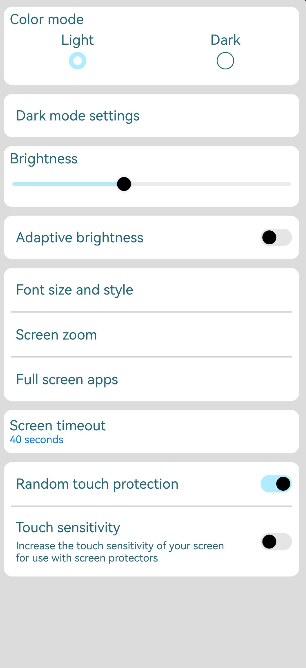
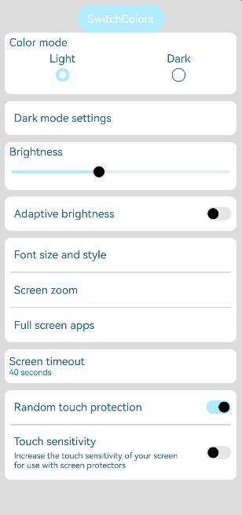
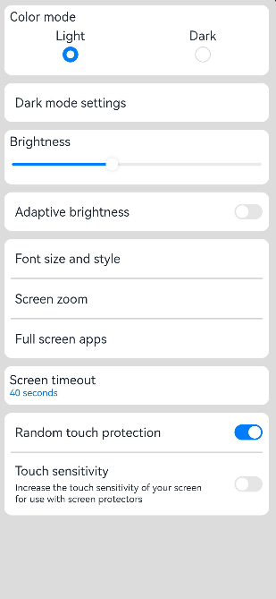

# 设置主题换肤

### 概述

针对Theme主题换肤方案，本文描述应用如下场景的开发指导：
- 自定义品牌色
- 局部页面自定义主题风格
- 局部深浅色


### 自定义品牌色
CustomTheme接口用于自定义Theme。CustomTheme的属性是可选的，只需要复写需要的修改的部分，其余部分会继承自系统。详情参考：

  ```ts
    import { CustomColors, CustomTheme } from '@ohos.arkui.theme'

    export class AppColors implements CustomColors {
      fontPrimary: ResourceColor = '#6A3E80'
      fontOnPrimary: ResourceColor = '#FDECFF'
      iconOnPrimary: ResourceColor = '#FDECFF'
      iconFourth: ResourceColor = '#336A3E80'
      compBackgroundTertiary: ResourceColor = '#Oc9162A8'
      compBackgroundEmphasize: ResourceColor = '#FF75D9'
      backgroundEmphasize: ResourceColor = '#FF75D9'
      interactiveFocus: ResourceColor = '#FF75D9'
      compBackgroundPrimary: ResourceColor = '#FFF1FB'
      compBackgroundSecondary: ResourceColor = '#199162A8'
    }

    export class AppTheme implements CustomTheme {
      public colors: AppColors = new AppColors()
    }
    
    export let gAppTheme: CustomTheme = new AppTheme()
  ```

### 设置应用级自定义品牌色
- 方法一：在页面入口处统一设置
- 约束：要在页面build前执行ThemeControl。

  其中，onWillApplyTheme回调函数用于自定义组件获取当前生效的Theme对象。

| 接口名          | 方法/属性名                                    | 是否必填 | 描述（说明默认值）                                                       | 所属文件                   |
|--------------|-------------------------------------------|------|-----------------------------------------------------------------|------------------------|
| ThemeControl | setDefaultTheme(theme: CustomTheme): void | 是    | 将自定义Theme应用于APP组件，实现APP组件风格跟随Theme切换。Theme后续可扩展shape, typograph | @ohos.arkui.theme.d.ts |


| 组件名             | 方法/属性名                          | 是否必填 | 描述（说明默认值）                 | 所属文件        |
|-----------------|---------------------------------|------|---------------------------|-------------|
| CustomComponent | onWillApplyTheme?(theme: Theme) | 是    | 回调函数用于自定义组件获取当前生效的Theme对象 | common.d.ts |


参考示例：

  ```ts
    import { Theme, ThemeControl } from '@ohos.arkui.theme'
    import { gAppTheme } from './AppTheme'
    
    //在页面build前执行ThemeControl
    ThemeControl.setDefaultTheme(gAppTheme)

    @Entry
    @Component
    struct DisplayPage {
      brightnessValue: number = 40
      brightnessMax: number = 100
      fontSize = '16fp'
      marginLeft = '14fp'
      fontSizeAndStyle = 'Font size and style'
      fullScreenApps = 'Full screen apps'
      darkModeSettings = 'Dark mode settings'
      screenZoom = 'Screen zoom'
      screenTimeout = 'Screen timeout'
      randomTouchProtection = 'Random touch protection'
      touchSensitivity = 'Touch sensitivity'
      menuItemColor: ResourceColor = $r('sys.color.background_primary')
      
      onWillApplyTheme(theme: Theme) {
        this.menuItemColor = theme.colors.backgroundPrimary;
      }

      build() {
          Column() {
            List({ space: 10 }) {
              ListItem() {
                Column({ space: '5vp' }) {
                  Text('Color mode')
                    .margin({ top: '5vp', left: this.marginLeft })
                    .width('100%')
                  Row() {
                    Column() {
                      Text('Light')
                        .fontSize(this.fontSize)
                        .textAlign(TextAlign.Start)
                        .alignSelf(ItemAlign.Center)
                      Radio({ group: 'light or dark', value: 'light'})
                        .checked(true)
                    }
                    .width('50%')
    
                    Column() {
                      Text('Dark')
                        .fontSize(this.fontSize)
                        .textAlign(TextAlign.Start)
                        .alignSelf(ItemAlign.Center)
                      Radio({ group: 'light or dark', value: 'dark'})
                    }
                    .width('50%')
                  }
                }
                .width('100%')
                .height('90vp')
                .borderRadius('10vp')
                .backgroundColor(this.menuItemColor)
              }
    
              ListItem() {
                Row() {
                  Text(this.darkModeSettings)
                    .fontSize(this.fontSize)
                    .textAlign(TextAlign.Start)
                    .alignSelf(ItemAlign.Center)
                    .margin({ left: this.marginLeft })
                    .width('100%')
                }
                .width('100%')
                .height('50vp')
                .borderRadius('10vp')
                .backgroundColor(this.menuItemColor)
                .onClick((event: ClickEvent) => {
                  console.log(`Pressed ${this.darkModeSettings}`)
                })
              }
    
              ListItem() {
                Column() {
                  Text('Brightness')
                    .width('100%')
                    .margin({ top: '5vp', left: this.marginLeft })
                  Slider({ value: this.brightnessValue, max: this.brightnessMax })
                    .onChange((value) => {
                      this.brightnessValue = value
                      console.log(`Set brightness value: ${this.brightnessValue}`)
                    })
                }
                .width('100%')
                .height('70vp')
                .borderRadius('10vp')
                .backgroundColor(this.menuItemColor)
              }
    
              ListItem() {
                Row() {
                  Text('Adaptive brightness')
                    .fontSize(this.fontSize)
                    .textAlign(TextAlign.Start)
                    .margin({ left: this.marginLeft })
                    .alignSelf(ItemAlign.Center)
                    .width('75%')
                  Toggle({ type: ToggleType.Switch })
                    .margin({ right: this.marginLeft })
                    .alignSelf(ItemAlign.Center)
                    .width('25%')
                }
                .width('100%')
                .height('50vp')
                .borderRadius('10vp')
                .backgroundColor(this.menuItemColor)
              }
    
              ListItem() {
                Column() {
                  Row() {
                    Text(this.fontSizeAndStyle)
                      .fontSize(this.fontSize)
                      .textAlign(TextAlign.Start)
                      .alignSelf(ItemAlign.Center)
                      .margin({ left: this.marginLeft })
                  }
                  .width('100%')
                  .height('50vp')
                  .onClick((event: ClickEvent) => {
                    console.log(`Pressed ${this.fontSizeAndStyle}`)
                  })
    
                  Divider()
                    .strokeWidth('1.5vp')
                    .width('95%')
                  Row() {
                    Text(this.screenZoom)
                      .fontSize(this.fontSize)
                      .textAlign(TextAlign.Start)
                      .alignSelf(ItemAlign.Center)
                      .margin({ left: this.marginLeft })
                  }
                  .width('100%')
                  .height('50vp')
                  .onClick((event: ClickEvent) => {
                    console.log(`Pressed ${this.screenZoom}`)
                  })
    
                  Divider()
                    .strokeWidth('1.5vp')
                    .width('95%')
                  Row() {
                    Text(this.fullScreenApps)
                      .fontSize(this.fontSize)
                      .textAlign(TextAlign.Start)
                      .alignSelf(ItemAlign.Center)
                      .margin({ left: this.marginLeft })
                  }
                  .width('100%')
                  .height('50vp')
                  .onClick((event: ClickEvent) => {
                    console.log(`Pressed ${this.fullScreenApps}`)
                  })
                }
                .width('100%')
                .borderRadius('10vp')
                .backgroundColor(this.menuItemColor)
              }
    
              ListItem() {
                Row() {
                  Column() {
                    Text(this.screenTimeout)
                      .fontSize(this.fontSize)
                      .textAlign(TextAlign.Start)
                      .margin({ left: this.marginLeft })
                      .width('100%')
                    Text('40 seconds')
                      .fontColor(Color.Blue)
                      .textAlign(TextAlign.Start)
                      .fontSize('12fp')
                      .fontColor('#FF0775E0')
                      .width('100%')
                      .margin({ left: this.marginLeft })
                  }
                  .alignSelf(ItemAlign.Center)
                  .width('100%')
                }
                .width('100%')
                .height('50vp')
                .borderRadius('10vp')
                .backgroundColor(this.menuItemColor)
                .onClick((event: ClickEvent) => {
                  console.log(`Pressed ${this.fullScreenApps}`)
                })
              }
    
              ListItem() {
                Column() {
                  Row() {
                    Text(this.randomTouchProtection)
                      .fontSize(this.fontSize)
                      .textAlign(TextAlign.Start)
                      .alignSelf(ItemAlign.Center)
                      .margin({ left: this.marginLeft })
                      .width('75%')
                    Toggle({ type: ToggleType.Switch, isOn: true })
                      .margin({ right: this.marginLeft })
                      .alignSelf(ItemAlign.Center)
                      .width('25%')
                  }
                  .width('100%')
                  .height('50vp')
                  .onClick((event: ClickEvent) => {
                    console.log(`Pressed ${this.randomTouchProtection}`)
                  })
    
                  Divider()
                    .strokeWidth('1.5vp')
                    .width('95%')
                  Row() {
                    Column({ space: '5vp' }) {
                      Text(this.touchSensitivity)
                        .fontSize(this.fontSize)
                        .textAlign(TextAlign.Start)
                        .width('100%')
                      Text('Increase the touch sensitivity of your screen' +
                        ' for use with screen protectors')
                        .fontSize('12fp')
                        .textAlign(TextAlign.Start)
                        .width('100%')
                    }
                    .alignSelf(ItemAlign.Center)
                    .margin({ left: this.marginLeft })
                    .width('75%')
    
                    Toggle({ type: ToggleType.Switch })
                      .margin({ right: this.marginLeft })
                      .alignSelf(ItemAlign.Center)
                      .width('25%')
                  }
                  .width('100%')
                  .height('80vp')
                  .onClick((event: ClickEvent) => {
                    console.log(`Pressed ${this.touchSensitivity}`)
                  })
                }
                .width('100%')
                .borderRadius('10vp')
                .backgroundColor(this.menuItemColor)
              }
            }
          }
          .padding('10vp')
          .backgroundColor('#dcdcdc')
          .width('100%')
          .height('100%')
      }
    }
  ```

- 方法二：在ability中设置ThemeControl
- 约束：如果在ability中设置，需要在onWindowStageCreate()方法中setDefaultTheme。

参考示例：

  ```ts
    import AbilityConstant from '@ohos.app.ability.AbilityConstant';
    import hilog from '@ohos.hilog';
    import UIAbility from '@ohos.app.ability.UIAbility';
    import Want from '@ohos.app.ability.Want';
    import window from '@ohos.window';
    import { CustomColors, ThemeControl } from '@ohos.arkui.theme';

    class AppColors implements CustomColors {
      fontPrimary = 0xFFD53032
      iconOnPrimary = 0xFFD53032
      iconFourth = 0xFFD53032
    }
    
    const abilityThemeColors = new AppColors();
    
    export default class EntryAbility extends UIAbility {
      onCreate(want: Want, launchParam: AbilityConstant.LaunchParam) {
        hilog.info(0x0000, 'testTag', '%{public}s', 'Ability onCreate');
      }
    
      onDestroy() {
        hilog.info(0x0000, 'testTag', '%{public}s', 'Ability onDestroy');
      }
    
      onWindowStageCreate(windowStage: window.WindowStage) {
        // Main window is created, set main page for this ability
        hilog.info(0x0000, 'testTag', '%{public}s', 'Ability onWindowStageCreate');
      
        windowStage.loadContent('pages/Index', (err, data) => {
          if (err.code) {
            hilog.error(0x0000, 'testTag', 'Failed to load the content. Cause: %{public}s', JSON.stringify(err) ?? '');
            return;
          }
          hilog.info(0x0000, 'testTag', 'Succeeded in loading the content. Data: %{public}s', JSON.stringify(data) ?? '');
          // 在onWindowStageCreate()方法中setDefaultTheme
          ThemeControl.setDefaultTheme({ colors: abilityThemeColors })
          hilog.info(0x0000, 'testTag', '%{public}s', 'ThemeControl.setDefaultTheme done');
        });
      }
    
    }
  ```



### 设置应用局部页面自定义主题风格 
- 将自定义Theme的配色通过设置WithTheme作用于内组件缺省样式，WithTheme作用域内组件配色跟随Theme的配色生效。
在下面示例中，通过WithTheme({ theme: this.myTheme })将作用域内的组件配色设置为自定义主题风格。后续可通过更改this.myTheme更换主题风格。
onWillApplyTheme回调函数用于自定义组件获取当前生效的Theme对象。


| 组件名                                  | 方法/属性名                                                                                      | 是否必填 | 描述（说明默认值）                          | 所属文件            |
|--------------------------------------|---------------------------------------------------------------------------------------------|------|------------------------------------|-----------------|
| WithTheme(options: WithThemeOptions) | WithThemeOptions? {<br/>theme?: CustomTheme // 自定义Theme<br/>colorMode?: ColorMode // 深浅色模式<br/>} | 是    | WithThemeOptions为自定义Theme或指定的深浅色模式 | with_theme.d.ts |


| 组件名             | 方法/属性名                          | 是否必填 | 描述（说明默认值）                 | 所属文件        |
|-----------------|---------------------------------|------|---------------------------|-------------|
| CustomComponent | onWillApplyTheme?(theme: Theme) | 是    | 回调函数用于自定义组件获取当前生效的Theme对象 | common.d.ts |


  ```ts
    import { CustomTheme, Theme } from '@ohos.arkui.theme'
    import { gAppTheme } from './AppTheme'
    
    @Entry
    @Component
    struct DisplayPage {
      brightnessValue: number = 40
      brightnessMax: number = 100
      fontSize = '16fp'
      marginLeft = '14fp'
      fontSizeAndStyle = 'Font size and style'
      fullScreenApps = 'Full screen apps'
      darkModeSettings = 'Dark mode settings'
      screenZoom = 'Screen zoom'
      screenTimeout = 'Screen timeout'
      randomTouchProtection = 'Random touch protection'
      touchSensitivity = 'Touch sensitivity'
      menuItemColor: ResourceColor = $r('sys.color.background_primary')
      fontPrimary: ResourceColor | undefined = gAppTheme?.colors?.fontPrimary
      @State myTheme: CustomTheme = gAppTheme
      count = 0
    
      onWillApplyTheme(theme: Theme) {
        this.menuItemColor = theme.colors.backgroundPrimary;
      }

      build() {
        WithTheme({ theme: this.myTheme }) {
          Column() {
            List({ space: 10 }) {
              ListItem() {
                Column({ space: '5vp' }) {
                  Text('Color mode')
                    .margin({ top: '5vp', left: this.marginLeft })
                    .width('100%')
                  Row() {
                    Column() {
                      Text('Light')
                        .fontSize(this.fontSize)
                        .textAlign(TextAlign.Start)
                        .alignSelf(ItemAlign.Center)
                      Radio({ group: 'light or dark', value: 'light'})
                        .checked(true)
                    }
                    .width('50%')
    
                    Column() {
                      Text('Dark')
                        .fontSize(this.fontSize)
                        .textAlign(TextAlign.Start)
                        .alignSelf(ItemAlign.Center)
                      Radio({ group: 'light or dark', value: 'dark'})
                    }
                    .width('50%')
                  }
                }
                .width('100%')
                .height('90vp')
                .borderRadius('10vp')
                .backgroundColor(this.menuItemColor)
              }
    
              ListItem() {
                Row() {
                  Text(this.darkModeSettings)
                    .fontSize(this.fontSize)
                    .textAlign(TextAlign.Start)
                    .alignSelf(ItemAlign.Center)
                    .margin({ left: this.marginLeft })
                    .width('100%')
                }
                .width('100%')
                .height('50vp')
                .borderRadius('10vp')
                .backgroundColor(this.menuItemColor)
                .onClick((event: ClickEvent) => {
                  console.log(`Pressed ${this.darkModeSettings}`)
                })
              }
    
              ListItem() {
                Column() {
                  Text('Brightness')
                    .width('100%')
                    .margin({ top: '5vp', left: this.marginLeft })
                  Slider({ value: this.brightnessValue, max: this.brightnessMax })
                    .onChange((value) => {
                      this.brightnessValue = value
                      console.log(`Set brightness value: ${this.brightnessValue}`)
                    })
                }
                .width('100%')
                .height('70vp')
                .borderRadius('10vp')
                .backgroundColor(this.menuItemColor)
              }
    
              ListItem() {
                Row() {
                  Text('Adaptive brightness')
                    .fontSize(this.fontSize)
                    .textAlign(TextAlign.Start)
                    .margin({ left: this.marginLeft })
                    .alignSelf(ItemAlign.Center)
                    .width('75%')
                  Toggle({ type: ToggleType.Switch })
                    .margin({ right: this.marginLeft })
                    .alignSelf(ItemAlign.Center)
                    .width('25%')
                }
                .width('100%')
                .height('50vp')
                .borderRadius('10vp')
                .backgroundColor(this.menuItemColor)
              }
    
              ListItem() {
                Column() {
                  Row() {
                    Text(this.fontSizeAndStyle)
                      .fontSize(this.fontSize)
                      .textAlign(TextAlign.Start)
                      .alignSelf(ItemAlign.Center)
                      .margin({ left: this.marginLeft })
                  }
                  .width('100%')
                  .height('50vp')
                  .onClick((event: ClickEvent) => {
                    console.log(`Pressed ${this.fontSizeAndStyle}`)
                  })
    
                  Divider()
                    .strokeWidth('1.5vp')
                    .width('95%')
                  Row() {
                    Text(this.screenZoom)
                      .fontSize(this.fontSize)
                      .textAlign(TextAlign.Start)
                      .alignSelf(ItemAlign.Center)
                      .margin({ left: this.marginLeft })
                  }
                  .width('100%')
                  .height('50vp')
                  .onClick((event: ClickEvent) => {
                    console.log(`Pressed ${this.screenZoom}`)
                  })
    
                  Divider()
                    .strokeWidth('1.5vp')
                    .width('95%')
                  Row() {
                    Text(this.fullScreenApps)
                      .fontSize(this.fontSize)
                      .textAlign(TextAlign.Start)
                      .alignSelf(ItemAlign.Center)
                      .margin({ left: this.marginLeft })
                  }
                  .width('100%')
                  .height('50vp')
                  .onClick((event: ClickEvent) => {
                    console.log(`Pressed ${this.fullScreenApps}`)
                  })
                }
                .width('100%')
                .borderRadius('10vp')
                .backgroundColor(this.menuItemColor)
              }
    
              ListItem() {
                Row() {
                  Column() {
                    Text(this.screenTimeout)
                      .fontSize(this.fontSize)
                      .textAlign(TextAlign.Start)
                      .margin({ left: this.marginLeft })
                      .width('100%')
                    Text('40 seconds')
                      .fontColor(Color.Blue)
                      .textAlign(TextAlign.Start)
                      .fontSize('12fp')
                      .fontColor('#FF0775E0')
                      .width('100%')
                      .margin({ left: this.marginLeft })
                  }
                  .alignSelf(ItemAlign.Center)
                  .width('100%')
                }
                .width('100%')
                .height('50vp')
                .borderRadius('10vp')
                .backgroundColor(this.menuItemColor)
                .onClick((event: ClickEvent) => {
                  console.log(`Pressed ${this.fullScreenApps}`)
                })
              }
    
              ListItem() {
                Column() {
                  Row() {
                    Text(this.randomTouchProtection)
                      .fontSize(this.fontSize)
                      .textAlign(TextAlign.Start)
                      .alignSelf(ItemAlign.Center)
                      .margin({ left: this.marginLeft })
                      .width('75%')
                    Toggle({ type: ToggleType.Switch, isOn: true })
                      .margin({ right: this.marginLeft })
                      .alignSelf(ItemAlign.Center)
                      .width('25%')
                  }
                  .width('100%')
                  .height('50vp')
                  .onClick((event: ClickEvent) => {
                    console.log(`Pressed ${this.randomTouchProtection}`)
                  })
    
                  Divider()
                    .strokeWidth('1.5vp')
                    .width('95%')
                  Row() {
                    Column({ space: '5vp' }) {
                      Text(this.touchSensitivity)
                        .fontSize(this.fontSize)
                        .textAlign(TextAlign.Start)
                        .width('100%')
                      Text('Increase the touch sensitivity of your screen' +
                      ' for use with screen protectors')
                        .fontSize('12fp')
                        .textAlign(TextAlign.Start)
                        .width('100%')
                    }
                    .alignSelf(ItemAlign.Center)
                    .margin({ left: this.marginLeft })
                    .width('75%')
    
                    Toggle({ type: ToggleType.Switch })
                      .margin({ right: this.marginLeft })
                      .alignSelf(ItemAlign.Center)
                      .width('25%')
                  }
                  .width('100%')
                  .height('80vp')
                  .onClick((event: ClickEvent) => {
                    console.log(`Pressed ${this.touchSensitivity}`)
                  })
                }
                .width('100%')
                .borderRadius('10vp')
                .backgroundColor(this.menuItemColor)
              }
            }
          }
          .padding('10vp')
          .backgroundColor('#dcdcdc')
          .width('100%')
          .height('100%')
        }
      }
    }
  ```



### 设置应用页面局部深浅色
- 通过WithTheme可以设置深浅色模式，ThemeColorMode.SYSTEM模式表示跟随系统模式，ThemeColorMode.LIGHT模式表示浅色模式，ThemeColorMode.DARK模式表示深色模式。
在WithTheme作用域内，组件的样式资源取值跟随指定的模式读取对应的深浅色模式系统和应用资源值，WithTheme作用域内的组件配色跟随指定的深浅模式生效。
在下面的示例中，通过WithTheme({ colorMode: ThemeColorMode.DARK })将作用域内的组件设置为深色模式。

  ```ts
    @Entry
    @Component
    struct DisplayPage {
      @State message: string = 'Hello World';
      @State colorMode: ThemeColorMode = ThemeColorMode.DARK;

      build() {
        WithTheme({ colorMode: ThemeColorMode.DARK }) {
          Row() {
            Column() {
              Text(this.message)
                .fontSize(50)
                .fontWeight(FontWeight.Bold)
              Button('Switch ColorMode').onClick(() => {
                if (this.colorMode === ThemeColorMode.LIGHT) {
                  this.colorMode = ThemeColorMode.DARK;
                } else if (this.colorMode === ThemeColorMode.DARK) {
                  this.colorMode = ThemeColorMode.LIGHT;
                }
              })
            }
            .width('100%')
          }
          .backgroundColor($r('sys.color.background_primary'))
          .height('100%')
          .expandSafeArea([SafeAreaType.SYSTEM], [SafeAreaEdge.TOP, SafeAreaEdge.END, SafeAreaEdge.BOTTOM, SafeAreaEdge.START])
        }
      }
    }
  ```
  

