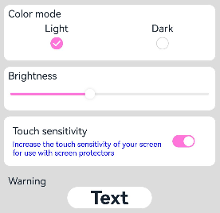
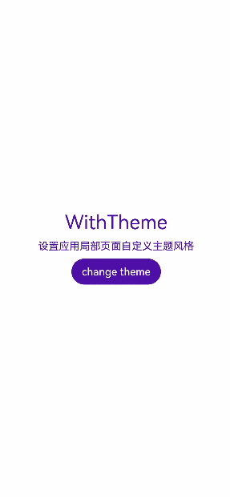
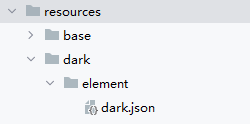

# 设置应用内主题换肤

## 概述

对于采用ArkTS开发的应用，提供了应用内组件的主题换肤功能，支持局部的深浅色切换及动态换肤。目前，该功能只支持设置应用内主题换肤，暂不支持在UIAbility或窗口层面进行主题设置，同时也不支持C-API和Node-API。

## 自定义主题色
当应用需要使用换肤功能时，应自定义主题颜色。[CustomTheme](../reference/apis-arkui/js-apis-arkui-theme.md#customtheme)用于自定义主题色的内容，其属性可选，仅需要复写需修改的部分，未修改内容将继承系统默认设置，可参考[系统默认的token颜色值](#系统缺省token色值)。请参照以下示例自定义主题色：

  ```ts
    import { CustomColors, CustomTheme } from '@kit.ArkUI';

    export class AppColors implements CustomColors {
      //自定义主题色
      brand: ResourceColor = '#FF75D9';
    }

    export class AppTheme implements CustomTheme {
      public colors: AppColors = new AppColors();
    }
    
    export let gAppTheme: CustomTheme = new AppTheme();
  ```

## 设置应用内组件自定义主题色
- 可以在页面入口处统一设置应用内组件自定义主题色，但需确保在页面build前执行[ThemeControl](../reference/apis-arkui/js-apis-arkui-theme.md#themecontrol)。
  其中，[onWillApplyTheme](../reference/apis-arkui/arkui-ts/ts-custom-component-lifecycle.md#onwillapplytheme12)回调函数用于使自定义组件获取当前生效的Theme对象。

  ```ts
    import { Theme, ThemeControl } from '@kit.ArkUI';
    import { gAppTheme } from './AppTheme';
    
    //在页面build前执行ThemeControl
    ThemeControl.setDefaultTheme(gAppTheme);

    @Entry
    @Component
    struct DisplayPage {
      @State menuItemColor: ResourceColor = $r('sys.color.background_primary');
      
      onWillApplyTheme(theme: Theme) {
        this.menuItemColor = theme.colors.backgroundPrimary;
      }
    
      build() {
        Column() {
          List({ space: 10 }) {
            ListItem() {
              Column({ space: '5vp' }) {
                Text('Color mode')
                  .margin({ top: '5vp', left: '14fp' })
                  .width('100%')
                Row() {
                  Column() {
                    Text('Light')
                      .fontSize('16fp')
                      .textAlign(TextAlign.Start)
                      .alignSelf(ItemAlign.Center)
                    Radio({ group: 'light or dark', value: 'light' })
                      .checked(true)
                  }
                  .width('50%')

                  Column() {
                    Text('Dark')
                      .fontSize('16fp')
                      .textAlign(TextAlign.Start)
                      .alignSelf(ItemAlign.Center)
                    Radio({ group: 'light or dark', value: 'dark' })
                  }
                  .width('50%')
                }
              }
              .width('100%')
              .height('90vp')
              .borderRadius('10vp')
              .backgroundColor(this.menuItemColor)
            }

            ListItem() {
              Column() {
                Text('Brightness')
                  .width('100%')
                  .margin({ top: '5vp', left: '14fp' })
                Slider({ value: 40, max: 100 })
              }
              .width('100%')
              .height('70vp')
              .borderRadius('10vp')
              .backgroundColor(this.menuItemColor)
            }

            ListItem() {
              Column() {
                Row() {
                  Column({ space: '5vp' }) {
                    Text('Touch sensitivity')
                      .fontSize('16fp')
                      .textAlign(TextAlign.Start)
                      .width('100%')
                    Text('Increase the touch sensitivity of your screen' +
                      ' for use with screen protectors')
                      .fontSize('12fp')
                      .fontColor(Color.Blue)
                      .textAlign(TextAlign.Start)
                      .width('100%')
                  }
                  .alignSelf(ItemAlign.Center)
                  .margin({ left: '14fp' })
                  .width('75%')
    
                  Toggle({ type: ToggleType.Switch, isOn: true })
                    .margin({ right: '14fp' })
                    .alignSelf(ItemAlign.Center)
                }
                .width('100%')
                .height('80vp')
              }
              .width('100%')
              .borderRadius('10vp')
              .backgroundColor(this.menuItemColor)
            }
          }
        }
        .padding('10vp')
        .backgroundColor('#dcdcdc')
        .width('100%')
        .height('100%')
      }
    }
  ```

- 在UIAbility中设置[ThemeControl](../reference/apis-arkui/js-apis-arkui-theme.md#themecontrol)，需要在onWindowStageCreate()方法中[setDefaultTheme](../reference/apis-arkui/js-apis-arkui-theme.md#setdefaulttheme)，设置应用内组件的自定义主题色。

  ```ts
    import {AbilityConstant, UIAbility, Want } from '@kit.AbilityKit';
    import { hilog } from '@kit.PerformanceAnalysisKit';
    import { window, CustomColors, ThemeControl } from '@kit.ArkUI';

    class AppColors implements CustomColors {
      fontPrimary = 0xFFD53032;
      iconOnPrimary = 0xFFD53032;
      iconFourth = 0xFFD53032;
    }
    
    const abilityThemeColors = new AppColors();
    
    export default class EntryAbility extends UIAbility {
      onCreate(want: Want, launchParam: AbilityConstant.LaunchParam) {
        hilog.info(0x0000, 'testTag', '%{public}s', 'Ability onCreate');
      }
    
      onDestroy() {
        hilog.info(0x0000, 'testTag', '%{public}s', 'Ability onDestroy');
      }
    
      onWindowStageCreate(windowStage: window.WindowStage) {
        // Main window is created, set main page for this ability
        hilog.info(0x0000, 'testTag', '%{public}s', 'Ability onWindowStageCreate');
      
        windowStage.loadContent('pages/Index', (err, data) => {
          if (err.code) {
            hilog.error(0x0000, 'testTag', 'Failed to load the content. Cause: %{public}s', JSON.stringify(err) ?? '');
            return;
          }
          hilog.info(0x0000, 'testTag', 'Succeeded in loading the content. Data: %{public}s', JSON.stringify(data) ?? '');
          // 在onWindowStageCreate()方法中setDefaultTheme
          ThemeControl.setDefaultTheme({ colors: abilityThemeColors });
          hilog.info(0x0000, 'testTag', '%{public}s', 'ThemeControl.setDefaultTheme done');
        });
      }
    
    }
  ```



> **说明：**
>
>如果setDefaultTheme的参数为undefined时，默认token值对应的色值参考[系统缺省token色值](#系统缺省token色值)。
>
>setDefaultTheme需要在ArkUI初始化后即windowStage.loadContent的完成时回调中使用。

## 设置应用局部页面自定义主题风格
通过设置[WithTheme](../reference/apis-arkui/arkui-ts/ts-container-with-theme.md)，将自定义主题Theme的配色应用于内部组件的默认样式。在WithTheme的作用范围内，组件的配色会根据Theme的配色进行调整。

如示例所示，使用WithTheme({ theme: this.myTheme })可将作用域内组件的配色设置为自定义主题风格。后续可以通过更新this.myTheme来更换主题风格。[onWillApplyTheme](../reference/apis-arkui/arkui-ts/ts-custom-component-lifecycle.md#onwillapplytheme12)回调函数用于使自定义组件能够获取当前生效的Theme对象。

  ```ts
    import { CustomColors, CustomTheme, Theme } from '@kit.ArkUI';

    class AppColors implements CustomColors {
      fontPrimary: ResourceColor = $r('app.color.brand_purple');
      backgroundEmphasize: ResourceColor = $r('app.color.brand_purple');
    }
    
    class AppColorsSec implements CustomColors {
      fontPrimary: ResourceColor = $r('app.color.brand');
      backgroundEmphasize: ResourceColor = $r('app.color.brand');
    }
    
    class AppTheme implements CustomTheme {
      public colors: AppColors = new AppColors();
    }
    
    class AppThemeSec implements CustomTheme {
      public colors: AppColors = new AppColorsSec();
    }
    
    @Entry
    @Component
    struct DisplayPage {
      @State customTheme: CustomTheme = new AppTheme();
      @State message: string = '设置应用局部页面自定义主题风格';
      count = 0;
    
      build() {
        WithTheme({ theme: this.customTheme }) {
          Row(){
            Column() {
              Text('WithTheme')
                .fontSize(30)
                .margin({bottom: 10})
              Text(this.message)
                .margin({bottom: 10})
              Button('change theme').onClick(() => {
                this.count++;
                if (this.count > 1) {
                  this.count = 0;
                }
                switch (this.count) {
                  case 0:
                    this.customTheme = new AppTheme();
                    break;
                  case 1:
                    this.customTheme = new AppThemeSec();
                    break;
                }
              })
            }
            .width('100%')
          }
          .height('100%')
          .width('100%')
        }
      }
    }
  ```



## 设置应用页面局部深浅色
通过[WithTheme](../reference/apis-arkui/arkui-ts/ts-container-with-theme.md)可以设置三种颜色模式，跟随系统模式，浅色模式和深色模式。

在WithTheme的作用范围内，组件的样式资源值会根据指定的模式，读取对应的深浅色模式系统和应用资源值。这意味着，在WithTheme作用范围内，组件的配色会根据所指定的深浅模式进行调整。

如下面的示例所示，通过WithTheme({ colorMode: ThemeColorMode.DARK })，可以将作用范围内的组件设置为深色模式。

设置局部深浅色时，需要添加dark.json资源文件，深浅色模式才会生效。



dark.json数据示例：
  ```ts
    {
      "color": [
        {
          "name": "start_window_background",
          "value": "#FFFFFF"
        }
      ]
    }
  ```

  ```ts
    @Entry
    @Component
    struct DisplayPage {
      @State message: string = 'Hello World';
      @State colorMode: ThemeColorMode = ThemeColorMode.DARK;

      build() {
        WithTheme({ colorMode: this.colorMode }) {
          Row() {
            Column() {
              Text(this.message)
                .fontSize(50)
                .fontWeight(FontWeight.Bold)
              Button('Switch ColorMode').onClick(() => {
                if (this.colorMode === ThemeColorMode.LIGHT) {
                  this.colorMode = ThemeColorMode.DARK;
                } else if (this.colorMode === ThemeColorMode.DARK) {
                  this.colorMode = ThemeColorMode.LIGHT;
                }
              })
            }
            .width('100%')
          }
          .backgroundColor($r('sys.color.background_primary'))
          .height('100%')
          .expandSafeArea([SafeAreaType.SYSTEM], [SafeAreaEdge.TOP, SafeAreaEdge.END, SafeAreaEdge.BOTTOM, SafeAreaEdge.START])
        }
      }
    }
  ```


## 系统缺省token色值

| Token                                      | 场景类别 | Light |           | Dark    |                                              |
|--------------------------------------------|-----| --- |-----------| ------- | -------------------------------------------- |
| theme.colors.brand                         | 品牌色 |#ff0a59f7|  |#ff317af7||
| theme.colors.warning                       | 一级警示色 |#ffe84026|  |#ffd94838||
| theme.colors.alert                         | 二级警示色 |#ffed6f21|  |#ffdb6b42||
| theme.colors.confirm                       | 确认色 |#ff64bb5c|  |#ff5ba854||
| theme.colors.fontPrimary                   | 一级文本 | #e5000000 |  |#e5ffffff||
| theme.colors.fontSecondary                 | 二级文本 | #99000000 |  |#99ffffff||
| theme.colors.fontTertiary                  | 三级文本 | #66000000 |  |#66ffffff||
| theme.colors.fontFourth                    | 四级文本 | #33000000 |  |#33ffffff||
| theme.colors.fontEmphasize                 | 高亮文本 | #ff0a59f7 |  |#ff317af7||
| theme.colors.fontOnPrimary                 | 一级文本反色 | #ffffffff |  |#ff000000||
| theme.colors.fontOnSecondary               | 二级文本反色 | #99ffffff |  |#99000000||
| theme.colors.fontOnTertiary                | 三级文本反色 | #66ffffff |  |#66000000||
| theme.colors.fontOnFourth                  | 四级文本反色 | #33ffffff |  |#33000000||
| theme.colors.iconPrimary                   | 一级图标 | #e5000000 |  |#e5ffffff||
| theme.colors.iconSecondary                 | 二级图标 | #99000000 |  |#99ffffff||
| theme.colors.iconTertiary                  | 三级图标 | #66000000 |  |#66ffffff||
| theme.colors.iconFourth                    | 四级图标 | #33000000 |  |#33ffffff||
| theme.colors.iconEmphasize                 | 高亮图标 | #ff0a59f7 |  |#ff317af7||
| theme.colors.iconSubEmphasize              | 高亮辅助图标 | #660a59f7 |  |#66317af7||
| theme.colors.iconOnPrimary                 | 一级图标反色 | #ffffffff |  |#ff000000||
| theme.colors.iconOnSecondary               | 二级图标反色 | #99ffffff |  |#99000000||
| theme.colors.iconOnTertiary                | 三级图标反色 | #66ffffff |  |#66000000||
| theme.colors.iconOnFourth                  | 四级图标反色 | #33ffffff |  |#33000000||
| theme.colors.backgroundPrimary             | 一级背景（实色/不透明色） | #ffffffff |  |#ffe5e5e5||
| theme.colors.backgroundSecondary           | 二级背景（实色/不透明色） | #fff1f3f5 |  |#ff191a1c||
| theme.colors.backgroundTertiary            | 三级背景（实色/不透明色） | #ffe5e5ea |  |#ff202224||
| theme.colors.backgroundFourth              | 四级背景（实色/不透明色） | #ffd1d1d6 |  |#ff2e3033||
| theme.colors.backgroundEmphasize           | 高亮背景（实色/不透明色） | #ff0a59f7 |  |#ff317af7||
| theme.colors.compForegroundPrimary         | 前背景 | #ff000000 |  | #ffe5e5e5 ||
| theme.colors.compBackgroundPrimary         | 白色背景 | #ffffffff || #ffffffff ||
| theme.colors.compBackgroundPrimaryTran     | 白色透明背景 | #ffffffff || #33ffffff ||
| theme.colors.compBackgroundPrimaryContrary | 常亮背景 | #ffffffff || #ffe5e5e5 ||
| theme.colors.compBackgroundGray            | 灰色背景 | #fff1f3f5 || #ffe5e5ea ||
| theme.colors.compBackgroundSecondary       | 二级背景 | #19000000 || #19ffffff ||
| theme.colors.compBackgroundTertiary        | 三级背景 | #0c000000 || #0cffffff ||
| theme.colors.compBackgroundEmphasize       | 高亮背景 | #ff0a59f7 || #ff317af7 ||
| theme.colors.compBackgroundNeutral         | 黑色中性高亮背景 | #ff000000 || #ffffffff ||
| theme.colors.compEmphasizeSecondary        | 20%高亮背景 | #330a59f7 || #33317af7 ||
| theme.colors.compEmphasizeTertiary         | 10%高亮背景 | #190a59f7 || #19317af7 ||
| theme.colors.compDivider                   | 分割线颜色 | #33000000 || #33ffffff ||
| theme.colors.compCommonContrary            | 通用反色 | #ffffffff || #ff000000 ||
| theme.colors.compBackgroundFocus           | 获焦态背景色 | #fff1f3f5 || #ff000000 ||
| theme.colors.compFocusedPrimary            | 获焦态一级反色 | #e5000000 || #e5ffffff ||
| theme.colors.compFocusedSecondary          | 获焦态二级反色 | #99000000 || #99ffffff ||
| theme.colors.compFocusedTertiary           | 获焦态三级反色 | #66000000 || #66ffffff ||
| theme.colors.interactiveHover              | 通用悬停交互式颜色 | #0c000000 || #0cffffff ||
| theme.colors.interactivePressed            | 通用按压交互式颜色 | #19000000 || #19ffffff ||
| theme.colors.interactiveFocus              | 通用获焦交互式颜色 | #ff0a59f7 || #ff317af7 ||
| theme.colors.interactiveActive             | 通用激活交互式颜色 | #ff0a59f7 || #ff317af7 ||
| theme.colors.interactiveSelect             | 通用选择交互式颜色 | #33000000 || #33ffffff ||
| theme.colors.interactiveClick              | 通用点击交互式颜色 | #19000000 || #19ffffff ||
