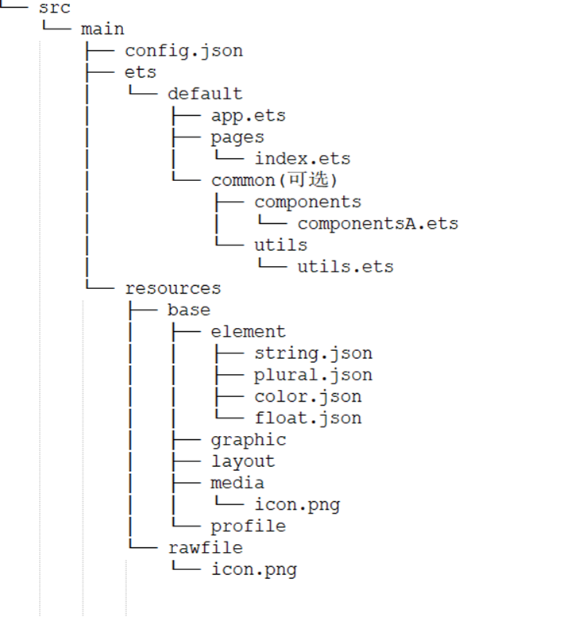

# 目录结构

FA应用的eTS模块(entry/src/main)的典型开发目录结构如下：

**目录结构中文件分类如下：**

.ets结尾的eTS（extended TypeScript）文件，用于描述UI布局、样式、事件交互和页面逻辑。

**各个文件夹和文件的作用：**

- **app.ets**文件用于全局应用逻辑和应用生命周期管理。

- **pages**目录用于存放所有组件页面。

- **common**目录用于存放公共代码文件，比如：自定义组件和公共方法。

>  **说明：**
> 
> - 资源目录resources文件夹位于src/main下，此目录下资源文件的详细规范以及子目录结构规范参看[资源文件的分类](../quick-start/basic-resource-file-categories.md)。
>
> - 页面支持导入TypeScript和JavaScript文件。
