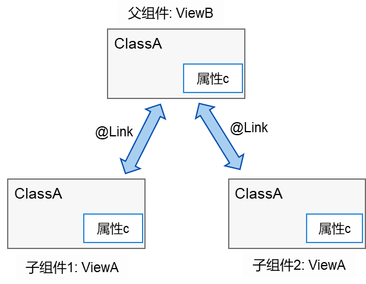
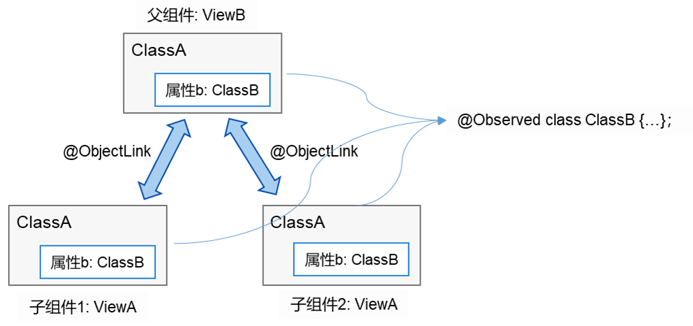

# Observed和ObjectLink数据管理

本章将引入两个新的装饰符@Observed和@ObjectLink：


- @Observed应用于类，表示该类中的数据变更被UI页面管理，例如：@Observed class ClassA {}。

- @ObjectLink应用于被@Observed所装饰类的对象，例如：@ObjectLink a: ClassA。


## 引入动机

当开发者需要在子组件中针对父组件的一个变量（parent_a）设置双向同步时，开发者可以在父组件中使用\@State装饰变量（parent_a），并在子组件中使用@Link装饰相应的变量（child_a）。这样的话，不仅可以实现父组件与单个子组件之间的数据同步，也可以实现父组件与多个子组件之间的数据同步。如下图所示，可以看到，父子组件针对ClassA类型的变量设置了双向同步，那么当子组件1中变量的属性c的值变化时，会通知父组件同步变化，而当父组件中属性c的值变化时，会通知所有子组件同步变化。



然而，上述例子是针对某个数据对象进行的整体同步，而当开发者只想针对父组件中某个数据对象的部分信息进行同步时，使用@Link就不能满足要求。如果这些部分信息是一个类对象，就可以使用@ObjectLink配合@Observed来实现，如下图所示。




## 设置要求

- @Observed 用于类，@ObjectLink 用于变量。

- @ObjectLink装饰的变量类型必须为类（class type）。
  - 类要被\@Observed装饰器所装饰。
  - 不支持简单类型参数，可以使用@Prop进行单向同步。

- @ObjectLink装饰的变量是不可变的（immutable）。
  - 属性的改动是被允许的，当改动发生时，如果同一个对象被多个@ObjectLink变量所引用，那么所有拥有这些变量的自定义组件都会被通知去重新渲染。

- @ObjectLink装饰的变量不可设置默认值。
  - 必须让父组件中有一个由@State、@Link、@StorageLink、@Provide或@Consume所装饰变量参与的TS表达式进行初始化。

- @ObjectLink装饰的变量是私有变量，只能在组件内访问。


## 示例


### 案例1

```
//父组件ViewB中的类对象ClassB，其包含的对象ClassA与子组件ViewA数据同步时，通过ObjectLink将数据c值的变化状态通知给父组件同步变化。
@Observed
class ClassA {
  public name : string;
  public c: number;
  constructor(c: number, name: string = 'OK') {
    this.name = name;
    this.c = c;
  }
}

class ClassB {
  public a: ClassA;
  constructor(a: ClassA) {
    this.a = a;
  }
}

@Component
struct ViewA {
  label : string = "ep1";
  @ObjectLink a : ClassA;
  build() {
    Column() {
      Text(`ViewA [${this.label}]: a.c=${this.a.c}`)
        .fontSize(20)
      Button(`+1`)
        .width(100)
        .margin(2)
        .onClick(() => {
          this.a.c += 1;
        })
      Button(`reset`)
        .width(100)
        .margin(2)
        .onClick(() => {
          this.a = new ClassA(0); // 错误：ObjectLink装饰的变量a是不可变的
        })
    }
  }
}

@Entry
@Component
struct ViewB {
  @State b : ClassB = new ClassB(new ClassA(10));
  build() {
    Flex({direction: FlexDirection.Column, alignItems: ItemAlign.Center}) {
      ViewA({label: "ViewA #1", a: this.b.a})
      ViewA({label: "ViewA #2", a: this.b.a})

      Button(`ViewB: this.b.a.c += 1` )
        .width(320)
        .margin(4)
        .onClick(() => {
          this.b.a.c += 1;
        })
      Button(`ViewB: this.b.a = new ClassA(0)`)
        .width(240)
        .margin(4)
        .onClick(() => {
          this.b.a = new ClassA(0);
        })
      Button(`ViewB: this.b = new ClassB(ClassA(0))`)
        .width(240)
        .margin(4)
        .onClick(() => {
          this.b = new ClassB(new ClassA(0));
        })
    }
  }
}
```


### 案例2

```
//父组件ViewB中的类对象ClassA与子组件ViewA保持数据同步时，可以使用@ObjectLink和@Observed，绑定该数据对象的父组件和其他子组件同步更新
var nextID: number = 0;
@Observed
class ClassA {
  public name : string;
  public c: number;
  public id : number;
  constructor(c: number, name: string = 'OK') {
    this.name = name;
    this.c = c;
    this.id = nextID++;
  }
}

@Component
struct ViewA {
  label : string = "ViewA1";
  @ObjectLink a: ClassA;
  build() {
    Row() {
      Button(`ViewA [${this.label}] this.a.c= ${this.a.c} +1`)
        .onClick(() => {
          this.a.c += 1;
        })
    }.margin({ top: 10 })
  }
}

@Entry
@Component
struct ViewB {
  @State arrA : ClassA[] = [ new ClassA(0), new ClassA(0) ];
  build() {
    Column() {
      ForEach (this.arrA, (item) => {
          ViewA({label: `#${item.id}`, a: item})
        },
        (item) => item.id.toString()
      )
      ViewA({label: `ViewA this.arrA[first]`, a: this.arrA[0]})
      ViewA({label: `ViewA this.arrA[last]`, a: this.arrA[this.arrA.length-1]})

      Button(`ViewB: reset array`)
        .margin({ top: 10 })
        .onClick(() => {
            this.arrA = [ new ClassA(0), new ClassA(0) ];
        })
      Button(`ViewB: push`)
      	.margin({ top: 10 })
        .onClick(() => {
            this.arrA.push(new ClassA(0))
        })
      Button(`ViewB: shift`)
      	.margin({ top: 10 })
        .onClick(() => {
            this.arrA.shift()
        })
    }
  }
}
```
