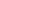

# 类型定义

## 长度类型

| 名称 | 类型定义 | 描述 |
| -------- | -------- | -------- |
| Length | string&nbsp;\|&nbsp;number | 用于描述尺寸单位，输入为number类型时，使用vp单位；输入为string类型时，需要显式指定像素单位，如'10px'，也可设置百分比字符串，如'100%'。 |


## 角度类型

| 名称 | 类型定义 | 描述 |
| -------- | -------- | -------- |
| Angle | string&nbsp;\|&nbsp;number | 用于角度单位，输入为number类型时，使用deg单位；输入为string类型时需要显示指定角度单位，支持以下两种角度单位：<br/>-&nbsp;deg：如'100deg'。<br/>-&nbsp;rad：如'3.14rad'。 |


## 点类型

| 名称 | 类型定义 | 描述 |
| -------- | -------- | -------- |
| Point | [Length,&nbsp;Length] | 用于描述点坐标，第一个值为x轴坐标，第二个值为y坐标。 |


## 颜色类型

组件属性方法使用的颜色Color说明如下：

| 名称 | 类型定义 | 描述 |
| -------- | -------- | -------- |
| Color | string&nbsp;\|&nbsp;number&nbsp;\|&nbsp;Color | 用于描述颜色信息，输入为string类型时，使用rgb或者rgba进行描述；输入为number类型是，使用HEX格式颜色；输入类型为Color枚举时，使用颜色枚举值。<br/>-&nbsp;'rgb(255,&nbsp;255,&nbsp;255)'。<br/>-&nbsp;'rgba(255,&nbsp;255,&nbsp;255,&nbsp;1.0)'。<br/>-&nbsp;HEX格式：0xrrggbb，0xaarrggbb，'\#FFFFFF'。<br/>-&nbsp;枚举格式：Color.Black，Color.White等。 |


当前支持的Color颜色枚举：


| 颜色名称 | 颜色值 | 颜色示意 |
| -------- | -------- | -------- |
| Black | 0x000000 |  |
| Blue | 0x0000ff |  |
| Brown | 0xa52a2a |  |
| Gray | 0x808080 |  |
| Green | 0x008000 |  |
| Orange | 0xffa500 |  |
| Pink | 0xffc0cb |  |
| Red | 0xff0000 |  |
| White | 0xffffff |  |
| Yellow | 0xffff00 |  |


## ColorStop类型

颜色断点类型，用于描述渐进色颜色断点。

| 名称 | 类型定义 | 描述 |
| -------- | -------- | -------- |
| ColorStop | [Color,&nbsp;number] | 描述渐进色颜色断点类型，第一个参数为颜色值，第二个参数为0~1之间的比例值。 |


## 示例

```
@Entry
@Component
struct dataTypeExample {
  build() {
    Column({ space: 5 }) {
      Text('Length').fontColor(0xCCCCCC).fontSize(9).width('90%')
      Text('90%').width('90%').height(40).backgroundColor(0xF9CF93)
        .textAlign(TextAlign.Center).fontColor(Color.White)
      Text('320').width(320).height(40).backgroundColor(0xF9CF93)
        .textAlign(TextAlign.Center).fontColor(Color.White)
      Text('1000px').width('1000px').height(40).backgroundColor(0xF9CF93)
        .textAlign(TextAlign.Center).fontColor(Color.White)

      Text('Angle').fontColor(0xCCCCCC).fontSize(9).width('90%')
      Text('45deg')
        .width(40).height(40)
        .rotate({ x: 0, y: 0, z: 1, angle: 45, centerX: '50%', centerY: '50%' })
        .fontColor(Color.White)
        .backgroundColor(0xF9CF93).textAlign(TextAlign.Center)

      Text('45rad')
        .width(40).height(40)
        .rotate({ x: 0, y: 0, z: 1, angle: '45rad', centerX: '50%', centerY: '50%' })
        .fontColor(Color.White)
        .backgroundColor(0xF9CF93).textAlign(TextAlign.Center).margin({ top: 30 })

      Text('Point').fontColor(0xCCCCCC).fontSize(9).width('90%')
      Line().width(300).height(40).startPoint([0, 20]).endPoint([300, 20])

      Text('Color').fontColor('#CCCCCC').fontSize(9).width('90%')
      Text('0xF9CF93')
        .fontColor(Color.White).textAlign(TextAlign.Center)
        .width('90%').height(40).backgroundColor(0xF9CF93)

      Text('#F9CF93')
        .fontColor(Color.White).textAlign(TextAlign.Center)
        .width('90%').height(40).backgroundColor('#F9CF93')

      Text('rgb(249, 207, 147)')
        .fontColor(Color.White).textAlign(TextAlign.Center)
        .width('90%').height(40).backgroundColor('rgb(249, 207, 147)')

      Text('rgba(249, 207, 147, 1.0)')
        .fontColor(Color.White).textAlign(TextAlign.Center)
        .width('90%').height(40).backgroundColor('rgba(249, 207, 147, 1.0)')

      Text('Color.Yellow')
        .textAlign(TextAlign.Center)
        .width('90%').height(40).backgroundColor(Color.Yellow)
    }
    .width('100%').margin({ top: 5 })
  }
}
```


