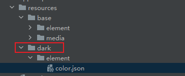

# 应用深浅色适配
<!--Kit: ArkUI-->
<!--Subsystem: ArkUI-->
<!--Owner: @fangzhiyuan1-->
<!--Designer: @fangzhiyuan1-->
<!--Tester: @gouyuanyuan-->
<!--Adviser: @Brilliantry_Rui-->

## 概述

当前系统存在深浅色两种显示模式，为了给用户更好的使用体验，应用应适配深浅色模式。从应用与系统配置关联的角度来看，适配深浅色模式可以分为下面两种情况：

[应用跟随系统的深浅色模式](#应用跟随系统的深浅色模式)

[应用主动设置深浅色模式](#应用主动设置深浅色模式)

## 应用跟随系统的深浅色模式

1. 颜色适配

   - 自定义资源实现

     resources目录下增加深色模式限定词目录（命名为dark）并新建color.json文件，可显示深色模式颜色资源的配置。详细请参考[资源分类与访问](../quick-start/resource-categories-and-access.md)。

     图1 resources目录结构示意

     
    
     例如，开发者可在这两个color.json中定义同名配色定义并赋予不同的色值。
    
     base/element/color.json文件：
    
     ```json
     {
       "color": [
         {
           "name": "app_title_color",
           "value": "#000000"
         }
       ]
     }
     ```
    
     dark/element/color.json文件：
    
     ```json
     {
       "color": [
         {
           "name": "app_title_color",
           "value": "#FFFFFF"
         }
       ]
     }
     ```

   - 通过系统资源实现

     开发者可直接使用的[系统预置资源](../quick-start/resource-categories-and-access.md#访问系统资源)，即分层参数，同一资源ID在设备类型、深浅色等不同配置下有不同的取值。通过使用系统资源，不同的开发者可以开发出具有相同视觉风格的应用，不需要自定义两份颜色资源，在深浅色模式下也会自动切换成不同的颜色值。例如，开发者可调用系统资源中的文本主要配色来定义应用内文本颜色。

     ```ts
     Text('使用系统定义配色')
       .fontColor($r('sys.color.ohos_id_color_text_primary'))
     ```

2. 图片资源适配

    采用资源限定词目录的方式。参照颜色适配的方法，需要将深色模式下对应的同名图片放到 dark/media 目录下，再通过[$r](../reference/apis-arkui/js-apis-arkui-resource.md#r)的方式加载图片资源的key值，系统做深浅色模式切换时，会自动加载对应资源文件中的value值。

    对于 SVG 格式的一些简单图标，可以使用[fillColor](arkts-graphics-display.md#显示矢量图)属性配合系统资源改变图片的绘制颜色。不通过两套图片资源的方式，也可以实现深浅色模式适配。

    ```ts
    Image($r('app.media.pic_svg'))
      .width(50)
      .fillColor($r('sys.color.ohos_id_color_text_primary'))
    ```

3. Web组件适配

    Web组件支持对前端页面进行深色模式配置，可参考[Web组件深色模式](../web/web-set-dark-mode.md)进行相关配置。

4. "自定义节点"适配

    自定义节点BuilderNode和ComponentContent需手动传递系统环境变化事件，触发节点的全量更新，详细请参考BuilderNode系统环境变化更新[updateConfiguration](../reference/apis-arkui/js-apis-arkui-builderNode.md#updateconfiguration12)。

    <!-- @[custom_node](https://gitcode.com/openharmony/applications_app_samples/blob/master/code/DocsSample/ArkUISample/ColorAdaptionSys/entry/src/main/ets/pages/BuilderNodeAdaptation.ets) -->
    
    ``` TypeScript
    // 记录创建的自定义节点对象
    const builderNodeMap: BuilderNode<[Params]>[] = [];
    
    class MyFrameCallback extends FrameCallback {
      onFrame() {
        updateColorMode();
      }
    }
    
    function updateColorMode() {
      builderNodeMap.forEach((value, index) => {
        // 通知BuilderNode环境变量改变，触发深浅色切换
        value.updateConfiguration();
      })
    }
    // ...
      aboutToAppear(): void {
        // ...
            this.getUIContext()?.postFrameCallback(new MyFrameCallback());
        // ...
      }
    ```

5. 应用监听深浅色模式切换事件

    应用可以主动监听系统深浅色模式变化，进行其他类型的资源初始化等自定义逻辑。应用使用[setColorMode](../reference/apis-ability-kit/js-apis-inner-application-uiAbilityContext.md#setcolormode18)手动设置深浅色的情况下，将不会收到onConfigurationUpdate回调。除此之外，无论应用是否跟随系统深浅色模式变化，该监听方式均可生效。

    a. 在 AbilityStage的[onCreate()](../reference/apis-ability-kit/js-apis-app-ability-abilityStage.md#oncreate)生命周期中获取APP当前的颜色模式并保存到[AppStorage](../reference/apis-arkui/arkui-ts/ts-state-management.md#appstorage)。

    <!-- @[create_set_sys](https://gitcode.com/openharmony/applications_app_samples/blob/master/code/DocsSample/ArkUISample/ColorAdaptionSys/entry/src/main/ets/entryability/EntryAbility.ets) -->
    
    ``` TypeScript
    onCreate(): void {
      // ...
      AppStorage.setOrCreate('currentColorMode', this.context.config.colorMode);
    }
    ```

    b. 在AbilityStage的[onConfigurationUpdate()](../reference/apis-ability-kit/js-apis-app-ability-abilityStage.md#onconfigurationupdate)生命周期中获取最新更新的颜色模式并刷新到AppStorage。

    <!-- @[update_sys](https://gitcode.com/openharmony/applications_app_samples/blob/master/code/DocsSample/ArkUISample/ColorAdaptionSys/entry/src/main/ets/entryability/EntryAbility.ets) -->
    
    ``` TypeScript
    onConfigurationUpdate(newConfig: Configuration): void {
      AppStorage.setOrCreate('currentColorMode', newConfig.colorMode);
      hilog.info(0x0000, 'testTag', 'the newConfig.colorMode is %{public}s', JSON.stringify(AppStorage.get('currentColorMode')) ?? '');
    }
    ```

    c. 在Page中通过[@StorageProp](state-management/arkts-appstorage.md#storageprop) + [@Watch](state-management/arkts-watch.md)方式获取当前最新颜色并监听设备深色模式变化。

    <!-- @[prop_sys](https://gitcode.com/openharmony/applications_app_samples/blob/master/code/DocsSample/ArkUISample/ColorAdaptionSys/entry/src/main/ets/pages/BuilderNodeAdaptation.ets) -->
    
    ``` TypeScript
    @StorageProp('currentColorMode') @Watch('onColorModeChange') currentMode: number =
      ConfigurationConstant.ColorMode.COLOR_MODE_LIGHT;
    ```

    d. 在[aboutToAppear](../reference/apis-arkui/arkui-ts/ts-custom-component-lifecycle.md#abouttoappear)初始化函数中根据当前最新颜色模式刷新状态变量。

    <!-- @[color_mode_change_appear](https://gitcode.com/openharmony/applications_app_samples/blob/master/code/DocsSample/ArkUISample/ColorAdaptionSys/entry/src/main/ets/pages/BuilderNodeAdaptation.ets) -->
    
    ``` TypeScript
    aboutToAppear(): void {
      // ...
      if (this.currentMode == ConfigurationConstant.ColorMode.COLOR_MODE_LIGHT) {
        // 当前为浅色模式，资源初始化逻辑
        // ...
      } else {
        // 当前为深色模式，资源初始化逻辑
        // ...
      }
    }
    ```

    e. 在 @Watch 回调函数中执行同样的适配逻辑。

    <!-- @[color_mode_change](https://gitcode.com/openharmony/applications_app_samples/blob/master/code/DocsSample/ArkUISample/ColorAdaptionSys/entry/src/main/ets/pages/BuilderNodeAdaptation.ets) -->
    
    ``` TypeScript
    onColorModeChange(): void {
      if (this.currentMode == ConfigurationConstant.ColorMode.COLOR_MODE_LIGHT) {
        // 当前为浅色模式，资源初始化逻辑
      // ···
      } else {
        // 当前为深色模式，资源初始化逻辑
      // ···
      }
    }
    ```

6. 局部深浅色适配

    通过[WithTheme](../reference/apis-arkui/arkui-ts/ts-container-with-theme.md)可以设置三种[颜色模式](../reference/apis-arkui/arkui-ts/ts-universal-attributes-foreground-blur-style.md#themecolormode枚举说明)，分别为：跟随系统深浅色模式、固定使用浅色模式和固定使用深色模式。

    在WithTheme作用范围内，组件的样式资源值将依据指定模式，读取对应的深浅色模式系统和应用资源值。这表明，在WithTheme作用范围内，组件的配色将根据指定的深浅模式进行调整。详情请参阅[设置应用页面局部深浅色](./theme_skinning.md#设置应用页面局部深浅色)。

## 应用主动设置深浅色模式

应用默认配置为跟随系统切换深浅色模式，如不希望应用跟随系统深浅色模式变化，可主动设置应用的深浅色风格。设置后，应用的深浅色模式固定，不会随系统改变。

> **说明：**
> 
> 应用未专门适配深色模式，直接跟随系统切换可能遇到深色模式下的显示异常，也可考虑使用该方法将本应用固定为浅色模式。

<!-- @[create_app](https://gitcode.com/openharmony/applications_app_samples/blob/master/code/DocsSample/ArkUISample/ColorAdaptionApp/entry/src/main/ets/entryability/EntryAbility.ets) -->

``` TypeScript
onCreate(want: Want, launchParam: AbilityConstant.LaunchParam): void {
  try {
    hilog.info(DOMAIN, 'testTag', '%{public}s', 'Ability onCreate');
    this.context.getApplicationContext().setColorMode(ConfigurationConstant.ColorMode.COLOR_MODE_LIGHT);
  } catch (err) {
    hilog.error(DOMAIN, 'testTag', 'Failed to set colorMode. Cause: %{public}s', JSON.stringify(err));
  }
  hilog.info(DOMAIN, 'testTag', '%{public}s', 'Ability onCreate');
}
```

## 系统判定应用深浅色模式的规则

1. 如果应用调用上述setColorMode接口主动设置了深浅色，则以接口效果优先。

2. 应用没有调用setColorMode接口时：

   - 如果应用工程dark目录下有深色资源，则系统组件在深色模式下会自动切换成为深色。

   - 如果应用工程dark目录下没有任何深色资源，则系统组件在深色模式下仍会保持浅色体验。

     

如果应用全部都是由系统组件/系统颜色开发，且想要跟随系统切换深浅色模式时，请参考以下示例修改代码来保证应用体验。

<!-- @[create_sys](https://gitcode.com/openharmony/applications_app_samples/blob/master/code/DocsSample/ArkUISample/ColorAdaptionSys/entry/src/main/ets/entryability/EntryAbility.ets) -->  

``` TypeScript
onCreate(): void {
  try {
    this.context.getApplicationContext().setColorMode(ConfigurationConstant.ColorMode.COLOR_MODE_NOT_SET);
  } catch (e) {
    hilog.error(DOMAIN, 'EntryAbility', `setColorMode failed, error: ${JSON.stringify(e)}`);
  }
  // ...
}
```

## 深浅色模式的使用建议与注意事项

- 建议方法

  当应用跟随系统深色或浅色模式时，建议采用AbilityStage的监听回调[onConfigurationUpdate](../reference/apis-ability-kit/js-apis-app-ability-abilityStage.md#onconfigurationupdate)或Ability的监听回调[onConfigurationUpdate](../reference/apis-ability-kit/js-apis-app-ability-ability.md#abilityonconfigurationupdate)方式，主动监听系统深浅色模式变化。一旦颜色模式发生变化，应通过绑定状态变量等方法，执行特定的业务逻辑。

- 不推荐方法

  开发者在使用资源时，未采用监听系统深浅色模式变化的方式，而是在属性设置中，通过函数返回值实现深浅色切换。例如以下写法：

  ```ts
  getResource() : string {
    // 获取系统颜色模式
    if (colorMode == "dark") {
      return "#FF000000"
    } else {
      return "#FFFFFFFF"
    }
  }
  // ... other code ...
  build() {
    // ... other code ...
    Button.backgroundColor(this.getResource())
    // ... other code ...
  }
  ```
  这种方式依赖于切换流程中重新执行属性设置代码，随着系统的发展和性能优化，并不能确保所有属性代码均被重新执行。因为在大部分热更新场景中，重新执行全部页面构建和属性设置代码显然是冗余的。

## 优化深浅色模式切换开销
  
默认情况下，深浅色模式的切换需要执行全量重绘，包括重新设置所有组件的属性，性能开销会随着应用UI的复杂度线性增加。

从API version 20开始，系统提供了一种高性能的深浅色切换流程，开发者可通过新增[metadata](../quick-start/module-configuration-file.md#metadata标签)配置项开启该能力，从而实现深浅色切换时的开销更小。

> **说明：**
>
> 配置此metadata时，必须确保在属性设置中，没有通过函数返回值实现深浅色切换。
> <!--RP1--><!--RP1End-->

1. 通过metadata开启深浅色切换优化选项。

   优化深浅色模式切换开销，需在module.json5文件中新增metadata字段，同时需对部分组件的属性进行适配。

    ```ts
    "metadata": [
      {
        "name": "configColorModeChangePerformanceInArkUI",
        "value": "true"
      }
    ]
    ```

2. 应用的自定义行为需要正确适配。

   开启深浅色切换优化选项后，深浅色切换不会全量重新执行前端代码和属性设置，仅会更新、重绘必要的属性，如果开发者之前在属性设置中通过函数适配深浅色更新将不会生效，这种情况需要开启优化流程前进行正确适配，可参考[深浅色模式的使用建议与注意事项](#深浅色模式的使用建议与注意事项)进行适配。以下是三个典型的适配场景：

  - 根据实时读取的深浅色模式返回不同资源值。

    开启深浅色切换优化选项后，可以采用AbilityStage的监听回调[onConfigurationUpdate](../reference/apis-ability-kit/js-apis-app-ability-abilityStage.md#onconfigurationupdate)或Ability的监听回调[onConfigurationUpdate](../reference/apis-ability-kit/js-apis-app-ability-ability.md#abilityonconfigurationupdate)方式，主动监听系统深浅色模式变化，更新对应文本的文字颜色，示例代码如下：

      ```ts
      // EntryAbility.ets
      import { Configuration, UIAbility } from '@kit.AbilityKit';

      export default class EntryAbility extends UIAbility {

        onConfigurationUpdate(newConfig: Configuration): void {
          AppStorage.setOrCreate('colorMode', newConfig.colorMode);
        }
      }
      ```
      ```ts
      // Index.ets
      import { ConfigurationConstant } from '@kit.AbilityKit';

      @Entry
      @Component
      struct MainPage {
        @StorageLink('colorMode') @Watch('colorModeChange') colorMode: ConfigurationConstant.ColorMode = ConfigurationConstant.ColorMode.COLOR_MODE_NOT_SET;
        @State textColor: Resource = $r("app.color.color_light");

        colorModeChange() {
          if (this.colorMode === ConfigurationConstant.ColorMode.COLOR_MODE_LIGHT) {
            this.textColor = $r("app.color.color_light")
          } else {
            this.textColor = $r("app.color.color_night")
          }
        }

        build() {
          Column() {
            Text('fontColor')
              .fontColor(this.textColor)
          }
        }
      }
      ```

  - 根据判断自定义主题模式返回不同资源值。

    开启深浅色切换优化选项后，需要将Text中文本内容和文本颜色与状态变量进行绑定，在接收到深浅色切换事件后通过状态变量更新实现组件属性的更新，示例代码如下：

      ```ts
      // ResourceTheme.ets
      export enum ThemeMode {
        mode1 = 0,
        mode2
      }

      export class ResourceTheme {
        fontColor: ResourceColor = this.getColor();
        themeMode: ThemeMode = ThemeMode.mode1;

        setThemeMode(mode: ThemeMode) {
          this.themeMode = mode
        }
        getThemeMode(): ThemeMode {
          return this.themeMode
        }
        getColor(): ResourceColor {
          if (this.themeMode === ThemeMode.mode1) {
            return $r("app.color.color_light")
          } else {
            return $r("app.color.color_night")
          }
        }
      }
      ```
      ```ts
      // Index.ets
      import { ConfigurationConstant } from '@kit.AbilityKit';
      import { ResourceTheme, ThemeMode } from './ResourceTheme';

      @Entry
      @Component
      struct MainPage {
        @StorageLink('colorMode') @Watch('colorModeChange') colorMode: ConfigurationConstant.ColorMode = ConfigurationConstant.ColorMode.COLOR_MODE_NOT_SET;
        resourceTheme = new ResourceTheme();
        @State textColor: ResourceColor = this.resourceTheme.getColor();
        @State textContent: string = this.resourceTheme.getThemeMode().toString();

        colorModeChange() {
          if (this.colorMode === ConfigurationConstant.ColorMode.COLOR_MODE_LIGHT) {
            this.resourceTheme.setThemeMode(ThemeMode.mode1)
          } else {
            this.resourceTheme.setThemeMode(ThemeMode.mode2)
          }
          this.textContent = this.resourceTheme.getThemeMode().toString()
          this.textColor = this.resourceTheme.getColor()
        }

        build() {
          Column() {
            Text('ThemeMode is ' + this.textContent)
              .fontColor(this.textColor)
          }
        }
      }
      ```

  - 根据读取的成员变量值返回不同资源值。

    开启深浅色切换优化选项后，需要将文本文字颜色属性与状态变量绑定。在深浅色切换时通过回调函数更新状态变量，从而实现仅在下一次深浅色切换时发生属性更新的效果，示例代码如下：

      ```ts
      // Index.ets
      import { ConfigurationConstant } from '@kit.AbilityKit';

      @Entry
      @Component
      struct MainPage {
        mode: number = 0;
        @StorageLink('colorMode') @Watch('colorModeChange') colorMode: ConfigurationConstant.ColorMode = ConfigurationConstant.ColorMode.COLOR_MODE_NOT_SET;
        @State textColor: Resource = $r("app.color.color_light");

        colorModeChange() {
          if (this.mode % 2 === 0) {
            this.textColor = $r("app.color.color_light")
          } else {
            this.textColor = $r("app.color.color_night")
          }
        }

        build() {
          Column() {
            Button('change mode')
              .onClick((event: ClickEvent) => {
                this.mode++
              })
            Text('fontColor')
              .fontColor(this.textColor)
          }
        }
      }
      ```

## 利用反色能力快速适配深色模式

从API version 20开始，对于有大量存量代码，之前已经通过[资源配置](#应用跟随系统的深浅色模式)模式或主题[WithTheme](../reference/apis-arkui/arkui-ts/ts-container-with-theme.md)方式，实现部分深色模式适配。可使用系统提供的反色能力，快速实现全量深色模式适配。

这种方式虽然管理上不如资源配置和主题方式精细可控，但适配工作量更低，应用包也不会因为大量的资源配置而膨胀，同时也能够带来一定程度上可以接受的视觉效果。

> **说明：**
>
> - 反色能力需在[优化深浅色模式切换开销](#优化深浅色模式切换开销)使用的前提下使用。
> - 跨进程场景如果想使用反色能力，需要[UIExtensionAbility](../reference/apis-ability-kit/js-apis-app-ability-uiExtensionAbility.md)和对应UIExtensionAbility的宿主同时适配。UIExtensionAbility的宿主相关接口请参考[@ohos.arkui.uiExtension (uiExtension)](../reference/apis-arkui/js-apis-arkui-uiExtension.md)。

1. 使用反色能力。

   从API version 20开始，ArkUI开发框架新增了[OH_ArkUI_SetForceDarkConfig](../reference/apis-arkui/capi-native-node-h.md#oh_arkui_setforcedarkconfig)接口，提供反色能力。该功能可根据开发者自定义的反色算法，在深浅色切换时自动对颜色属性进行反色。反色能力只有在颜色属性设置为非资源值时生效，若通过$r设置颜色属性，则优先生效资源文件中配置的颜色值。

   在应用开发时，可能会涉及到多个颜色属性的设置，当该属性不存在深色模式颜色资源的配置时，使用该能力可以快速实现深色模式的适配。

    > **说明：**
    >
    > - 调用OH_ArkUI_SetForceDarkConfig前，需确保已加载过[OH_ArkUI_QueryModuleInterfaceByName(ARKUI_NATIVE_NODE, "ArkUI_NativeNodeAPI_1")](../reference/apis-arkui/capi-native-interface-h.md#oh_arkui_querymoduleinterfacebyname)。
    >
    > - OH_ArkUI_SetForceDarkConfig接口一定要在节点创建前的UI线程中调用。**页面创建完成后，不支持通过该接口动态修改应用的反色能力生效状态。**
    >
    > - OH_ArkUI_SetForceDarkConfig接口仅支持进程级生效，暂不支持不同实例使用不同的反色算法。
    >
    > - OH_ArkUI_SetForceDarkConfig接口仅支持CAPI接口，考虑到反色算法在深浅色切换时会被频繁调用，采用C-API接口可以避免存在大量的跨语言调用开销。
    >
    > - 如果组件设置了异常值颜色或者undefined，反色能力不生效。

    本示例展示OH_ArkUI_SetForceDarkConfig接口的基础使用方式，自定义反色算法根据开发者实际场景进行设置，便于深浅色切换时展示不同的颜色值。

      ```c++
      OH_ArkUI_SetForceDarkConfig(nullptr, true, ArkUI_NodeType::ARKUI_NODE_UNDEFINED, nullptr); // 对所有组件使用系统默认反色算法，即三原色取反。
      ```

      ```ts
      // page1 ArkTs侧创建组件使用反色能力。
      // 前置已默认对所有组件使用默认反色算法，深浅色切换时会对文本的文字颜色进行反色，浅色模式下展示为黑色字体，深色模式下展示为白色字体。
      build() {
        // ... other code ...
        Text("测试反色算法")
          .fontColor(Color.Black)
        // ... other code ...
      }
      ```

    OH_ArkUI_SetForceDarkConfig接口不同入参效果如下：
      ```c++
      // 开发者自定义的反色算法函数。
      uint32_t colorInvertFunc(uint32_t color) {
        return ~color;
      }
      OH_ArkUI_SetForceDarkConfig(nullptr, true, ArkUI_NodeType::ARKUI_NODE_UNDEFINED, colorInvertFunc); // 对所有组件使用自定义反色算法。
      ```
      ```c++
      OH_ArkUI_SetForceDarkConfig(nullptr, false, ArkUI_NodeType::ARKUI_NODE_UNDEFINED, nullptr); // 对所有组件停用反色能力，深浅色切换使用系统原始逻辑。
      ```
      ```c++
      OH_ArkUI_SetForceDarkConfig(nullptr, true, ArkUI_NodeType::ARKUI_NODE_TEXT, nullptr); // 仅对文本组件使用默认反色算法。
      ```
      ```c++
      // 开发者自定义的反色算法函数。
      uint32_t colorInvertFunc(uint32_t color) {
        return ~color;
      }
      OH_ArkUI_SetForceDarkConfig(nullptr, true, ArkUI_NodeType::ARKUI_NODE_TEXT, colorInvertFunc); // 仅对文本组件使用自定义反色算法。
      ```

    > **说明：**
    >
    > - 不支持全局禁用反色能力的同时仅对某类组件使用反色算法。
    >
    > - 不支持全局使用反色能力的同时仅对某类组件禁用反色算法。

2. 反色算法生效优先级说明。

   a. 使用开发者深色模式颜色资源的配置。
   
   b. 使用开发者为本进程中指定组件配置的反色算法。
   
   c. 使用开发者为本进程中所有组件配置的反色算法。

3. 反色能力逃生通道。

   从API version 21开始，基于开发者当前实现，开发者可以通过主动设置[allowForceDark](../reference/apis-arkui/arkui-ts/ts-allow-force-dark.md#allowforcedark)属性，禁用指定组件的自动反色能力，维持深浅色切换时的原有逻辑，即使用主题或资源值切换。
