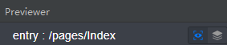
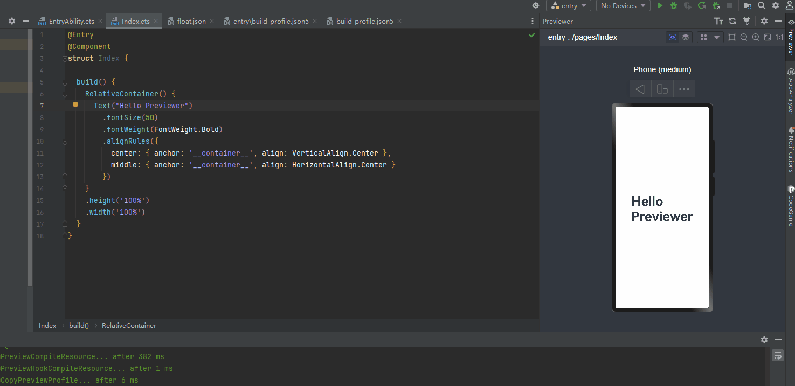
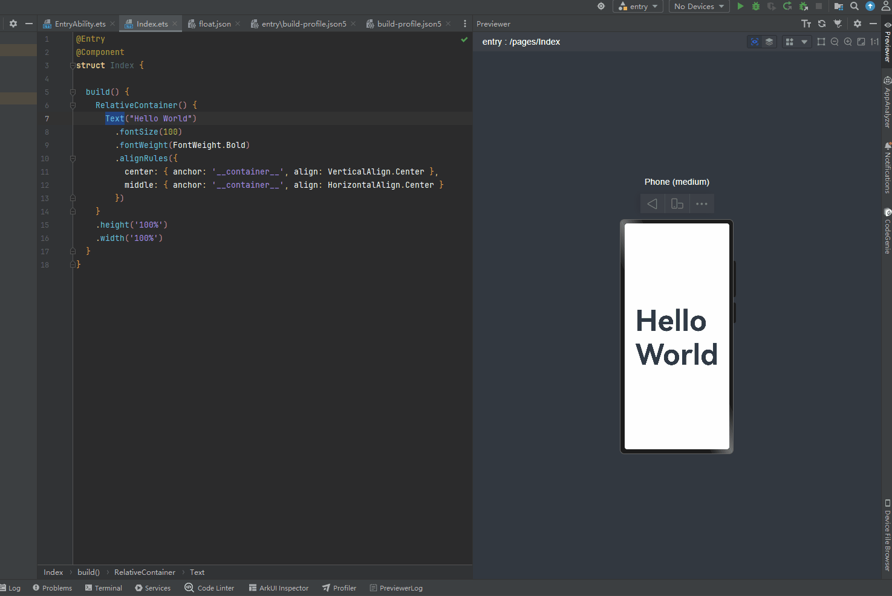
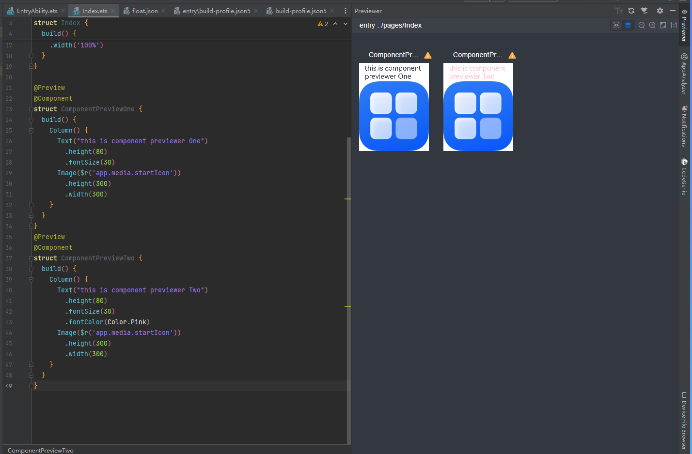
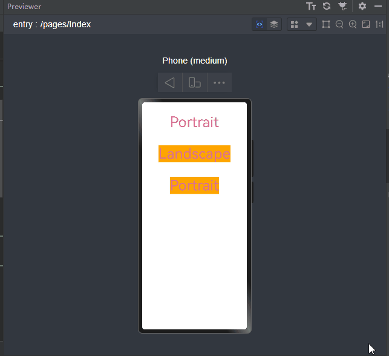

# UI预览

<!--Kit: ArkUI-->
<!--Subsystem: ArkUI-->
<!--Owner: @huyisuo-->
<!--Designer: @zhangboren-->
<!--Tester: @TerryTsao-->
<!--Adviser: @zhang_yixin13-->

DevEco Studio为开发者提供了UI预览功能，方便查看UI效果并随时调整页面布局。预览支持页面预览和组件预览。图1中左侧图标表示页面预览，右侧图标表示组件预览。

> **说明：**
>
> 操作系统和真机设备的差异可能导致预览效果与真机效果不同。预览效果仅作参考，实际效果以真机为准。

**图1** 预览图标



## 页面预览

ArkTS应用/原子化服务均支持页面预览。页面预览通过在工程的ets文件中，给自定义组件添加@Entry装饰器，即可以查看当前UI页面效果。

- 启动方式：选中需要预览的ets页面，点击右侧侧边栏的Previewer按钮，启动页面预览。

- 热加载：在启动页面预览的前提下，添加、删除或修改UI组件后，通过`Ctrl+S`保存，预览器会同步刷新预览效果，无需重新启动预览。

- 路由能力：支持通过路由能力进行页面切换查看其它页面预览效果。

在页面预览的基础上，提供了极速预览和Inspector双向预览两种特性。下面将详细说明这两种特性。

### 极速预览

支持在修改组件的属性时，无需使用`Ctrl+S`进行保存，可以直接观察到修改后的预览效果。极速预览默认开启，若需关闭，点击预览器右上角按钮即可。

> **注意：**
>
> 部分应用场景不支持极速预览：
> - 不显示的组件。
> - 新增或删除组件。
> - 包含private变量或无类型的controller的组件。
> - 使用了@Builder、@Style、@Extend等装饰器的组件。
> - 修改使用import导入外部组件/模块的组件。
> - 修改状态变量。

效果如图2所示：

**图2** 极速预览演示图



### inspector双向预览

支持ets文件与预览器的双向预览。使用时，点击预览器界面图标开启双向预览功能。

开启双向预览功能后，支持代码编辑器、UI界面和组件树之间的联动：

1. 选中预览器界面中的组件，组件树上对应的组件将被选中，同时代码编辑器中的布局文件中对应的代码块高亮显示。

2. 选中布局文件中的代码块，预览器界面将高亮显示，组件树上的组件节点将呈现被选中的状态。

3. 选中组件树中的组件，对应的代码块和预览器界面将高亮显示。

4. 在预览界面，通过组件的属性面板修改可修改的属性或样式。预览界面的修改会自动同步到代码编辑器中，并实时刷新预览器界面。代码编辑器中的源码修改也会实时刷新预览器界面，并更新组件树信息及组件属性。

效果如图3所示：

**图3** inspector双向预览演示图



## 组件预览

ArkTS应用/原子化服务支持组件预览功能。组件预览通过在自定义组件前添加[`@Preview`](../reference/apis-arkui/arkui-ts/ts-universal-component-previewer.md#preview装饰器)装饰器实现。在单个源文件中，最多可以使用10个`@Preview`装饰自定义组件。启动方式：
- 当组件被\@Entry和\@Preview装饰时，点击右侧侧边栏的Previewer按钮，启动页面预览，页面加载成功后，点击，切换到组件预览。
- 当组件仅被\@Preview装饰时，点击右侧侧边栏的Previewer按钮，则默认为组件预览。

组件预览时，使用@Preview装饰器的默认属性（请参考[\@Preview装饰器](../reference/apis-arkui/arkui-ts/ts-universal-component-previewer.md#previewparams9)）进行效果显示。可以通过设置@Preview的参数，指定预览设备的相关属性，包括设备类型、屏幕形状等。

@Preview的使用参考如下示例：

```ts
@Preview
@Component
struct ComponentPreviewOne {
  build() {
    Column() {
      Text('this is component previewer One')
        .height(80)
        .fontSize(30)
      Image($r('app.media.startIcon'))
        .height(300)
        .width(300)
    }
  }
}
@Preview
@Component
struct ComponentPreviewTwo {
  build() {
    Column() {
      Text('this is component previewer Two')
        .height(80)
        .fontSize(30)
        .fontColor(Color.Pink)
      Image($r('app.media.startIcon'))
        .height(300)
        .width(300)
    }
  }
}
```

效果如图4所示：

**图4** 组件预览效果图



## 动态修改分辨率

同一个应用/元服务可以运行在多个设备上，因不同设备的屏幕分辨率、形状、大小等不同，开发者需要在不同的设备上查看应用/元服务的UI布局和交互效果。预览支持动态修改分辨率，方便开发者随时查看不同设备上的页面显示效果。启动方式：启动页面预览后，点击右上角，即可拖动页面选中框动态修改当前设备的屏幕大小。

效果如图5所示：

**图5** 动态修改分辨率效果图

