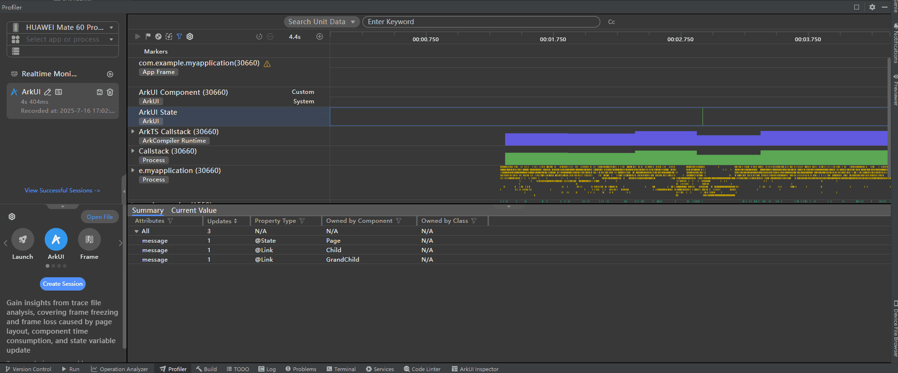
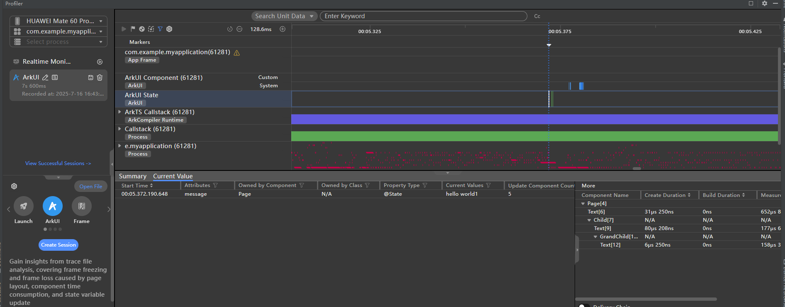
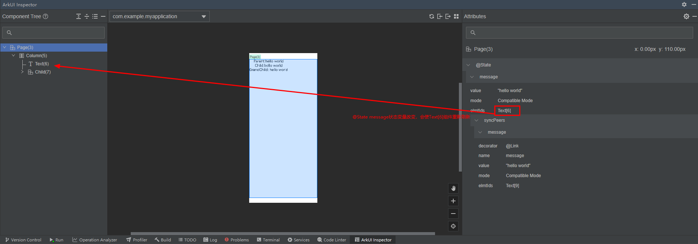

# UI调优
<!--Kit: ArkUI-->
<!--Subsystem: ArkUI-->
<!--Owner: @lushi871202-->
<!--Designer: @lushi871202-->
<!--Tester: @sally__-->
<!--Adviser: @HelloCrease-->

本章节主要介绍UI的dump和调优能力，用于提高开发效率和优化开发者体验。

## 状态管理hidumper、调试与调优
为提升开发者定位状态管理问题的效率，UI提供针对状态变量的hidumper、调试与调优功能，将状态变量的黑盒信息暴露给开发者，帮助开发者深入了解状态变量和UI组件的变化过程，提升开发高性能应用的效率。
### 状态管理hidumper能力
状态管理接入[hidumper](../dfx/hidumper.md)，支持通过`-jsdump`获取状态变量关联的组件、自定义组件树等信息，方便开发者了解状态变量影响的UI范围，便于写出高性能应用代码。

下面介绍dump状态变量每个参数的含义：

- jsdump：请求状态管理中的dump信息。
- viewHierarchy：打印自定义组件树信息，默认只打印根自定义组件。
- r：递归从根节点打印，自定义组件和其拥有组件的elementId。默认值打印根节点信息。
- viewId：打印指定viewId的自定义组件的信息。
- stateVariable：打印状态变量及关联的组件和同步对象的信息。当前命令不支持`r`递归dump。
- registerdElementIds：打印当前自定义组件拥有的elementId。

具体例子如下：
下面的例子为嵌套两层子组件的典型示例，使用了装饰器[\@State](./state-management/arkts-state.md)和 [\@Link](./state-management/arkts-link.md)。开发者可组合使用上述命令，展示前端组件树、状态变量和其影响的组件等信息。

```ts
@Entry
@Component
struct Page {
  @State message: string = 'hello world';

  build() {
    Column() {
      Text('Parent:' + this.message).fontSize(20).onClick(() => {
        this.message += '1';
      })
      Child({ message: this.message })
    }
  }
}

@Component
struct Child {
  @Link message: string;

  build() {
    Column() {
      Text('Child:' + this.message).fontSize(20)
      GrandChild({ message: this.message })
    }
  }
}

@Component
struct GrandChild {
  @Link message: string;

  build() {
    Column() {
      Text('GrandChild: ' + this.message).fontSize(20)
    }
  }
}
```

步骤1：获取当前激活窗口的id。
```
hdc shell hidumper -s WindowManagerService -a '-a'
```

步骤2：执行打印状态变量dump信息的命令。
假定激活的窗口id是90，可通过下面的命令dump出自定义组件树和根节点的状态变量的信息。
- 命令1：递归打印所有自定义组件和根节点的状态变量信息：

  ```
  hdc shell hidumper -s WindowManagerService -a '-w 90 -jsdump -dumpAll -r'
  ```
  
  执行上述命令后，dump信息代表的含义如下：
   - `Page[4]`：自定义组件根节点。
   - `View Hierarchy`：前端自定义组件树结构信息。
   - `State variables`：根节点状态变量。从下面的信息可以看到`Page`下有状态变量`@State 'message'[0]`的具体信息：
     - `[0]`代表状态变量id。
     - `Owned by @Component 'Page'[4]`：当前状态变量属于组件`'Page'[4]`,`[4]`为自定义组件id。
     - `Sync peers`：当前状态变量的同步对象，即`@State message`改变会通知`@Link 'message'[-1] <@Component 'Child'[7]>`刷新。
     - `dependencies`：
       - `variable assignment affects elmtIds`：状态变量改变会触发的组件的刷新。例如，`@State message`的改变会触发`Text[6]`的刷新。
       - `Dependent elements`：当前状态变量和其同步对象的关联组件。
   - `Registered Element IDs`：自定义组件和`build()`方法下声明的组件。
   - `Dirty Registered Element IDs`：自定义组件下未更新的脏节点列表。状态变量变化后，会标记其关联节点为脏节点，并请求在下一帧更新。在下一帧中更新脏节点并清空脏节点列表。手动执行dump时，`Dirty Registered Element IDs`通常为空。因为以目前大多数设备的帧间隔，开发者难以在两帧之间dump出脏节点列表。
  ```ts
  --------------------ViewPUInfo--------------------
  [-dumpAll, viewId=4, isRecursive=true]
  
  @Component
  Page[4]
  
  View Hierarchy:
  
  |--Page[4]ViewPU {isViewActive: true, isDeleting_: false}
    |--Child[7]ViewPU {isViewActive: true, isDeleting_: false}
      |--GrandChild[10]ViewPU {isViewActive: true, isDeleting_: false}
  
  State variables:
  |--Page[4]
    @State 'message'[0]
    |--Owned by @Component 'Page'[4]
    |--Sync peers: {
      @Link 'message'[-1] <@Component 'Child'[7]>
    }
    dependencies: variable assignment affects elmtIds: Text[6]
    |--Dependent elements: Text[6]; @Component 'Child'[7], Text[9]; @Component 'GrandChild'[10], Text[12]
  
  Registered Element IDs:
  
  |--Page[4]: {
      Column[5]
      Text[6]
      Child[7]
    }[3]
    |--Child[7]: {
        Column[8]
        Text[9]
        GrandChild[10]
      }[3]
      |--GrandChild[10]: {
          Column[11]
          Text[12]
        }[2]
  Total: 8
  
  Dirty Registered Element IDs:
  
  |--Page[4]: {
    }[0]
    |--Child[7]: {
      }[0]
      |--GrandChild[10]: {
        }[0]
  Total: 0
  ```
- 命令2：打印指定自定义组件的状态变量信息。例如，dump组件id为7的状态变量，可执行如下命令：
  ```
  hdc shell hidumper -s WindowManagerService -a '-w 90 -jsdump -dumpAll -viewId=7'
  ```
  输出信息如下。
  ```ts
  --------------------ViewPUInfo--------------------
  [-dumpAll, viewId=7, isRecursive=false]
  
  @Component
  Child[7]
  
  View Hierarchy:
  
  |--Child[7]ViewPU {isViewActive: true, isDeleting_: false}
    |--GrandChild[10]ViewPU {isViewActive: true, isDeleting_: false}
  
  State variables:
  |--Child[7]
    @Link 'message'[-1]
    |--Owned by @Component 'Child'[7]
    |--Sync peers: {
      @Link 'message'[-2] <@Component 'GrandChild'[10]>
    }
    dependencies: variable assignment affects elmtIds: Text[9]
    |--Dependent elements: Text[9]; @Component 'GrandChild'[10], Text[12]
  
  Registered Element IDs:
  
  |--Child[7]: {
      Column[8]
      Text[9]
      GrandChild[10]
    }[3]
  
  Dirty Registered Element IDs:
  
  |--Child[7]: {
    }[0]
  ```

### 状态管理Profiler调优能力

DevEco Studio的Profiler工具可抓取状态变量的变化打点。在Profiler工具中选择ArkUI，则抓取ArkUI State泳道。该泳道主要展示录制期间有哪些状态变量发生变化，和其会触发哪些关联组件刷新，以便开发者根据状态变量关联组件的数量分析当前场景内的更新负载。

状态管理在Profiler工具中，会展示如下信息内容：
| 名称                 | 含义   |
| -------------------- | ------|
|Start Time|状态变量修改的时间|
|Attributes |状态变量的属性名|
|Owned by Component|状态变量所属自定义组件名|
|Owned by Class|状态变量所属类名|
|Property Type|状态变量装饰器名称|
|Current Values|状态变量当前值|

录制ArkUI State泳道图步骤如下：

步骤1：点击ArkUI模板创建session，并启动录制。录制过程中点击第一个Text组件，修改状态变量`@State message`为`hello world1`，通知其同步对象`@Link message`的变更，及其关联组件的刷新。

步骤2： 录制结束等待数据处理完成，ArkUI State泳道会记录状态变量变化的事件打点。

**图1** 录制ArkUI State泳道流程示意图



步骤3：选中状态变量变化的打点，将显示当前状态变量更新触发了哪些组件的刷新，以及对应组件的创建、测量和布局的耗时。

**图2** ArkUI State泳道图示意图



<!--RP3-->

<!--RP3End-->

### 状态管理Inspector调试能力
DevEco Studio的ArkUI Inspector可以显示当前页面自定义组件内的状态变量的详细信息，具体包括以下内容。
| 名称                 | 含义   |
| -------------------- | ------|
|decorator|自定义组件内状态变量装饰器，如\@State、\@Link等。|
|name|自定义组件内状态变量的属性名，如`@State message: string = 'hello world';`中`message`。|
|value|当前状态变量值。对于超长或者嵌套多层的复杂类型会进行截断。|
|mode|状态变量观察模式，包括：<br>`Compatible Mode`：状态管理V1状态变量，且其装饰变量的类型没有[\@Track](./state-management/arkts-track.md)装饰的属性。<br>`Track Mode`：状态管理V1状态变量，且其装饰的类型有\@Track装饰的属性。<br>`V2`：状态管理V2状态变量。|
|elmtIds|状态变量关联的组件。声明式UI语法规则中，状态会驱动UI刷新。<br>目前状态管理可以做到组件级别的更新，即状态变量变化后仅会触发使用该变量的组件的刷新。|
|syncPeers|状态变量同步对象，仅限状态管理V1的状态变量。例如`@State`的同步对象为`@Link`。|

打开ArkUI Inspector展示`@Component Page`自定义组件状态变量相关信息如下。

**图3** ArkUI Inspector显示状态变量相关信息



<!--RP4-->

<!--RP4End-->


以上主要介绍了状态管理的hidumper、调试与调优能力，这些工具方便开发者调测，有助于提升开发高性能应用的效率。

## Trace调试能力

ArkUI内部针对关键的UI处理流程添加了Trace信息，帮助开发者通过Trace工具观测应用的UI耗时，辅助定位问题。详细Trace说明及案例参考：<!--RP1-->[常用Trace使用指导](../performance/common-trace-using-instructions.md)<!--RP1End-->。

## Inspector调试能力

ArkUI Inspector是DevEco Studio内置的页面布局检查工具，帮助开发者查看应用的UI层级结构、组件属性和布局效果。详细Inspector使用方法及案例参考：<!--RP2-->[页面布局检查器ArkUI Inspector使用指导](../performance/arkUI-inspector.md)<!--RP2End-->。
