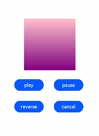

# 组件动画

在组件上创建和运行动画的快捷方式。具体用法请参考[通用方法](../reference/arkui-js/js-components-common-methods.md)。


## 获取动画对象

通过调用animate方法获得animation对象，animation对象支持动画属性、动画方法和动画事件。

```html
<!-- xxx.hml -->
<div class="container">
  <div id="content" class="box" onclick="Show"></div>
</div>
```

```css
/* xxx.css */
.container {
  flex-direction: column;
  justify-content: center;
  align-items: center;
  width: 100%;
}
.box{
  width: 200px;
  height: 200px;
  background-color: #ff0000;
  margin-top: 30px;
}
```

```js
/* xxx.js */
export default {
  data: {
    animation: '',
  },
  onInit() {
  },
  onShow() {
    var options = {
      duration: 1500,
    };
    var frames = [
      {
        width:200,height:200,
      },
      {
        width:300,height:300,
      }
    ];
    this.animation = this.$element('content').animate(frames, options);  //获取动画对象
  },
  Show() {   
    this.animation.play();
  }
}
```


> **说明：**
> -   使用animate方法时必须传入Keyframes和Options参数。
> -   多次调用animate方法时，采用replace策略，即最后一次调用时传入的参数生效。


## 设置动画参数

在获取动画对象后，通过设置参数Keyframes设置动画在组件上的样式。

```html
<!-- xxx.hml -->
<div class="container">
   <div id="content" class="box" onclick="Show"></div>
</div>
```

```css
/* xxx.css */
.container {
  flex-direction: column;
  justify-content: center;
  align-items: center;
  width: 100%;
  height: 100%;
}
.box{
  width: 200px;
  height: 200px;
  background-color: #ff0000;
  margin-top: 30px;
}
```

```js
/* xxx.js */
export default {
  data: {
    animation: '',
    keyframes:{},
    options:{}
  },
  onInit() {
    this.options = {
      duration: 4000,
    }
    this.keyframes = [
    {
      transform: {
        translate: '-120px -0px',   
        scale: 1,        
        rotate: 0
        },   
        transformOrigin: '100px 100px',  
        offset: 0.0, 
        width: 200,  
        height: 200   
      }, 
      {
        transform: {      
          translate: '120px 0px',     
          scale: 1.5,     
          rotate: 90   
          },
          transformOrigin: '100px 100px',
          offset: 1.0,
          width: 300,
          height: 300   
      }    
    ]
  },
  Show() {
    this.animation = this.$element('content').animate(this.keyframes, this.options)
    this.animation.play()
  }
}
```


> **说明：**
> - translate、scale和rtotate的先后顺序会影响动画效果。
>
> - transformOrigin只对scale和rtotate起作用。

在获取动画对象后，通过设置参数Options来设置动画的属性。

```html
<!-- xxx.hml -->
<div class="container">
   <div id="content" class="box" onclick="Show"></div>
</div>
```

```css
/* xxx.css */
.container {
  flex-direction: column;
  justify-content: center;
  align-items: center;
  width: 100%;
}
.box{
  width: 200px;
  height: 200px;
  background-color: #ff0000;
  margin-top: 30px;
}
```

```js
/* xxx.js */
export default {
  data: {
    animation: '',
  },
  onInit() {
  },
  onShow() {
    var options = {      
        duration: 1500,      
        easing: 'ease-in',      
        delay: 5,      
        iterations: 2,      
        direction: 'normal',    
    };
    var frames = [
      {
        transform: {
          translate: '-150px -0px'
        }
      },
      {
        transform: {
          translate: '150px 0px'
        }
      }
    ];
    this.animation = this.$element('content').animate(frames, options);
  },
  Show() {
    this.animation.play();
  }
}
```


> **说明：**
> direction：指定动画的播放模式。
>
> normal： 动画正向循环播放。
>
> reverse： 动画反向循环播放。
>
> alternate：动画交替循环播放，奇数次正向播放，偶数次反向播放。
>
> alternate-reverse：动画反向交替循环播放，奇数次反向播放，偶数次正向播放。


## 添加事件和调用方法

animation对象支持动画事件和动画方法。可以通过添加开始和取消事件，调用播放、暂停、倒放和结束方法实现预期动画。

```html
<!-- xxx.hml -->
<div class="container">
    <div id="content" style="width: 350px;height: 350px;margin-top: 100px;background: linear-gradient(pink, purple);">
    </div>
    <div class="row">
        <button type="capsule" value="play" onclick="playAnimation"></button>
        <button type="capsule" value="pause" onclick="pauseAnimation"></button>
    </div>
    <div class="row1">
        <button type="capsule" value="reverse" onclick="reverseAnimation"></button>
        <button type="capsule" value="cancel" onclick="cancelAnimation"></button>
    </div>
</div>
```

```css
/* xxx.css */
.container {
  flex-direction: column;
  align-items: center;
  justify-content: center;
  width: 100%;
  height: 100%;
}
button{
  width: 200px;
}
.row{
  width: 65%;
  height: 100px;
  align-items: center;
  justify-content: space-between;
  margin-top: 40px;
  position: fixed;
  top: 65%;
  left: 120px;
}
.row1{
  width: 65%;
  height: 100px;
  align-items: center;
  justify-content: space-between;
  margin-top: 30px;
  position: fixed;
  top: 75%;
  left: 120px;
}
```

```js
// xxx.js
export default {
    data: {
        animation: '',
    },
    onShow() {
        var options = {
            duration: 1500,
            easing:'ease-in',
            delay:5,
            direction:'normal',
            iterations:2
        };
        var frames = [
            {
                transform: {
                    translate: '-150px -0px'
                },
                opacity: 0.1,
                offset: 0.0,
                width: 200,
                height: 200,
            },
            {
                transform: {
                    translate: '150px 0px'
                },
                opacity: 1.0,
                offset: 1.0,
                width: 300,
                height: 300,
            }
        ];
        this.animation = this.$element('content').animate(frames, options);
        this.animation.onstart = function() {
            console.info('animation start')
        }  // 添加开始事件
        this.animation.onrepeat = function() {
            console.info('animation repeated')
        }  // 添加重播事件
        this.animation.oncancel = function() {
            console.info('animation canceled')
        }   // 添加取消事件
        this.animation.onfinish = function() {
            console.info('animation finish')
        }   // 添加完成事件
    },
    playAnimation() {
        this.animation.play()  // 调用播放开始的方法
    },
    pauseAnimation() {
        this.animation.pause()  // 调用播放暂停的方法
    },
    reverseAnimation() {
        this.animation.reverse()  // 调用播放倒放的方法
    },
    cancelAnimation() {
        this.animation.cancel()  // 调用播放取消的方法
    }
}
```



通过改变playState的值实现动画状态的改变。

```html
<!-- xxx.hml -->
<div class="container">
  <div id="content" style="width: 350px;height: 350px;margin-top: 100px;background: linear-gradient(pink, purple);">
  </div>
  <div class="row">
     <button type="capsule" value="{{state}}" onclick="playStateClick"></button>
  </div>
  <div class="row1">
     <button type="capsule" value="{{state1}}" onclick="playStateClick1"></button>
  </div>
</div>
```

```css
/* xxx.css */
.container {
  flex-direction: column;
  align-items: center;
  justify-content: center;
}
button{
  width: 200px;
}
.row{
  width: 65%;
  height: 100px;
  align-items: center;
  justify-content: space-between;
  margin-top: 50px;
  margin-left: 260px;
  position: fixed;
  top: 65%;
}
.row1{
  width: 65%;
  height: 100px;
  align-items: center;
  justify-content: space-between;
  margin-top: 50px;
   margin-left: 260px;
  position: fixed;
  top: 75%;
}
```

```js
// xxx.js
import promptAction from '@ohos.promptAction';
export default {
  data: {
    animation: '',
    state:'play',
    state1:'play'
  },
  onInit() {
  },
  onShow() {
    var options = {
      duration: 1500,
      easing:'ease-in',
      elay:5,
      direction:'normal',
      iterations:2,
    };
    var frames = [
      {
        transform: {
          translate: '-150px -0px'
        },
        opacity: 0.1,
        offset: 0.0,
        width: 200,
        height: 200,
      },
      {
        transform: {
          translate: '150px 0px'
        },
          opacity: 1.0,
          offset: 1.0,
          width: 300,
          height: 300,
        }
      ];
      this.animation = this.$element('content').animate(frames, options);
      this.animation.onstart = function(){
        promptAction.showToast({
          message: "start"
        });
      };
      this.animation.onrepeat = function(){
        promptAction.showToast({
          message: " repeated"
        });
      };
      this.animation.onfinish = function(){
        promptAction.showToast({
          message: " finished"
      });
    };
  },
  playStateClick(){
    if(this.animation.playState != 'running'){
      this.animation.playState = 'running';//设置playState为running，动画运行。
      this.state = 'pause'
    }else{
      this.animation.playState = 'paused';//设置playState为paused，动画暂停。
      this.state = 'play'
    }
  },
  playStateClick1(){
    if(this.animation.playState != 'running'){
      this.animation.playState = 'running';
      this.state1 = 'finish'
    }else{
      this.animation.playState = 'finished';//设置playState为finished，动画结束。
      this.state1 = 'play'
    }
  }
}
```


