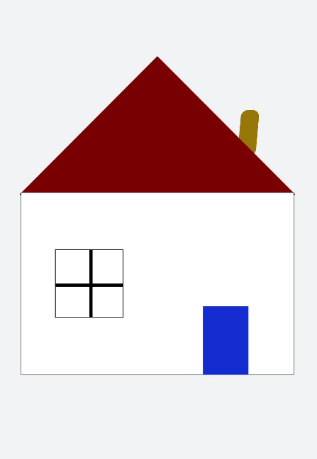

# transform样式动画

设置transform属性对组件进行旋转、缩放、移动和倾斜。


## 设置静态动画

创建一个正方形并旋转90°变成菱形，并用下方的长方形把菱形下半部分遮盖形成屋顶，设置长方形translate属性值为(150px,-150px)确定坐标位置形成门，再使用position属性使横纵线跟随父组件（正方形）移动到指定坐标位置，接着设置scale属性使父子组件一起变大形成窗户大小，最后使用skewX属性使组件倾斜后设置坐标translate(200px,-710px)得到烟囱。

```html
<!-- xxx.hml -->
<div class="container">
  <div class="top"></div>
  <div class="content"></div>
  <div class="door"></div>
  <!-- 窗户 -->
  <div class="window">
    <div class="horizontal"></div>
    <div class="vertical"></div>
  </div>
  <div class="chimney"></div>
</div>
```

```css
/* xxx.css */
.container {
  width:100%;
  height:100%;
  background-color:#F1F3F5;
  align-items: center;
  flex-direction: column;
}
.top{
  z-index: -1;
  position: absolute;
  width: 428px;
  height: 428px;
  background-color: #860303;
  transform: rotate(45deg);
  margin-top: 284px;
  margin-left: 148px;
}
.content{
  margin-top: 500px;
  width: 600px;
  height: 400px;
  background-color: white;
  border:  1px solid black;
}
.door{
  width: 100px;
  height: 135px;
  background-color: #1033d9;
  transform: translate(150px,-137px);
}
.window{
  z-index: 1;
  position: relative;   
  width: 100px;
  height: 100px;
  background-color: white;
  border: 1px solid black;
  transform: translate(-150px,-400px) scale(1.5);
}
/* 窗户的横轴 */
.horizontal{
  position: absolute;
  top: 50%;
  width: 100px;
  height: 5px;
  background-color: black;
}
/* 窗户的纵轴 */
.vertical{
  position: absolute;
  left: 50%;
  width: 5px;
  height: 100px;
  background-color: black;
}
.chimney{
  z-index: -2;
  width: 40px;
  height: 100px;
  border-radius: 15px;
  background-color: #9a7404;
  transform: translate(200px,-710px) skewX(-5deg);
}
```




## 设置平移动画

小球下降动画，改变小球的Y轴坐标实现小球下落，在下一段时间内减小Y轴坐标实现小球回弹，让每次回弹的高度逐次减小直至回弹高度为0，就模拟出了小球下降的动画。

```html
<!-- xxx.hml -->
<div class="container">
  <div class="circle"></div>
  <div class="flower"></div>
</div>
```

```css
/* xxx.css */
.container {
  width:100%;
  height:100%;
  background-color:#F1F3F5;
  display: flex;
  justify-content: center;
}
.circle{
  width: 100px;
  height: 100px;
  border-radius: 50px;
  background-color: red;
  /* forwards停在动画的最后一帧 */
  animation: down 3s fast-out-linear-in forwards;
}
.flower{
  position: fixed;
  width: 80%;
  margin-left: 10%;
  height: 5px;
  background-color: black;
  top: 1000px;
}
@keyframes down {
  0%{
    transform: translate(0px,0px);
  }
  /* 下落 */
  15%{
    transform: translate(10px,900px);
  }
  /* 开始回弹 */
  25%{
    transform: translate(20px,500px);
  }
  /* 下落 */
  35%{
    transform: translate(30px,900px);
  }
  /* 回弹 */
  45%{
    transform: translate(40px,700px);
  }
  55%{
    transform: translate(50px,900px);
  }
  65%{
    transform: translate(60px,800px);
  }
  80%{
    transform: translate(70px,900px);
  }
  90%{
    transform: translate(80px,850px);
  }
  /* 停止 */
  100%{
    transform: translate(90px,900px);
  }
}
```


## 设置旋转动画

设置不同的原点位置（transform-origin）改变元素所围绕的旋转中心。rotate3d属性前三个参数值分别为X轴、Y轴、Z轴的旋转向量，第四个值为旋转角度，旋转角度可为负值，负值则代表旋转方向为逆时针方向。

```html
<!-- xxx.hml -->
<div class="container">
  <div class="rotate">
    <div class="rect rect1"></div>
    <div class="rect rect2"></div>
    <div class="rect rect3"></div>
  </div>
  <!-- 3d属性 -->
  <div class="rotate3d">
    <div class="content">
        <div class="rect4"></div>
        <div class="rect5"> </div>
    </div>
    <div class="mouse"></div>
  </div>
</div>
```

```css
/* xxx.css */
.container {
    flex-direction: column;
    background-color:#F1F3F5;
    display: flex;
    align-items: center;
    justify-content: center;
    width: 100%;
    height: 100%;
}
.rect {
    width: 100px;
    height: 100px;
    animation: rotate 3s infinite;
    margin-left: 30px;
}
.rect1 {
    background-color: #f76160;
}
.rect2 {
    background-color: #60f76f;
/* 改变原点位置*/
    transform-origin: 10% 10px;
}
.rect3 {
    background-color: #6081f7;
/*  改变原点位置*/
    transform-origin: right bottom;
}
@keyframes rotate {
    from {
        transform: rotate(0deg)
    }
    to {
        transform: rotate(360deg);
    }
}
/* 3d示例样式 */
.rotate3d {
    margin-top: 150px;
    flex-direction: column;
    background-color:#F1F3F5;
    display: flex;
    align-items: center;
    width: 80%;
    height: 600px;
    border-radius: 300px;
    border: 1px solid #ec0808;
}
.content {
    padding-top: 150px;
    display: flex;
    align-items: center;
    justify-content: center;
}
/* react4 react5 翻转形成眼睛 */
.rect4 {
    width: 100px;
    height: 100px;
    animation: rotate3d1 1000ms infinite;
    background-color: darkmagenta;
}
.rect5 {
    width: 100px;
    height: 100px;
    animation: rotate3d1 1000ms infinite;
    margin-left: 100px;
    background-color: darkmagenta;
}
.mouse {
    margin-top: 150px;
    width: 200px;
    height: 100px;
    border-radius: 50px;
    border: 1px solid #e70303;
    animation: rotate3d2 1000ms infinite;
}
/* 眼睛的动效 */
@keyframes rotate3d1 {
    0% {
        transform:rotate3d(0,0,0,0deg)
    }
    50% {
        transform:rotate3d(20,20,20,360deg);
    }
    100% {
        transform:rotate3d(0,0,0,0deg);
    }
}
/* 嘴的动效 */
@keyframes rotate3d2 {
    0% {
        transform:rotate3d(0,0,0,0deg)
    }
    33% {
        transform:rotate3d(0,0,10,30deg);
    }
    66% {
        transform:rotate3d(0,0,10,-30deg);
    }
    100% {
        transform:rotate3d(0,0,0,0deg);
    }
}
```


> **说明：** 
>
> transform-origin变换对象的原点位置，如果仅设置一个值，另一个值为50%，若设置两个值第一个值表示X轴的位置，第二个值表示Y轴的位置。


## 设置缩放动画

设置scale样式属性实现涟漪动画，先使用定位确定元素的位置，确定坐标后创建多个组件实现重合效果，再设置opacity属性改变组件不透明度实现组件隐藏与显示，同时设置scale值使组件可以一边放大一边隐藏，最后设置两个组件不同的动画执行时间，实现扩散的效果。

设置sacle3d中X轴、Y轴、Z轴的缩放参数实现动画。

```html
<!-- xxx.hml -->
<div class="container">
  <div class="circle">
    <text>ripple</text>
  </div>
  <div class="ripple"></div>
  <div class="ripple ripple2"></div>
  <!-- 3d -->
  <div class="content">
    <text>spring</text>
  </div>
</div>
```

```css
/* xxx.css */
.container {
    flex-direction: column;
    background-color:#F1F3F5;
    width: 100%;
    position: relative;
}
.circle{
    margin-top: 400px;
    margin-left: 40%;
    width: 100px;
    height: 100px;
    border-radius: 50px;
    background-color: mediumpurple;
    z-index: 1;  position: absolute;
}
.ripple{
    margin-top: 400px;
    margin-left: 40%;
    position: absolute;  z-index: 0;
    width: 100px;
    height: 100px;
    border-radius: 50px;
    background-color: blueviolet;
    animation: ripple 5s infinite;
}
/* 设置不同的动画时间 */
.ripple2{
    animation-duration: 2.5s;
}
@keyframes ripple{
    0%{
        transform: scale(1);
        opacity: 0.5;
    }
    50%{
        transform: scale(3);
        opacity: 0;
    }
    100%{
        transform: scale(1);
        opacity: 0.5;
    }
}
text{
    color: white;
    text-align: center;
    height: 100%;
    width: 100%;
}
.content {
    margin-top: 700px;
    margin-left: 33%;
    width: 200px;
    height: 100px;
    animation:rubberBand 1s infinite;
    background-color: darkmagenta;
    position: absolute;
}
@keyframes rubberBand {
    0% {
        transform: scale3d(1, 1, 1);
    }
    30% {
        transform: scale3d(1.25, 0.75, 1.1);
    }
    40% {
        transform: scale3d(0.75, 1.25, 1.2);
    }
    50% {
        transform: scale3d(1.15, 0.85, 1.3);
    }
    65% {
        transform: scale3d(.95, 1.05, 1.2);
    }
    75% {
        transform: scale3d(1.05, .95, 1.1);
    }
    100%{
        transform: scale3d(1, 1, 1);
    }
}
```


> **说明：** 
>
> 设置transform属性值后，子元素会跟着父元素一起改变，若只改变父元素其他属性值时（如：height，width），子元素不会改变。


## 设置matrix属性

matrix是一个入参为六个值的矩阵，6个值分别代表：scaleX, skewY, skewX, scaleY, translateX, translateY。下面示例中设置 了matrix属性为matrix(1,0,0,1,0,200)使组件移动和倾斜。

```html
<!-- xxx.hml -->
<div class="container">
  <div class="rect"> </div>
</div>
```

```css
/* xxx.css */
.container{
  background-color:#F1F3F5;
  display: flex;
  justify-content: center;
  width: 100%;
  height: 100%;
}
.rect{
  width: 100px;
  height: 100px;
  background-color: red;
  animation: down 3s infinite forwards;
}
@keyframes down{
  0%{
    transform: matrix(1,0,0,1,0,0);
  }
  10%{
    transform: matrix(1,0,0,1,0,200);
  }
  60%{
    transform: matrix(2,1.5,1.5,2,0,700);
  }
  100%{
    transform: matrix(1,0,0,1,0,0);
  }
}
```


## 整合transform属性

transform可以设置多个值并且多个值可同时设置，下面案例中展示同时设置缩放（scale），平移（translate），旋转（rotate）属性时的动画效果。

```html
<!-- xxx.hml -->
<div class="container">
  <div class="rect1"></div>
  <div class="rect2"></div>
  <div class="rect3"></div>
  <div class="rect4"></div>
  <div class="rect5"></div>
</div>
```

```css
/* xxx.css */
.container{
    width: 100%;
    height: 100%;
    flex-direction:column;
    background-color:#F1F3F5;
    padding:50px;
}
.rect1{
    width: 100px;
    height: 100px;
    background-color: red;
    animation: change1 3s infinite forwards;
}
.rect2{
    margin-top: 50px;
    width: 100px;
    height: 100px;
    background-color: darkblue;
    animation: change2 3s infinite forwards;
}
.rect3{
    margin-top: 50px;
    width: 100px;
    height: 100px;
    background-color: darkblue;
    animation: change3 3s infinite;
}
.rect4{
    align-self: center;
    margin-left: 50px;
    margin-top: 200px;
    width: 100px;
    height: 100px;
    background-color: darkmagenta;
    animation: change4 3s infinite;
}
.rect5{
    margin-top: 300px;
    width: 100px;
    height: 100px;
   background-color: cadetblue;
    animation: change5 3s infinite;
}
/* change1 change2 对比 */
@keyframes change1{
    0%{
        transform: translate(0,0);    transform: rotate(0deg)
    }
    100%{
        transform: translate(0,500px);
        transform: rotate(360deg)
    }
}
/* change2 change3 对比属性顺序不同的动画效果 */
@keyframes change2{
    0%{
        transform:translate(0,0) rotate(0deg) ;
    }
    100%{
        transform: translate(300px,0) rotate(360deg);
    }
}
@keyframes change3{
    0%{
        transform:rotate(0deg) translate(0,0);
    }
    100%{
        transform:rotate(360deg)  translate(300px,0);
    }
}
/* 属性值不对应的情况 */
@keyframes change4{
    0%{
        transform: scale(0.5);
    }
    100%{
        transform:scale(2) rotate(45deg);
    }
}
/* 多属性的写法 */
@keyframes change5{
    0%{
        transform:scale(0) translate(0,0) rotate(0);
    }
    100%{
        transform: scale(1.5) rotate(360deg) translate(200px,0);
    }
}
```


> **说明：**
> - 当设置多个transform时，后续的transform值会把前面的覆盖掉。若想同时使用多个动画样式可用复合写法，例：transform: scale(1) rotate(0) translate(0,0)。
>
> - transform进行复合写法时，变化样式内多个样式值顺序的不同会呈现不一样的动画效果。
>
> - transform属性设置的样式值要一一对应，若前后不对应，则该动画不生效。若设置多个样式值则只会呈现出已对应值的动画效果。


## 相关实例

针对transform样式动画开发，有以下相关实例可供参考：

- [`JsClock`：时钟（JS）（API10）](https://gitee.com/openharmony/applications_app_samples/tree/master/code/Solutions/Tools/JsClock)

- [动画样式（JS）（API9）](https://gitee.com/openharmony/codelabs/tree/master/JSUI/AnimationDemo)

- [图片常见操作（JS）（API9）](https://gitee.com/openharmony/codelabs/tree/master/Media/ImageOperation)
