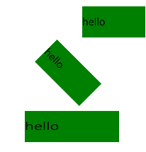
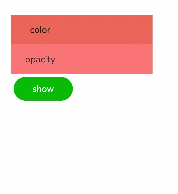

# 动画
<!--Kit: ArkUI-->
<!--Subsystem: ArkUI-->
<!--Owner: @CCFFWW-->
<!--Designer: @yangfan229-->
<!--Tester: @lxl007-->
<!--Adviser: @HelloCrease-->

动画分为[静态动画](#静态动画)和[连续动画](#连续动画)。


## 静态动画

静态动画的核心是transform样式，主要可以实现以下三种变换类型，一次样式设置只能实现一种类型变换。

- **translate**：沿水平或垂直方向将指定组件移动所需距离。

- **scale**：横向或纵向将指定组件缩小或放大到所需比例。

- **rotate**：将指定组件沿横轴或纵轴或中心点旋转指定的角度。

具体的使用示例如下，更多信息请参考[动画样式](../reference/apis-arkui/arkui-js/js-components-common-animation.md)。

```html
<!-- xxx.hml -->
<div class="container">
  <text class="translate">hello</text>
  <text class="rotate">hello</text>
  <text class="scale">hello</text>
</div>
```

```css
/* xxx.css */
.container {
  width: 100%;
  flex-direction: column;
  align-items: center;
}
.translate {
  height: 150px;
  width: 300px;
  margin: 50px;
  font-size: 50px;
  background-color: #008000;
  transform: translate(200px);
}
.rotate {
  height: 150px;
  width: 300px;
  margin: 50px;
  font-size: 50px;
  background-color: #008000;
  transform-origin: 200px 100px;
  transform: rotate(45deg);
}
.scale {
  height: 150px;
  width: 300px;
  margin: 50px;
  font-size: 50px;
  background-color: #008000;
  transform: scaleX(1.5);
}
```


**图1** 静态动画效果图




## 连续动画

静态动画只有开始状态和结束状态，没有中间状态，如果需要设置中间的过渡状态和转换效果，需要使用连续动画实现。

连续动画的核心是animation样式，它定义了动画的开始状态、结束状态以及时间和速度的变化曲线。通过animation样式可以实现的效果有：

- **animation-name**：设置动画执行后应用到组件上的背景颜色、透明度、宽高和变换类型。

- **animation-delay**和**animation-duration**：分别设置动画执行后元素延迟和持续的时间。

- **animation-timing-function**：描述动画执行的速度曲线，使动画更加平滑。

- **animation-iteration-count**：定义动画播放的次数。

- **animation-fill-mode**：指定动画执行结束后是否恢复初始状态。

animation样式需要在css文件中先定义keyframe，在keyframe中设置动画的过渡效果，并通过一个样式类型在hml文件中调用。animation-name的使用示例如下：

```html
<!-- xxx.hml -->
<div class="item-container">
    <div class="item {{colorParam}}">
        <text class="txt">color</text>
    </div>
    <div class="item {{opacityParam}}">
        <text class="txt">opacity</text>
    </div>
    <input class="button" type="button" name="" value="show" onclick="showAnimation"/>
</div>
```

```css
/* xxx.css */
.item-container {
  margin: 60px;
  flex-direction: column;
}
.item {
  width: 80%;
  background-color: #f76160;
}
.txt {
  text-align: center;
  width: 200px;
  height: 100px;
}
.button {
  width: 200px;
  margin: 10px;
  font-size: 30px;
  background-color: #09ba07;
}
.color {
  animation-name: Color;
  animation-duration: 8000ms;
}
.opacity {
  animation-name: Opacity;
  animation-duration: 8000ms;
}
@keyframes Color {
  from {
    background-color: #f76160;
  }
  to {
    background-color: #09ba07;
  }
}
@keyframes Opacity {
  from {
    opacity: 0.9;
  }
  to {
    opacity: 0.1;
  }
}
```

```js
// xxx.js
export default {
  data: {
    colorParam: '',
    opacityParam: '',
  },
  showAnimation: function () {
    this.colorParam = '';
    this.opacityParam = '';
    this.colorParam = 'color';
    this.opacityParam = 'opacity';
  }
}
```

**图2** 连续动画效果图


