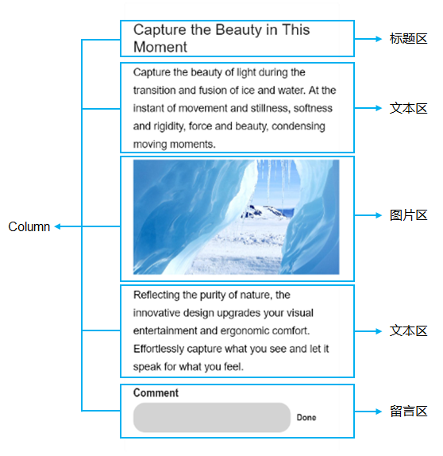

# 布局说明

设备的基准宽度为720px（px为逻辑像素，非物理像素），实际显示效果会根据实际屏幕宽度进行缩放。

其换算关系如下：

组件的width设为100px时，在宽度为720物理像素的屏幕上，实际显示为100物理像素；在宽度为1440物理像素的屏幕上，实际显示为200物理像素。

一个页面的基本元素包含标题区域、文本区域、图片区域等，每个基本元素内还可以包含多个子元素，开发者根据需求还可以添加按钮、开关、进度条等组件。在构建页面布局时，需要对每个基本元素思考以下几个问题：

- 该元素的尺寸和排列位置

- 是否有重叠的元素

- 是否需要设置对齐、内间距或者边界

- 是否包含子元素及其排列位置

- 是否需要容器组件及其类型

将页面中的元素分解之后再对每个基本元素按顺序实现，可以减少多层嵌套造成的视觉混乱和逻辑混乱，提高代码的可读性，方便对页面做后续的调整。以下图为例进行分解：

**图1** 页面布局分解

**图2** 留言区布局分解

