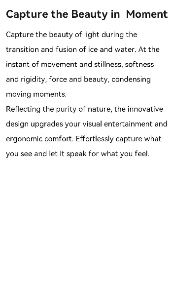

# 添加标题行和文本区域
<!--Kit: ArkUI-->
<!--Subsystem: ArkUI-->
<!--Owner: @xiangyuan6-->
<!--Designer: @pssea-->
<!--Tester: @jiaoaozihao-->
<!--Adviser: @HelloCrease-->

实现标题和文本区域最常用的是基础组件text。text组件用于展示文本，可以设置不同的属性和样式，文本内容需要写在标签内容区，完整属性和样式信息请参考[text](../reference/apis-arkui/arkui-js/js-components-basic-text.md)。在页面中插入标题和文本区域的示例如下：


```html
<!-- xxx.hml -->
<div class="container">
  <text class="title-text">{{headTitle}}</text>
  <text class="paragraph-text">{{paragraphFirst}}</text>
  <text class="paragraph-text">{{paragraphSecond}}</text>
</div>
```


```css
/* xxx.css */
.container {
  flex-direction: column;
  margin-top: 20px;
  margin-left: 30px;
}
.title-text {
  color: #1a1a1a;
  font-size: 50px;
  margin-top: 40px;
  margin-bottom: 20px;
  font-weight: 700;
}
.paragraph-text {
  width: 95%;
  color: #000000;
  font-size: 35px;
  line-height: 60px;
}
```


```js
// xxx.js
export default {
  data: {
    headTitle: 'Capture the Beauty in Moment',
    paragraphFirst: 'Capture the beauty of light during the transition and fusion of ice and water. At the instant of movement and stillness, softness and rigidity, force and beauty, condensing moving moments.',
    paragraphSecond: 'Reflecting the purity of nature, the innovative design upgrades your visual entertainment and ergonomic comfort. Effortlessly capture what you see and let it speak for what you feel.',
  },
}
```

  