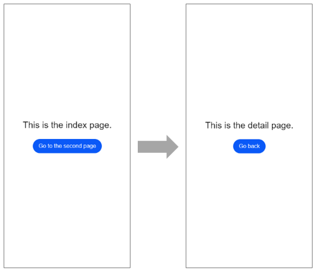

# 页面路由

很多应用由多个页面组成，比如用户可以从音乐列表页面点击歌曲，跳转到该歌曲的播放界面。开发者需要通过页面路由将这些页面串联起来，按需实现跳转。


页面路由router根据页面的uri找到目标页面，从而实现跳转。以最基础的两个页面之间的跳转为例，具体实现步骤如下：


1. 在“Project“窗口，打开src &gt; main &gt;js &gt;MainAbility，右键点击pages文件夹，选择NewJS Page，创建一个详情页。

2. 调用router.push()路由到详情页。

3. 调用router.back()回到首页。


## 构建页面布局

index和detail这两个页面均包含一个text组件和button组件：text组件用来指明当前页面，button组件用来实现两个页面之间的相互跳转。hml文件代码示例如下：

```html
<!-- index.hml -->
<div class="container">
  <text class="title">This is the index page.</text>
  <button type="capsule" value="Go to the second page" class="button" onclick="launch"></button>
</div>
```

```html
<!-- detail.hml -->
<div class="container">
  <text class="title">This is the detail page.</text>
  <button type="capsule" value="Go back" class="button" onclick="launch"></button>
</div>
```


## 构建页面样式

构建index和detail页面的页面样式，text组件和button组件居中显示，两个组件之间间距为50px。css代码如下（两个页面样式代码一致）：

```css
/* index.css */
/* detail.css */
.container {
  width: 100%;
  height: 100%;
  flex-direction: column;
  justify-content: center;
  align-items: center;
}

.title {
  font-size: 50px;
  margin-bottom: 50px;
}
```


## 实现跳转

为了使button组件的launch方法生效，需要在页面的js文件中实现跳转逻辑。调用router.push()接口将uri指定的页面添加到路由栈中，即跳转到uri指定的页面。在调用router方法之前，需要导入router模块。代码示例如下：

```js
// index.js
import router from '@ohos.router';
export default {
  launch() {
    router.push ({
      url: 'pages/detail/detail',
    });
  },
}
```

```js
// detail.js
import router from '@ohos.router';
export default {
  launch() {
    router.back();
  },
}
```

运行效果如下图所示：

