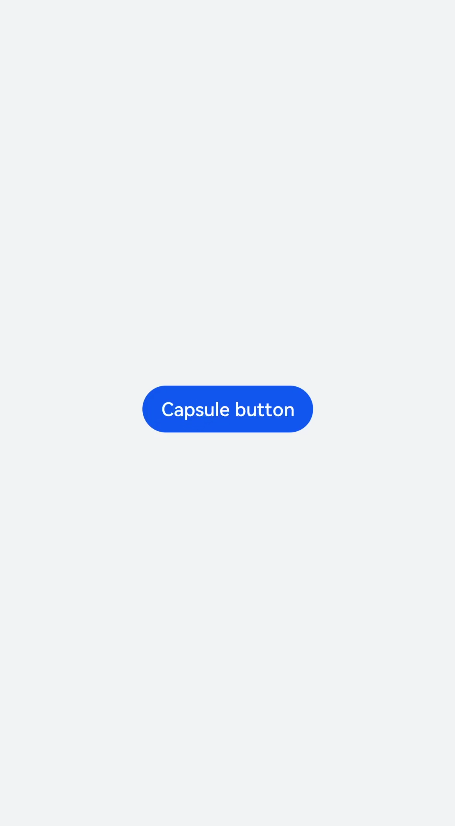
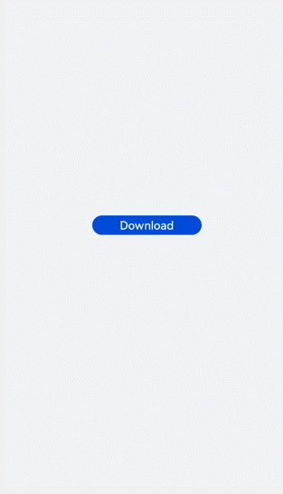
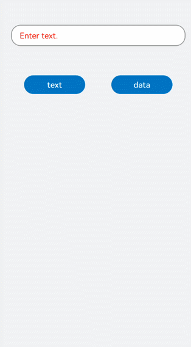

# Button

Button是按钮组件，其类型包括胶囊按钮、圆形按钮、文本按钮、弧形按钮、下载按钮。具体用法请参考[Button API](../reference/arkui-js/js-components-basic-button.md)。


## 创建Button组件

在pages/index目录下的hml文件中创建一个Button组件。

```
<!-- xxx.hml -->
<div class="container">       
  <button  type="capsule" value="Capsule button"></button>
</div>
```

```
/* xxx.css */
.container {
  width: 100%;
  height: 100%;
  flex-direction: column;
  justify-content: center;
  align-items: center;
  background-color: #F1F3F5;
}
```




## 设置Button类型

通过设置Button的type属性来选择按钮类型，如定义Button为圆形按钮、文本按钮等。


```
<!-- xxx.hml -->
<div class="container">    
  <button class="circle" type="circle" >+</button>
  <button class="text" type="text"> button</button>
</div>
```


```
/* xxx.css */
.container {  
  width: 100%;
  height: 100%;
  background-color: #F1F3F5;
  flex-direction: column;
  align-items: center;
  justify-content: center;
}
.circle {
  font-size: 120px;
  background-color: blue;
  radius: 72px;
}
.text {
  margin-top: 30px;
  text-color: white;
  font-size: 30px;
  font-style: normal;
  background-color: blue;
  width: 50%;
  height: 100px;
}
```


>  **说明：**
> - Button组件使用的icon图标如果来自云端路径，需要添加网络访问权限 ohos.permission.INTERNET。具体申请方式请参考[权限申请声明](../security/accesstoken-guidelines.md)。


如果需要添加ohos.permission.INTERNET权限，则在resources文件夹下的config.json文件里进行权限配置。


```
<!-- config.json -->
"module": {
  "reqPermissions": [{
    "name": "ohos.permission.INTERNET"
  }],
}
```


## 显示下载进度

为Button组件添加progress方法，来实时显示下载进度条的进度。

```
<!-- xxx.hml -->
<div class="container">
  <button class="button download" type="download" id="download-btn" onclick="setProgress">{{downloadText}}</button>
</div>
```

```
/* xxx.css */
.container { 
  width: 100%;
  height: 100%;
  background-color: #F1F3F5;  
  flex-direction: column;
  align-items: center;
  justify-content: center;
}
.download {    
  width: 280px;
  text-color: white;
  background-color: #007dff;
}
```

```
// xxx.js
import prompt from '@system.prompt';
export default {
  data: {
    percent: 0,
    downloadText: "Download",
    isPaused: true,
    intervalId : null,
  },
  star(){
    this.intervalId = setInterval(()=>{
      if(this.percent <100){
        this.percent += 1;
        this.downloadText = this.percent+ "%";
       } else{
         prompt.showToast({
            message: "Download succeeded."
         })
         this.paused()
         this.downloadText = "Download";
         this.percent = 0;
         this.isPaused = true;
       }
    },100)
  },
  paused(){
    clearInterval(this.intervalId);
    this.intervalId = null;
  },
 setProgress(e) {
    if(this.isPaused){
      prompt.showToast({
        message: "Started Downloading"
      })
      this.star();
      this.isPaused = false;
    }else{
      prompt.showToast({
        message: "Paused."
      })
      this.paused();
      this.isPaused = true;
    }
  }
}
```



>  **说明：**
> setProgress方法只支持button的类型为download。


## 场景示例

在本场景中，开发者可根据输入的文本内容进行Button类型切换。


```
<!-- xxx.hml -->
<div class="container">
  <div class="input-item">
    <input class="input-text" id="change" type="{{mytype}}"  placeholder="{{myholder}}" 
      style="background-color:{{mystyle1}};
      placeholder-color:{{mystyle2}};flex-grow:{{myflex}};"name="{{myname}}" value="{{myvalue}}"></input>
  </div>
  <div class="input-item">
    <div class="doc-row">
      <input type="button" class="select-button color-3" value="text" onclick="changetype3"></input>
      <input type="button" class="select-button color-3" value="data" onclick="changetype4"></input>
    </div>
  </div>
</div>
```


```
/* xxx.css */
.container {
  flex-direction: column;
  align-items: center;
  background-color: #F1F3F5;
}
.input-item {
  margin-bottom: 80px;
  flex-direction: column;
}
.doc-row {
  justify-content: center;
  margin-left: 30px;
  margin-right: 30px;
  justify-content: space-around;
}
.input-text {
  height: 80px;
  line-height: 80px;
  padding-left: 30px;
  padding-right: 30px;
  margin-left: 30px;
  margin-right: 30px;
  margin-top:100px;
  border: 3px solid;
  border-color: #999999;
  font-size: 30px;
  background-color: #ffffff;
  font-weight: 400;
}
.select-button {
  width: 35%;
  text-align: center;
  height: 70px;
  padding-top: 10px;
  padding-bottom: 10px;
  margin-top: 30px;
  font-size: 30px;
  color: #ffffff;
}
.color-3 {
  background-color: #0598db;;
}
```


```
// xxx.js
export default {
  data: {
    myflex: '',
    myholder: 'Enter text.',
    myname: '',
    mystyle1: "#ffffff",
    mystyle2: "#ff0000",
    mytype: 'text',
    myvalue: '',
  },
  onInit() {
  },
  changetype3() {
    this.myflex = '';
    this.myholder = 'Enter text.';
    this.myname = '';
    this.mystyle1 = "#ffffff";
    this.mystyle2 = "#FF0000";
    this.mytype = 'text';
    this.myvalue = '';
  },
  changetype4() {
    this.myflex = '';
    this.myholder = 'Enter a date.';
    this.myname = '';
    this.mystyle1 = "#ffffff";
    this.mystyle2 = "#FF0000";
    this.mytype = 'date';
    this.myvalue = '';
  },
}
```



