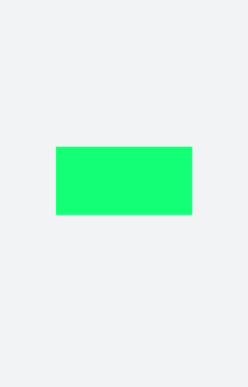
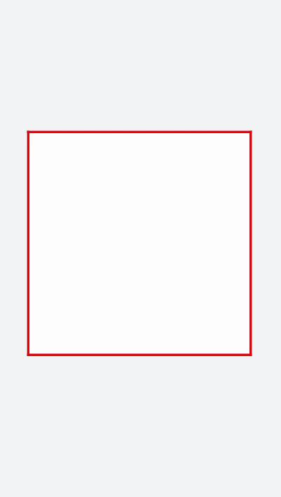

# Canvas对象
<!--Kit: ArkUI-->
<!--Subsystem: ArkUI-->
<!--Owner: @sd-wu-->
<!--Designer: @sunbees-->
<!--Tester: @liuli0427-->
<!--Adviser: @HelloCrease-->


Canvas组件提供画布，用于自定义绘制图形。具体用法请参考[CanvasRenderingContext2D对象](../reference/apis-arkui/arkui-js/js-components-canvas-canvasrenderingcontext2d.md)。


## 创建Canvas组件

在pages/index目录下的hml文件中创建一个Canvas组件。


```html
<!-- xxx.hml -->
<div class="container">
  <canvas></canvas>
</div>
```


```css
/* xxx.css */
.container{
  width: 100%;
  height: 100%;
  flex-direction: column;
  justify-content: center;
  align-items: center;
  background-color: #F1F3F5;
}
canvas{
  background-color: #00ff73;
}
```



> **说明：**
> - Canvas组件默认背景色与父组件的背景色一致。
>
> - Canvas默认宽高为width: 300px，height: 150px。


## 添加样式

Canvas组件设置宽（width）、高（height）、背景色（background-color）及边框样式（border）。


```html
<!-- xxx.hml -->
<div class="container">
  <canvas></canvas>
</div>
```


```css
/* xxx.css */
.container{
  flex-direction: column;
  justify-content: center;
  align-items: center;
  background-color: #F1F3F5;
  width: 100%;
  height: 100%;
}
canvas{
  width: 500px;
  height: 500px;  
  background-color: #fdfdfd;  
  border: 5px solid red;
}
```




## 添加事件

Canvas添加长按事件，长按后可获取Canvas组件的dataUrl值（toDataURL方法返回的图片信息），打印在下方文本区域内。


```html
<!-- xxx.hml -->
<div class="container">
  <canvas ref="canvas1" onlongpress="getUrl"></canvas>
  <text>dataURL</text>
  <text class="content">{{dataURL}}</text>
</div>
```


```css
/* xxx.css */
.container{
  width:100%;
  height:100%;
  flex-direction: column;
  justify-content: center;
  align-items: center;
  background-color: #F1F3F5;
  }
  canvas{  
    width: 500px;  
    height: 500px;
    background-color: #fdfdfd;
    border: 5px solid red;
    margin-bottom: 50px;
}
.content{
  border: 5px solid blue;
  padding: 10px;
  width: 90%;
  height: 400px; 
  overflow: scroll;
}
```


```js
// xxx.js
import promptAction from '@ohos.promptAction';
export default {
  data:{
    dataURL:null,
  },
  onShow(){
    let el = this.$refs.canvas1;
    let ctx = el.getContext("2d"); 
    ctx.strokeRect(100,100,300,300);
  },
  getUrl(){
    let el = this.$refs.canvas1
    let dataUrl = el.toDataURL()
    this.dataURL = dataUrl;
    promptAction.showToast({duration:2000,message:"long press,get dataURL"})
  }
}
```


> **说明：** 
>
> 画布不支持在onInit和onReady中进行创建。

## 相关实例

针对Canvas开发，有以下相关实例可供参考：

- [自定义抽奖转盘（JS）（API9）](https://gitee.com/openharmony/codelabs/tree/master/JSUI/JSCanvasComponent)

- [图片编辑（JS）（API9）](https://gitee.com/openharmony/codelabs/tree/master/Media/ImageEditorTemplate)
