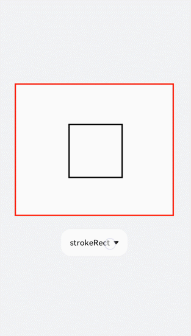
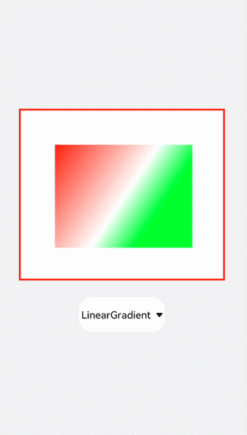

# CanvasRenderingContext2D对象
<!--Kit: ArkUI-->
<!--Subsystem: ArkUI-->
<!--Owner: @sd-wu-->
<!--Designer: @sunbees-->
<!--Tester: @liuli0427-->
<!--Adviser: @HelloCrease-->


使用CanvasRenderingContext2D在Canvas画布组件上进行绘制，绘制对象可以是图形、文本、线段、图片等。具体请参考[CanvasRenderingContext2D对象](../reference/apis-arkui/arkui-js/js-components-canvas-canvasrenderingcontext2d.md)。


## 画线段

使用moveTo和lineTo画出一条线段，当使用closePath方法时会结束当前路径形成一个封闭图形。设置quadraticCurveTo（二次贝塞尔曲线）或bezierCurveTo（三次贝塞尔曲线）的值组成图形。


```html
<!-- xxx.hml -->
<div class="container">
  <canvas ref="canvas1"></canvas>
  <select @change="change">
    <option value="value1"> line </option>
    <option value="value2"> quadratic </option>
    <option value="value3"> bezier </option>
    <option value="value4"> arc/ellipse </option>
    <option value="value5"> lineJoin/miterLimit </option>
  </select>
</div>
```


```css
/* xxx.css */
.container{
  width: 100%;
  height: 100%;
  flex-direction: column;
  justify-content: center;
  align-items: center;
  background-color: #F1F3F5;
}
canvas{
  width: 600px;
  height: 500px;
  background-color: #fdfdfd;
  border: 5px solid red;
}
select{
  margin-top: 50px;
  width: 250px;
  height: 100px;
  background-color: white;
}
```


```js
// xxx.js
export default {
  data:{
    el: null,
    ctx: null,
  },
  onShow(){
    this.el = this.$refs.canvas1;
    this.ctx = this.el.getContext("2d",{antialias: true});
    // 清除画布上的内容
    this.ctx.clearRect(0, 0, 600, 500);
    // 创建一个新的绘制路径
    this.ctx.beginPath();
    // 线端点以方形结束
    this.ctx.lineCap = 'butt';
    // 描边的宽度
    this.ctx.lineWidth = 15;
    // 创建一个新的绘制路径
    this.ctx.beginPath();
    // 路径从当前点移动到指定点
    this.ctx.moveTo(200, 100);
    // 从当前点到指定点进行路径连接
    this.ctx.lineTo(400, 100);
    // 边框绘制
    this.ctx.stroke();
    this.ctx.beginPath();
    // 线端点以圆形结束
    this.ctx.lineCap = 'round';
    this.ctx.moveTo(200, 200);
    this.ctx.lineTo(400, 200);
    this.ctx.stroke();
    // 线端点以方形结束
    this.ctx.beginPath();
    this.ctx.lineCap = 'square';
    this.ctx.moveTo(200, 300);
    this.ctx.lineTo(400, 300);
    this.ctx.stroke();
  },
  change(e){
    if(e.newValue == 'value1'){
      this.el = this.$refs.canvas1;
      this.ctx = this.el.getContext("2d",{antialias: true});
      this.ctx.clearRect(0, 0, 600, 500);
      // 上
      this.ctx.beginPath();
      this.ctx.lineCap = 'butt';
      this.ctx.moveTo(200, 100);
      this.ctx.lineTo(400, 100);
      this.ctx.stroke();
      // 中
      this.ctx.beginPath();
      this.ctx.lineCap = 'round';
      this.ctx.moveTo(200, 200);
      this.ctx.lineTo(400, 200);
      this.ctx.stroke();
      // 下
      this.ctx.beginPath();
      this.ctx.lineCap = 'square';
      this.ctx.moveTo(200, 300);
      this.ctx.lineTo(400, 300);
      this.ctx.stroke();
    }else if(e.newValue == 'value2'){
      this.ctx.clearRect(0, 0, 600, 500);
      // 上
      this.ctx.beginPath();
      this.ctx.moveTo(100, 150);
      // 二次贝塞尔曲线的路径
      this.ctx.quadraticCurveTo(300, 50, 500, 150);
      this.ctx.stroke();
      // 左
      this.ctx.beginPath();
      this.ctx.moveTo(200, 150);
      this.ctx.quadraticCurveTo(250, 250, 250, 400);
      this.ctx.stroke();
      // 右
      this.ctx.beginPath();
      this.ctx.moveTo(400, 150);
      this.ctx.quadraticCurveTo(350, 250, 350, 400);
      this.ctx.stroke();
    }else if(e.newValue == 'value3'){
      this.ctx.clearRect(0, 0, 600, 500);
      // 下
      this.ctx.beginPath();
      this.ctx.moveTo(100, 200);
      // 三次贝塞尔曲线的路径
      this.ctx.bezierCurveTo(150, 100, 200, 100,250, 200);
      this.ctx.stroke();
      // 左
      this.ctx.beginPath();
      this.ctx.moveTo(350, 200);
      this.ctx.bezierCurveTo(400, 100, 450, 100,500, 200);
      this.ctx.stroke();
      // 右
      this.ctx.beginPath();
      this.ctx.moveTo(200, 350);
      this.ctx.bezierCurveTo(250, 500, 350, 500, 400, 350);
      this.ctx.stroke();
    }else if(e.newValue == 'value4'){
      this.ctx.clearRect(0, 0, 600, 500);
      this.ctx.beginPath();
      this.ctx.moveTo(100, 200);
      // 弧线
      this.ctx.arcTo(150, 300, 350, 300, 150);
      this.ctx.stroke();
      this.ctx.beginPath();
      // 椭圆
      this.ctx.ellipse(400, 250, 50, 100, Math.PI * 0.25, Math.PI * 0.5 , Math.PI , 1);
      this.ctx.stroke();
    }else if(e.newValue == 'value5'){
      this.ctx.clearRect(0, 0, 600, 500);
      // 左上
      this.ctx.beginPath();
      // 在线段相连处绘制一个扇形
      this.ctx.lineJoin = 'round';
      this.ctx.moveTo(100, 100);
      this.ctx.lineTo(200, 200);
      this.ctx.lineTo(100, 250);
      this.ctx.stroke();
      // 左下
      this.ctx.beginPath();
      // 在线段相连处使用三角形为底填充
      this.ctx.lineJoin = 'bevel';
      this.ctx.moveTo(100, 300);
      this.ctx.lineTo(200, 400);
      this.ctx.lineTo(100, 450);
      this.ctx.stroke();
      // 右上
      this.ctx.beginPath();
      //线条相交处内角和外角的距离
      this.ctx.lineJoin = 'miter';
      this.ctx.miterLimit = 3;
      this.ctx.moveTo(400, 100);
      this.ctx.lineTo(450, 200);
      this.ctx.lineTo(400, 250);
      // 结束当前路径形成一个封闭路径
      this.ctx.closePath();
      this.ctx.stroke();
      // 右下
      this.ctx.beginPath();
      this.ctx.lineJoin = 'miter';
      this.ctx.miterLimit = 10;
      this.ctx.moveTo(400, 300);
      this.ctx.lineTo(450, 400);
      this.ctx.lineTo(400, 450);
      this.ctx.closePath();
      this.ctx.stroke();
    }
  },
}
```


## 画边框

全局定义画布（el）及画笔（ctx），初始化创建一个边框宽度为5的长方形。对边框的宽度（lineWidth）、颜色（strokeStyle）、虚化程度（setLineDash）进行改变，选用select组件添加change事件，下拉选择时触发change事件后画出改变后的图形。

```html
<!-- xxx.hml -->
<div class="container">
  <canvas ref="canvas1"></canvas>
  <select @change="change">
    <option value="value1">strokeRect</option>
    <option value="value2">arc</option>
    <option value="value3">lineDashRect</option>
    <option value="value4">fillRect</option>
  </select>
</div>
```

```css
/* xxx.css */
.container{
  width: 100%;
  height: 100%;
  flex-direction: column;
  justify-content: center;
  align-items: center;
  background-color: #F1F3F5;
  display: flex;
}
canvas{
  width: 600px;
  height: 500px;
  background-color: #fdfdfd;
  border: 5px solid red;
}
select{
  margin-top: 50px;
  width: 250px;
  height: 100px;
  background-color: white;
}
```

```js
// xxx.js
export default {
  data:{
    el: null,
    ctx: null,
  },
  onShow(){
    this.el = this.$refs.canvas1;
    this.ctx = this.el.getContext("2d",{antialias: true});
    this.ctx.lineWidth = 5;
    this.ctx.strokeRect(200, 150, 200, 200);
  },
  change(e){
    if(e.newValue == 'value1'){
      // 清除画布上的内容
      this.ctx.clearRect(0,0,600,500);
      // 边框宽度
      this.ctx.lineWidth = 5;
      // 边框颜色
      this.ctx.strokeStyle = '#110000';
      // 边框的虚化程度
      this.ctx.setLineDash([0,0]);
      // 画具有边框的矩形
      this.ctx.strokeRect(200, 150, 200, 200);
    }else if (e.newValue == 'value2'){
      this.ctx.clearRect(0,0,600,500);
      this.ctx.lineWidth = 30;
      this.ctx.strokeStyle = '#0000ff';
      this.ctx.setLineDash([0,0]);
      // 画圆
      this.ctx.arc(300, 250, 150,0,6.28);
      //进行边框绘制
      this.ctx.stroke();
    }else if (e.newValue == 'value3'){
      this.ctx.clearRect(0,0,600,500);
      this.ctx.lineWidth = 5;
      this.ctx.setLineDash([5,5]);
      this.ctx.strokeRect(200, 150, 200, 200);
    }else if (e.newValue == 'value4'){
      this.ctx.clearRect(0,0,600,500);
      // 画一个有填充颜色的矩形
      this.ctx.fillStyle = '#0000ff';
      this.ctx.fillRect(200, 150, 200, 200);
    }
  },
}
```





## 填充渐变色

添加createLinearGradient和createRadialGradient属性创建渐变容器，接着用addColorStop方法添加多个色块组成渐变色，再设置fillStyle为gradient将渐变色填充到矩形中，最后设置阴影的模糊级别（shadowBlur）、阴影颜色（shadowColor）及阴影偏移量（shadowOffset）。


```html
<!-- xxx.hml -->
<div class="container">
  <canvas ref="canvas1"></canvas>
  <select @change="change">
    <option value="value1">LinearGradient</option>
    <option value="value2">RadialGradient</option>
    <option value="value3">shadowBlur</option>
    <option value="value4">shadowOffset</option>
  </select>
</div>
```


```css
/* xxx.css */
.container{
  width: 100%;
  height: 100%;
  flex-direction: column;
  justify-content: center;
  align-items: center;
  background-color: #F1F3F5;
  display: flex;
}
canvas{
  width: 600px;
  height: 500px;
  background-color: #fdfdfd;
  border: 5px solid red;
}
select{
  margin-top: 50px;
  width: 250px;
  height: 100px;
  background-color: white;
}
```


```js
// xxx.js
export default {
  data:{
    el: null,
    ctx: null,
  },
  onShow(){
    this.el = this.$refs.canvas1;
    this.ctx = this.el.getContext("2d",{antialias: true});
    // 创建一个线性渐变色
    let gradient = this.ctx.createLinearGradient(100,100, 400,300);
    // 添加渐变颜色
    gradient.addColorStop(0.0, 'red');
    gradient.addColorStop(0.7, 'white');
    gradient.addColorStop(1.0, 'green');
    // 填充颜色为渐变色
    this.ctx.fillStyle = gradient;
    this.ctx.fillRect(100, 100, 400, 300);
  },
  change(e){
    if(e.newValue == 'value1'){
      // 清除画布上的内容
      this.ctx.clearRect(0,0,600,500);
      let gradient = this.ctx.createLinearGradient(100,100, 400,300);
      gradient.addColorStop(0.0, 'red');
      gradient.addColorStop(0.7, 'white');
      gradient.addColorStop(1.0, 'green');
      this.ctx.fillStyle = gradient;
      // 设置绘制阴影时的模糊级别
      this.ctx.shadowBlur = 0;
      // 绘制阴影时和原有对象的垂直偏移值
      this.ctx.shadowOffsetY = 0;
      // 绘制阴影时和原有对象的水平偏移值
      this.ctx.shadowOffsetX = 0;
      this.ctx.fillRect(100, 100, 400, 300);
    }else if(e.newValue == 'value2'){
      this.ctx.clearRect(0,0,600,500);
      // 创建一个径向渐变色
      let gradient = this.ctx.createRadialGradient(300,250,20,300,250,100);
      gradient.addColorStop(0.0, 'red');
      gradient.addColorStop(0.7, 'white');
      gradient.addColorStop(1.0, 'green');
      this.ctx.shadowBlur = 0;
      this.ctx.shadowOffsetY = 0;
      this.ctx.shadowOffsetX = 0;
      this.ctx.fillStyle = gradient;
      this.ctx.fillRect(100, 100, 400, 300);
    }else if(e.newValue == 'value3'){
      this.ctx.clearRect(0,0,600,500);
      let gradient = this.ctx.createLinearGradient(100,100, 400,400);             
      gradient.addColorStop(0.0, 'red');    
      gradient.addColorStop(0.5, 'white');    
      gradient.addColorStop(1, '#17ea35');
      // 设置绘制阴影时的模糊级别
      this.ctx.shadowBlur = 30;
      // 绘制阴影时的阴影颜色
      this.ctx.shadowColor = 'rgb(229, 16, 16)';
      this.ctx.fillStyle = gradient;
      this.ctx.fillRect(100, 100, 400, 300);
    }else if(e.newValue == 'value4'){
      this.ctx.clearRect(0,0,600,500);
      this.ctx.clearRect(0,0,600,500);
      let gradient = this.ctx.createRadialGradient(300,250,20,300,250,200);      
      gradient.addColorStop(0.0, 'red');     
      gradient.addColorStop(0.5, 'white');     
      gradient.addColorStop(1, '#17ea35');
      // 设置绘制阴影时的模糊级别
      this.ctx.shadowBlur = 30;     
      this.ctx.shadowOffsetY = 30;
      // 绘制阴影时的阴影颜色
      this.ctx.shadowColor = 'rgb(23, 1, 1)';
      this.ctx.fillStyle = gradient;
      this.ctx.fillRect(100, 100, 400, 300);
    }
  },
}
```




## 填充文字

先创建文本，再用fillText方法把文字写在画布上。通过globalAlpha属性改变基线透明度，使基线不会挡住文字，再设置textAlign和textBaseline属性确定文字基于基线的位置。


```html
<!-- xxx.hml -->
<div class="container">
  <canvas ref="canvas1"></canvas>
  <select @change="change">
    <option value="value1">text</option>
    <option value="value2">textBaseline</option>
    <option value="value3">textAlign</option>
  </select>
</div>
```


```css
/* xxx.css */
.container{
  width: 100%;
  height: 100%;
  flex-direction: column;
  justify-content: center;
  align-items: center;
  background-color: #F1F3F5;
}
canvas{
  width: 600px;
  height: 500px;
  background-color: #fdfdfd;
  border: 5px solid red;
}
select{
  margin-top: 50px;
  width: 250px;
  height: 100px;
  background-color: white;
}
```


```js
// xxx.js
export default {
  data:{
    el: null,
    ctx: null,
  },
  onShow(){
    this.el = this.$refs.canvas1;
    this.ctx = this.el.getContext("2d",{antialias: true});
    // 创建文本
    let text = "Hello World";
    // 设置字体
    this.ctx.font = '30px';
    this.ctx.fillText("with:"+this.ctx.measureText(text).width, 200, 300);
    // 填充字体文本
    this.ctx.fillText(text, 200, 250);
  },
  change(e){
    if(e.newValue == 'value1'){
      // 清除画布上的内容
      this.ctx.clearRect(0,0,600,500);
      // 开始新的路径
      this.ctx.beginPath();
      // 初始化textAlign值
      this.ctx.textAlign = 'left';
      // 初始化textBaseline
      this.ctx.textBaseline = 'alphabetic';
      // 设置字体
      this.ctx.font = '30px Arial';
      let text = "Hello World";
      // 获取字体width
      this.ctx.fillText("with:"+this.ctx.measureText(text).width, 200, 300);
      // 填充字体文本
      this.ctx.fillText(text, 200, 250);
    }else if(e.newValue == 'value2'){
      this.ctx.clearRect(0,0,600,500);
      this.ctx.beginPath();
      // 设置透明度
      this.ctx.globalAlpha = 0.1;
      // 设置线宽度
      this.ctx.lineWidth = 10;
      // 设置线段颜色
      this.ctx.strokeStyle = '#0000ff';
      // 从当前点移动到指定点
      this.ctx.moveTo(0, 240);
      // 当前点到指定点进行路径连接
      this.ctx.lineTo(600, 240);
      this.ctx.stroke();
      this.ctx.font = '35px';
      this.ctx.globalAlpha = 1;
      // 初始化textAlign值
      this.ctx.textAlign = 'left';
      // 设置textBaseline
      this.ctx.textBaseline = 'top';
      this.ctx.fillText('Top', 50, 240);
      this.ctx.textBaseline = 'bottom';
      this.ctx.fillText('Bottom', 200, 240);
      this.ctx.textBaseline = 'middle';
      this.ctx.fillText('Middle', 400, 240);
    }else if(e.newValue == 'value3'){
      // 清除画布上的内容
      this.ctx.clearRect(0,0,600,500);
      this.ctx.beginPath();
      this.ctx.globalAlpha = 0.1;
      this.ctx.lineWidth = 10;
      this.ctx.strokeStyle = '#0000ff';
      this.ctx.moveTo(300, 0);
      this.ctx.lineTo(300, 500);
      this.ctx.stroke();
      this.ctx.font = '35px';
      this.ctx.globalAlpha = 1;
      // 初始化 textBaseline
      this.ctx.textBaseline = 'alphabetic';
      // 设置textAlign
      this.ctx.textAlign = 'left';
      this.ctx.fillText('textAlign=left',300, 100);
      this.ctx.textAlign = 'center';
      this.ctx.fillText('textAlign=center',300, 250);
      this.ctx.textAlign = 'right';
      this.ctx.fillText('textAlign=right',300, 400);
    }
  }
}
```


> **说明：** 
>
> ltr布局模式下start和left一致，rtl布局模式下start和right一致。


## 添加图片

创建图片对象后使用drawImage属性画出图片，给图片设置一些动画样式如scale（缩放）、translate（平移）或rotate（旋转）。


```html
<!-- xxx.hml -->
<div class="container">
  <div class="content">
    <canvas ref="canvas0"></canvas>
    <text onclick="change">change</text>
    <canvas ref="canvas1"></canvas>
    <text onclick="rotate">rotate</text>
    <canvas ref="canvas2"></canvas>
    <text onclick="scale">scale</text>
    <canvas ref="canvas3"></canvas>
    <text onclick="translate" style="width: 300px;">translate</text>
    <canvas ref="canvas4"></canvas>
    <text onclick="transform" style="width: 300px;">transform</text>
    <canvas ref="canvas5"></canvas>
    <text onclick="setTransform" style="width: 300px;">setTransform</text>
    <canvas ref="canvas6"></canvas>
  </div>
</div>
```


```css
/* xxx.css */
.container{
  width: 100%;
  flex-direction: column;
  background-color: #F1F3F5;
  align-items: center;
}
canvas{
  width: 600px;
  height: 300px;
  margin-bottom: 100px;
  background-color: #fdfdfd;
  border: 5px solid red;
}
.content{
  width: 80%;
  margin-top: 50px;
  margin-bottom: 50px;
  display: flex;
  flex-wrap: wrap;
  justify-content: space-around;
}
text{
  font-size: 35px;
  width: 200px;
  height: 80px;
  color: white;
  border-radius: 20px;
  text-align: center;
  background-color: #6060e7;
  margin-bottom: 30px;
}
```


```js
// xxx.js
import promptAction from '@ohos.promptAction';
export default {
  data:{
    compositeOperation: 'source-over'
  },
  onShow(){
    let ctx = this.$refs.canvas0.getContext("2d");
    // 创建图片对象
    let img = new Image();
    // 设置图片路径
    // "common/images/2.png"需要替换为开发者所需的图像资源文件
    img.src = 'common/images/2.png';
    // 设置图片宽度
    img.width= 150;
    // 设置图片高度
    img.height=150;
    // 图片平铺容器
    var pat = ctx.createPattern(img, 'repeat');ctx.fillStyle = pat;
    ctx.fillRect(0, 0, 600, 300);
  },
  change(){
    // 创建画布后得到画笔
    let ctx = this.$refs.canvas1.getContext("2d");
    ctx.clearRect(0,0,600,1000);
    if(this.compositeOperation == "source-over"){
      this.compositeOperation = "destination-over";
    }else{
      this.compositeOperation = "source-over";
    }
    ctx.globalCompositeOperation = this.compositeOperation;
    let img = new Image();
    img.src = 'common/images/2.png';
    // 图片成功获取触发方法
    img.onload = function() {
      ctx.drawImage(img, 150, 20, 200, 200);
    };
    let img1 = new Image();
    // "common/images/3.png"需要替换为开发者所需的图像资源文件
    img1.src = 'common/images/3.png';
    img1.onload = function() {
      // 画上图片
      ctx.drawImage(img1, 250, 80, 200, 200);
    };
    // 图片获取失败触发方法
    img1.onerror = function() {
      promptAction.showToast({message:"error",duration:2000})
    };
  },
  rotate(){
    let ctx = this.$refs.canvas2.getContext("2d");
    ctx.clearRect(0,0,600,300);
    // 旋转
    ctx.rotate(10 * Math.PI / 180);
    let img = new Image();
    img.src = 'common/images/2.png';
    img.onload = function() {
      ctx.drawImage(img, 300, 0, 100, 100);
    };
  },
  scale(){
    let ctx = this.$refs.canvas3.getContext("2d");
    ctx.clearRect(0,0,600,200);
    // 缩放
    ctx.scale(1.3,1.2);
    let img = new Image();
    img.src = 'common/images/2.png';
    img.onload = function() {
      ctx.drawImage(img, 0, 0, 50, 50);
    };
  },
  translate(){
    let ctx = this.$refs.canvas4.getContext("2d");
    ctx.clearRect(0,0,600,300);
    ctx.translate(10,0);
    let img = new Image();
    img.src = 'common/images/2.png';
    img.onload = function() {
      ctx.drawImage(img, 0, 50, 300, 200);
    };
  },
  transform(){
    let ctx = this.$refs.canvas5.getContext("2d");
    ctx.clearRect(0,0,600,300);
    ctx.transform(1.1, 0.1, 0.1, 1, 10, 0);
    let img = new Image();
    img.src = 'common/images/2.png';
    img.onload = function() {
      ctx.drawImage(img, 0, 50, 100, 100);
     };
  },
  setTransform(){
    let ctx = this.$refs.canvas6.getContext("2d");
    ctx.clearRect(0,0,600,300);
    ctx.setTransform(1.1, 0.1, 0.1, 1, 10, 0);
    let img = new Image();
    img.src = 'common/images/2.png';
    img.onload = function() {
      ctx.drawImage(img, 0, 50, 100, 100);
    };
  },
}
```


> **说明：**
> - setTransform方法使用的参数和transform()方法相同，但setTransform()方法会重置现有的变换矩阵并创建新的变换矩阵。
>
> - 变换后的坐标计算方式（x和y为变换前坐标，x'和y'为变换后坐标）：
>   x' = scaleX \* x + skewY \* y + translateX
>
>   y' = skewX \* x + scaleY \* y + translateY


## 添加方法

save方法可对画笔样式进行存储，restore可对存储的画笔进行恢复。如下面的示例，先设置画笔为红色，在保存画笔后对画布进行清除并改变画笔为蓝色，当我们直接使用画笔时会画出一个蓝色矩形，对存储的画笔进行恢复后就可画出红色矩形。


```html
<!-- xxx.hml -->
<div class="container">
  <div class="content">
    <canvas ref="canvas"></canvas>
  </div>
  <div class="content">
    <text onclick="save">save</text>
    <text onclick="clear">clear</text>
    <text onclick="restore">restore</text>
  </div>
</div>
```


```css
/* xxx.css */
.container{
  width: 100%;
  height: 100%;
  flex-direction: column;
  background-color: #F1F3F5;
  align-items: center;
}
canvas{
  margin-top: 300px;
  width: 600px;
  height: 500px;
  background-color: #fdfdfd;
  border: 5px solid red;
}
.content{
  width: 80%;
  margin-top: 50px;
  margin-bottom: 50px;
  display: flex;
  flex-wrap: wrap;
  justify-content: space-around;
}
text{
  width: 150px;
  height: 80px;
  color: white;
  border-radius: 20px;
  text-align: center;
  background-color: #6060e7;
  margin-bottom: 30px;
}
```


```js
// xxx.js
import promptAction from '@ohos.promptAction';
export default {
  data:{
    ctx: '',
  },
  onShow(){
    this.ctx = this.$refs.canvas.getContext("2d");
    this.ctx.fillStyle = "red";
    this.ctx.fillRect(200, 150, 200, 200);
  },
  save(){
    // 画笔储存
    this.ctx.save();
    promptAction.showToast({message:"save succeed"});
  },
  clear(){ 
    this.ctx.clearRect(0,0,600,500);
    // 改变画笔颜色
    this.ctx.fillStyle = "#2133d2";
  },
  restore(){
    this.ctx.beginPath();
    // 画笔恢复
    this.ctx.restore();    
    this.ctx.fillRect(200, 150, 200, 200);
  },
}
```


