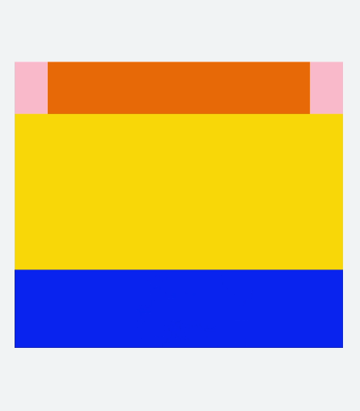
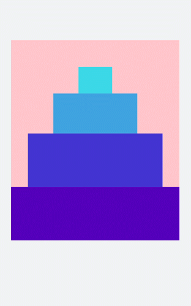

# 栅格布局
<!--Kit: ArkUI-->
<!--Subsystem: ArkUI-->
<!--Owner: @zju_ljz-->
<!--SE: @lanshouren-->
<!--TSE: @liuli0427-->

栅格布局容器根节点，使用grid-row与grid-col进行栅格布局。具体请参考[Grid-container](../reference/apis-arkui/arkui-js/js-components-grid-container.md)。


## 创建grid-container组件

在pages/index目录下的hml文件中创建一个grid-container组件，并添加[Grid-row](../reference/apis-arkui/arkui-js/js-components-grid-row.md)子组件。


```html
<!-- index.hml -->
<div class="container">
  <grid-container id="mygrid" gutter="20px" style="background-color: pink;">
    <grid-row style="height:100px;justify-content:space-around;width: 80%;background-color: #f67002;margin-left: 
      10%;"></grid-row>
    <grid-row style="height:300px;justify-content:space-around;background-color: #ffcf00;width: 100%;"></grid-row>
    <grid-row style="height:150px;justify-content:space-around;background-color: #032cf8;width: 100%;"></grid-row>
  </grid-container>
</div>
```


```css
/* xxx.css */
.container{
  flex-direction: column;
  background-color: #F1F3F5;
  margin-top: 500px;
  justify-content: center;
  align-items: center;
}
```



> **说明：** 
>
> grid-container仅支持grid-row为子组件。


## 调用方法

grid-container点击组件调用getColumns、getColumnWidth、getGutterWidth方法，返回栅格容器列数、column宽度及gutter宽度。长按调用getSizeType方法返回当前容器响应尺寸类型（xs|sm|md|lg）。


```html
<!-- index.hml -->
<div class="container">
  <grid-container id="mygrid" gutter="20px" style="background-color: pink;padding-top: 100px;" 
    onclick="getColumns" onlongpress="getSizeType">
    <grid-row style="height:100px;justify-content:space-around;background-color: #4cedf3;width: 20%;margin-left: 
      40%;"></grid-row>
    <grid-row style="height:150px;justify-content:space-around;background-color: #4cbff3;width: 50%;margin-left:
      25%;"></grid-row>
    <grid-row style="height:200px;justify-content:space-around;background-color: #465ff6;width: 80%;margin-left: 
      10%;"></grid-row>
    <grid-row style="height:200px;justify-content:space-around;background-color: #5011ec;width: 100%;"></grid-row>
  </grid-container>
</div>
```


```css
/* xxx.css */
.container{
  flex-direction: column;
  background-color: #F1F3F5;
  margin-top: 400px;
  justify-content: center;
  align-items: center;
}
```


```js
// index.js
import promptAction from '@ohos.promptAction';
export default {
  data:{
    gutterWidth:'',
    columnWidth:'',
    columns:'',
  },
  getColumns(){
    this.$element('mygrid').getColumnWidth((result)=>{
      this.columnWidth = result;
    })
    this.$element('mygrid').getGutterWidth((result)=>{
      this.gutterWidth = result;
    })
    this.$element('mygrid').getColumns((result)=>{
      this.columns= result;
    }) 
    setTimeout(()=>{              
      promptAction.showToast({duration:5000,message:'columnWidth:'+this.columnWidth+',gutterWidth:'+
      this.gutterWidth+',getColumns:'+this.columns})
    })
  },
  getSizeType(){
      this.$element('mygrid').getSizeType((result)=>{
      promptAction.showToast({duration:2000,message:'get size type:'+result})
    })
  },
}
```




## 添加grid-col

创建grid-container组件并添加grid-row，在grid-row组件内添加grid-col组件形成布局。


```html
<!-- index.hml -->
<div class="container">
  <grid-container id="mygrid" columns="4" gutter="0" style="background-color: pink;" onclick="getColumns" onlongpress="getSizeType">
    <grid-row style="height: 100px;justify-content: space-around;background-color: #4cbff3;width: 100%;">
      <grid-col span="0">
        <div style="align-items: center;justify-content: center;height: 100%;width: 100%;">
          <text style="color: dodgerblue;" onclick="getCol">top</text>
        </div>
      </grid-col>
    </grid-row>
    <grid-row style="height:500px;justify-content:space-around;background-color: #3b55ef;width: 100%;">
      <grid-col span="0" style="width: 20%;">
        <div style="align-items: center;justify-content: center;height: 100%;width: 100%;">
          <text style="color: dodgerblue;">left</text>
        </div>
      </grid-col>
      <grid-col span="0" style="background-color:orange;width: 80%;">
        <div style="width: 100%;height: 100%;align-items: center;justify-content: center;">
          <text>right</text>
        </div>
      </grid-col>
    </grid-row>
    <grid-row style="height: 100px;justify-content: space-around;background-color: #4cbff3;width: 100%;">
      <grid-col style="background-color:#c075ef;" span="0">
        <div style="width: 100%;height: 100%;padding: 20px;align-items: center;justify-content: center;">
          <text>bottom</text>
        </div>
      </grid-col>
    </grid-row>
  </grid-container>
</div>
```


```css
/* xxx.css */
.container{
  flex-direction: column;
  background-color: #F1F3F5;
  width: 100%;
  height: 100%;
  justify-content: center;
  align-items: center;
}
text{
  color: white;
  font-size: 40px;
}
```


> **说明：** 
>
> grid-row仅支持grid-col为子组件，只能在grid-col组件中添加填充的内容。


## 场景示例

本场景中循环输出list中的内容，创建出网格布局。进行下拉操作时触发refresh（刷新页面）方法，这时会向list数组中添加一条数据并设置setTimeout（延迟触发），达到刷新请求数据的效果。


```html
<!-- index.hml -->
<div class="container">
  <refresh refreshing="{{fresh}}" onrefresh="refresh">
    <grid-container id="mygrid" gutter="20" style="margin: 10px;">
      <grid-row style="height:200px;width: 100%;background-color: #e7e7e2;margin-top: 50px; padding: 0px 20px;border-radius: 15px;" for="item in list">
        <grid-col span="0" style="width: 40%;">
          <div style="align-items: center;justify-content: center">
            <image src="{{item.src}}" style="object-fit: contain;border-radius: 30px;"></image>
          </div>
        </grid-col>
        <grid-col span="0" style="width: 60%;">
          <div style="align-items: center;justify-content: center;width: 100%;height: 100%;text-align: center;">
            <text>image{{item.id}}</text>
          </div>
        </grid-col>
      </grid-row>
    </grid-container>
  </refresh>
</div>
```


```css
/* xxx.css */
.container{
  flex-direction: column;
  background-color: #F1F3F5;
  width: 100%;
  height: 100%;
}
text{
  color: #0a0aef;
  font-size: 60px;
}
```


```js
// index.js
import promptAction from '@ohos.promptAction';
export default {
  data:{
    list:[
      {src:'common/images/1.png',id:'1'},
      {src:'common/images/2.png',id:'2'},
      {src:'common/images/3.png',id:'3'}
    ],
    fresh:false
  },
  refresh(e) {
    promptAction.showToast({
      message: 'refreshing'
    })
    var that = this;
    that.fresh = e.refreshing;
    setTimeout(function () {
      that.fresh = false;
      that.list.unshift({src: 'common/images/4.png',id:'4'});
      promptAction.showToast({
        message: 'succeed'
      })
    }, 2000)
  }
}
```


