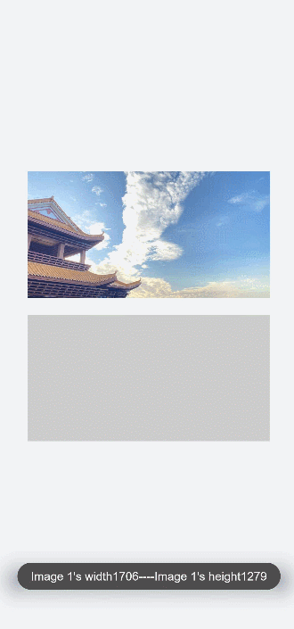

# image开发指导

image是图片组件，用来渲染展示图片。具体用法请参考[image API](../reference/apis-arkui/arkui-js/js-components-basic-image.md)。


## 创建image组件

在pages/index目录下的hml文件中创建一个image组件。
```html
<!-- index.hml -->
<div class="container">
  <image style="height: 30%;" src="common/images/bg-tv.jpg"> </image>
</div>
```

```css
/* xxx.css */
.container {
  width: 100%;
  height: 100%; 
  flex-direction: column;
  justify-content: center;
  align-items: center;
  background-color: #F1F3F5;
}
```


## 设置image样式

通过设置width、height和object-fit属性定义图片的宽、高和缩放样式。


```html
<!-- index.hml -->
<div class="container">
  <image src="common/images/bg-tv.jpg"> </image>
</div>
```


```css
/* xxx.css */
.container {
  width: 100%;
  height: 100%;
  flex-direction: column;
  align-items: center;
  justify-content: center;
  background-color:#F1F3F5;
}
image{
  width: 80%;  
  height: 500px;
  border: 5px solid saddlebrown;
  border-radius: 20px;
  object-fit: contain;
  match-text-direction:true;
}
```


## 加载图片

图片成功加载时触发complete事件，返回加载的图源尺寸。加载失败则触发error事件，打印图片加载失败。

```html
<!-- index.hml -->
<div class="container" >
  <div>
    <image src="common/images/bg-tv.jpg" oncomplete="imageComplete(1)" onerror="imageError(1)"> </image>
  </div>
  <div>
    <image src="common/images/bg-tv1.jpg" oncomplete="imageComplete(2)" onerror="imageError(2)"> </image>
  </div>
</div>
```

```css
/* xxx.css */
.container{
  width: 100%;
  height: 100%;
  flex-direction: column;
  justify-content: center;
  align-self: center;
  background-color: #F1F3F5;
}
.container div{
  margin-left: 10%;
  width: 80%;
  height: 300px;
  margin-bottom: 40px;
}
```

```js
// index.js
import promptAction from '@ohos.promptAction';
export default {
  imageComplete(i,e){
    promptAction.showToast({
      message: "image "+i+"'s width"+ e.width+"----image "+i+"'s height"+e.height,
      duration: 3000,
    })
  },
  imageError(i,e){
    setTimeout(()=>{
      promptAction.showToast({
        message: "Failed to load image "+i+".",
        duration: 3000,
      })
    },3000)
  }
}
```




## 场景示例

在本场景中，开发者长按图片后将慢慢隐藏图片，当完全隐藏后再重新显示原始图片。定时器setInterval每隔一段时间改变图片透明度,实现慢慢隐藏的效果，当透明度为0时清除定时器，设置透明度为1。
```html
<!-- index.hml -->
<div class="page-container">
  <div class="content">
    <div class="image-container">
      <image class="testimage" src="{{testuri}}" style="opacity:{{imageopacity}};" onlongpress="changeopacity"> </image>
    </div>
    <div class="text-container">
      <text style="font-size: 37px;font-weight:bold;color:orange;text-align: center;width: 100%;">Touch and hold the image</text>
    </div>
  </div>
</div>
```

```css
/* xxx.css */
.page-container {
  width: 100%;
  height: 100%;
  flex-direction:column;
  align-self: center;
  justify-content: center;
  background-color:#F1F3F5;
  background-color: #F1F3F5;
}
.content{
  flex-direction:column;
}
.image-container {
  width: 100%;
  height: 300px;
  align-items: center;
  justify-content: center;
}
.text-container {
  margin-top:50px;
  width: 100%;
  height: 60px;
  flex-direction: row;
  justify-content: space-between;
}
.testimage {
  width: 100%;  height: 400px;   
  object-fit: scale-down;  
  border-radius: 20px;
}
```

```js
// index.js
import promptAction from '@ohos.promptAction';
export default {
  data: {
    testuri: 'common/images/bg-tv.jpg',
    imageopacity:1,
    timer: null
  },
  changeopacity: function () {
    promptAction.showToast({
      message: 'Touch and hold the image.'
    })
    var opval = this.imageopacity * 20
    clearInterval(this.timer);
    this.timer = setInterval(()=>{
      opval--;
      this.imageopacity = opval / 20
      if (opval===0) {
        clearInterval(this.timer)
        this.imageopacity = 1
      }
    },100);
  }
}
```


## 相关实例

针对image开发，有以下相关实例可供参考：

- [image、image-animator组件的使用（JS）（API9）](https://gitee.com/openharmony/codelabs/tree/master/JSUI/ClickableJs)

- [图片常见操作（JS）（API9）](https://gitee.com/openharmony/codelabs/tree/master/Media/ImageOperation)