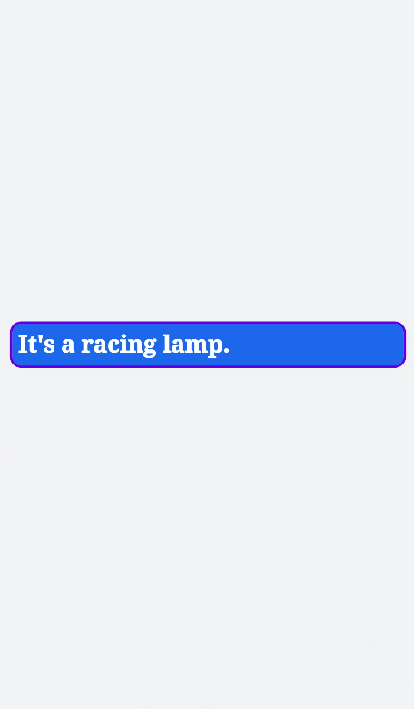
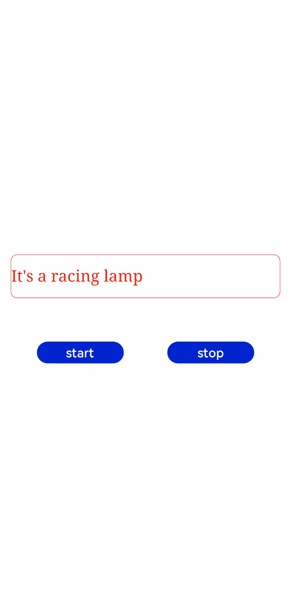

# marquee开发指导


marquee为跑马灯组件，用于展示一段单行滚动的文字。具体用法请参考[marquee](../reference/apis-arkui/arkui-js/js-components-basic-marquee.md)。


## 创建marquee组件

在pages/index目录下的hml文件中创建一个marquee组件。


```html
<!-- xxx.hml -->
<div class="container">
  <marquee style="width: 100%;height: 80px; color: #ffffff; background-color: #0820ef;padding-left: 200px;">It's a racing lamp.</marquee>
</div>
```


```css
/* xxx.css */
.container {
  width: 100%;
  height: 100%;
  flex-direction: column;
  justify-content: center;
  align-items: center;
  background-color: #F1F3F5;
}
```


## 设置属性和样式

marquee通过color和font-weight属性设置跑马灯中文本的颜色、字体粗细和边框样式。


```html
<!-- xxx.hml -->
<div class="container">
 <marquee class="custommarquee">It's a racing lamp.</marquee>
</div>
```


```css
/* xxx.css */
.container {
  width: 100%;
  height: 100%;
  flex-direction: column;
  justify-content: center;
  align-items: center;
  background-color: #F1F3F5;
}
.custommarquee {
  width: 100%;
  height: 80px;
  padding: 10px;
  margin: 20px;
  border: 4px solid #6712f1;
  border-radius: 20px;
  font-size: 40px;
  color: #ffffff;  font-weight: bolder;
  font-family: serif;
  background-color: #1567f3;
}
```



通过scrollamount、loop和direction属性实现跑马灯滚动时移动的最大长度、滚动次数和文字滚动方向。


```html
<!-- xxx.hml -->
<div class="tutorial-page">
  <div class="mymarquee">
    <marquee loop="{{loopval}}" scrollamount="{{scroll}}" direction="{{isleft}}" class="marqueetext" id="testmarquee" onclick="makestart">
      Life is a journey, not the destination.
    </marquee>
  </div>
  <div style="width: 600px;height: 150px;flex-direction: row;justify-content: space-around;">
    <button onclick="setleft"  value="left"></button>
    <button onclick="setright" value="right"></button>
  </div>
</div>
```


```css
/* xxx.css */
.tutorial-page {
  width: 750px;
  height: 100%;
  flex-direction: column;
  align-items: center;
  justify-content: center;
  background-color: #F1F3F5;
}
.marqueetext {
  color: #ffffff;
  font-family: serif;
  font-size: 37px;
}
.mymarquee {
  margin-top: 20px;
  width:100%;
  height: 100px;
  margin-left: 50px;
  margin-right: 50px;
  border: 1px solid #6712f1;
  background-color: #1567f3;
  border-radius: 15px;
  align-items: center;
}
button{
  width: 200px;
  height: 80px;
  margin-top: 100px;
}
```


```js
// xxx.js
export default {
  private: {
    loopval: -1,
    scroll: 10,    
    isleft: "left",
  },
  onInit(){
  },
  setleft(e) {
    this.isleft = "left"
  },
  setright(e) {
    this.isleft = "right"
  },
  makestart(e) {
    this.$element('testmarquee').start()
  }
}
```

> **说明：** 
>
> 当loop的值小于等于零时，跑马灯marquee将连续滚动。如果loop未指定，则默认为-1。


## 场景示例

本场景可以控制跑马灯文字的滚动和暂停。

跑马灯的次数设置为1，在结束的时候触发finish事件使跑马灯的次数加1，字体颜色变为随机颜色，调用start方法使跑马灯再次开始滚动。


```html
<!-- xxx.hml -->
<div class="tutorial-page">
  <div class="mymarquee">
    <marquee  style="color: {{color1}}" loop="{{loopval}}" scrollamount="{{scroll}}" direction="{{isleft}}" class="marqueetext" 
    id="testmarquee" onfinish="setfinish">
      Life is a journey, not the destination.
    </marquee>
  </div>
  <div style="width: 600px;height: 150px;flex-direction: row;justify-content: space-around;">
    <button onclick="makestart"  value="start"></button>
    <button onclick="makestop" value="stop"></button>
  </div>
</div>
```


```css
/* xxx.css */
.tutorial-page {
  width: 750px;
  height: 100%;
  flex-direction: column;
  align-items: center;
  justify-content: center;
}
.marqueetext {
  font-size: 37px;
}
.mymarquee {
  margin-top: 20px;
  width:100%;
  height: 100px;
  margin-left: 50px;
  margin-right: 50px;
  border: 1px solid #dc0f27;
  border-radius: 15px;
  align-items: center;
}
button{
  width: 200px;
  height: 80px;
  margin-top: 100px;
}
```


```js
// xxx.js
export default {
  private: {
    loopval: 1,
    scroll: 8,
    color1: 'red'
  },
  onInit(){
  },
  setfinish(e) {
    this.loopval=  this.loopval + 1,
    this.r = Math.floor(Math.random()*255),
    this.g = Math.floor(Math.random()*255),
    this.b = Math.floor(Math.random()*255),
    this.color1 = 'rgba('+ this.r +','+ this.g +','+ this.b +',0.8)',
    this.$element('testmarquee').start(),
    this.loopval=  this.loopval - 1
  },
  makestart(e) {
    this.$element('testmarquee').start()
  },
  makestop(e) {
    this.$element('testmarquee').stop()
  }
}
```


