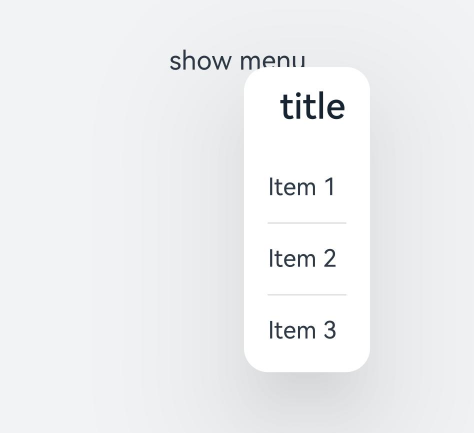
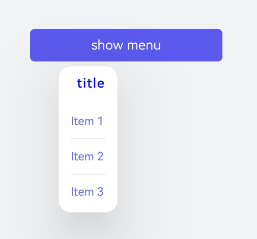

# menu开发指导
<!--Kit: ArkUI-->
<!--Subsystem: ArkUI-->
<!--Owner: @Armstrong15-->
<!--Designer: @zhanghaibo0-->
<!--Tester: @lxl007-->
<!--Adviser: @HelloCrease-->


提供菜单组件，作为临时性弹出窗口，用于展示用户可执行的操作，具体用法请参考[menu](../reference/apis-arkui/arkui-js/js-components-basic-menu.md)。


## 创建menu组件

在pages/index目录下的hml文件中创建一个menu组件，添加target、type、title属性。


```html
<!-- xxx.hml-->
<div class="container">
  <text class="title-text" id="textId">show menu</text>
  <menu target="textId" type="click" title="title">
    <option value="Item 1">Item 1</option>
    <option value="Item 2">Item 2</option>
    <option value="Item 3">Item 3</option>
  </menu>
</div>
```


```css
/* xxx.css */
.container{
  width: 100%;
  height: 100%; 
  flex-direction: column;
  background-color: #F1F3F5;
  align-items: center;
  justify-content: center;
  width: 100%;
}
.title-text{
  font-size: 35px;
}
```



> **说明：**
> - menu仅支持[option](../reference/apis-arkui/arkui-js/js-components-basic-option.md)子组件。
>
> - menu组件不支持focusable、disabled属性。


## 设置样式

为menu组件设置样式，例如字体颜色、大小、字符间距等。


```html
<!-- xxx.hml-->
<div class="container">
  <text class="title-text" id="textId">show menu</text>
  <menu target="textId" type="click" title="title">
    <option value="Item 1">Item 1</option>
    <option value="Item 2">Item 2</option>
    <option value="Item 3">Item 3</option>
  </menu>
</div>
```


```css
/* xxx.css */
.container{
  width: 100%;
  height: 100%; 
  flex-direction: column;
  background-color: #F1F3F5;
  align-items: center;
  justify-content: center;
  width: 100%;
}
.title-text{
  font-size: 35px;
  background-color: #5a5aee;
  color: white;
  width: 70%;
  text-align: center;
  height: 85px;
  border-radius: 12px;
}
menu{
  text-color: blue;
  font-size: 35px;
  letter-spacing: 2px;
}
option{
  color: #6a6aef;
  font-size: 30px;
}
```




## 绑定事件

为menu组件绑定oncancel事件（取消操作时触发）。


```html
<!-- xxx.hml-->
<div class="container">
  <text  class="title-text" id="textId" onclick="textClick">show menu</text>
  <menu  title="title" oncancel="cancel" id="menuId">
    <option value="Item 1">Item 1</option>
    <option value="Item 2">Item 2</option>
    <option value="Item 3">Item 3</option>
  </menu>
</div>
```


```css
/* xxx.css */
.container{
  width: 100%;
  height: 100%;
  flex-direction: column;
  background-color: #F1F3F5;
  width: 100%;
}
.title-text{
  font-size: 35px;
  background-color: #5a5aee;
  color: white;
  width: 70%;
  text-align: center;
  height: 85px;
  border-radius: 12px;
  margin-top: 500px;
  margin-left: 15%;
}
menu{
  text-color: blue;
  font-size: 35px;
  letter-spacing: 2px;
}
option{
  color: #6a6aef;
  font-size: 30px;
}
```


```js
// xxx.js
import promptAction from '@ohos.promptAction';
export default {
  cancel() {
    promptAction.showToast({
      message: "cancel"
    })
  },
  textClick() {
    this.$element("menuId").show({ x: 175,y: 590 });
  }
}
```


