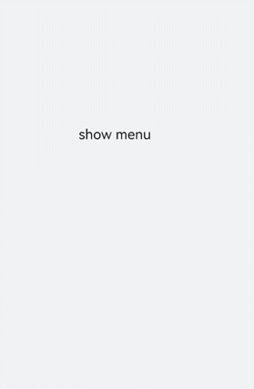
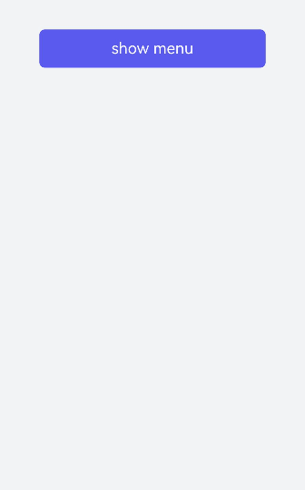
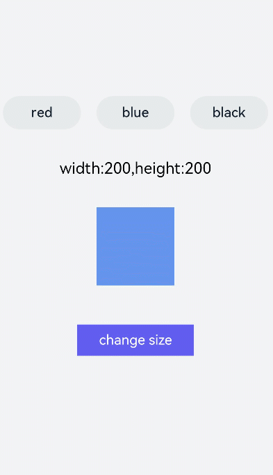

# menu开发指导


提供菜单组件，作为临时性弹出窗口，用于展示用户可执行的操作，具体用法请参考[menu](../reference/apis-arkui/arkui-js/js-components-basic-menu.md)。


## 创建menu组件

在pages/index目录下的hml文件中创建一个menu组件，添加target、type、title属性。


```html
<!-- xxx.hml-->
<div class="container">
  <text class="title-text" id="textId">show menu</text>
  <menu target="textId" type="click" title="title">
    <option value="Item 1">Item 1</option>
    <option value="Item 2">Item 2</option>
    <option value="Item 3">Item 3</option>
  </menu>
</div>
```


```css
/* xxx.css */
.container{
  width: 100%;
  height: 100%; 
  flex-direction: column;
  background-color: #F1F3F5;
  align-items: center;
  justify-content: center;
  width: 100%;
}
.title-text{
  font-size: 35px;
}
```



> **说明：**
> - menu仅支持[option](../reference/apis-arkui/arkui-js/js-components-basic-option.md)子组件。
>
> - menu组件不支持focusable、disabled属性。


## 设置样式

为menu组件设置样式，例如字体颜色、大小、字符间距等。


```html
<!-- xxx.hml-->
<div class="container">
  <text class="title-text" id="textId">show menu</text>
  <menu target="textId" type="click" title="title">
    <option value="Item 1">Item 1</option>
    <option value="Item 2">Item 2</option>
    <option value="Item 3">Item 3</option>
  </menu>
</div>
```


```css
/* xxx.css */
.container{
  width: 100%;
  height: 100%; 
  flex-direction: column;
  background-color: #F1F3F5;
  align-items: center;
  justify-content: center;
  width: 100%;
}
.title-text{
  font-size: 35px;
  background-color: #5a5aee;
  color: white;
  width: 70%;
  text-align: center;
  height: 85px;
  border-radius: 12px;
}
menu{
  text-color: blue;
  font-size: 35px;
  letter-spacing: 2px;
}
option{
  color: #6a6aef;
  font-size: 30px;
}
```


## 绑定事件

为menu组件绑定onselected事件（菜单中某个值被点击选中时触发）和oncancel事件（取消操作时触发），点击text组件调用show方法可设置menu组件的坐标。


```html
<!-- xxx.hml-->
<div class="container">
  <text  class="title-text" id="textId" onclick="textClick">show menu</text>
  <menu  title="title" onselected="select" oncancel="cancel" id="menuId">
    <option value="Item 1">Item 1</option>
    <option value="Item 2">Item 2</option>
    <option value="Item 3">Item 3</option>
  </menu>
</div>
```


```css
/* xxx.css */
.container{
  width: 100%;
  height: 100%;
  flex-direction: column;
  background-color: #F1F3F5;
  width: 100%;
}
.title-text{
  font-size: 35px;
  background-color: #5a5aee;
  color: white;
  width: 70%;
  text-align: center;
  height: 85px;
  border-radius: 12px;
  margin-top: 500px;
  margin-left: 15%;
}
menu{
  text-color: blue;
  font-size: 35px;
  letter-spacing: 2px;
}
option{
  color: #6a6aef;
  font-size: 30px;
}
```


```js
// xxx.js
import promptAction from '@ohos.promptAction';
export default {
  select(e) {
    promptAction.showToast({
      message: e.value
    })
  },
  cancel(){
    promptAction.showToast({
      message: "cancel"
    })
  },
  textClick() {
    this.$element("menuId").show({x:175,y:590});
  },
}
```




## 场景示例

本场景中开发者可点击toggle组件修改文字颜色，选择menu组件修改渐变色块大小。


```html
<!-- xxx.hml-->
<div class="container">
    <div class="contentToggle">
        <toggle class="toggle" for="{{item in togglesList}}" onclick="toggleClick({{$idx}})" checked="{{item.checked}}">{{item.name}}</toggle>
    </div>
    <text class="size" style="color: {{color}};">width:{{width}},height:{{height}}</text>
    <div style="width: {{width}}px;height: {{height}}px; background-color: cornflowerblue;"></div>
    <text id="menuId" class="text">change size</text>
    <menu onselected="select" oncancel="cancel" target="menuId">
        <option value="{{item.value}}" for="item in optionList">{{item.text}}</option>
    </menu>
</div>
```


```css
/* xxx.css */
.container{
  flex-direction: column;
  background-color: #F1F3F5;
  width: 100%;
  justify-content: center;
  align-items: center;
}
.contentToggle{
  width: 100%;
  justify-content: space-around;
}
.toggle{
  padding: 10px;
  height:80px;
  font-size: 35px;
  width: 200px;
  height: 85px;
}
.size{
  width: 100%;
  height: 200px;
  text-align: center;
  font-size: 40px;
  text-align: center;
}
.text{
  width: 300px;
  height: 80px;
  background-color: #615def;
  color: white;
  font-size: 35px;
  text-align: center;
  margin-top: 100px;
}
menu{
  text-color: blue;
  font-size: 35px;
  letter-spacing: 2px;
}
option{
  color: #6a6aef;
  font-size: 30px;
}
```


```js
// xxx.js
export default {
  data:{
    fresh: false,
    width: 200,
    height: 200,
    color: '',
    optionList:[
      {text:'200 x 200',value:2},
      {text:'300 x 300',value:3},
      {text:'500 x 500',value:5},
    ],
    togglesList:[
      {name:"red", checked:false},
      {name:"blue", checked:false},
      {name: "black", checked:false},
    ],
  },
  toggleClick(index) {   
    for(let i=0;i<this.togglesList.length;i++) {     
      if (i == index) {        
      this.color = this.togglesList[index].name;        
      this.togglesList[i].checked = true;      
      }else {        
        this.togglesList[i].checked = false;      
      }    
    }  
  },
  select(e) {
    this.width = e.value * 100;
    this.height = e.value * 100;
  }
}
```

