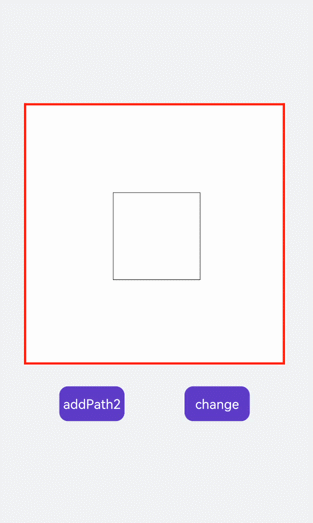

# Path2D对象
<!--Kit: ArkUI-->
<!--Subsystem: ArkUI-->
<!--Owner: @sd-wu-->
<!--Designer: @sunbees-->
<!--Tester: @liuli0427-->
<!--Adviser: @HelloCrease-->


路径对象，支持通过对象的接口进行路径的描述，并通过Canvas的stroke接口进行绘制。具体请参考[Path2D对象](../reference/apis-arkui/arkui-js/js-components-canvas-path2d.md)。


## 画线段

创建Path2D，使用多条线段组合图形。

```html
<!-- xxx.hml --> 
<div class="container">
  <canvas ref="canvas"></canvas>
</div>
```

```css
/* xxx.css */
.container {
    flex-direction: column;
    background-color: #F1F3F5;
    align-items: center;
    justify-content: center;
    width: 100%;
    height: 100%;
}

canvas {
    width: 600px;
    height: 600px;
    background-color: #fdfdfd;
    border: 5px solid red;
}
```

```js
// xxx.js
import promptAction from '@ohos.promptAction';

export default {
    onShow() {
        let ctx = this.$refs.canvas.getContext('2d', {
            antialias: true
        });
        let path = ctx.createPath2D();
        // 房顶
        path.moveTo(10, 300);
        path.lineTo(210, 100);
        path.lineTo(410, 300);
        // 屋子
        path.moveTo(10, 300);
        path.lineTo(410, 300);
        path.lineTo(410, 600);
        path.lineTo(10, 600);
        path.closePath();
        // 窗子
        path.moveTo(50, 450);
        path.bezierCurveTo(70, 350, 130, 350, 150, 450);
        path.closePath();
        // 门
        path.moveTo(250, 450);
        path.rect(250, 450, 100, 600);
        path.closePath();
        // 烟囱
        path.moveTo(365, 250);
        path.ellipse(310, 215, 30, 130, 0, Math.PI * 0.04, Math.PI * 1.1, 1);
        // 树
        path.moveTo(485, 450);
        path.quadraticCurveTo(510, 500, 485, 600);
        path.moveTo(550, 450);
        path.quadraticCurveTo(525, 500, 550, 600);
        path.moveTo(600, 535);
        path.arc(520, 450, 85, 0, 6);
        ctx.stroke(path);
    }
}
```


## 画图形

先使用createPath2D创建出路径对象，只对path1路径进行描边，所以画布上就只会出现path1的路径图形。点击text组件触发addPath方法会把path2路径对象当参数传入path1中，再对path1对象进行描边（stroke）操作后画布出现path1和path2两个图形。点击change文本改变setTransform属性值为setTransform(2, 0.1, 0.1, 2, 0,0)，图形变大并向左倾斜。


```html
<!-- xxx.hml -->
<div class="container">
    <canvas ref="canvas"></canvas>
    <div class="content">
        <text onclick="addPath">{{ isAdd }}</text>
        <text onclick="setTransform">{{ textName }}</text>
    </div>
</div>
```


```css
/* xxx.css */
.container {
    flex-direction: column;
    background-color: #F1F3F5;
    align-items: center;
    justify-content: center;
    width: 100%;
    height: 100%;
}

canvas {
    width: 600px;
    height: 600px;
    background-color: #fdfdfd;
    border: 5px solid red;
}

.content {
    width: 80%;
    margin-top: 50px;
    margin-bottom: 50px;
    display: flex;
    flex-wrap: wrap;
    justify-content: space-around;
}

text {
    width: 150px;
    height: 80px;
    color: white;
    border-radius: 20px;
    text-align: center;
    background-color: #6060e7;
    margin-bottom: 30px;
}
```


```js
// xxx.js
import promptAction from '@ohos.promptAction';

export default {
    data: {
        ctx: null,
        path1: null,
        path2: null,
        path3: null,
        isAdd: "addPath2",
        isChange: true,
        textName: 'change'
    },
    onShow() {
        this.ctx = this.$refs.canvas.getContext('2d', {
            antialias: true
        });
        this.path1 = this.ctx.createPath2D();
        // 正方形
        this.path1.moveTo(200, 200);
        this.path1.lineTo(400, 200);
        this.path1.lineTo(400, 400);
        this.path1.lineTo(200, 400);
        this.path1.closePath();
        this.path2 = this.ctx.createPath2D();
        // 圆形
        this.path2.arc(300, 300, 75, 0, 6.28);
        this.ctx.stroke(this.path1);
    },
    addPath() {
        if (this.isAdd == "addPath2") {
            // 删除指定区域的绘制内容
            this.ctx.clearRect(0, 0, 600, 600);
            this.ctx.beginPath();
            // 将另一个的路径添加到当前路径对象中
            this.path2.addPath(this.path1);
            this.ctx.stroke(this.path2);
            this.isAdd = "clearPath2";
        } else {
            this.ctx.clearRect(0, 0, 600, 600);
            this.ctx.stroke(this.path1);
            this.isAdd = "addPath2";
        }
    },
    setTransform() {
        if (this.isChange) {
            this.ctx.clearRect(0, 0, 600, 600);
            this.path3 = this.ctx.createPath2D();
            this.path3.arc(150, 150, 100, 0, 6.28);
            // 重置现有的变换矩阵并创建新的变换矩阵
            this.path3.setTransform(2, 0.1, 0.1, 2, 0, 0);
            this.ctx.stroke(this.path3);
            this.isChange = !this.isChange;
            this.textName = "back"
        } else {
            this.ctx.clearRect(0, 0, 600, 600);
            this.path3.setTransform(0.5, -0.1, -0.1, 0.5, 0, 0);
            this.ctx.stroke(this.path3);
            this.isChange = !this.isChange;
            this.textName = "change";
        }
    }
}
```


