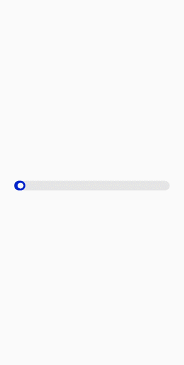

# slider开发指导


slider为滑动条组件，用来快速调节音量、亮度等。具体用法请参考[slider](../reference/apis-arkui/arkui-js/js-components-basic-slider.md)。


## 创建slider组件

在pages/index目录下的hml文件中创建一个slider组件。


```html
<!-- xxx.hml -->
<div class="container">
  <slider></slider>
</div>
```

```css
/* xxx.css */
.container {
  width: 100%;
  height: 100%;
  background-color: #F1F3F5;
  flex-direction: column;
  justify-content: center;
  align-items: center;
}
```


## 设置样式和属性

slider组件通过color、selected-color、block-color样式分别为滑动条设置背景颜色、已选择颜色和滑块颜色。


```html
<!-- xxx.hml -->
<div class="container">
  <slider class= "sli"></slider>
</div>
```


```css
/* xxx.css */
.container {
  width: 100%;
  height: 100%;
  flex-direction: column;
  justify-content: center;
  align-items: center;
  background-color: #F1F3F5;
}
.sli{
  color: #fcfcfc;
  scrollbar-color: aqua;
  background-color: #b7e3f3;
}
```


通过添加mix、max、value、step、mode属性分别为滑动条设置最小值、最大值、初始值、滑动步长和滑动条样式。


```html
<!-- xxx.hml -->
<div class="container">
  <slider min="0" max="100" value="1" step="2" mode="inset" showtips="true"></slider>
</div>
```


```css
/* xxx.css */
.container {
  width: 100%;
  height: 100%;
  flex-direction: column;
  justify-content: center;
  align-items: center;
  background-color: #F1F3F5;
}
```



> **说明：** 
>
> mode属性为滑动条样式，可选值为：
>
> - outset：滑块在滑杆上。
>
> - inset：滑块在滑杆内。


## 绑定事件

向slider组件添加change事件，添加时需要传入ChangeEvent参数。


```html
<!-- xxx.hml -->
<div class="container">
  <text>slider start value is {{startValue}}</text>
  <text>slider current value is {{currentValue}}</text>
  <text>slider end value is {{endValue}}</text>
  <slider min="0" max="100" value="{{value}}" onchange="setvalue"></slider>
</div>
```


```css
/* xxx.css */
.container {
  width: 100%;
  height: 100%; 
  flex-direction: column;
  justify-content: center;
  align-items: center;
  background-color: #F1F3F5;
}
```


```js
// xxx.js
export default {
  data: {
    value: 0,
    startValue: 0,
    currentValue: 0,
    endValue: 0,
  },
  setvalue(e) {
    if (e.mode == "start") {
      this.value = e.value;
      this.startValue = e.value;
    } else if (e.mode == "move") {
      this.value = e.value;
      this.currentValue = e.value;
    } else if (e.mode == "end") {
      this.value = e.value;
      this.endValue = e.value;
    }
  }
}
```


## 场景示例

开发者可以通过调整滑动条的值来改变图片大小，并且动态打印当前图片的宽和高。


```html
<!-- xxx.hml -->
<div class="container">
  <image src="common/landscape3.jpg" style=" width: {{WidthVal}}px;height:{{HeightVal}}px;margin-top: -150px;"></image>
  <div class="txt">
    <slider min="0" max="100" value="{{value}}" onchange="setvalue"></slider>
    <text>The width of this picture is    {{WidthVal}}</text>
    <text>The height of this picture is  {{HeightVal}}</text>
  </div>
</div>
```


```css
/* xxx.css */
.container {
  width: 100%;
  height: 100%;
  flex-direction: column;
  justify-content: center;
  align-items: center;
  background-color: #F1F3F5;
}
.txt{
  flex-direction: column;
  justify-content: center;
  align-items: center;
  position: fixed;
  top: 65%;
}
text{
  margin-top: 30px;
}
```


```js
// xxx.js
export default{
  data: {
    value: 0,
    WidthVal: 200,
    HeightVal: 200
  },
  setvalue(e) {
    this.WidthVal = 200 + e.value;
    this.HeightVal = 200 + e.value
  }
}
```


## 相关实例

针对slider开发，有以下相关实例可供参考：

- [slider组件的使用（JS）（API9）](https://gitee.com/openharmony/codelabs/tree/master/JSUI/SliderApplication)

- [简易视频播放器（JS）（API9）](https://gitee.com/openharmony/codelabs/tree/master/Media/VideoOpenHarmony)