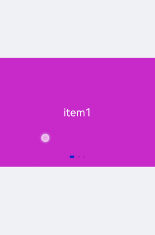
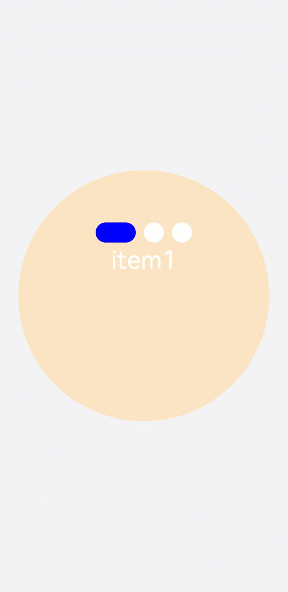
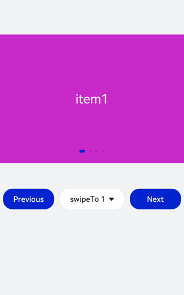
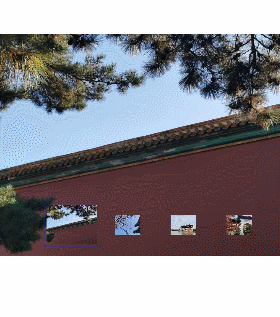

# swiper开发指导


swiper为滑动容器，提供切换显示子组件的能力。具体用法请参考[swiper](../reference/apis-arkui/arkui-js/js-components-container-swiper.md)。


## 创建swiper组件

在pages/index目录下的hml文件中创建一个swiper组件。

```html
<!-- xxx.hml-->
<div class="container">
  <swiper>
    <div class="item" style="background-color: #bf45ea;">
      <text>item1</text>
    </div>
    <div class="item" style="background-color: #088684;">
      <text>item2</text>
    </div>
    <div class="item" style="background-color: #7786ee;">
      <text>item3</text>
    </div>
  </swiper>
</div>
```

```css
/* xxx.css */
.container{
  width: 100%;
  height: 100%;
  flex-direction: column;
  background-color: #F1F3F5;
  align-items: center;
  justify-content: center;
  width: 100%;
}
swiper{
  height: 30%;
}
.item{
  width: 100%;
  height: 500px;
}
text{
  width: 100%;
  height: 100%;
  text-align: center;
  font-size: 50px;
  color: white;
}
```





> **说明：** 
>
> swiper组件支持除&lt;list&gt;之外的子组件。


## 添加属性

swiper组件当不开启循环播放（loop="false"）时添加自动播放属性（autoplay），设置自动播放时播放时间间隔（interval），页面会自动切换并停留在最后一个子组件页面。添加digital属性启用数字导航点，设置切换时为渐隐滑动效果（scrolleffect="fade"）。


```html
<!-- xxx.hml-->
<div class="container">
  <swiper index="1"  autoplay="true" interval="2000" indicator="true" digital="true" duration="500"
  scrolleffect="fade" loop="false">
    <div class="item" style="background-color: #bf45ea;">
      <text>item1</text>
    </div>
    <div class="item" style="background-color: #088684;">
      <text>item2</text>
    </div>
    <div class="item" style="background-color: #7786ee;">
      <text>item3</text>
    </div>
    <div class="item" style="background-color: #c88cee;">
      <text>item4</text>
    </div>
  </swiper>
</div>
```


```css
/* xxx.css */
.container{
  width: 100%;
  height: 100%;
  flex-direction: column;
  background-color: #F1F3F5;
  align-items: center;
  justify-content: center;
}
swiper{
  height: 30%;
}
.item{
  width: 100%;
  height: 500px;
}
text{
  width: 100%;
  height: 100%;
  text-align: center;
  font-size: 50px;
  color: white;
}
```


> **说明：**
> - 设置indicator（是否启用导航点指示器）属性为true时digital（是否启用数字导航点）属性才会生效。
>
> - swiper子组件的个数大于等于2时设置的loop属性才会生效。
>
> - scrolleffect属性仅在loop属性值为false时生效。


## 设置样式

设置swiper组件的宽高，导航点指示器的直径大小（indicator-size）、颜色（indicator-color）、相对位置（indicator-top）及选中时的颜色（indicator-selected-color）。


```html
<!-- xxx.hml-->
<div class="container">
    <swiper index="1" autoplay="true" interval="2000"  duration="500" >
        <div class="item" style="background-color: bisque;">
            <text>item1</text>
        </div>
        <div class="item" style="background-color: darkkhaki;">
            <text>item2</text>
        </div>
        <div class="item" style="background-color: cadetblue;">
            <text>item3</text>
        </div>
    </swiper>
</div>
```


```css
/* xxx.css */
.container{
  width: 100%;
  height: 100%;
  flex-direction: column;
  background-color: #F1F3F5;
  align-items: center;
  justify-content: center;
}
swiper{
  width:  500px;
  height: 500px;
  border-radius: 250px;
  indicator-color: white;
  indicator-selected-color: blue;
  indicator-size: 40px;
  indicator-top: 100px;
  overflow: hidden ;
}
.item{
  width: 100%;
  height: 500px;
}
text{
  width: 100%;
  text-align: center;
  margin-top: 150px;
  font-size: 50px;
  color: white;
}
```




## 绑定事件

创建两个text组件添加点击事件，当点击后就调用showPrevious（显示上一个子组件）或showNext（显示下一个子组件）方法。添加select组件下拉选择时触发change事件后调用swipeTo方法跳转到指定轮播页面。swiper组件绑定change（当前显示的组件索引变化时触发）和finish（切换动画结束时触发）事件。


```html
<!-- xxx.hml-->
<div class="container">
  <swiper interval="2000" onchange="change" loop="false" onanimationfinish="finish" id="swiper">
    <div class="item" style="background-color: #bf45ea">
      <text>item1</text>
    </div>
    <div class="item" style="background-color: #088684;">
      <text>item2</text>
    </div>
    <div class="item" style="background-color: #7786ee;">
      <text>item3</text>
    </div>
    <div class="item" style="background-color: #c88cee;">
      <text>item4</text>
    </div>
  </swiper>
  <div class="content">
      <button class="pnbtn" onclick="previous">Previous</button>
      <select onchange="selectChange">
          <option value="0">swipeTo 1</option>
          <option value="1">swipeTo 2</option>
          <option value="2">swipeTo 3</option>
          <option value="3">swipeTo 4</option>
      </select>
    <button class="pnbtn" onclick="next">Next</button>
  </div>
</div>
```


```css
/* xxx.css */
.container{
  width: 100%;
  height: 100%;
  flex-direction: column;
  background-color: #F1F3F5;
  align-items: center;
  justify-content: center;
}
swiper{
  height: 30%;
}
.item{
  width: 100%;
  height: 500px;
}
text{
  width: 100%;
  height: 100%;
  text-align: center;
  font-size: 50px;
  color: white;
}
select{
  background-color: white;
  width: 250px;
  height: 80px;
}
.content{
  margin-top: 100px;
  justify-content: space-around;
}
.pnbtn{
  width: 200px;
  height: 80px;
  font-size: 30px; 
}
```


```js
// xxx.js
import promptAction from '@ohos.promptAction';
export default{
  change(e){
    promptAction.showToast({duration:2000,message:"current index:"+e.index});
  },
  finish(){
    promptAction.showToast({duration:2000,message:"切换动作结束"});
  },
  selectChange(e){
    this.$element('swiper').swipeTo({index: Number(e.newValue)});
  },
  previous(){
    this.$element('swiper').showPrevious();
  },
  next(){
    this.$element('swiper').showNext();
  }
}
```




## 场景示例

本场景中使用swiper创建一个轮播图，在轮播图底部制作一个缩略图，点击缩略图后调用swipeTo方法切换到对应的轮播图。


```html
<!-- xxx.hml-->
<div class="container">
  <swiper duration="500" indicator="false" id="swiper" onchange="change">
    <div class="item" for="item in list">
      <image src="{{item.src}}"></image>
    </div>
  </swiper>
  <div class="content">
    <div class="content_item {{index == $idx?'actived':''}}" for="item in list" onclick="imageTo({{$idx}})">
      <image src="{{item.src}}"></image>
    </div>
  </div>
</div>
```


```css
/* xxx.css */
.container{
  flex-direction: column;
  background-color: #F1F3F5;
  align-items: center;
  justify-content: center;
  width: 100%;
}
swiper{
  width: 100%;
  height: 500px;
}
.item{
  width: 100%;
  height: 500px;
}
.content{
  margin-top: -120px;
  width: 70%;
  display: flex;
  justify-content: space-around;
  height: 100px;
}
.content_item{
  padding: 5px;
  transform: scale(0.5);
}
.actived{
  transform: scale(1);
  border: 1px solid #b20937ea;
}
```


```js
// xxx.js
import promptAction from '@ohos.promptAction';
export default {
  data:{
    index: 0,
    list:[
      {src: 'common/images/1.png'},
      {src: 'common/images/2.png'},
      {src: 'common/images/3.png'},
      {src: 'common/images/4.png'},]
    },
  imageTo(index){
    this.index = index;
    this.$element('swiper').swipeTo({index: index});
  },
  change(e){
    this.index = e.index;
  }
}
```




## 相关实例

针对swiper开发，有以下相关实例可供参考：

- [简易视频播放器（JS）（API9）](https://gitee.com/openharmony/codelabs/tree/master/Media/VideoOpenHarmony)
