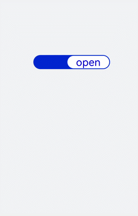
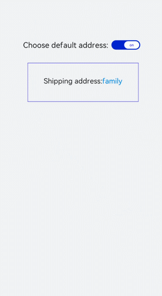

# switch开发指导


switch为开关选择器，切换开启或关闭状态。具体用法请参考[switch](../reference/apis-arkui/arkui-js/js-components-basic-switch.md)。


## 创建switch组件

在pages/index目录下的hml文件中创建一个switch组件。


```html
<!-- xxx.hml -->
<div class="container">
    <switch checked="true"></switch>
</div>
```


```css
/* xxx.css */
.container {
  flex-direction: column;
  background-color: #F1F3F5;
}
```


## 添加属性和方法

  switch组件通过textoff和showtext属性设置文本选中和未选中时的状态。设置checked属性值为true（组件为打开状态）。添加change事件，当组件状态改变时触发，触发后执行switchChange函数获取组件当前状态（关闭/打开）。

```html
<!-- xxx.hml -->
<div class="container">
  <switch showtext="true" texton="open" textoff="close" checked="true" @change="switchChange"></switch>
</div>
```


```css
/* xxx.css */
.container {
  width: 100%;
  height: 100%; 
  display: flex;
  justify-content: center;
  align-items: center;
  background-color: #F1F3F5;
}
switch {
  texton-color: #002aff;
  textoff-color: silver;
  text-padding: 20px; 
  font-size: 50px;
}
```


```js
// xxx.js
import promptAction from '@ohos.promptAction';
export default {
  switchChange(e){
    if(e.checked){
      promptAction.showToast({
        message: "open"
      });
    }else{
      promptAction.showToast({
        message: "close"
      });
    }
  }
}
```





> **说明：** 
>
> 当showtext属性值设置为true时，texton和textoff设置的文本才会生效。


## 场景示例

在下面示例中设置开关为打开状态（使用默认收货地址），关闭开关后页面显示选择地址按钮，点击按钮即可改变收货地址。

  实现方法：创建switch开关，设置checked属性为true，通过数据绑定改变收货地址。设置display属性（默认为none），当关闭开关改变display属性值为flex后显示地址模块，点击按钮改变颜色。

```html
<!-- xxx.hml -->
<div class="container">
  <div class="change">
    <text>Choose default address:</text>
    <switch showtext="true" texton="on" textoff="off" checked="true" @change="switchChange"></switch>
  </div>
  <div class="content">
    <text class="address"><span>Shipping address:</span><span class="textSpan">{{address}}</span></text>
  </div>
  <div class="myAddress" style="display: {{addressDisplay}};">
    <text style="font-size: 30px;margin-bottom: 50px;">Choose an address:</text>
    <text class="addressText" style="background-color: {{item == address?'#0fabe7':''}};color: {{item == address?'white':'black'}};" 
    for="item in addressList"@click="changeAddress({{$idx}}})">{{item}}</text>
  </div>
</div>
```


```css
/* xxx.css */
.container {
  width: 100%;
  height: 100%; 
  background-color: #F1F3F5;
  flex-direction: column;
  padding: 50px;
}
.change{
  margin-top: 20%;
  width: 100%;
  justify-content: center;
}
switch{
  texton-color: #002aff;
  textoff-color: silver;
  text-padding: 20px;
}
.content{
  width: 70%;
  text-align: center;
  flex-direction: column;
  border: 1px solid #002aff;
  margin-left: 15%;
  text-align: center;
}
.address{
  width: 100%;
  height: 100px;
  line-height: 100px;
  text-align: center;
  font-size: 28px;
  margin-bottom: 50px;
}
.textSpan{
  color: #0aa9f1;
}
.myAddress{
  flex-direction: column;
  margin-top: 50px;
}
.addressText{
  margin-left: 35%;
  width: 30%;
  height: 75px;
  text-align: center;
  color: white;
  margin-bottom: 30px;
  border-radius: 10px;
  border: 1px solid #0fabe7;
}
```


```js
// xxx.js
export default {
  data:{
    address: '',
    addressDisplay: 'none',
    addressList: ['family','company','commissary'],
  },
  onInit(){
    // 初始化默认地址为地址列表中的第一个
    this.address = this.addressList[0];
  },
  switchChange(e){
    if(e.checked){
        this.addressDisplay = "none";
    }else{
        this.addressDisplay = "flex";
    }
  },
  changeAddress(i){
    this.address= this.addressList[i];
  }
}
```


