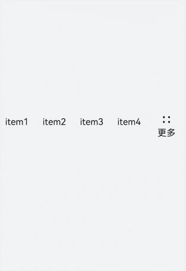
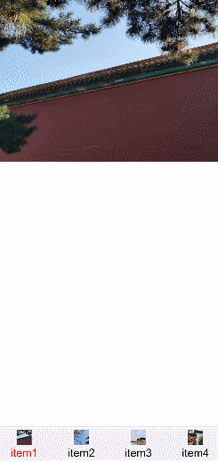

# toolbar开发指导
<!--Kit: ArkUI-->
<!--Subsystem: ArkUI-->
<!--Owner: @mayaolll-->
<!--Designer: @jiangdayuan-->
<!--Tester: @lxl007-->
<!--Adviser: @HelloCrease-->

toolbar为页面工具栏组件，用于展示针对当前界面的操作选项，可作为页面的一级导航。具体用法请参考[toolbar](../reference/apis-arkui/arkui-js/js-components-basic-toolbar.md)。


## 创建toolbar组件

在pages/index目录下的hml文件中创建一个toolbar组件。


```html
<!-- xxx.hml -->
<div class="container">
  <toolbar style="background-color: #F1F3F5;">
    <toolbar-item value="item1"></toolbar-item>
    <toolbar-item value="item2"></toolbar-item>
  </toolbar>
</div>
```


```css
/* xxx.css */
.container {
  width: 100%;
  height: 100%; 
  flex-direction: column;
  justify-content: center;
  align-items: center;
  background-color: #F1F3F5;
}
toolbar-item{
  font-size: 35px;
}
```


## 添加子组件

  toolbar组件仅支持toolbar-item为子组件，页面最多可以展示5个toolbar-item子组件，如果存在6个及以上toolbar-item，则保留前面4个，后续的将收纳到工具栏上的更多项中，通过点击更多项弹窗进行展示。并且更多项展示的组件样式采用系统默认样式，toolbar-item上设置的自定义样式不生效。

```html
<!-- xxx.hml -->
<div class="container">
  <toolbar>
    <toolbar-item value="item1"></toolbar-item>    
    <toolbar-item value="item2"></toolbar-item>    
    <toolbar-item value="item3"></toolbar-item>    
    <toolbar-item value="item4"></toolbar-item>    
    <toolbar-item value="item5"></toolbar-item>    
    <toolbar-item value="item6"></toolbar-item>
  </toolbar>
</div>
```


```css
/* xxx.css */
.container {
  width: 100%;
  height: 100%; 
  flex-direction: column;
  justify-content: center;
  align-items: center;
  background-color: #F1F3F5;
}
toolbar-item{
  font-size: 35px;
}
```




## 设置样式

设置position样式控制toolbar组件的位置，并设置子组件toolbar-item的字体颜色、大小及背景色。

```html
<!-- xxx.hml -->
<div class="container">
  <toolbar style="position: fixed;bottom: 5%;width: 100%;background-color: #F1F3F5;">
    <toolbar-item value="item1" icon="common/images/1.png" class="toolbarActive"></toolbar-item>
    <toolbar-item value="item2" icon="common/images/2.png"></toolbar-item>
    <toolbar-item value="item3" icon="common/images/1.png"></toolbar-item>
    <toolbar-item value="item4" icon="common/images/2.png"></toolbar-item>
  </toolbar>
</div>
```


```css
/* xxx.css */
.container {
  background-color: #F1F3F5;
  flex-direction: column;
  width: 100%;
  height: 100%; 
  justify-content: center;
  align-items: center;
}
toolbar-item{
  font-size: 35px;
}
```


## 绑定事件

分别给toolbar-item绑定单击事件和长按事件，单击后文本变红，长按时文本变蓝。


```html
<!-- xxx.hml -->
<div class="container">
  <toolbar style="position: fixed;top: 50%;width: 100%;background-color: #F1F3F5;">
    <toolbar-item value="item1" icon="common/images/1.png" style="color: {{itemColor}};" onclick="itemClick"></toolbar-item>
    <toolbar-item value="item2" icon="common/images/2.png"  style="color: {{itemColor}}"></toolbar-item>
    <toolbar-item value="item3" icon="common/images/3.png"  style="color: {{itemColor}}" onlongpress="itemLongPress"></toolbar-item>
  </toolbar>
</div>
```


```css
/* xxx.css */
.container {
  background-color: #F1F3F5;   
  flex-direction: column;
  width: 100%;
  height: 100%; 
  justify-content: center;
  align-items: center;
}
toolbar-item{
  font-size: 35px;
}
```


```js
// xxx.js
import promptAction from '@ohos.promptAction';
export default {
  data:{
    itemColor:'black'
  },
  itemClick(){
    this.itemColor= "red";
    promptAction.showToast({duration:2000,message:'item click'});
  },
  itemLongPress(){
    promptAction.showToast({duration:2000,message:'item long press'});
    this.itemColor= "blue";
  },
}
```


> **说明：** 
>
> toolbar组件不支持添加事件和方法，但其子组件toolbar-item支持。


## 场景示例

本场景中开发者可点击toolbar-item组件，改变当前组件文本颜色并更换相对应的图片内容。

  使用for循环创建toolbar-item组件并添加点击事件，点击后获得索引值进行存储。设置文本颜色时，判断当前索引值是否为储存的值，若相同则设置为红色，不同则使用默认颜色。

```html
<!-- xxx.hml -->
<div class="container">
  <image src="{{imgList[active]}}"></image>
  <toolbar style="position: fixed;bottom: 5%;width: 100%;background-color: #F1F3F5;">
    <toolbar-item value="{{ item.option}}" icon="{{item.icon}}" style="color: {{active == $idx?'red':'black'}};background-color: {{active== $idx?'#dbe7f1':'#F1F3F5'}};" for="{{item in itemList}}" onclick="itemClick({{$idx}})"></toolbar-item>
    </toolbar>
</div>
```


```css
/* xxx.css */
.container {
  background-color: #F1F3F5;   
  flex-direction: column;
  width: 100%;
  justify-content: center;
  align-items: center;
}
toolbar-item{
  font-size: 35px;
}
```


```js
// xxx.js
export default {
  data:{
    active: 0,
    imgList:["common/images/1.png","common/images/2.png","common/images/3.png","common/images/4.png"],
    itemList:[
      {option:'item1',icon:'common/images/1.png'},
      {option:'item2',icon:'common/images/2.png'},
      {option:'item3',icon:'common/images/3.png'},
      {option:'item4',icon:'common/images/4.png'},
    ]
  },
  itemClick(id){
    this.active= id;
  },
}
```

