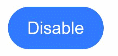
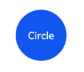
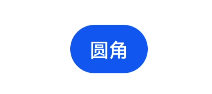
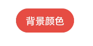
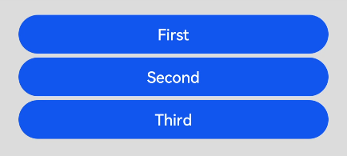
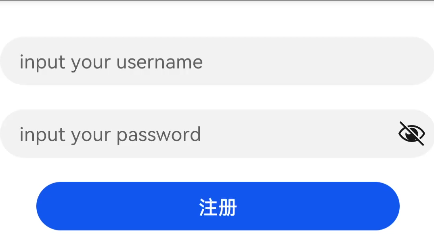

# Button


Button是按钮组件，通常用于响应用户的点击操作，如提交表单，其类型包括胶囊按钮、圆形按钮、普通按钮。


## 创建按钮

Button通过调用接口来创建，接口调用有以下两种形式：

- 创建包含子组件的按钮

  `Button(options?: {type?: ButtonType, stateEffect?: boolean})`，该接口用于创建包含子组件的按钮，其中type用于设置Button类型，stateEffect属性设置Button是否开启点击效果。


  ```
  Button({ type: ButtonType.Normal, stateEffect: true }) {
    Row() {
      Image($r('app.media.loading')).width(20).height(20).margin({ left: 12 })
      Text('loading').fontSize(12).fontColor(0xffffff).margin({ left: 5, right: 12 })
    }.alignItems(VerticalAlign.Center)
  }.borderRadius(8).backgroundColor(0x317aff).width(90)
  ```

  

- 创建不包含子组件的按钮

  `Button(label?: string, options?: { type?: ButtonType, stateEffect?: boolean })`，该接口用于创建不包含子组件的按钮，其中label确定所创建的Button是否包含子组件。


  ```
  Button('Ok', { type: ButtonType.Normal, stateEffect: true })
    .borderRadius(8)
    .backgroundColor(0x317aff)
    .width(90)
  ```

  


## 设置按钮类型

Button有三种可选类型，分别为Capsule（胶囊类型）、Circle（圆形按钮）和Normal（普通按钮），通过type进行设置。

- 胶囊按钮（默认类型）

  ```
  Button('Disable', { type: ButtonType.Capsule, stateEffect: false })
    .backgroundColor(0x317aff)
    .width(90)
  ```

  

- 圆形按钮

  ```
  Button('Circle', { type: ButtonType.Circle, stateEffect: false })
    .backgroundColor(0x317aff)
    .width(90)
    .height(90)
  ```

  


## 自定义样式

- 设置边框弧度
  一般使用通用属性来自定义按钮样式。例如通过borderRadius属性设置按钮的边框弧度。


  ```
  Button('circle border', { type: ButtonType.Normal })
    .borderRadius(20)
  ```

  

- 设置文本样式
  通过添加文本样式设置按钮文本的展示样式。


  ```
  Button('font style', { type: ButtonType.Normal })
    .fontSize(20)
    .fontColor(Color.Red)
    .fontWeight(800)
  ```

  

- 设置背景颜色
  添加backgroundColor属性设置按钮的背景颜色。


  ```
  Button('background color').backgroundColor(0xF55A42)
  ```

  

- 用作功能型按钮
  为删除操作创建一个按钮。


  ```
  Button({ type: ButtonType.Circle, stateEffect: true }) {
    Image($r('app.media.ic_public_delete_filled')).width(30).height(30)
  }.width(55).height(55).margin({ left: 20 }).backgroundColor(0xF55A42)
  ```

  


## 添加事件

Button组件通常用于触发某些操作，可以在绑定onClick事件来响应点击操作后的自定义行为。


```
Button('Ok', { type: ButtonType.Normal, stateEffect: true })
  .onClick(()=>{
    console.info('Button onClick')
  })
```


## 场景示例

- 用于启动操作

  可以将按钮用于启动操作的任何用户界面元素。按钮会根据用户的操作触发相应的事件。如，在List容器里边通过点击按钮进行页面跳转：

  ```
  import router from '@ohos.router'

  @Entry
  @Component
  struct ButtonCase1 {
    build() {
      List({ space: 4 }) {
        ListItem() {
          Button("First").onClick(() => {
            router.push({ url: 'xxx' })
          })
        }

        ListItem() {
          Button("Second").onClick(() => {
            router.push({ url: 'yyy' })
          })
        }

        ListItem() {
          Button("Third").onClick(() => {
            router.push({ url: 'zzz' })
          })
        }
      }
      .listDirection(Axis.Vertical)
      .backgroundColor(0xDCDCDC).padding(20)
    }
  }
  ```


  


- 用于表单的提交
  在用户登录/注册页面，用户的登录或注册的提交操作会用按钮。


  ```
  @Entry
  @Component
  struct ButtonCase2 {
    build() {
      Column() {
        TextInput({ placeholder: 'input your username' }).margin({ top: 20 })
        TextInput({ placeholder: 'input your password' }).type(InputType.Password).margin({ top: 20 })
        Button('Register').width(300).margin({ top: 20 })
      }.padding(20)
    }
  }
  ```

  
