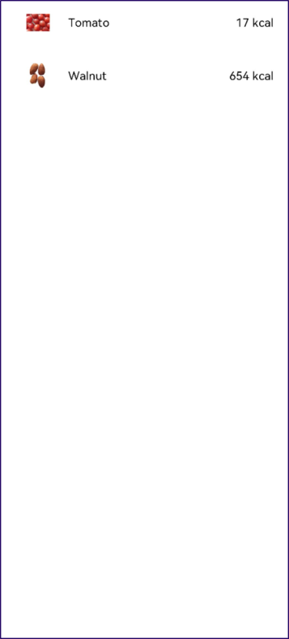

# 构建食物列表List布局

使用List组件和ForEach循环渲染，构建食物列表布局。


1. 在pages目录新建页面FoodCategoryList.ets，将index.ets改名为FoodDetail.ets。
   
2. 新建FoodList组件作为页面入口组件，FoodListItem为其子组件。List组件是列表组件，适用于重复同类数据的展示，其子组件为ListItem，适用于展示列表中的单元。
   ```ts
   @Component
   struct FoodListItem {
     build() {}
   }

   @Entry
   @Component
   struct FoodList {
     build() {
       List() {
         ListItem() {
           FoodListItem()
         }
       }
     }
   }
   ```

3. 引入FoodData类和initializeOnStartup方法。

应用代码中文件访问方法主要有下面两种：
- **相对路径**：使用相对路径引用代码文件，以"../"访问上一级目录，以"./"访问当前目录，也可以省略不写。
- **绝对路径**：使用当前模块根路径引用代码文件，比如：common/utils/utils。
这里使用相对路径访问：

   ```
   import { FoodData } from '../model/FoodData'
   import { initializeOnStartup } from '../model/FoodDataModels'
   ```

4. FoodList和FoodListItem组件数值传递。在FoodList组件内创建类型为FoodData[]成员变量foodItems，调用initializeOnStartup方法为其赋值。在FoodListItem组件内创建类型为FoodData的成员变量foodItem。将父组件foodItems数组的第一个元素的foodItems[0]作为参数传递给FoodListItem。
   ```ts
   import { FoodData } from '../model/FoodData'
   import { initializeOnStartup } from '../model/FoodDataModels'

   @Component
   struct FoodListItem {
     private foodItem: FoodData
     build() {}
   }

   @Entry
   @Component
   struct FoodList {
     private foodItems: FoodData[] = initializeOnStartup()
     build() {
       List() {
         ListItem() {
           FoodListItem({ foodItem: this.foodItems[0] })
         }
       }
     }
   }
   ```

5. 声明子组件FoodListItem 的UI布局。创建Flex组件，包含食物图片缩略图，食物名称，和食物对应的卡路里。
   ```ts
   import { FoodData } from '../model/FoodData'
   import { initializeOnStartup } from '../model/FoodDataModels'

      @Component
      struct FoodListItem {
        private foodItem: FoodData
        build() {
          Flex({ justifyContent: FlexAlign.Start, alignItems: ItemAlign.Center }) {
            Image(this.foodItem.image)
              .objectFit(ImageFit.Contain)
              .height(40)
              .width(40)
              .margin({ right: 16 })
            Text(this.foodItem.name)
              .fontSize(14)
              .flexGrow(1)
            Text(this.foodItem.calories + ' kcal')
              .fontSize(14)
          }
          .height(64)
          .margin({ right: 24, left:32 })
        }
      }
   
   @Entry
      @Component
      struct FoodList {
        private foodItems: FoodData[] = initializeOnStartup()
        build() {
          List() {
            ListItem() {
              FoodListItem({ foodItem: this.foodItems[0] })
            }
          }
        }
      }
   ```
   
   
   
   
6. 创建两个FoodListItem。在List组件创建两个FoodListItem，分别给FoodListItem传递foodItems数组的第一个元素this.foodItems[0]和第二个元素foodItem: this.foodItems[1]。

   ```ts
   import { FoodData } from '../model/FoodData'
   import { initializeOnStartup } from '../model/FoodDataModels'
   
   @Component
   struct FoodListItem {
     private foodItem: FoodData
   
     build() {
       Flex({ justifyContent: FlexAlign.Start, alignItems: ItemAlign.Center }) {
         Image(this.foodItem.image)
           .objectFit(ImageFit.Contain)
           .height(40)
           .width(40)
           .margin({ right: 16 })
         Text(this.foodItem.name)
           .fontSize(14)
           .flexGrow(1)
         Text(this.foodItem.calories + ' kcal')
           .fontSize(14)
       }
       .height(64)
       .margin({ right: 24, left: 32 })
     }
   }
   
   @Entry
   @Component
   struct FoodList {
     private foodItems: FoodData[] = initializeOnStartup()
   
     build() {
       List() {
         ListItem() {
           FoodListItem({ foodItem: this.foodItems[0] })
         }
   
         ListItem() {
           FoodListItem({ foodItem: this.foodItems[1] })
         }
       }
     }
   }
   ```
   
   
      
   
7. 单独创建每一个FoodListItem肯定是不合理的，这就需要引入[ForEach循环渲染](../quick-start/arkts-rendering-control.md#循环渲染)。

   ```ts
   import { FoodData } from '../model/FoodData'
   import { initializeOnStartup } from '../model/FoodDataModels'
   
   @Component
   struct FoodListItem {
     private foodItem: FoodData
     build() {
       Flex({ justifyContent: FlexAlign.Start, alignItems: ItemAlign.Center }) {
         Image(this.foodItem.image)
           .objectFit(ImageFit.Contain)
           .height(40)
           .width(40)     
           .margin({ right: 16 })
         Text(this.foodItem.name)
           .fontSize(14)
           .flexGrow(1)
         Text(this.foodItem.calories + ' kcal')
           .fontSize(14)
       }
       .height(64)
       .margin({ right: 24, left:32 })
     }
   }
   
   @Entry
   @Component
   struct FoodList {
     private foodItems: FoodData[] = initializeOnStartup()
     build() {
       List() {
         ForEach(this.foodItems, item => {
           ListItem() {
             FoodListItem({ foodItem: item })
           }
         }, item => item.id.toString())
       }
     }
   }
   ```
   
8. 添加FoodList标题。

   ```
   @Entry
   @Component
   struct FoodList {
     private foodItems: FoodData[] = initializeOnStartup()
   
     build() {
       Column() {
         Flex({ justifyContent: FlexAlign.Start, alignItems: ItemAlign.Center }) {
           Text('Food List')
             .fontSize(20)
             .margin({ left: 20 })
         }
         .height('7%')
         .backgroundColor('#FFf1f3f5')
   
         List() {
           ForEach(this.foodItems, item => {
             ListItem() {
               FoodListItem({ foodItem: item })
             }
           }, item => item.id.toString())
         }
         .height('93%')
       }
     }
   }
   ```

     