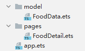

# 构建食物数据模型

在创建视图中，我们逐一去表述食物的各个信息，如食物名称、卡路里、蛋白质、脂肪、碳水和维生素C。这样的编码形式在实际的开发中肯定是不切实际的，所以要创建食物数据模型来统一存储和管理数据。


1. 新建model文件夹，在model目录下创建FoodData.ets。
   

2. 定义食物数据的存储模型FoodData和枚举变量Category，FoodData类包含食物id、名称（name）、分类（category）、图片（image）、热量（calories）、蛋白质（protein）、脂肪（fat）、碳水（carbohydrates）和维生素C（vitaminC）属性。
   eTS语言是在ts语言的基础上的扩展，同样支持ts语法。

   ```
   enum Category  {
     Fruit,
     Vegetable,
     Nut,
     Seafood,
     Dessert
   }
   
   let NextId = 0;
   class FoodData {
     id: string;
     name: string;
     image: Resource;
     category: Category;
     calories: number;
     protein: number;
     fat: number;
     carbohydrates: number;
     vitaminC: number;
   
     constructor(name: string, image: Resource, category: Category, calories: number, protein: number, fat: number, carbohydrates: number, vitaminC: number) {
       this.id = `${ NextId++ }`;
       this.name = name;
       this.image = image;
       this.category = category;
       this.calories = calories;
       this.protein = protein;
       this.fat = fat;
       this.carbohydrates = carbohydrates;
       this.vitaminC = vitaminC;
     }
   }
   ```

3. 存入食物图片资源。在resources &gt; phone &gt; media目录下存入食物图片资源，图片名称为食物名称。
   
4. 创建食物资源数据。在model文件夹下创建FoodDataModels.ets，在该页面中声明食物成分数组FoodComposition。
   实际开发中，开发者可以自定义更多的数据资源，当食物资源很多时，建议使用数据懒加载LazyForEach。

5. 创建initializeOnStartUp方法来初始化FoodData的数组。在FoodDataModels.ets中使用了定义在FoodData.ets的FoodData和Category，所以要将FoodData.ets的FoodData类export，在FoodDataModels.ets内import FoodData和Category。
   ```
   // FoodData.ets
   export enum Category {
    ......
   }
   export class FoodData {
     ......
   }
   // FoodDataModels.ets
   import { Category, FoodData } from './FoodData'
   
   export function initializeOnStartup(): Array<FoodData> {
     let FoodDataArray: Array<FoodData> = []
     FoodComposition.forEach(item => {
       FoodDataArray.push(new FoodData(item.name, item.image, item.category, item.calories, item.protein, item.fat, item.carbohydrates, item.vitaminC ));
     })
     return FoodDataArray;
   }
   ```


已完成好健康饮食应用的数据资源准备，接下来将通过加载这些数据来创建食物列表页面。
