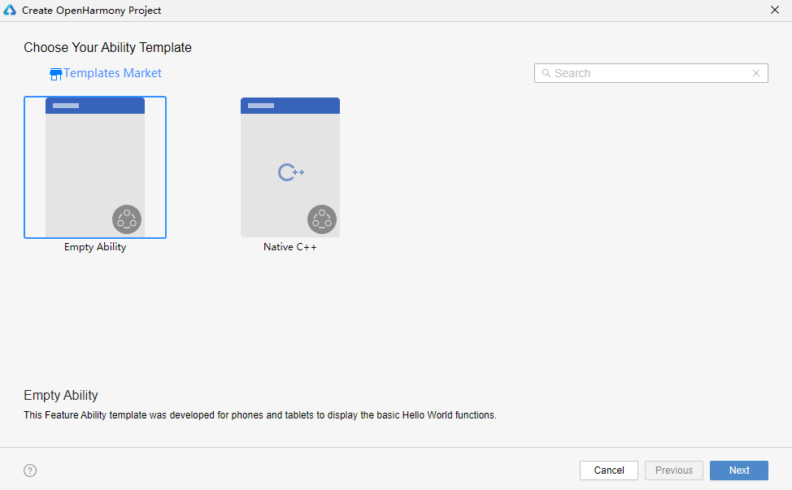
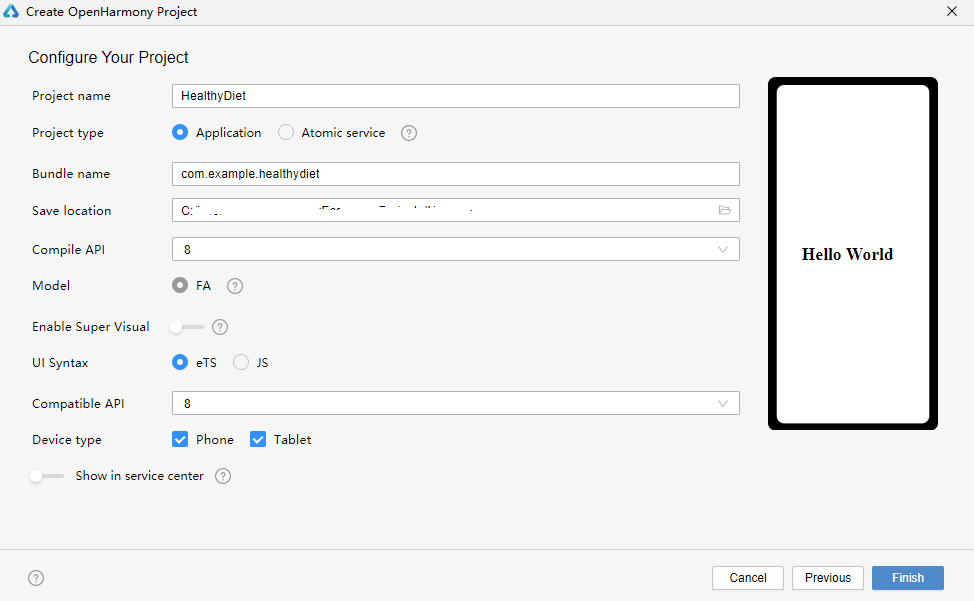
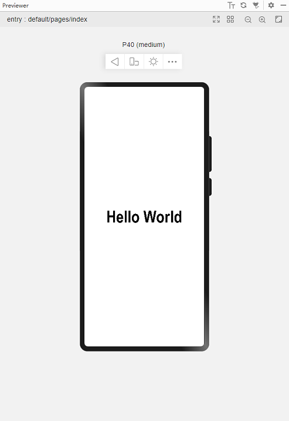
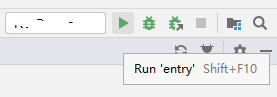
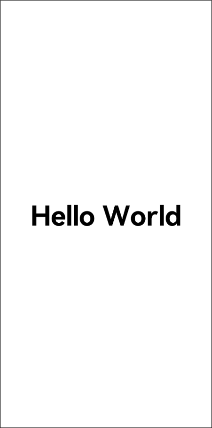

# 创建声明式UI工程


创建工程之前，首先需要安装DevEco Studio。


1. 打开DevEco Studio，点击Create Project。如果已有一个工程，则点击File &gt; New &gt; New project。
   

2. 
   进入选择ability template界面，选择[Standard]Empty Ability。

   

3. 
   安装OpenHarmony SDK。

   

4. 进入配置工程界面，将工程名字改为HealthyDiet，Project Type选择Application，Device Type选择Phone，Language选择eTS，选择兼容API Version 7。DevEco Studio会默认将工程保存在C盘，如果要更改工程保存位置，点击Save Location的文件夹图标，自行指定工程创建位置。配置完成后点击Finish。
   

   

5. 工程创建完成后，打开app.ets。
   app.ets提供了应用生命周期的接口：onCreate和onDestroy，分别在应用创建之初和应用被销毁时调用。在app.ets里可以声明全局变量，并且声明的数据和方法是整个应用共享的。
   ```
   export default {
       onCreate() {
           console.info('Application onCreate')
       },
       onDestroy() {
           console.info('Application onDestroy')
       },
   }
   ```

6. 在工程导航栏里，打开index.ets。该页面展示了当前的UI描述，声明式UI框架会自动生成一个组件化的struct，这个struct遵循Builder接口声明，在build方法里面声明当前的布局和组件。
   ```
   @Entry
   @Component
   struct MyComponent  {
     build() {
       Flex({ direction: FlexDirection.Column, alignItems: ItemAlign.Center, justifyContent: FlexAlign.Center }) {
         Text('Hello World')
           .fontSize(50)
           .fontWeight(FontWeight.Bold)
       }
       .width('100%')
       .height('100%')
     }
   }
   ```

7. 点击右侧的Previewer按钮，打开预览窗口。可以看到在手机设备类型的预览窗口中“Hello World”居中加粗显示。
   如果没有Previewer按钮，点击settings &gt; SDK Manager &gt;  OpenHarmony SDK&gt; Tools 查看是否安装了Previewer。

   

8. 应用安装到手机上运行应用。将手机连接电脑，等IDE识别到物理设备后，点击Run 'entry'按钮。
   

   在安装之前，需要[配置应用签名](https://developer.harmonyos.com/cn/docs/documentation/doc-guides/ohos-debugging-and-running-0000001263040487#section17660437768)。安装成功后，点击屏幕上的Run图标打开应用，可以看到居中加粗显示的“Hello World”。

   
