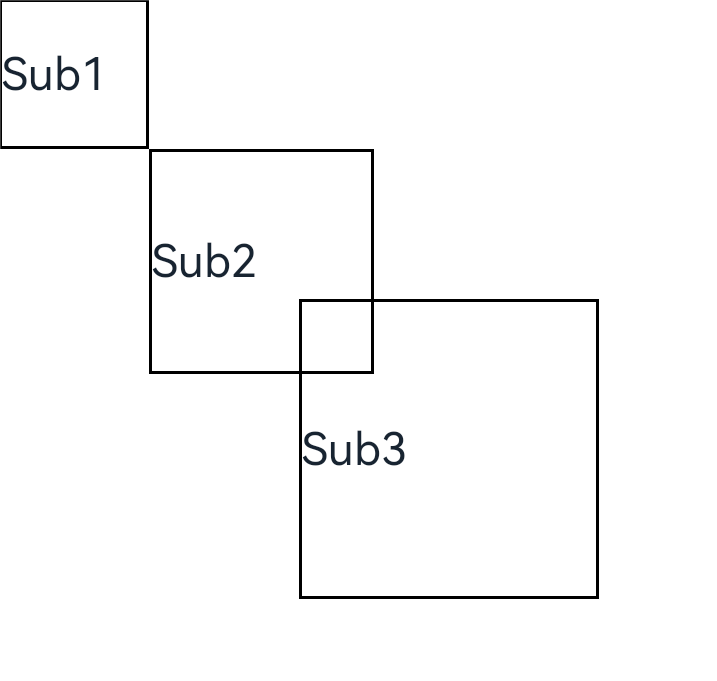

# 自定义组件的生命周期

自定义组件的生命周期回调函数用于通知用户该自定义组件的生命周期，这些回调函数是私有的，在运行时由开发框架在特定的时间进行调用，不能从应用程序中手动调用这些回调函数。

> **说明：**
>
> - 允许在生命周期函数中使用Promise和异步回调函数，比如网络资源获取，定时器设置等；
>
> - 不允许在生命周期函数中使用async await。


## aboutToAppear

aboutToAppear?(): void

aboutToAppear函数在创建自定义组件的新实例后，在执行其build函数之前执行。允许在aboutToAppear函数中改变状态变量，更改将在后续执行build函数中生效。

## aboutToDisappear

aboutToDisappear?(): void

aboutToDisappear函数在自定义组件析构销毁之前执行。不允许在aboutToDisappear函数中改变状态变量，特别是@Link变量的修改可能会导致应用程序行为不稳定。

**示例1：** 

```ts
// xxx.ets
@Entry
@Component
struct CountDownTimerComponent {
  @State countDownFrom: number = 10
  private timerId: number = -1

  aboutToAppear(): void {
    this.timerId = setInterval(() => {
      if (this.countDownFrom <= 1) {
        clearTimeout(this.timerId)  // countDownFrom小于等于1时清除计时器
      }
      this.countDownFrom -= 1
    }, 1000) // countDownFrom每1s减1
  }

  aboutToDisappear(): void {
    if (this.timerId > 0) {
      clearTimeout(this.timerId)
      this.timerId = -1
    }
  }

  build() {
    Column() {
      Text(`${this.countDownFrom} sec left`)
        .fontSize(30)
        .margin(30)
    }.width('100%')
  }
}
```


上述示例表明，生命周期函数对于允许CountDownTimerComponent管理其计时器资源至关重要，类似的函数也包括异步从网络请求加载资源。

## onPageShow

onPageShow?(): void

页面每次显示时触发一次，包括路由过程、应用进入前后台等场景，仅@Entry修饰的自定义组件生效。

## onPageHide

onPageHide?(): void

页面每次隐藏时触发一次，包括路由过程、应用进入前后台等场景，仅@Entry修饰的自定义组件生效。

## onBackPress

onBackPress?(): void

当用户点击返回按钮时触发，仅@Entry修饰的自定义组件生效。返回true表示页面自己处理返回逻辑，不进行页面路由，返回false表示使用默认的路由返回逻辑。不设置返回值按照false处理。

**示例2：** 

```ts
// xxx.ets
@Entry
@Component
struct IndexComponent {
  @State textColor: Color = Color.Black

  onPageShow() {
    this.textColor = Color.Blue
    console.info('IndexComponent onPageShow')
  }

  onPageHide() {
    this.textColor = Color.Transparent
    console.info('IndexComponent onPageHide')
  }

  onBackPress() {
    this.textColor = Color.Red
    console.info('IndexComponent onBackPress')
  }

  build() {
    Column() {
      Text('Hello World')
        .fontColor(this.textColor)
        .fontSize(30)
        .margin(30)
    }.width('100%')
  }
}
```


## onLayout<sup>9+</sup>

onLayout?(children: Array\<LayoutChild\>, constraint: ConstraintSizeOptions): void

框架会在自定义组件布局时，将该自定义组件的子节点信息和自身的尺寸范围通过onLayout传递给该自定义组件。不允许在onLayout函数中改变状态变量。

**参数：**

| 参数名     | 类型                                                                             | 说明                   |
| ---------- | -------------------------------------------------------------------------------- | ---------------------- |
| children   | Array\<[LayoutChild](#layoutchild9)\>                                            | 子组件布局信息。       |
| constraint | [ConstraintSizeOptions](../reference/arkui-ts/ts-types.md#constraintsizeoptions) | 父组件constraint信息。 |

## onMeasure<sup>9+</sup>

onMeasure?(children: Array\<LayoutChild\>, constraint: ConstraintSizeOptions): void

框架会在自定义组件确定尺寸时，将该自定义组件的子节点信息和自身的尺寸范围通过onMeasure传递给该自定义组件。不允许在onMeasure函数中改变状态变量。

**参数：**

| 参数名     | 类型                                                                             | 说明                   |
| ---------- | -------------------------------------------------------------------------------- | ---------------------- |
| children   | Array\<[LayoutChild](#layoutchild9)\>                                            | 子组件布局信息。       |
| constraint | [ConstraintSizeOptions](../reference/arkui-ts/ts-types.md#constraintsizeoptions) | 父组件constraint信息。 |

## LayoutChild<sup>9+</sup>

子组件布局信息。

| 参数       | 参数类型                                                                                                    | 描述                                   |
| ---------- | ----------------------------------------------------------------------------------------------------------- | -------------------------------------- |
| name       | string                                                                                                      | 子组件名称。                           |
| id         | string                                                                                                      | 子组件id。                             |
| constraint | [ConstraintSizeOptions](../reference/arkui-ts/ts-types.md#constraintsizeoptions)                            | 子组件约束尺寸。                       |
| borderInfo | [LayoutBorderInfo](#layoutborderinfo9)                                                                      | 子组件border信息。                     |
| position   | [Position](../reference/arkui-ts/ts-types.md#position)                                                      | 子组件位置坐标。                       |
| measure    | (childConstraint: [ConstraintSizeOptions](../reference/arkui-ts/ts-types.md#constraintsizeoptions)) => void | 调用此方法对子组件的尺寸范围进行限制。 |
| layout     | (LayoutInfo： [LayoutInfo](#layoutinfo9)) => void                                                           | 调用此方法对子组件的位置信息进行限制。 |

## LayoutBorderInfo<sup>9+</sup>

子组件border信息。

| 参数        | 参数类型                                                   | 描述                                           |
| ----------- | ---------------------------------------------------------- | ---------------------------------------------- |
| borderWidth | [EdgeWidths](../reference/arkui-ts/ts-types.md#edgewidths) | 边框宽度类型，用于描述组件边框不同方向的宽度。 |
| margin      | [Margin](../reference/arkui-ts/ts-types.md#margin)         | 外边距类型，用于描述组件不同方向的外边距。     |
| padding     | [Padding](../reference/arkui-ts/ts-types.md#padding)       | 内边距类型，用于描述组件不同方向的内边距。     |

## LayoutInfo<sup>9+</sup>

子组件layout信息。

| 参数       | 参数类型                                                                         | 描述             |
| ---------- | -------------------------------------------------------------------------------- | ---------------- |
| position   | [Position](../reference/arkui-ts/ts-types.md#position)                           | 子组件位置坐标。 |
| constraint | [ConstraintSizeOptions](../reference/arkui-ts/ts-types.md#constraintsizeoptions) | 子组件约束尺寸。 |

**示例3：**

```ts
// xxx.ets
@Entry
@Component
struct Index {
  build() {
    Column() {
      CustomLayout() {
        ForEach([1, 2, 3], (index) => {
          Text('Sub' + index)
            .fontSize(30)
            .borderWidth(2)
        })
      }
    }
  }
}


@Component
struct CustomLayout {
  @BuilderParam builder: () => {}

  onLayout(children: Array<LayoutChild>, constraint: ConstraintSizeOptions) {
    let pos = 0
    children.forEach((child) => {
      child.layout({ position: { x: pos, y: pos }, constraint: constraint })
      pos += 100
    })
  }

  onMeasure(children: Array<LayoutChild>, constraint: ConstraintSizeOptions) {
    let size = 100
    children.forEach((child) => {
      child.measure({ minHeight: size, minWidth: size, maxWidth: size, maxHeight: size })
      size += 50
    })
  }

  build() {
    this.builder()
  }
}
```


