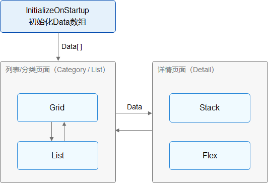

# 开发说明

本指导将从以下三个部分介绍构建健康饮食应用，其主要功能为查看食物的营养信息。具体信息如下：

1. Food Detail：[构建食物基本信息页面](../ui/ui-ts-creating-simple-page.md)。

2. Food Category/List：[构建食物列表和分类展示页面](../ui/ui-ts-building-data-model.md)。

从工程创建，构建普通视图开始，逐步学习学习组件、布局、动效和数据状态管理，在了解到这些知识后，开发者将有能力自主设计和开发应用。简单的学习成本，功能完备的UI开发，我们现在就开始吧。

