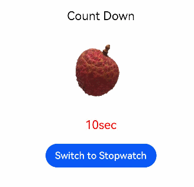

# 声明式UI开发指导

## 开发说明

| 任务                   | 简介                                                         | 相关资源                                                     |
| ---------------------- | ------------------------------------------------------------ | ------------------------------------------------------------ |
| 准备开发环境           | 了解声明式UI的工程结构。<br>了解资源分类与访问。             | [OpenHarmony工程介绍](https://developer.harmonyos.com/cn/docs/documentation/doc-guides/ohos-project-overview-0000001218440650)<br>[资源分类与访问](../quick-start/resource-categories-and-access.md) |
| 学习ArkTS语言          | ArkTS是HarmonyOS优选的主力应用开发语言，当前，ArkTS在TS基础上主要扩展了声明式UI能力。 | [学习ArkTS语言](../quick-start/arkts-get-started.md)         |
| 开发页面               | 根据页面的使用场景，选择合适的布局。<br>根据页面需要实现的内容，添加系统内置组件，并修改组件样式。<br>更新页面内容，丰富页面展现形式。 | [创建页面](#创建页面)<br>        [常见布局开发指导](ui-ts-layout-linear.md)<br>        [常见组件说明](ui-ts-components-intro.md)<br>[修改组件样式](#修改组件样式)<br>[更新页面内容](#更新页面内容) |
| （可选）页面多样化     | 绘图和动画。                                                 | [绘图组件](../reference/arkui-ts/ts-drawing-components-circle.md)<br>[画布组件](../reference/arkui-ts/ts-components-canvas-canvas.md)<br>[动画](../reference/arkui-ts/ts-animatorproperty.md) |
| （可选）页面之间的跳转 | 使用页面路由实现多个页面之前的跳转。                         | [页面路由](../reference/apis/js-apis-router.md)              |
| （可选）性能提升       | 避免低性能代码对应用的性能造成负面影响。                     | [性能提升的推荐方法](ui-ts-performance-improvement-recommendation.md) |

## 创建页面

请先根据页面预期效果选择布局结构创建页面，并在页面中添加基础的系统内置组件。下述示例采用了[弹性布局（Flex）](ui-ts-layout-flex.md)，对页面中的Text组件进行横纵向居中布局显示。

   ```ts
    // xxx.ets
    @Entry
    @Component
    struct MyComponent {
      build() {
        Flex({ direction: FlexDirection.Column, alignItems: ItemAlign.Center, justifyContent: FlexAlign.Center }) {
          Text('Hello')
        }        
        .width('100%')
        .height('100%')
      }
    }
   ```

## 修改组件样式

在页面中添加系统内置组件时，若不设置属性方法，则会显示其默认样式。通过更改组件的属性样式或者组件支持的[通用属性](../reference/arkui-ts/ts-universal-attributes-size.md)样式，改变组件的UI显示。

1. 通过修改Text组件的构造参数，将Text组件的显示内容修改为“Tomato”。
2. 修改Text组件的fontSize属性更改组件的字体大小，将字体大小设置为26，通过fontWeight属性更改字体粗细，将其设置为500。

   ```ts
    // xxx.ets
    @Entry
    @Component
    struct MyComponent {
      build() {
        Flex({ direction: FlexDirection.Column, alignItems: ItemAlign.Center, justifyContent: FlexAlign.Center }) {
          Text('Tomato')
            .fontSize(26)
            .fontWeight(500)
        }
        .width('100%')
        .height('100%')
      }
    }
   ```

   

## 更新页面内容

在创建基本的页面之后，可根据组件的状态来更新页面内容。以下示例展示了简单的更新页面方法。

> **说明：** 
>
> 更新组件的状态之前，请先初始化组件的成员变量。自定义组件的成员变量可以通过[本地初始化](../quick-start/arkts-restrictions-and-extensions.md#自定义组件成员变量初始化的方式与约束)和[在构造组件时通过构造参数初始化](../quick-start/arkts-restrictions-and-extensions.md#自定义组件成员变量初始化的方式与约束)两种方式实现，具体允许哪种方式取决于该变量所使用的装饰器。

**示例：**

```ts
// xxx.ets
@Entry
@Component
struct ParentComp {
  @State isCountDown: boolean = true

  build() {
    Column() {
      Text(this.isCountDown ? 'Count Down' : 'Stopwatch').fontSize(20).margin(20)
      if (this.isCountDown) {
        // 图片资源放在media目录下
        Image($r("app.media.countdown")).width(120).height(120)
        TimerComponent({ counter: 10, changePerSec: -1, showInColor: Color.Red })
      } else {
        // 图片资源放在media目录下
        Image($r("app.media.stopwatch")).width(120).height(120)
        TimerComponent({ counter: 0, changePerSec: +1, showInColor: Color.Black })
      }
      Button(this.isCountDown ? 'Switch to Stopwatch' : 'Switch to Count Down')
        .onClick(() => {
          this.isCountDown = !this.isCountDown
        })
    }.width('100%')
  }
}

// 自定义计时器/倒计时组件
@Component
struct TimerComponent {
  @State counter: number = 0
  private changePerSec: number = -1
  private showInColor: Color = Color.Black
  private timerId: number = -1

  build() {
    Text(`${this.counter}sec`)
      .fontColor(this.showInColor)
      .fontSize(20)
      .margin(20)
  }

  aboutToAppear() {
    this.timerId = setInterval(() => {
      this.counter += this.changePerSec
    }, 1000)
  }

  aboutToDisappear() {
    if (this.timerId > 0) {
      clearTimeout(this.timerId)
      this.timerId = -1
    }
  }
}
```



**初始创建和渲染：**

1. 创建父组件ParentComp；

2. 本地初始化ParentComp的状态变量isCountDown；

3. 执行ParentComp的build函数；

4. 创建Column组件；
   1. 创建Text组件，设置其文本展示内容，并将Text组件实例添加到Column中；
   2. 判断if条件，创建true条件下的元素；
       1. 创建Image组件，并设置其图片源地址；
       2. 使用给定的构造函数创建TimerComponent；
   3. 创建Button内置组件，设置相应的内容。

**状态更新：**

用户单击按钮时：

1. ParentComp的isCountDown状态变量的值更改为false；

2. 执行ParentComp的build函数；

3. Column组件被重用并执行重新初始化；

4. Column的子组件会重用内存中的对象，但会进行重新初始化；
   1. Text组件会被重用，但使用新的文本内容进行重新初始化；
   2. 判断if条件，使用false条件下的元素；
       1. 原来true条件的组件不再使用，将这些组件销毁；
       2. 创建false条件下的组件；
   3. 重用Button组件，使用新的图片源地址。