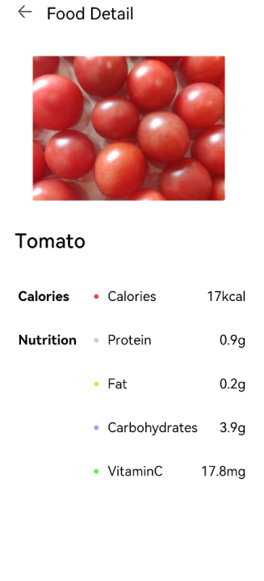
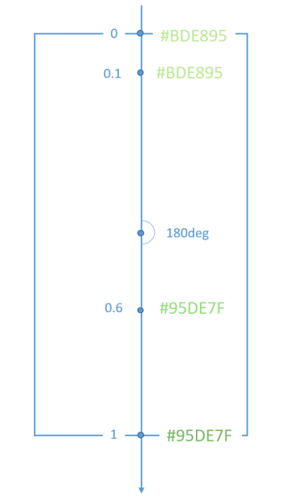
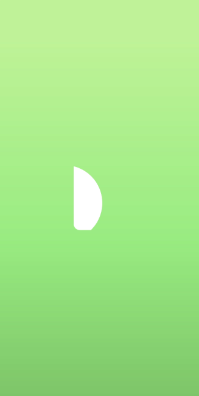
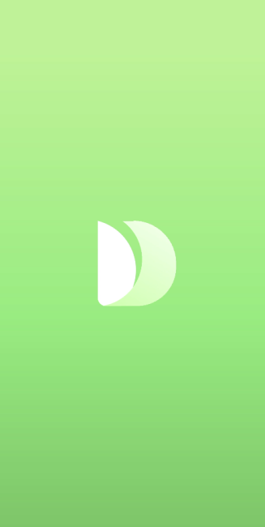

# 绘制图形

绘制能力主要是通过框架提供的绘制组件来支撑，支持svg标准绘制命令。

本节主要学习如何使用绘制组件，绘制详情页食物成分标签（基本几何图形）和应用Logo（自定义图形）。

## 绘制基本几何图形

绘制组件封装了一些常见的基本几何图形，比如矩形Rect、圆形Circle、椭圆形Ellipse等，为开发者省去了路线计算的过程。

FoodDetail页面的食物成分表里，给每一项成分名称前都加上一个圆形的图标作为成分标签。

1. 创建Circle组件，在每一项含量成分前增加一个圆形图标作为标签。设置Circle的直径为 6vp。修改FoodDetail页面的ContentTable组件里的IngredientItem方法，在成分名称前添加Circle。

   ```ts
   // FoodDetail.ets
   @Component
   struct ContentTable {
     private foodItem: FoodData
   
     @Builder IngredientItem(title:string, colorValue: string, name: string, value: string) {
       Flex() {
         Text(title)
           .fontSize(17.4)
           .fontWeight(FontWeight.Bold)
           .layoutWeight(1)
         Flex({ alignItems: ItemAlign.Center }) {
           Circle({width: 6, height: 6})
             .margin({right: 12})
             .fill(colorValue)
           Text(name)
             .fontSize(17.4)
             .flexGrow(1)
           Text(value)
             .fontSize(17.4)
         }
         .layoutWeight(2)
       }
     }
   
     build() {
       ......
     }
   }
   ```

2. 每个成分的标签颜色不一样，所以我们在build方法中，调用IngredientItem，给每个Circle填充不一样的颜色。

   ```ts
   // FoodDetail.ets
   @Component
   struct ContentTable {
     private foodItem: FoodData
   
     @Builder IngredientItem(title:string, colorValue: string, name: string, value: string) {
       Flex() {
         Text(title)
           .fontSize(17.4)
           .fontWeight(FontWeight.Bold)
           .layoutWeight(1)
         Flex({ alignItems: ItemAlign.Center }) {
           Circle({width: 6, height: 6})
             .margin({right: 12})
             .fill(colorValue)
           Text(name)
             .fontSize(17.4)
             .flexGrow(1)
           Text(value)
             .fontSize(17.4)
         }
         .layoutWeight(2)
       }
     }
   
     build() {
       Flex({ direction: FlexDirection.Column, justifyContent: FlexAlign.SpaceBetween, alignItems: ItemAlign.Start }) {
         this.IngredientItem('Calories', '#FFf54040', 'Calories', this.foodItem.calories + 'kcal')
         this.IngredientItem('Nutrition', '#FFcccccc', 'Protein', this.foodItem.protein + 'g')
         this.IngredientItem(' ', '#FFf5d640', 'Fat', this.foodItem.fat + 'g')
         this.IngredientItem(' ', '#FF9e9eff', 'Carbohydrates', this.foodItem.carbohydrates + 'g')
         this.IngredientItem(' ', '#FF53f540', 'VitaminC', this.foodItem.vitaminC + 'mg')
       }
       .height(280)
       .padding({ top: 30, right: 30, left: 30 })
     }
   }
   ```

   

## 绘制自定义几何图形

除绘制基础几何图形，开发者还可以使用Path组件来绘制自定义的路线，下面进行绘制应用的Logo图案。

1. 在pages文件夹下创建新的页面Logo.ets。

   

2. Logo.ets中删掉模板代码，创建Logo Component。

   ```ts
   @Entry
   @Component
   struct Logo {
     build() {
     }
   }
   ```
   
3. 创建Flex组件为根节点，宽高设置为100%，设置其在主轴方向和交叉轴方向的对齐方式都为Center，创建Shape组件为Flex子组件。

   Shape组件是所有绘制组件的父组件。如果需要组合多个绘制组件成为一个整体，需要创建Shape作为其父组件。

   我们要绘制的Logo的大小630px * 630px。声明式UI范式支持多种长度单位的设置，在前面的章节中，我们直接使用number作为参数，即采用了默认长度单位vp，虚拟像素单位。vp和设备分辨率以及屏幕密度有关。比如设备分辨率为1176 * 2400，屏幕基准密度（resolution）为3，vp = px / resolution，则该设备屏幕宽度是392vp。

   但是绘制组件采用svg标准，默认采取px为单位的，为方便统一，在这绘制Logo这一部分，统一采取px为单位。声明式UI框架同样也支持px单位，入参类型为string，设置宽度为630px，即210vp，设置方式为width('630px')或者width(210)。

   ```ts
   @Entry
   @Component
   struct Logo {
     build() {
       Flex({ alignItems: ItemAlign.Center, justifyContent: FlexAlign.Center }) {
         Shape() {
   
         }
         .height('630px')
         .width('630px')
       }
       .width('100%')
       .height('100%')
     }
   }
   ```

4. 给页面填充渐变色。设置为线性渐变，偏移角度为180deg，三段渐变 #BDE895 -->95DE7F --> #7AB967，其区间分别为[0, 0.1], (0.1, 0.6], (0.6, 1]。

   ```ts
   .linearGradient(
     {
       angle: 180,
       colors: [['#BDE895', 0.1], ["#95DE7F", 0.6],  ["#7AB967", 1]]
   })
   ```

   

   ```ts
   @Entry
   @Component
   struct Logo {
     build() {
       Flex({ alignItems: ItemAlign.Center, justifyContent: FlexAlign.Center }) {
         Shape() {
   
         }
         .height('630px')
         .width('630px')
       }
       .width('100%')
       .height('100%')
       .linearGradient(
       {
         angle: 180,
         colors: [['#BDE895', 0.1], ["#95DE7F", 0.6],  ["#7AB967", 1]]
       })
     }
   }
   ```

   

5. 绘制第一条路线Path，设置其绘制命令。

   ```ts
   Path()
     .commands('M162 128.7 a222 222 0 0 1 100.8 374.4 H198 a36 36 0 0 3 -36 -36')
   ```

   Path的绘制命令采用svg标准，上述命令可分解为：

   ```ts
   M162 128.7
   ```

   将笔触移动到（Moveto）坐标点(162, 128.7)。

   ```ts
   a222 222 0 0 1 100.8 374.4
   ```

   画圆弧线（elliptical arc）半径rx，ry为222，x轴旋转角度x-axis-rotation为0，角度大小large-arc-flag为0，即小弧度角，弧线方向（sweep-flag）为1，即逆时针画弧线，小写a为相对位置，即终点坐标为(162 + 100.8 = 262.8, 128.7 + 374.4 = 503.1)。

   ```ts
   H198
   ```

   画水平线（horizontal lineto）到198，即画(262.8, 503.1)到(198, 503.1)的水平线。

   ```ts
   a36 36 0 0 3 -36 -36
   ```

   画圆弧线（elliptical arc），含义同上，结束点为(198 - 36 = 162, 503.1 - 36 = 467.1)。

   ```ts
   V128.7
   ```

   画垂直线（vertical lineto）到128.7，即画(162, 467.1)到(162, 128.7)的垂直线。

   ```ts
   z
   ```

   关闭路径（closepath）。

   

   填充颜色为白色。

   ```ts
   .fill(Color.White)
   ```

   ```ts
   @Entry
   @Component
   struct Logo {
     build() {
       Flex({ alignItems: ItemAlign.Center, justifyContent: FlexAlign.Center }) {
         Shape() {
           Path()
             .commands('M162 128.7 a222 222 0 0 1 100.8 374.4 H198 a36 36 0 0 3 -36 -36')
             .fill(Color.White)
         }
         .height('630px')
         .width('630px')
       }
       .width('100%')
       .height('100%')
       .linearGradient(
         {
           angle: 180,
           colors: [['#BDE895', 0.1], ["#95DE7F", 0.6],  ["#7AB967", 1]]
         })
     }
   }
   ```

   

6. 在Shape组件内绘制第二个Path。第二条Path的背景色为渐变色，但是渐变色的填充是其整体的box，所以需要clip将其裁剪，入参为Shape，即按照Shape的形状进行裁剪。

   ```ts
   Path()
     .commands('M319.5 128.1 c103.5 0 187.5 84 187.5 187.5 v15 a172.5 172.5 0 0 3 -172.5 172.5 H198 a36 36 0 0 3 -13.8 -1 207 207 0 0 0 87 -372 h48.3 z')
     .fill('none')
     .linearGradient(
     {
       angle: 30,
       colors: [["#C4FFA0", 0],  ["#ffffff", 1]]
     })
     .clip(new Path().commands('M319.5 128.1 c103.5 0 187.5 84 187.5 187.5 v15 a172.5 172.5 0 0 3 -172.5 172.5 H198 a36 36 0 0 3 -13.8 -1 207 207 0 0 0 87 -372 h48.3 z'))
   ```

   Path的绘制命令比较长，可以将其作为组件的成员变量，通过this调用。

   ```ts
   @Entry
   @Component
   struct Logo {
     private pathCommands1:string = 'M319.5 128.1 c103.5 0 187.5 84 187.5 187.5 v15 a172.5 172.5 0 0 3 -172.5 172.5 H198 a36 36 0 0 3 -13.8 -1 207 207 0 0 0 87 -372 h48.3 z'
     build() {
       ......
           Path()
             .commands(this.pathCommands1)
             .fill('none')
             .linearGradient(
             {
               angle: 30,
               colors: [["#C4FFA0", 0],  ["#ffffff", 1]]
             })
             .clip(new Path().commands(this.pathCommands1))
        ......
     }
   }
   ```

   

7. 在Shape组件内绘制第二个Path。

   ```ts
   @Entry
   @Component
   struct Logo {
     private pathCommands1:string = 'M319.5 128.1 c103.5 0 187.5 84 187.5 187.5 v15 a172.5 172.5 0 0 3 -172.5 172.5 H198 a36 36 0 0 3 -13.8 -1 207 207 0 0 0 87 -372 h48.3 z'
     private pathCommands2:string = 'M270.6 128.1 h48.6 c51.6 0 98.4 21 132.3 54.6 a411 411 0 0 3 -45.6 123 c-25.2 45.6 -56.4 84 -87.6 110.4 a206.1 206.1 0 0 0 -47.7 -288 z'
     build() {
       Flex({ alignItems: ItemAlign.Center, justifyContent: FlexAlign.Center }) {
         Shape() {
           Path()
             .commands('M162 128.7 a222 222 0 0 1 100.8 374.4 H198 a36 36 0 0 3 -36 -36')
             .fill(Color.White)
   
           Path()
             .commands(this.pathCommands1)
             .fill('none')
             .linearGradient(
             {
               angle: 30,
               colors: [["#C4FFA0", 0],  ["#ffffff", 1]]
             })
             .clip(new Path().commands(this.pathCommands1))
   
           Path()
             .commands(this.pathCommands2)
             .fill('none')
             .linearGradient(
             {
               angle: 50,
               colors: [['#8CC36A', 0.1], ["#B3EB90", 0.4],  ["#ffffff", 0.7]]
             })
             .clip(new Path().commands(this.pathCommands2))
         }
         .height('630px')
         .width('630px')
       }
       .width('100%')
       .height('100%')
       .linearGradient(
         {
           angle: 180,
           colors: [['#BDE895', 0.1], ["#95DE7F", 0.6],  ["#7AB967", 1]]
         })
     }
   }
   ```

   

   完成应用Logo的绘制。Shape组合了三个Path组件，通过svg命令绘制出一个艺术的叶子，寓意绿色健康饮食方式。

8. 添加应用的标题和slogan。

   ```ts
   @Entry
   @Component
   struct Logo {
     private pathCommands1:string = 'M319.5 128.1 c103.5 0 187.5 84 187.5 187.5 v15 a172.5 172.5 0 0 3 -172.5 172.5 H198 a36 36 0 0 3 -13.8 -1 207 207 0 0 0 87 -372 h48.3 z'
     private pathCommands2:string = 'M270.6 128.1 h48.6 c51.6 0 98.4 21 132.3 54.6 a411 411 0 0 3 -45.6 123 c-25.2 45.6 -56.4 84 -87.6 110.4 a206.1 206.1 0 0 0 -47.7 -288 z'
     build() {
       Flex({ direction: FlexDirection.Column, alignItems: ItemAlign.Center, justifyContent: FlexAlign.Center }) {
         Shape() {
           Path()
             .commands('M162 128.7 a222 222 0 0 1 100.8 374.4 H198 a36 36 0 0 3 -36 -36')
             .fill(Color.White)
   
           Path()
             .commands(this.pathCommands1)
             .fill('none')
             .linearGradient(
             {
               angle: 30,
               colors: [["#C4FFA0", 0],  ["#ffffff", 1]]
             })
             .clip(new Path().commands(this.pathCommands1))
   
           Path()
             .commands(this.pathCommands2)
             .fill('none')
             .linearGradient(
             {
               angle: 50,
               colors: [['#8CC36A', 0.1], ["#B3EB90", 0.4],  ["#ffffff", 0.7]]
             })
             .clip(new Path().commands(this.pathCommands2))
         }
         .height('630px')
         .width('630px')
   
         Text('Healthy Diet')
           .fontSize(26)
           .fontColor(Color.White)
           .margin({ top:300 })
   
         Text('Healthy life comes from a balanced diet')
           .fontSize(17)
           .fontColor(Color.White)
           .margin({ top:4 })
       }
       .width('100%')
       .height('100%')
       .linearGradient(
         {
           angle: 180,
           colors: [['#BDE895', 0.1], ["#95DE7F", 0.6],  ["#7AB967", 1]]
         })
     }
   }
   ```

   