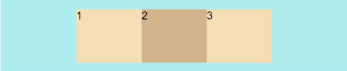
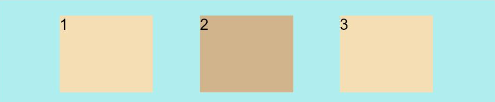
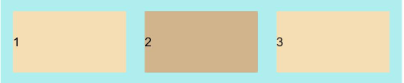

# 弹性布局


Flex组件用于创建弹性布局，开发者可以通过Flex的接口创建容器组件，进而对容器内的其他元素进行弹性布局，例如：使三个元素在容器内水平居中，垂直等间隔分散。


## 创建弹性布局

接口的调用形式如下：

`Flex(options?: { direction?: FlexDirection, wrap?: FlexWrap,  justifyContent?: FlexAlign, alignItems?: ItemAlign, alignContent?: FlexAlign })`
通过参数direction定义弹性布局的布局方向，justifyContent定义弹性布局方向上的子组件对齐方式， alignContent定义与布局方向垂直的方向上的子组件对齐方式，wrap定义内容超过一行时是否换行。

## 弹性布局方向

弹性布局有两个方向，子组件放置的方向是主轴，与主轴垂直的方向是交叉轴。通过direction参数设置容器主轴的方向，可选值有：

- FlexDirection.Row（默认值）：主轴为水平方向，子组件从起始端沿着水平方向开始排布。

  ```
  Flex({ direction: FlexDirection.Row }) {
    Text('1').width('33%').height(50).backgroundColor(0xF5DEB3)
    Text('2').width('33%').height(50).backgroundColor(0xD2B48C)
    Text('3').width('33%').height(50).backgroundColor(0xF5DEB3)
  }
  .height(70)
  .width('90%')
  .padding(10)
  .backgroundColor(0xAFEEEE)
  ```

  

- FlexDirection.RowReverse：主轴为水平方向，子组件从终点端沿着FlexDirection.Row相反的方向开始排布。

  ```
  Flex({ direction: FlexDirection.RowReverse }) {
    Text('1').width('33%').height(50).backgroundColor(0xF5DEB3)
    Text('2').width('33%').height(50).backgroundColor(0xD2B48C)
    Text('3').width('33%').height(50).backgroundColor(0xF5DEB3)
  }
  .height(70)
  .width('90%')
  .padding(10)
  .backgroundColor(0xAFEEEE)
  ```

  

- FlexDirection.Column：主轴为垂直方向，子组件从起始端沿着垂直方向开始排布。

  ```
  Flex({ direction: FlexDirection.Column }) {
    Text('1').width('100%').height(50).backgroundColor(0xF5DEB3)
    Text('2').width('100%').height(50).backgroundColor(0xD2B48C)
    Text('3').width('100%').height(50).backgroundColor(0xF5DEB3)
  }
  .height(70)
  .width('90%')
  .padding(10)
  .backgroundColor(0xAFEEEE)
  ```

  

- FlexDirection.ColumnReverse：主轴为垂直方向，子组件从终点端沿着FlexDirection.Column相反的方向开始排布。

  ```
  Flex({ direction: FlexDirection.ColumnReverse }) {
    Text('1').width('100%').height(50).backgroundColor(0xF5DEB3)
    Text('2').width('100%').height(50).backgroundColor(0xD2B48C)
    Text('3').width('100%').height(50).backgroundColor(0xF5DEB3)
  }
  .height(70)
  .width('90%')
  .padding(10)
  .backgroundColor(0xAFEEEE)
  ```

  


## 弹性布局换行

默认情况下，子组件在Flex容器中都排在一条线（又称"轴线"）上。通过wrap参数设置其他换行方式，可选值有：

- FlexWrap.NoWrap: 不换行。如果子元素的宽度总和大于父元素的宽度，则子元素会被压缩宽度。

  ```
  Flex({ wrap: FlexWrap.NoWrap }) {
    Text('1').width('50%').height(50).backgroundColor(0xF5DEB3)
    Text('2').width('50%').height(50).backgroundColor(0xD2B48C)
    Text('3').width('50%').height(50).backgroundColor(0xF5DEB3)
  } 
  .width('90%')
  .padding(10)
  .backgroundColor(0xAFEEEE)
  ```

  

- FlexWrap.Wrap：换行。

  ```
  Flex({ wrap: FlexWrap.Wrap }) {
    Text('1').width('50%').height(50).backgroundColor(0xF5DEB3)
    Text('2').width('50%').height(50).backgroundColor(0xD2B48C)
    Text('3').width('50%').height(50).backgroundColor(0xD2B48C)
  } 
  .width('90%')
  .padding(10)
  .backgroundColor(0xAFEEEE)
  ```

  

- FlexWrap.WrapReverse：换行，且与行排列方向相反。

  ```
  Flex({ wrap: FlexWrap.WrapReverse}) {
    Text('1').width('50%').height(50).backgroundColor(0xF5DEB3)
    Text('2').width('50%').height(50).backgroundColor(0xD2B48C)
    Text('3').width('50%').height(50).backgroundColor(0xF5DEB3)
  }
  .width('90%')
  .padding(10)
  .backgroundColor(0xAFEEEE)
  ```

  


## 弹性布局对齐方式


### 主轴对齐

可以通过justifyContent参数设置在主轴的对齐方式，可选值有：

- FlexAlign.Start: 元素在主轴方向首端对齐, 第一个元素与行首对齐，同时后续的元素与前一个对齐。

  ```
  Flex({ justifyContent: FlexAlign.Start }) {  
    Text('1').width('20%').height(50).backgroundColor(0xF5DEB3)  
    Text('2').width('20%').height(50).backgroundColor(0xD2B48C)   
    Text('3').width('20%').height(50).backgroundColor(0xF5DEB3)
  }
  .width('90%')
  .padding(10)
  .backgroundColor(0xAFEEEE)
  ```

  

- FlexAlign.Center: 元素在主轴方向中心对齐，第一个元素与行首的距离与最后一个元素与行尾距离相同。

  ```
  Flex({ justifyContent: FlexAlign.Center }) {  
    Text('1').width('20%').height(50).backgroundColor(0xF5DEB3)  
    Text('2').width('20%').height(50).backgroundColor(0xD2B48C)   
    Text('3').width('20%').height(50).backgroundColor(0xF5DEB3)
  }
  .width('90%')
  .padding(10)
  .backgroundColor(0xAFEEEE)
  ```

  

- FlexAlign.End: 元素在主轴方向尾部对齐,  最后一个元素与行尾对齐，其他元素与后一个对齐。

  ```
  Flex({ justifyContent: FlexAlign.End }) {  
    Text('1').width('20%').height(50).backgroundColor(0xF5DEB3)  
    Text('2').width('20%').height(50).backgroundColor(0xD2B48C)   
    Text('3').width('20%').height(50).backgroundColor(0xF5DEB3)
  }
  .width('90%')
  .padding(10)
  .backgroundColor(0xAFEEEE)
  ```

  

- FlexAlign.SpaceBetween: Flex主轴方向均匀分配弹性元素，相邻元素之间距离相同。 第一个元素与行首对齐，最后一个元素与行尾对齐。

  ```
  Flex({ justifyContent: FlexAlign.SpaceBetween }) {  
    Text('1').width('20%').height(50).backgroundColor(0xF5DEB3)  
    Text('2').width('20%').height(50).backgroundColor(0xD2B48C)   
    Text('3').width('20%').height(50).backgroundColor(0xF5DEB3)
  }
  .width('90%')
  .padding(10)
  .backgroundColor(0xAFEEEE)
  ```

  

- FlexAlign.SpaceAround: Flex主轴方向均匀分配弹性元素，相邻元素之间距离相同。 第一个元素到行首的距离和最后一个元素到行尾的距离是相邻元素之间距离的一半。

  ```
  Flex({ justifyContent: FlexAlign.SpaceAround }) {  
    Text('1').width('20%').height(50).backgroundColor(0xF5DEB3)  
    Text('2').width('20%').height(50).backgroundColor(0xD2B48C)   
    Text('3').width('20%').height(50).backgroundColor(0xF5DEB3)
  }
  .width('90%')
  .padding(10)
  .backgroundColor(0xAFEEEE)
  ```

  

- FlexAlign.SpaceEvenly: Flex主轴方向元素等间距布局， 相邻元素之间的间距、第一个元素与行首的间距、最后一个元素到行尾的间距都完全一样。

  ```
  Flex({ justifyContent: FlexAlign.SpaceEvenly }) {  
    Text('1').width('20%').height(50).backgroundColor(0xF5DEB3)  
    Text('2').width('20%').height(50).backgroundColor(0xD2B48C)   
    Text('3').width('20%').height(50).backgroundColor(0xF5DEB3)
  }
  .width('90%')
  .padding(10)
  .backgroundColor(0xAFEEEE)
  ```

  


### 交叉轴对齐

可以通过alignItems参数设置在交叉轴的对齐方式，可选值有：

- ItemAlign.Auto: 使用Flex容器中默认配置。

  ```
  Flex({ alignItems: ItemAlign.Auto }) {  
    Text('1').width('33%').height(30).backgroundColor(0xF5DEB3)  
    Text('2').width('33%').height(40).backgroundColor(0xD2B48C)  
    Text('3').width('33%').height(50).backgroundColor(0xF5DEB3)
  }
  .size({width: '90%', height: 80})
  .padding(10)
  .backgroundColor(0xAFEEEE)
  ```

  

- ItemAlign.Start: 交叉轴方向首部对齐。

  ```
  Flex({ alignItems: ItemAlign.Start }) {  
    Text('1').width('33%').height(30).backgroundColor(0xF5DEB3)  
    Text('2').width('33%').height(40).backgroundColor(0xD2B48C)  
    Text('3').width('33%').height(50).backgroundColor(0xF5DEB3)
  }
  .size({width: '90%', height: 80})
  .padding(10)
  .backgroundColor(0xAFEEEE)
  ```

  

- ItemAlign.Center: 交叉轴方向居中对齐。

  ```
  Flex({ alignItems: ItemAlign.Center }) {  
    Text('1').width('33%').height(30).backgroundColor(0xF5DEB3)  
    Text('2').width('33%').height(40).backgroundColor(0xD2B48C)  
    Text('3').width('33%').height(50).backgroundColor(0xF5DEB3)
  }
  .size({width: '90%', height: 80})
  .padding(10)
  .backgroundColor(0xAFEEEE)
  ```

  

- ItemAlign.End：交叉轴方向底部对齐。

  ```
  Flex({ alignItems: ItemAlign.End }) {  
    Text('1').width('33%').height(30).backgroundColor(0xF5DEB3)  
    Text('2').width('33%').height(40).backgroundColor(0xD2B48C)  
    Text('3').width('33%').height(50).backgroundColor(0xF5DEB3)
  }
  .size({width: '90%', height: 80})
  .padding(10)
  .backgroundColor(0xAFEEEE)
  ```

  

- ItemAlign.Stretch：交叉轴方向拉伸填充，在未设置尺寸时，拉伸到容器尺寸。

  ```
  Flex({ alignItems: ItemAlign.Stretch }) {  
    Text('1').width('33%').height(30).backgroundColor(0xF5DEB3)  
    Text('2').width('33%').height(40).backgroundColor(0xD2B48C)  
    Text('3').width('33%').height(50).backgroundColor(0xF5DEB3)
  }
  .size({width: '90%', height: 80})
  .padding(10)
  .backgroundColor(0xAFEEEE)
  ```

  

- ItemAlign.Baseline：交叉轴方向文本基线对齐。

  ```
  Flex({ alignItems: ItemAlign.Baseline }) {  
    Text('1').width('33%').height(30).backgroundColor(0xF5DEB3)  
    Text('2').width('33%').height(40).backgroundColor(0xD2B48C)  
    Text('3').width('33%').height(50).backgroundColor(0xF5DEB3)
  }
  .size({width: '90%', height: 80})
  .padding(10)
  .backgroundColor(0xAFEEEE)
  ```

  


### 内容对齐

可以通过alignContent参数设置在换行组件的行在交叉轴剩余空间内的对齐方式，可选值有：

- FlexAlign.Start: 左对齐。

- FlexAlign.Center: 居中对齐。

- FlexAlign.End: 右对齐。

- FlexAlign.SpaceBetween:  flex items之间的距离相等，与main start、main end两端对齐。

- FlexAlign.SpaceAround:  flex items之间的距离相等，flex items与main start、main end之间的距离等于flex items之间距离的一半。

- FlexAlign.SpaceEvenly:  flex items之间的距离相等，flex items与main start、main end之间的距离等于flex items之间的距离。


## 场景示例

  可使用弹性布局做出子元素排列方式为水平方向排列，且子元素的总宽度超出父元素的宽度不换行，子元素在水平方向两端对齐，中间间距由除首尾外的子元素平分，竖直方向上子元素居中的效果。

```
@Entry
@Component
struct FlexExample {
  build() {
    Column() {
      Column({ space: 5 }) {
        Flex({ direction: FlexDirection.Row, wrap: FlexWrap.NoWrap, justifyContent: FlexAlign.SpaceBetween, alignItems: ItemAlign.Center }) {
          Text('1').width('30%').height(50).backgroundColor(0xF5DEB3)
          Text('2').width('30%').height(50).backgroundColor(0xD2B48C)
          Text('3').width('30%').height(50).backgroundColor(0xF5DEB3)
        }
        .height(70)
        .width('90%')
        .padding(10)
        .backgroundColor(0xAFEEEE)
      }.width('100%').margin({ top: 5 })
    }.width('100%') 
 }
}
```



