# 弹性布局

弹性布局（Flex布局）是自适应布局中使用最为灵活的布局。弹性布局提供一种更加有效的方式来对容器中的子组件进行排列、对齐和分配空白空间。弹性布局


- 容器: [Flex组件](../reference/arkui-ts/ts-container-flex.md)作为Flex布局的容器，用于设置布局相关属性。
- 子组件: Flex组件内的子组件自动成为布局的子组件。
- 主轴: 水平方向的轴线，子组件默认沿着主轴排列。主轴开始的位置称为主轴起始端，结束位置称为主轴终点端。
- 交叉轴: 垂直方向的轴线。交叉始的位置称为主轴首部，结束位置称为交叉轴尾部。

    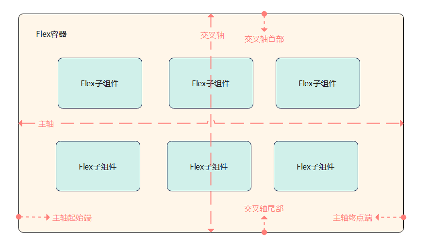

## 容器组件属性

通过Flex组件提供的Flex接口创建弹性布局。如下：

`Flex(options?: { direction?: FlexDirection, wrap?: FlexWrap,  justifyContent?: FlexAlign, alignItems?: ItemAlign, alignContent?: FlexAlign })`


### 弹性布局方向
参数direction决定主轴的方向，即子组件的排列方向。可选值有：

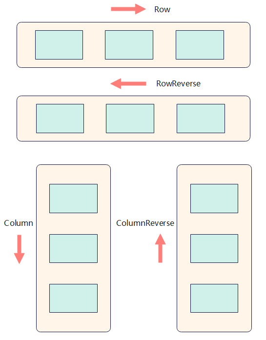

- FlexDirection.Row（默认值）：主轴为水平方向，子组件从起始端沿着水平方向开始排布。

    ```ts
    Flex({ direction: FlexDirection.Row }) {
      Text('1').width('33%').height(50).backgroundColor(0xF5DEB3)
      Text('2').width('33%').height(50).backgroundColor(0xD2B48C)
      Text('3').width('33%').height(50).backgroundColor(0xF5DEB3)
    }
    .height(70)
    .width('90%')
    .padding(10)
    .backgroundColor(0xAFEEEE)
    ```
    

- FlexDirection.RowReverse：主轴为水平方向，子组件从终点端沿着FlexDirection. Row相反的方向开始排布。

    ```ts
    Flex({ direction: FlexDirection.RowReverse }) {
      Text('1').width('33%').height(50).backgroundColor(0xF5DEB3)
      Text('2').width('33%').height(50).backgroundColor(0xD2B48C)
      Text('3').width('33%').height(50).backgroundColor(0xF5DEB3)
    }
    .height(70)
    .width('90%')
    .padding(10)
    .backgroundColor(0xAFEEEE)
    ```

    

- FlexDirection.Column：主轴为垂直方向，子组件从起始端沿着垂直方向开始排布。

    ```ts
    Flex({ direction: FlexDirection.Column }) {
      Text('1').width('100%').height(50).backgroundColor(0xF5DEB3)
      Text('2').width('100%').height(50).backgroundColor(0xD2B48C)
      Text('3').width('100%').height(50).backgroundColor(0xF5DEB3)
    }
    .height(70)
    .width('90%')
    .padding(10)
    .backgroundColor(0xAFEEEE)
    ```

    

- FlexDirection.ColumnReverse：主轴为垂直方向，子组件从终点端沿着FlexDirection. Column相反的方向开始排布。

    ```ts
    Flex({ direction: FlexDirection.ColumnReverse }) {
      Text('1').width('100%').height(50).backgroundColor(0xF5DEB3)
      Text('2').width('100%').height(50).backgroundColor(0xD2B48C)
      Text('3').width('100%').height(50).backgroundColor(0xF5DEB3)
    }
    .height(70)
    .width('90%')
    .padding(10)
    .backgroundColor(0xAFEEEE)
    ```

    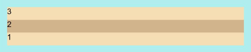

### 弹性布局换行

默认情况下，子组件在Flex容器中都排在一条线（又称"轴线"）上。通过wrap参数设置子组件换行方式。可选值有：

- FlexWrap. NoWrap（默认值）: 不换行。如果子组件的宽度总和大于父元素的宽度，则子组件会被压缩宽度。

    ```ts
    Flex({ wrap: FlexWrap.NoWrap }) {
      Text('1').width('50%').height(50).backgroundColor(0xF5DEB3)
      Text('2').width('50%').height(50).backgroundColor(0xD2B48C)
      Text('3').width('50%').height(50).backgroundColor(0xF5DEB3)
    } 
    .width('90%')
    .padding(10)
    .backgroundColor(0xAFEEEE)
    ```
    
    

- FlexWrap. Wrap：换行，每一行子组件按照主轴方向排列。

    ```ts
    Flex({ wrap: FlexWrap.Wrap }) {
      Text('1').width('50%').height(50).backgroundColor(0xF5DEB3)
      Text('2').width('50%').height(50).backgroundColor(0xD2B48C)
      Text('3').width('50%').height(50).backgroundColor(0xD2B48C)
    } 
    .width('90%')
    .padding(10)
    .backgroundColor(0xAFEEEE)
    ```
    
    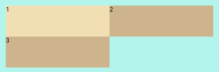

- FlexWrap. WrapReverse：换行，每一行子组件按照主轴反方向排列。

    ```ts
    Flex({ wrap: FlexWrap.WrapReverse}) {
      Text('1').width('50%').height(50).backgroundColor(0xF5DEB3)
      Text('2').width('50%').height(50).backgroundColor(0xD2B48C)
      Text('3').width('50%').height(50).backgroundColor(0xF5DEB3)
    }
    .width('90%')
    .padding(10)
    .backgroundColor(0xAFEEEE)
    ```
    
    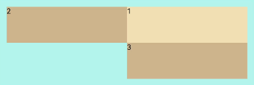

### 弹性布局对齐方式

#### 主轴对齐

通过justifyContent参数设置在主轴方向的对齐方式，存在下面六种情况：

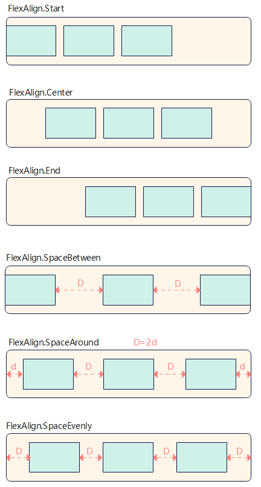

- FlexAlign.Start（默认值）: 子组件在主轴方向起始端对齐, 第一个子组件与父元素边沿对齐，其他元素与前一个元素对齐。

    ```ts
    Flex({ justifyContent: FlexAlign.Start }) {  
      Text('1').width('20%').height(50).backgroundColor(0xF5DEB3)
      Text('2').width('20%').height(50).backgroundColor(0xD2B48C)    
      Text('3').width('20%').height(50).backgroundColor(0xF5DEB3)
    }
    .width('90%')
    .padding({ top: 10, bottom: 10 })
    .backgroundColor(0xAFEEEE)
    ```
    
    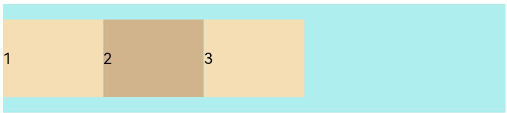

- FlexAlign.Center: 子组件在主轴方向居中对齐。

    ```ts
    Flex({ justifyContent: FlexAlign.Center }) {  
      Text('1').width('20%').height(50).backgroundColor(0xF5DEB3)  
      Text('2').width('20%').height(50).backgroundColor(0xD2B48C)   
      Text('3').width('20%').height(50).backgroundColor(0xF5DEB3)
    }
    .width('90%')
    .padding({ top: 10, bottom: 10 })
    .backgroundColor(0xAFEEEE)
    ```
    
    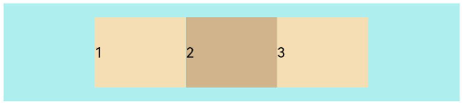

- FlexAlign.End: 子组件在主轴方向终点端对齐, 最后一个子组件与父元素边沿对齐，其他元素与后一个元素对齐。

    ```ts
    Flex({ justifyContent: FlexAlign.End }) {  
      Text('1').width('20%').height(50).backgroundColor(0xF5DEB3)  
      Text('2').width('20%').height(50).backgroundColor(0xD2B48C)   
      Text('3').width('20%').height(50).backgroundColor(0xF5DEB3)
    }
    .width('90%')
    .padding({ top: 10, bottom: 10 })
    .backgroundColor(0xAFEEEE)
    ```
    
    

- FlexAlign.SpaceBetween:  Flex主轴方向均匀分配弹性元素，相邻子组件之间距离相同。第一个子组件和最后一个子组件与父元素边沿对齐。

    ```ts
    Flex({ justifyContent: FlexAlign.SpaceBetween }) {  
      Text('1').width('20%').height(50).backgroundColor(0xF5DEB3)  
      Text('2').width('20%').height(50).backgroundColor(0xD2B48C)   
      Text('3').width('20%').height(50).backgroundColor(0xF5DEB3)
    }
    .width('90%')
    .padding({ top: 10, bottom: 10 })
    .backgroundColor(0xAFEEEE)
    ```
    
    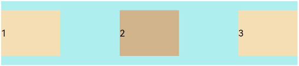

- FlexAlign.SpaceAround:  Flex主轴方向均匀分配弹性元素，相邻子组件之间距离相同。第一个子组件到主轴起始端的距离和最后一个子组件到主轴终点端的距离是相邻元素之间距离的一半。

    ```ts
    Flex({ justifyContent: FlexAlign.SpaceAround }) {  
      Text('1').width('20%').height(50).backgroundColor(0xF5DEB3)  
      Text('2').width('20%').height(50).backgroundColor(0xD2B48C)   
      Text('3').width('20%').height(50).backgroundColor(0xF5DEB3)
    }
    .width('90%')
    .padding({ top: 10, bottom: 10 })
    .backgroundColor(0xAFEEEE)
    ```
    
    

- FlexAlign.SpaceEvenly:  Flex主轴方向元素等间距布局，相邻子组件之间的间距、第一个子组件与主轴起始端的间距、最后一个子组件到主轴终点端的间距均相等。

    ```ts
    Flex({ justifyContent: FlexAlign.SpaceEvenly }) {  
      Text('1').width('20%').height(50).backgroundColor(0xF5DEB3)  
      Text('2').width('20%').height(50).backgroundColor(0xD2B48C)   
      Text('3').width('20%').height(50).backgroundColor(0xF5DEB3)
    }
    .width('90%')
    .padding({ top: 10, bottom: 10 })
    .backgroundColor(0xAFEEEE)
    ```
    
    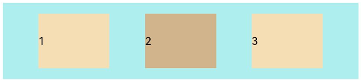

#### 交叉轴对齐

容器和子组件都可以设置交叉轴对齐方式，且子组件设置的对齐方式优先级较高。

##### 容器组件设置交叉轴对齐
可以通过Flex组件的alignItems参数设置子组件在交叉轴的对齐方式，可选值有：

- ItemAlign.Auto: 使用Flex容器中默认配置。

    ```ts
    Flex({ alignItems: ItemAlign.Auto }) {  
      Text('1').width('33%').height(30).backgroundColor(0xF5DEB3)  
      Text('2').width('33%').height(40).backgroundColor(0xD2B48C)  
      Text('3').width('33%').height(50).backgroundColor(0xF5DEB3)
    }
    .size({width: '90%', height: 80})
    .padding(10)
    .backgroundColor(0xAFEEEE)
    ```

    

- ItemAlign.Start: 交叉轴方向首部对齐。

    ```ts
    Flex({ alignItems: ItemAlign.Start }) {  
      Text('1').width('33%').height(30).backgroundColor(0xF5DEB3)  
      Text('2').width('33%').height(40).backgroundColor(0xD2B48C)  
      Text('3').width('33%').height(50).backgroundColor(0xF5DEB3)
    }
    .size({width: '90%', height: 80})
    .padding(10)
    .backgroundColor(0xAFEEEE)
    ```
    
    

- ItemAlign.Center: 交叉轴方向居中对齐。

    ```ts
    Flex({ alignItems: ItemAlign.Center }) {  
      Text('1').width('33%').height(30).backgroundColor(0xF5DEB3)  
      Text('2').width('33%').height(40).backgroundColor(0xD2B48C)  
      Text('3').width('33%').height(50).backgroundColor(0xF5DEB3)
    }
    .size({width: '90%', height: 80})
    .padding(10)
    .backgroundColor(0xAFEEEE)
    ```
    
    

- ItemAlign.End：交叉轴方向底部对齐。

    ```ts
    Flex({ alignItems: ItemAlign.End }) {  
      Text('1').width('33%').height(30).backgroundColor(0xF5DEB3)  
      Text('2').width('33%').height(40).backgroundColor(0xD2B48C)  
      Text('3').width('33%').height(50).backgroundColor(0xF5DEB3)
    }
    .size({width: '90%', height: 80})
    .padding(10)
    .backgroundColor(0xAFEEEE)
    ```
  
    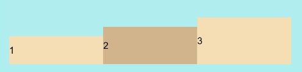

- ItemAlign.Stretch：交叉轴方向拉伸填充，在未设置尺寸时，拉伸到容器尺寸。

    ```ts
    Flex({ alignItems: ItemAlign.Stretch }) {  
      Text('1').width('33%').height(30).backgroundColor(0xF5DEB3)  
      Text('2').width('33%').height(40).backgroundColor(0xD2B48C)  
      Text('3').width('33%').height(50).backgroundColor(0xF5DEB3)
    }
    .size({width: '90%', height: 80})
    .padding(10)
    .backgroundColor(0xAFEEEE)
    ```
  
    

- ItemAlign. Baseline：交叉轴方向文本基线对齐。

    ```ts
    Flex({ alignItems: ItemAlign.Baseline }) {  
      Text('1').width('33%').height(30).backgroundColor(0xF5DEB3)  
      Text('2').width('33%').height(40).backgroundColor(0xD2B48C)  
      Text('3').width('33%').height(50).backgroundColor(0xF5DEB3)
    }
    .size({width: '90%', height: 80})
    .padding(10)
    .backgroundColor(0xAFEEEE)
    ```
    
    

##### 子组件设置交叉轴对齐
子组件的alignSelf属性也可以设置子组件在父容器交叉轴的对齐格式，且会覆盖Flex布局容器中alignItems默认配置。如下例所示：

```ts
Flex({ direction: FlexDirection.Row, alignItems: ItemAlign.Center }) { //容器组件设置子组件居中
  Text('alignSelf Start').width('25%').height(80)
    .alignSelf(ItemAlign.Start)
    .backgroundColor(0xF5DEB3)
  Text('alignSelf Baseline')
    .alignSelf(ItemAlign.Baseline)
    .width('25%')
    .height(80)
    .backgroundColor(0xD2B48C)
  Text('alignSelf Baseline').width('25%').height(100)
    .backgroundColor(0xF5DEB3)
    .alignSelf(ItemAlign.Baseline)
  Text('no alignSelf').width('25%').height(100)
    .backgroundColor(0xD2B48C)
  Text('no alignSelf').width('25%').height(100)
    .backgroundColor(0xF5DEB3)

}.width('90%').height(220).backgroundColor(0xAFEEEE)
```


上例中，Flex容器中alignItems设置交叉轴子组件的对齐方式为居中，子组件自身设置了alignSelf属性的情况，覆盖父组件的alignItem值，表现为alignSelf的定义。

#### 内容对齐

可以通过alignContent参数设置子组件各行在交叉轴剩余空间内的对齐方式，只在多行的flex布局中生效，可选值有：

- FlexAlign.Start: 子组件各行与交叉轴起点对齐。

    ```ts
    Flex({ justifyContent: FlexAlign.SpaceBetween, wrap: FlexWrap.Wrap, alignContent: FlexAlign.Start }) {
      Text('1').width('30%').height(20).backgroundColor(0xF5DEB3)
      Text('2').width('60%').height(20).backgroundColor(0xD2B48C)
      Text('3').width('40%').height(20).backgroundColor(0xD2B48C)
      Text('4').width('30%').height(20).backgroundColor(0xF5DEB3)
      Text('5').width('20%').height(20).backgroundColor(0xD2B48C)
    }
    .width('90%')
    .height(100)
    .backgroundColor(0xAFEEEE)          
    ```
    
    

- FlexAlign.Center: 子组件各行在交叉轴方向居中对齐。

    ```ts
    Flex({ justifyContent: FlexAlign.SpaceBetween, wrap: FlexWrap.Wrap, alignContent: FlexAlign.Center }) {
      Text('1').width('30%').height(20).backgroundColor(0xF5DEB3)
      Text('2').width('60%').height(20).backgroundColor(0xD2B48C)
      Text('3').width('40%').height(20).backgroundColor(0xD2B48C)
      Text('4').width('30%').height(20).backgroundColor(0xF5DEB3)
      Text('5').width('20%').height(20).backgroundColor(0xD2B48C)
    }
    .width('90%')
    .height(100)
    .backgroundColor(0xAFEEEE)          
    ```
    
    

- FlexAlign.End: 子组件各行与交叉轴终点对齐。

    ```ts
    Flex({ justifyContent: FlexAlign.SpaceBetween, wrap: FlexWrap.Wrap, alignContent: FlexAlign.End }) {
      Text('1').width('30%').height(20).backgroundColor(0xF5DEB3)
      Text('2').width('60%').height(20).backgroundColor(0xD2B48C)
      Text('3').width('40%').height(20).backgroundColor(0xD2B48C)
      Text('4').width('30%').height(20).backgroundColor(0xF5DEB3)
      Text('5').width('20%').height(20).backgroundColor(0xD2B48C)
    }
    .width('90%')
    .height(100)
    .backgroundColor(0xAFEEEE)          
    ```
    
    

- FlexAlign.SpaceBetween: 子组件各行与交叉轴两端对齐，各行间垂直间距平均分布。

    ```ts
    Flex({ justifyContent: FlexAlign.SpaceBetween, wrap: FlexWrap.Wrap, alignContent: FlexAlign.SpaceBetween }) {
      Text('1').width('30%').height(20).backgroundColor(0xF5DEB3)
      Text('2').width('60%').height(20).backgroundColor(0xD2B48C)
      Text('3').width('40%').height(20).backgroundColor(0xD2B48C)
      Text('4').width('30%').height(20).backgroundColor(0xF5DEB3)
      Text('5').width('20%').height(20).backgroundColor(0xD2B48C)
    }
    .width('90%')
    .height(100)
    .backgroundColor(0xAFEEEE)          
    ```
    
    

- FlexAlign.SpaceAround: 子组件各行间距相等，是元素首尾行与交叉轴两端距离的两倍。

    ```ts
    Flex({ justifyContent: FlexAlign.SpaceBetween, wrap: FlexWrap.Wrap, alignContent: FlexAlign.SpaceAround }) {
      Text('1').width('30%').height(20).backgroundColor(0xF5DEB3)
      Text('2').width('60%').height(20).backgroundColor(0xD2B48C)
      Text('3').width('40%').height(20).backgroundColor(0xD2B48C)
      Text('4').width('30%').height(20).backgroundColor(0xF5DEB3)
      Text('5').width('20%').height(20).backgroundColor(0xD2B48C)
    }
    .width('90%')
    .height(100)
    .backgroundColor(0xAFEEEE)          
    ```
    
    

- FlexAlign.SpaceEvenly:  子组件各行间距，子组件首尾行与交叉轴两端距离都相等。

    ```ts
    Flex({ justifyContent: FlexAlign.SpaceBetween, wrap: FlexWrap.Wrap, alignContent: FlexAlign.SpaceAround }) {
      Text('1').width('30%').height(20).backgroundColor(0xF5DEB3)
      Text('2').width('60%').height(20).backgroundColor(0xD2B48C)
      Text('3').width('40%').height(20).backgroundColor(0xD2B48C)
      Text('4').width('30%').height(20).backgroundColor(0xF5DEB3)
      Text('5').width('20%').height(20).backgroundColor(0xD2B48C)
    }
    .width('90%')
    .height(100)
    .backgroundColor(0xAFEEEE)          
    ```
    
    

### 弹性布局的自适应拉伸

在弹性布局父组件尺寸不够大的时候，通过子组件的下面几个属性设置其再父容器的占比，达到自适应布局能力。
- flexBasis: 设置子组件在父容器主轴方向上的基准尺寸。如果设置了该值，则子项占用的空间为设置的值；如果没设置或者为auto，那子项的空间为width/height的值。
  
  ```ts
  Flex() {
    Text('flexBasis("auto")')
      .flexBasis('auto') // 未设置width以及flexBasis值为auto，内容自身宽松
      .height(100)
      .backgroundColor(0xF5DEB3)
    Text('flexBasis("auto")'+' width("40%")')
      .width('40%')
      .flexBasis('auto') //设置width以及flexBasis值auto，使用width的值
      .height(100)
      .backgroundColor(0xD2B48C)
  
    Text('flexBasis(100)')  // 未设置width以及flexBasis值为100，宽度为100vp
      .flexBasis(100)  
      .height(100)
      .backgroundColor(0xF5DEB3)
  
    Text('flexBasis(100)')
      .flexBasis(100)
      .width(200) // flexBasis值为100，覆盖width的设置值，宽度为100vp
      .height(100)
      .backgroundColor(0xD2B48C)
  }.width('90%').height(120).padding(10).backgroundColor(0xAFEEEE)
  ```
  
  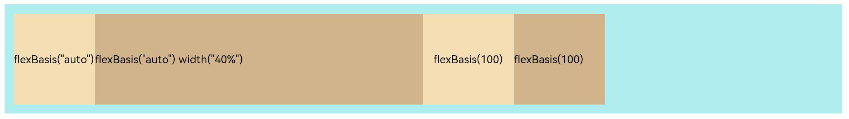

- flexGrow: 设置父容器的剩余空间分配给此属性所在组件的比例。用于"瓜分"父组件的剩余空间。

  ```ts
  Flex() {
    Text('flexGrow(1)')
      .flexGrow(2) 
      .width(100)
      .height(100)
      .backgroundColor(0xF5DEB3)
    
    Text('flexGrow(3)')
      .flexGrow(2)
      .width(100)
      .height(100)
      .backgroundColor(0xD2B48C)
  
    Text('no flexGrow')
      .width(100) 
      .height(100)
      .backgroundColor(0xF5DEB3)
  }.width(400).height(120).padding(10).backgroundColor(0xAFEEEE)
  ```
  
  

上图中，父容器宽度400vp, 三个子组件原始宽度为100vp，综合300vp，剩余空间100vp根据flexGrow值的占比分配给子组件，未设置flexGrow的子组件不参与“瓜分”。
第一个元素以及第二个元素以2:3分配剩下的100vp。第一个元素为100vp+100vp*2/5=140vp，第二个元素为100vp+100vp*3/5=160vp。

- flexShrink: 当父容器空间不足时，子组件的压缩比例。

  ```ts
  Flex({ direction: FlexDirection.Row }) {
    Text('flexShrink(3)')
      .flexShrink(3)
      .width(200)
      .height(100)
      .backgroundColor(0xF5DEB3)
    
    Text('no flexShrink')
      .width(200)
      .height(100)
      .backgroundColor(0xD2B48C)
  
    Text('flexShrink(2)')
      .flexShrink(2)
      .width(200)
      .height(100)
      .backgroundColor(0xF5DEB3)  
  }.width(400).height(120).padding(10).backgroundColor(0xAFEEEE) 
  ```
  
  

## 场景示例

使用弹性布局，可以实现子组件沿水平方向排列，两端对齐，子组件间距平分，竖直方向上子组件居中的效果。示例如下：

```ts
@Entry  
@Component
struct FlexExample {
  build() {
    Column() {
      Column({ space: 5 }) {
        Flex({ direction: FlexDirection.Row, wrap: FlexWrap.NoWrap, justifyContent: FlexAlign.SpaceBetween, alignItems: ItemAlign.Center }) {
          Text('1').width('30%').height(50).backgroundColor(0xF5DEB3)
          Text('2').width('30%').height(50).backgroundColor(0xD2B48C)
          Text('3').width('30%').height(50).backgroundColor(0xF5DEB3)
        }
        .height(70)
        .width('90%')
        .backgroundColor(0xAFEEEE)
      }.width('100%').margin({ top: 5 })
    }.width('100%') 
 }
}
```


## 相关实例

针对弹性布局开发，有以下相关实例可供参考：

- [弹性布局（ArkTS）（API8）](https://gitee.com/openharmony/codelabs/tree/master/ETSUI/FlowLayoutEts)

- [ArkUI常用布局容器对齐方式（ArkTS）（API9）](https://gitee.com/openharmony/codelabs/tree/master/ETSUI/LayoutAlignmentDemo)
