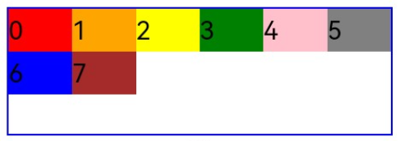
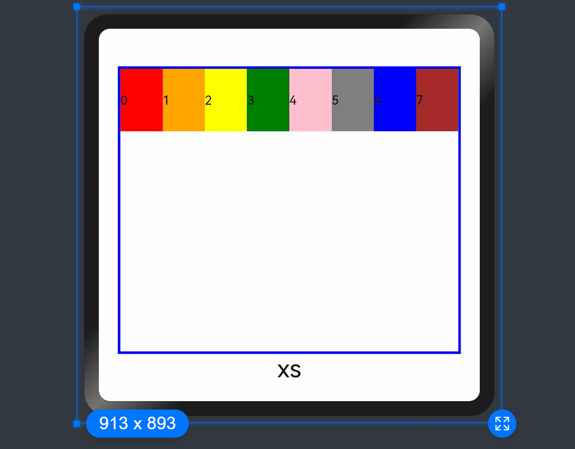
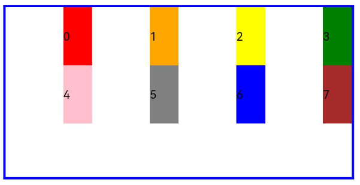
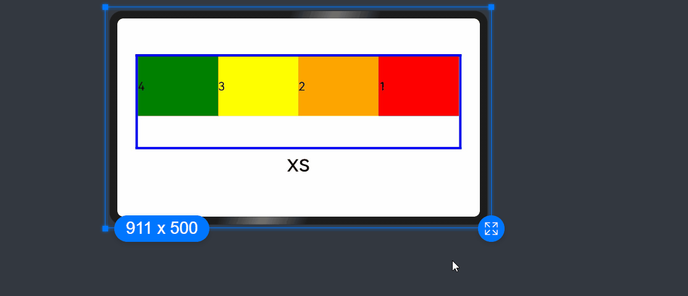

# 栅格布局

栅格系统作为一种辅助布局的定位工具，在平面设计和网站设计都起到了很好的作用，对移动设备的界面设计有较好的借鉴作用。总结栅格系统对于移动设备的优势主要有：

1. 给布局提供一种可循的规律，解决多尺寸多设备的动态布局问题。
2. 给系统提供一种统一的定位标注，保证各模块各设备的布局一致性。
3. 给应用提供一种灵活的间距调整方法，满足特殊场景布局调整的可能性。

推荐使用栅格组件[GridRow](../reference/arkui-ts/ts-container-gridrow.md)和[GridCol](../reference/arkui-ts/ts-container-gridcol.md)来实现栅格布局效果，
相对于目前已废弃的[GridContainer](../reference/arkui-ts/ts-container-gridcontainer.md)组件，GridRow和GridCol提供了更灵活、更全面的栅格系统实现方案。GridRow为栅格容器组件，只能与栅格子组件GridCol在栅格布局场景中使用。


## 栅格容器GridRow


栅格容器有columns、gutter、direction、breakpoints四个属性。
- columns: 栅格布局的主要定位工具，设置栅格布局的总列数。
- gutter: 设置元素之间的距离，决定内容间的紧密程度。
- direction: 设置栅格子组件在栅格容器中的排列方向。
- breakpoints：以设备宽度为基准，将应用宽度分成了几个不同的区间，即不同的断点。开发者可根据需要在不同的区间下实现不同的页面布局效果。


首先通过设置断点，得到一系列断点区间；然后，借助栅格组件能力监听应用窗口大小的变化，判断应用当前处于哪个断点区间，最后调整应用的布局。

### 栅格系统断点

栅格系统以设备的水平宽度（屏幕密度像素值，单位vp)作为断点依据，定义设备的宽度类型，形成了一套断点规则。开发者可根据需求在不同的断点区间实现不同的页面布局效果。
栅格系统默认断点将设备宽度分为xs、sm、md、lg四类，尺寸范围如下：

| 断点名称  | 取值范围（vp）| 
| --------| ------ | 
| xs | [0, 320）   | 
| sm | [320, 520) | 
| md | [520, 840) | 
| lg | [840, +∞)  | 

在GridRow新栅格组件中，允许开发者使用breakpoints自定义修改断点的取值范围，最多支持6个断点，除了默认的四个断点外，
还可以启用xl，xxl两个断点，支持六种不同尺寸（xs, sm, md, lg, xl, xxl）设备的布局设置。

| 断点名称 | 设备描述        |
| ----- | ---------------------------------------- |
| xs  | 最小宽度类型设备。    |
| sm   | 小宽度类型设备。      |
| md   | 中等宽度类型设备。    |
| lg  | 大宽度类型设备。      |
| xl   | 特大宽度类型设备。    |
| xxl | 超大宽度类型设备。    |

- 针对断点位置，开发者根据实际使用场景，通过一个单调递增数组设置。由于breakpoints最多支持六个断点，单调递增数组长度最大为5。

  ```ts
  breakpoints: {value: ["100vp", "200vp"]}
  ```

  表示启用xs、sm、md共3个断点，小于100vp为xs，100vp-200vp为sm，大于200vp为md。

  ```ts
  breakpoints: {value: ["320vp", "520vp", "840vp", "1080vp"]}
  ```

  表示启用xs、sm、md、lg、xl共5个断点，小于320vp为xs，320vp-520vp为sm，520vp-840vp为md，840vp-1080vp为lg，大于1080vp为xl。


- 栅格系统通过监听窗口或容器的尺寸变化进行断点，通过reference设置断点切换参考物。 考虑到应用可能以非全屏窗口的形式显示，以应用窗口宽度为参照物更为通用。

下例中，使用栅格的默认列数12列，通过断点设置将应用宽度分成六个区间，在各区间中，每个栅格子元素占用的列数均不同。效果如图：
  ```ts
GridRow({
  breakpoints: {
    value: ['200vp', '300vp', '400vp', '500vp', '600vp'],
    reference: BreakpointsReference.WindowSize
  }
}) {
     ForEach(this.bgColors, (color, index) => {
       GridCol({
         span: {
           xs: 2,
           sm: 3,
           md: 4,
           lg: 6,
           xl: 8,
           xxl: 12
         }
       }) {
         Row() {
           Text(`${index}`)
         }.width("100%").height("50vp")
       }.backgroundColor(color)
     })
}                                                                    
```


  


### 栅格布局的总列数

GridRow中通过columns设置栅格布局的总列数。

- columns默认值为12，当未设置columns时，在任何断点下，栅格布局被分成12列。
   ```ts
  GridRow() {
    ForEach(this.bgColors, (item, index) => {
      GridCol() {
        Row() {
          Text(`${index + 1}`)
        }.width("100%").height("50")
      }.backgroundColor(item)
    })
  }           
  ```

  

- 当columns类型为number时，栅格布局在任何尺寸设备下都被分为columns列。下面分别设置栅格布局列数为4和8，子元素默认占一列，效果如下：

  ```ts
  Row() {
    GridRow({ columns: 4 }) {
      ForEach(this.bgColors, (item, index) => {
        GridCol() {
          Row() {
            Text(`${index + 1}`)
          }.width("100%").height("50")
        }.backgroundColor(item)
      })
    }
    .width("100%").height("100%")
    .onBreakpointChange((breakpoint) => {
      this.currentBp = breakpoint
    })
  }
  .height(160)
  .border({ color: Color.Blue, width: 2 })
  .width('90%')
  
  Row() {
    GridRow({ columns: 8 }) {
      ForEach(this.bgColors, (item, index) => {
        GridCol() {
          Row() {
            Text(`${index + 1}`)
          }.width("100%").height("50")
        }.backgroundColor(item)
      })
    }
    .width("100%").height("100%")
    .onBreakpointChange((breakpoint) => {
      this.currentBp = breakpoint
    })
  }
  .height(160)
  .border({ color: Color.Blue, width: 2 })
  .width('90%')
  ```
  
  


- 当columns类型为GridRowColumnOption时，支持下面六种不同尺寸（xs, sm, md, lg, xl, xxl）设备的总列数设置，各个尺寸下数值可不同。

  ```ts
  GridRow({ columns: { sm: 4, md: 8 }, breakpoints: { value: ['200vp', '300vp', '400vp', '500vp', '600vp'] } }) {
    ForEach(this.bgColors, (item, index) => {
      GridCol() {
        Row() {
          Text(`${index + 1}`)
        }.width("100%").height("50")
      }.backgroundColor(item)
    })
  }
  ```
  

  如上，若只设置sm, md的栅格总列数，则较小的尺寸使用默认columns值12，较大的尺寸使用前一个尺寸的columns。这里只设置sm:8, md:10，则较小尺寸的xs:12，较大尺寸的参照md的设置，lg:10, xl:10, xxl:10。

### 栅格子组件间距

GridRow中通过gutter设置子元素在水平和垂直方向的间距。

- 当gutter类型为number时，同时设置栅格子组件间水平和垂直方向边距且相等。下例中，设置子组件水平与垂直方向距离相邻元素的间距为10。

  ```ts
   GridRow({ gutter: 10 }){}
  ```

  
  
  

- 当gutter类型为GutterOption时，单独设置栅格子组件水平垂直边距，x属性为水平方向间距，y为垂直方向间距。

  ```ts
  GridRow({ gutter: { x: 20, y: 50 } }){}
  ```

    


### 排列方向

通过GridRow的direction属性设置栅格子组件在栅格容器中的排列方向。

- 子组件默认从左往右排列。

  ```ts
  GridRow({ direction: GridRowDirection.Row }){}
  ```
  

- 子组件从右往左排列。

  ```ts
  GridRow({ direction: GridRowDirection.RowReverse }){}
  ```
  
  


## 栅格子组件GridCol

GridCol组件作为GridRow组件的子组件，通过给GridCol传参或者设置属性两种方式，设置span，offset，order的值。

- span的设置

  ```ts
  GridCol({ span: 2 }){}
  GridCol({ span: { xs: 1, sm: 2, md: 3, lg: 4 } }){}
  GridCol(){}.span(2)
  GridCol(){}.span({ xs: 1, sm: 2, md: 3, lg: 4 })
  ```

- offset的设置

  ```ts
  GridCol({ offset: 2 }){}
  GridCol({ offset: { xs: 2, sm: 2, md: 2, lg: 2 } }){}
  GridCol(){}.offset(2)
  GridCol(){}.offset({ xs: 1, sm: 2, md: 3, lg: 4 }) 
  ```

- order的设置

  ```ts
  GridCol({ order: 2 }){}
  GridCol({ order: { xs: 1, sm: 2, md: 3, lg: 4 } }){}
  GridCol(){}.order(2)
  GridCol(){}.order({ xs: 1, sm: 2, md: 3, lg: 4 })
  ```

  下面使用传参的方式演示各属性的使用。

### span

子组件占栅格布局的列数，决定了子组件的宽度，默认为1。

- 当类型为number时，子组件在所有尺寸设备下占用的列数相同。

  ```ts
  GridRow({ columns: 8 }) {
    ForEach(this.bgColors, (color, index) => {
      GridCol({ span: 2 }) {      
        Row() {
          Text(`${index}`)
        }.width("100%").height("50vp")          
      }
      .backgroundColor(color)
    })
  }                
  ```

  

- 当类型为GridColColumnOption时，支持六种不同尺寸（xs, sm, md, lg, xl, xxl）设备中子组件所占列数设置,各个尺寸下数值可不同。

  ```ts
  GridRow({ columns: 8 }) {
    ForEach(this.bgColors, (color, index) => {
      GridCol({ span: { xs: 1, sm: 2, md: 3, lg: 4 } }) {      
        Row() {
          Text(`${index}`)
        }.width("100%").height("50vp")          
      }
      .backgroundColor(color)
    })
  }                
  ```

  

### offset

栅格子组件相对于前一个子组件的偏移列数，默认为0。
- 当类型为number时，子组件偏移相同列数。

  ```ts
  GridRow() {
    ForEach(this.bgColors, (color, index) => {
      GridCol({ offset: 2 }) {      
        Row() {
          Text("" + index)
        }.width("100%").height("50vp")          
      }
      .backgroundColor(color)
    })
  }                
  ```

  

  栅格默认分成12列，每一个子组件默认占1列，偏移2列，每个子组件及间距共占3列，一行放四个子组件。


- 当类型为GridColColumnOption时，支持六种不同尺寸（xs, sm, md, lg, xl, xxl）设备中子组件所占列数设置,各个尺寸下数值可不同。

  ```ts
  GridRow() {
    ForEach(this.bgColors, (color, index) => {
      GridCol({ offset: { xs: 1, sm: 2, md: 3, lg: 4 } }) {      
        Row() {
          Text("" + index)
        }.width("100%").height("50vp")          
      }
      .backgroundColor(color)
    })
  }                
  ```

  

### order

  栅格子组件的序号，决定子组件排列次序。当子组件不设置order或者设置相同的order, 子组件按照代码顺序展示。当子组件设置不同的order时，order较大的组件在前，较小的在后。
  当子组件部分设置order，部分不设置order时，未设置order的子组件依次排序靠前，设置了order的子组件按照数值从大到小排列。


- 当类型为number时，子组件在任何尺寸下排序次序一致。

  ```ts
  GridRow() {
    GridCol({ order: 5 }) {
      Row() {
        Text("1")
      }.width("100%").height("50vp")
    }.backgroundColor(Color.Red)
    GridCol({ order: 4 }) {
      Row() {
        Text("2")
      }.width("100%").height("50vp")
    }.backgroundColor(Color.Orange)
    GridCol({ order: 3 }) {
      Row() {
        Text("3")
      }.width("100%").height("50vp")
    }.backgroundColor(Color.Yellow)
    GridCol({ order: 2 }) {
      Row() {
        Text("4")
      }.width("100%").height("50vp")
    }.backgroundColor(Color.Green)
  }            
  ```

  
- 当类型为GridColColumnOption时，支持六种不同尺寸（xs, sm, md, lg, xl, xxl）设备中子组件排序次序设置。

  ```ts
  GridRow() {
    GridCol({ order: { xs:1, sm:5, md:3, lg:7}}) {
      Row() {
        Text("1")
      }.width("100%").height("50vp")
    }.backgroundColor(Color.Red)
    GridCol({ order: { xs:2, sm:2, md:6, lg:1} }) {
      Row() {
        Text("2")
      }.width("100%").height("50vp")
    }.backgroundColor(Color.Orange)
    GridCol({ order: { xs:3, sm:3, md:1, lg:6} }) {
      Row() {
        Text("3")
      }.width("100%").height("50vp")
    }.backgroundColor(Color.Yellow)
    GridCol({ order: { xs:4, sm:4, md:2, lg:5} }) {
      Row() {
        Text("4")
      }.width("100%").height("50vp")
    }.backgroundColor(Color.Green)
  } 
  ```

  


