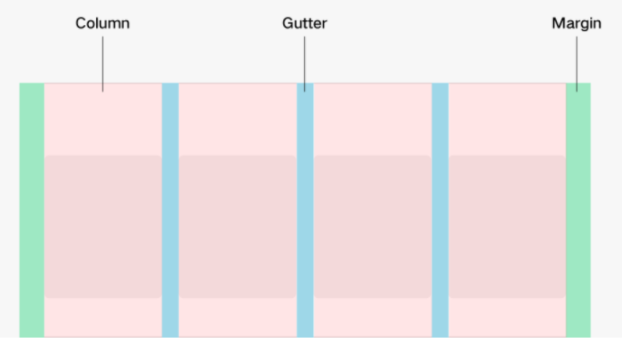

# 栅格布局


栅格系统作为一种辅助布局的定位工具，在平面设计和网站设计都起到了很好的作用，对移动设备的界面设计有较好的借鉴作用。总结栅格系统对于移动设备的优势主要有：


1. 给布局提供一种可循的规律，解决多尺寸多设备的动态布局问题。
2. 给系统提供一种统一的定位标注，保证各模块各设备的布局一致性。
3. 给应用提供一种灵活的间距调整方法，满足特殊场景布局调整的可能性。

为实现栅格布局效果，声明式范式提供了GridContainer栅格容器组件，配合其子组件的通用属性useSizeType来实现栅格布局。

## 栅格系统

栅格系统有Columns、Margins、Gutters三个概念。





1. Gutters：
   用来控制元素与元素之间距离关系。可以根据设备的不同尺寸，定义不同的gutter值，作为栅格布局的统一规范。为了保证较好的视觉效果，通常gutter的取值不会大于margin的取值。
2. Margins：
   离栅格容器边缘的距离。可以根据设备的不同尺寸，定义不同的margin值，作为栅格布局的统一规范。
3. Columns:
   栅格布局的主要定位工具。根据设备的不同尺寸，把栅格容器分割成不同的列数，在保证margin和gutter符合规范的情况下，根据总Column的个数计算每个Column列的宽度。


### 系统栅格断点

系统根据不同水平宽度设备对应Columns的数量关系，形成了一套断点规则定义。

系统以设备的水平宽度的屏幕密度像素值作为断点依据，根据当前设备水平宽度所在的断点范围，定义了设备的宽度类型。系统的栅格断点范围、设备宽度类型及其描述，以及对应的默认总列数(columns)，边距（gutter)，间隔(gutter)定义如下：

<a id="grid_system_define">系统栅格定义</a>


| 设备水平宽度断点范围 | 设备宽度类型 | 描述 | columns | gutter | margin |
| -------- | -------- | -------- | -------- | -------- | -------- |
| 0&lt;水平宽度&lt;320vp | XS | 最小宽度类型设备。 | 2 | 12vp | 12vp |
| 320vp&lt;=水平宽度&lt;600vp | SM | 小宽度类型设备。 | 4 | 24vp | 24vp |
| 600vp&lt;=水平宽度&lt;840vp | MD | 中等宽度类型设备。 | 8 | 24vp | 32vp |
| 840&lt;=水平分辨率 | LG | 大宽度类型设备。 | 12 | 24vp | 48vp |

## 如何使用

首先创建栅格容器组件，定义栅格布局，然后给栅格容器内的组件设置不同设备宽度类型下的占用列数。

### 创建栅格容器

通过接口：GridContainer(options?: { columns?: number | 'auto', sizeType?: SizeType, gutter?: Length, margin?: Length})创建栅格容器，栅格容器内的所有子组件可以使用栅格布局。

可以通过参数定义栅格布局的总列数（columns)，间隔（gutter)，两侧边距（margin)。例如栅格容器总共分为6列，列于列间隔为10vp, 两侧边距为20vp：
```
GridContainer({ columns: 6, gutter: 10, margin: 20 }) {}
```
栅格容器不设置参数，或者sizeType设置为SizeType.Auto时使用默认的栅格系统定义，如：

```
GridContainer() {}
```
上述例子中，默认在在小宽度类型设备(SizeType.SM)上，栅格容器被分为4列，列于列的间隔为24vp, 两侧边距是24vp。在中等宽度类型设备(SizeType.MD)上，栅格容器被分为8列，列于列的间隔为24vp，两侧边距是32vp。


也可以通过参数sizeType指定此栅格容器内的组件使用此设备宽度类型的栅格设置，如：

```
GridContainer({ sizeType: SizeType.SM) {
   Row() {
     Text('1')
       .useSizeType({
         xs: { span: 2},
         sm: { span: 3, offset: 1 },
         md: { span: 6, offset: 2 },
         lg: { span: 8, offset: 2 },
       })
   }
}
```
上述例子中，不管在任何宽度类型的设备上， Text组件都使用SizeType.SM类型的栅格设置即占用3列，放置在第1列。

### 栅格容器内子组件的栅格设置

栅格容器中的组件使用通用属性useSizeType设置不同的设备宽度类型的占用列数和列偏移。其中span表示栅格容器组件占据columns的数量；offest表示列偏移量，指将组件放置在哪一个columns上。 如：

```
GridContainer() {
   Row() {
     Text('1')
       .useSizeType({
         xs: { span: 2},
         sm: { span: 3, offset: 1 },
         md: { span: 6, offset: 2 },
         lg: { span: 8, offset: 2 },
       })
   }
}
```
其中sm: { span: 2, offset: 0 } 指在设备宽度类型为SM的设备上，Text组件占用3列，且放在栅格容器的第1列上。
## 场景示例

使用栅格布局可以灵活地在不同的设备宽度类型下呈现合适的效果，而不必书写大量的代码兼容不同宽度类型的设备。  

```
@Entry
@Component
struct GridContainerExample {
  build() {
    Column({ space: 5 }) {
      GridContainer({ columns: 6 }) {
        Flex({justifyContent:FlexAlign.SpaceAround}) {
          Text('1')
            .useSizeType({
              xs: { span: 2, offset: 0 },
              sm: { span: 2, offset: 0 },
              md: { span: 1, offset: 0 },
              lg: { span: 1, offset: 0 },
            })
            .height(100).backgroundColor(0x4682B4).textAlign(TextAlign.Center)
          Text('2')
            .useSizeType({
              xs: { span: 2, offset: 0 },
              sm: { span: 2, offset: 0 },
              md: { span: 4, offset: 0 },
              lg: { span: 4, offset: 0 },
            })
            .height(100).backgroundColor(0x46F2B4).textAlign(TextAlign.Center)
          Text('3')   
            .useSizeType({
              xs: { span: 2, offset: 0 },
              sm: { span: 2, offset: 0 },
              md: { span: 1, offset: 0 },
              lg: { span: 1, offset: 0 },
            })
            .height(100).backgroundColor(0x46A2B4).textAlign(TextAlign.Center)
        }
      }.width('80%').backgroundColor('gray')
    }.width('100%').margin({ top: 15 })
  }
}
```


小宽度类型设备(SizeType.SM)运行效果：


中等宽度类型设备(SizeType.MD)运行效果：

