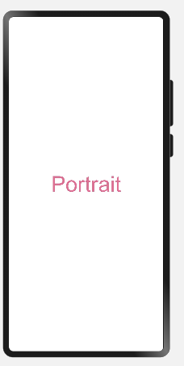

# 媒体查询

[媒体查询（Media Query）](../reference/apis/js-apis-mediaquery.md)作为响应式设计的核心，在移动设备上应用十分广泛。它根据不同设备类型或同设备不同状态修改应用的样式。媒体查询的优势有：

1. 提供丰富的媒体特征监听能力，针对设备和应用的属性信息（比如显示区域、深浅色、分辨率），设计出相匹配的布局。

2. 当屏幕发生动态改变时（比如分屏、横竖屏切换），同步更新应用的页面布局。

   

## 媒体查询引入与使用流程

媒体查询通过媒体查询接口，设置查询条件并绑定回调函数，在对应的条件的回调函数里更改页面布局或者实现业务逻辑，实现页面的响应式设计。具体步骤如下：

首先导入媒体查询模块。

```ts
import mediaquery from '@ohos.mediaquery'
```

通过matchMediaSync接口设置媒体查询条件，保存返回的条件监听句柄listener。

```ts
listener = mediaquery.matchMediaSync('(orientation: landscape)')
```

给条件监听句柄listener绑定回调函数onPortrait，当listener检测设备状态变化时执行回调函数。在回调函数内，根据不同设备状态更改页面布局或者实现业务逻辑。

```ts
onPortrait(mediaQueryResult) {
    if (mediaQueryResult.matches) {
        // do something here
    } else {
        // do something here
    }
}
listener.on('change', onPortrait)
```

## 媒体查询条件

媒体查询条件由媒体类型，逻辑操作符，媒体特征组成，其中媒体类型可省略，逻辑操作符用于连接不同媒体类型与媒体特征，其中，媒体特征要使用()包裹且可以有多个。具体规则如下：

### 语法规则

```
[media-type] [and|not|only] [(media-feature)]
```

例如：

`screen and (round-screen: true)` ：当设备屏幕是圆形时条件成立。

`(max-height: 800)` ：当高度小于等于800时条件成立。

`(height <= 800) ` ：当高度小于等于800时条件成立。

`screen and (device-type: tv) or (resolution < 2)` ：包含多个媒体特征的多条件复杂语句查询，当设备类型为tv或设备分辨率小于2时条件成立。

###  媒体类型(media-type)

| 类型     | 说明             |
| ------ | -------------- |
| screen | 按屏幕相关参数进行媒体查询。 |

###  媒体逻辑操作(and|or|not|only)

媒体逻辑操作符：and、or、not、only用于构成复杂媒体查询，也可以通过comma（, ）将其组合起来，详细解释说明如下表。

  **表1** 媒体逻辑操作符

| 类型       | 说明                                       |
| -------- | ---------------------------------------- |
| and      | 将多个媒体特征（Media&nbsp; Feature）以“与”的方式连接成一个媒体查询，只有当所有媒体特征都为true，查询条件成立。另外，它还可以将媒体类型和媒体功能结合起来。<br/>例如：screen&nbsp; and&nbsp; (device-type:&nbsp; wearable)&nbsp; and&nbsp; (max-height:&nbsp; 600)&nbsp; 表示当设备类型是智能穿戴且应用的最大高度小于等于600个像素单位时成立。 |
| or       | 将多个媒体特征以“或”的方式连接成一个媒体查询，如果存在结果为true的媒体特征，则查询条件成立。<br/>例如：screen&nbsp; and&nbsp; (max-height:&nbsp; 1000)&nbsp; or&nbsp; （round-screen：true）表示当应用高度小于等于1000个像素单位或者设备屏幕是圆形时，条件成立。 |
| not      | 取反媒体查询结果，媒体查询结果不成立时返回true，否则返回false。<br/>例如：not&nbsp; screen&nbsp; and&nbsp; (min-height:&nbsp; 50)&nbsp; and&nbsp; (max-height:&nbsp; 600)&nbsp; 表示当应用高度小于50个像素单位或者大于600个像素单位时成立。<br/>使用not运算符时必须指定媒体类型。 |
| only     | 当整个表达式都匹配时，才会应用选择的样式，可以应用在防止某些较早的版本的浏览器上产生歧义的场景。一些较早版本的浏览器对于同时包含了媒体类型和媒体特征的语句会产生歧义，比如：<br/>screen&nbsp; and&nbsp; (min-height:&nbsp; 50)<br/>老版本浏览器会将这句话理解成screen，从而导致仅仅匹配到媒体类型（screen），就应用了指定样式，使用only可以很好地规避这种情况。<br/>使用only时必须指定媒体类型。 |
| , (comma) | 将多个媒体特征以“或”的方式连接成一个媒体查询，如果存在结果为true的媒体特征，则查询条件成立。其效果等同于or运算符。<br/>例如：screen&nbsp; and&nbsp; (min-height:&nbsp; 1000), &nbsp; &nbsp; （round-screen：true）&nbsp; 表示当应用高度大于等于1000个像素单位或者设备屏幕是圆形时，条件成立。 |

在MediaQuery Level 4中引入了范围查询，使其能够使用max-，min-的同时，也支持了&lt; =，&gt; =，&lt; ，&gt; 操作符。

  **表2** 媒体逻辑范围操作符

| 类型    | 说明                                       |
| ----- | ---------------------------------------- |
| &lt; = | 小于等于，例如：screen&nbsp; and&nbsp; (height&nbsp; &lt; =&nbsp; 50)。 |
| &gt; = | 大于等于，例如：screen&nbsp; and&nbsp; (height&nbsp; &gt; =&nbsp; 600)。 |
| &lt; | 小于，例如：screen&nbsp; and&nbsp; (height&nbsp; &lt; &nbsp; 50)。 |
| &gt; | 大于，例如：screen&nbsp; and&nbsp; (height&nbsp; &gt; &nbsp; 600)。 |

### 媒体特征(media-feature)

| 类型                | 说明                                       |
| ----------------- | ---------------------------------------- |
| height            | 应用页面显示区域的高度。                             |
| min-height        | 应用页面显示区域的最小高度。                           |
| max-height        | 应用页面显示区域的最大高度。                           |
| width             | 应用页面显示区域的宽度。                             |
| min-width         | 应用页面显示区域的最小宽度。                           |
| max-width         | 应用页面显示区域的最大宽度。                           |
| resolution        | 设备的分辨率，支持dpi，dppx和dpcm单位。其中：<br/>-&nbsp; dpi表示每英寸中物理像素个数，1dpi≈0.39dpcm；<br/>-&nbsp; dpcm表示每厘米上的物理像素个数，1dpcm&nbsp; ≈&nbsp; 2.54dpi；<br/>-&nbsp; dppx表示每个px中的物理像素数（此单位按96px=1英寸为基准，与页面中的px单位计算方式不同），1dppx&nbsp; =&nbsp; 96dpi。 |
| min-resolution    | 设备的最小分辨率。                                |
| max-resolution    | 设备的最大分辨率。                                |
| orientation       | 屏幕的方向。<br/>可选值：<br/>-&nbsp; orientation:&nbsp; portrait（设备竖屏）<br/>-&nbsp; orientation:&nbsp; landscape（设备横屏） |
| device-height     | 设备的高度。                                   |
| min-device-height | 设备的最小高度。                                 |
| max-device-height | 设备的最大高度。                                 |
| device-width      | 设备的宽度。                                   |
| min-device-width  | 设备的最小宽度。                                 |
| max-device-width  | 设备的最大宽度。                                 |
| round-screen      | 屏幕类型，圆形屏幕为true，&nbsp; 非圆形屏幕为&nbsp; false。  |
| dark-mode         | 系统为深色模式时为true，否则为false。                  |

## 场景示例

下例中使用媒体查询，实现屏幕横竖屏切换时给页面文本应用不同的内容和样式的效果。

```ts
import mediaquery from '@ohos.mediaquery'

let portraitFunc = null

@Entry
@Component
struct MediaQueryExample {
  @State color: string = '#DB7093'
  @State text: string = 'Portrait'
  listener = mediaquery.matchMediaSync('(orientation: landscape)') // 当设备横屏时条件成立

  onPortrait(mediaQueryResult) {
    if (mediaQueryResult.matches) {
      this.color = '#FFD700'
      this.text = 'Landscape'
    } else {
      this.color = '#DB7093'
      this.text = 'Portrait'
    }
  }

  aboutToAppear() {
    portraitFunc = this.onPortrait.bind(this) // 绑定当前应用实例
    this.listener.on('change', portraitFunc)
  }

  build() {
    Flex({ direction: FlexDirection.Column, alignItems: ItemAlign.Center, justifyContent: FlexAlign.Center }) {
      Text(this.text).fontSize(50).fontColor(this.color)
    }
    .width('100%').height('100%')
  }
}
```

横屏下文本内容为Landscape，颜色为#FFD700。


非横屏下文本内容为Portrait，颜色为#DB7093。



## 相关实例

使用媒体查询的自适应布局开发，有以下相关实例可供参考：

- [`MediaQuery`：媒体查询（ArkTS）（API8）](https://gitee.com/openharmony/applications_app_samples/tree/master/ETSUI/MediaQuery)

