# 层叠布局

层叠布局（StackLayout）用于在屏幕上预留一块区域来显示组件中的元素，提供元素可以重叠的布局。
通过层叠容器[Stack](../reference/arkui-ts/ts-container-stack.md)实现，容器中的子元素依次入栈，后一个子元素覆盖前一个子元素显示。

## 对齐方式

设置子元素在容器内的对齐方式。支持左上，上中，右上，左，中，右，右下，中下，右下九种对齐方式，如下表所示：

|名称|    描述| 图示 |
|---|	---|---|
|TopStart|    顶部起始端 |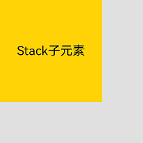|
Top    |顶部横向居中 |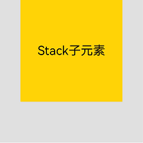|
TopEnd|    顶部尾端 |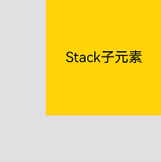|
Start|    起始端纵向居中 |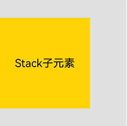|
Center|    横向和纵向居中 |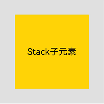|
End|    尾端纵向居中 |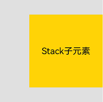|
BottomStart    |底部起始端 |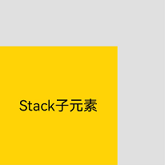|
Bottom|    底部横向居中 |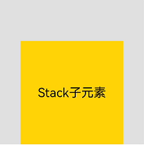|
BottomEnd|    底部尾端 |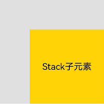|

## Z序控制

Stack容器中兄弟组件显示层级关系可以通过[zIndex](../reference/arkui-ts/ts-universal-attributes-z-order.md)
属性改变。zIndex值越大，显示层级越高，即zIndex值大的组件会覆盖在zIndex值小的组件上方。

- 在层叠布局中，如果后面子元素尺寸大于前面子元素尺寸，则前面子元素完全隐藏。

    ```ts
    Stack({ alignContent: Alignment.BottomStart }) {
        Column() {
          Text('Stack子元素1').textAlign(TextAlign.End).fontSize(20)
        }.width(100).height(100).backgroundColor(0xffd306)
        Column() {
          Text('Stack子元素2').fontSize(20)
        }.width(150).height(150).backgroundColor(Color.Pink)
        Column() {
          Text('Stack子元素3').fontSize(20)
        }.width(200).height(200).backgroundColor(Color.Grey)
    }.margin({ top: 100 }).width(350).height(350).backgroundColor(0xe0e0e0)
    ```

  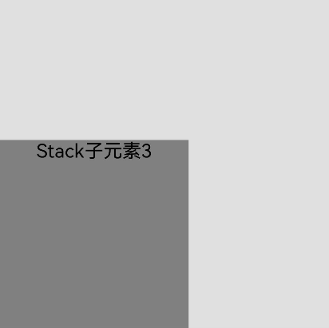

  上图中，最后的子元素3的尺寸大于前面的所有子元素，所以，前面两个元素完全隐藏。改变子元素1，子元素2的zIndex属性后，可以将元素展示出来。

    ```ts
    Stack({ alignContent: Alignment.BottomStart }) {
        Column() {
          Text('Stack子元素1').textAlign(TextAlign.End).fontSize(20)
        }.width(100).height(100).backgroundColor(0xffd306).zIndex(2)
        Column() {
          Text('Stack子元素2').fontSize(20)
        }.width(150).height(150).backgroundColor(Color.Pink).zIndex(1)
        Column() {
          Text('Stack子元素3').fontSize(20)
        }.width(200).height(200).backgroundColor(Color.Grey)
    }.margin({ top: 100 }).width(350).height(350).backgroundColor(0xe0e0e0)
    ```
  
    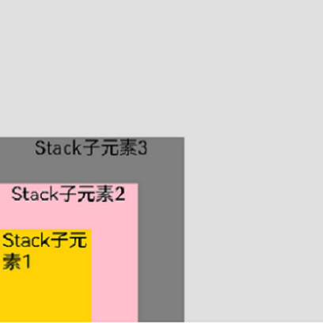
