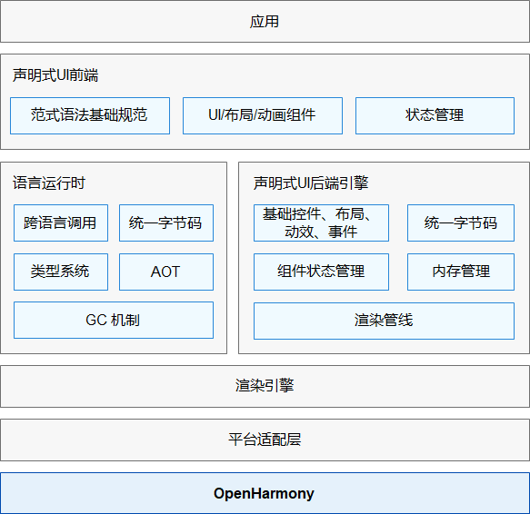

# 概述

ArkUI(声明式开发范式)是一套开发极简、高性能、跨设备应用的UI开发框架，支持开发者高效的构建跨设备应用UI界面。

## 基础能力

声明式开发范式采用接近自然语义的编程方式，从组件、动效和状态管理三个维度提供UI能力，并提供系统能力接口，便于开发者直观高效地描述UI界面，极简地调用系统能力，不必关心UI绘制和渲染的底层实现，极大地提高开发者的开发效率与体验。

具体请参考[声明式开发范式API](../reference/arkui-ts/Readme-CN.md)。

- **开箱即用的组件**

  框架提供丰富的系统组件，通过链式调用的方式设置组件属性实现不同的组件样式，达到不同渲染效果。应用开发中，开发者基于组件化思想，将页面分割为多个独立的UI单元，每个UI单元使用系统组件组合拼接，实现代码的封装、复用，具有更浅的结构性和工程性。

- **丰富的动效接口**

  提供svg标准的绘制图形能力，同时开放了丰富的动效接口，开发者可以通过封装的物理模型或者调用动画能力接口来实现自定义动画轨迹。

- **状态与数据管理**

  状态数据管理是声明式开发范式的特色，框架提供功能不同的装饰器对UI组件状态和应用程序状态进行管理，为开发者提供了清晰的页面数据传递方式和渲染更新方法，便于开发者完整地构建整个应用的数据更新和UI渲染流程。

- **系统能力接口**

  ArkUI封装了丰富的[系统能力接口](../reference/apis/Readme-CN.md)，实现系统能力调用的极简开发。

## 整体架构

- **声明式UI前端**

  提供了UI开发范式的基础语言规范，并提供内置的UI组件、布局和动画，提供了多种状态管理机制，为应用开发者提供一系列接口支持。

- **语言运行时**

  选用方舟语言运行时，提供了针对UI范式语法的解析能力、跨语言调用支持的能力和TS语言高性能运行环境。

- **声明式UI后端引擎**

  后端引擎提供了兼容不同开发范式的UI渲染管线，提供多种基础组件、布局计算、动效、交互事件，提供了状态管理和绘制能力。

- **渲染引擎**

  提供了高效的绘制能力，将渲染管线收集的渲染指令，绘制到屏幕能力。

- **平台适配层**

  提供了对系统平台的抽象接口，具备接入不同系统的能力，如系统渲染管线、生命周期调度等。

## 相关实例

基于TS扩展的声明式开发范式的方舟开发框架，有以下相关实例可供参考：

- [`Canvas`：画布组件（eTS）（API8）](https://gitee.com/openharmony/applications_app_samples/tree/master/ETSUI/Canvas)

- [`Drag`：拖拽事件（eTS）（API8）](https://gitee.com/openharmony/applications_app_samples/tree/master/ETSUI/Drag)

- [`ArkUIAnimation`：动画（eTS）（API8）](https://gitee.com/openharmony/applications_app_samples/tree/master/ETSUI/ArkUIAnimation)

- [`Xcomponent`：XComponent（eTS）（API9）](https://gitee.com/openharmony/applications_app_samples/tree/master/ETSUI/XComponent)

- [`MouseEvent`：鼠标事件（eTS）（API8）](https://gitee.com/openharmony/applications_app_samples/tree/master/ETSUI/MouseEvent)

- [`Gallery`：组件集合（eTS）（API8）](https://gitee.com/openharmony/applications_app_samples/tree/master/ETSUI/Gallery)

- [`BringApp`：拉起系统应用（eTS）（API8）](https://gitee.com/openharmony/applications_app_samples/tree/master/ETSUI/BringApp)

- [`Chat`：聊天示例应用（eTS）（API8）](https://gitee.com/openharmony/applications_app_samples/tree/master/AppSample/Chat)

- [`Shopping`：购物示例应用（eTS）（API8）](https://gitee.com/openharmony/applications_app_samples/tree/master/AppSample/Shopping)

- [`Lottie`：Lottie（eTS）（API8）（Full SDK）](https://gitee.com/openharmony/applications_app_samples/tree/master/ETSUI/Lottie)

- [`Clock`：简单时钟（eTS）（API9）](https://gitee.com/openharmony/applications_app_samples/tree/master/Preset/Clock)

- [`Flybird`：小鸟避障游戏（eTS）（API9）](https://gitee.com/openharmony/applications_app_samples/tree/master/ResourcesSchedule/Flybird)

- [`AdaptiveCapabilities`：多设备自适应能力（eTS）（API9）](https://gitee.com/openharmony/app_samples/tree/master/MultiDeviceAppDev/AdaptiveCapabilities)

- [`Game2048`：2048游戏（eTS）（API8）](https://gitee.com/openharmony/applications_app_samples/tree/master/ETSUI/Game2048)

- [`TransitionAnimation`：转场动画(eTS)（API9）](https://gitee.com/openharmony/applications_app_samples/tree/master/ETSUI/TransitionAnimation)

- [`PatternLock`：图案密码锁组件（eTS）（API9）](https://gitee.com/openharmony/applications_app_samples/tree/master/ETSUI/PatternLock)

- [`Search`：Search组件（eTS）（API9）](https://gitee.com/openharmony/applications_app_samples/tree/master/ETSUI/Search)

- [`QRCode`：二维码（eTS）（API9）](https://gitee.com/openharmony/applications_app_samples/tree/master/ETSUI/QRCode)

- [极简声明式UI范式（eTS）（API8）](https://gitee.com/openharmony/codelabs/tree/master/ETSUI/SimpleGalleryEts)

- [购物应用（eTS）（API8）](https://gitee.com/openharmony/codelabs/tree/master/ETSUI/ShoppingEts)

- [转场动画的使用（eTS）（API8）](https://gitee.com/openharmony/codelabs/tree/master/ETSUI/TransitionAnimtaionEts)

- [基础组件Slider的使用（eTS）（API8）](https://gitee.com/openharmony/codelabs/tree/master/ETSUI/SliderApplicationEts)

- [弹窗（eTS）（API8）](https://gitee.com/openharmony/codelabs/tree/master/ETSUI/CustomDialogEts)

- [`UpgradePopup`：自定义弹窗（eTS）（API9）](https://gitee.com/openharmony/applications_app_samples/tree/master/ETSUI/UpgradePopup)

- [CustomComponent:组件化（eTS）（API8）](https://gitee.com/openharmony/applications_app_samples/tree/master/ETSUI/CustomComponent)