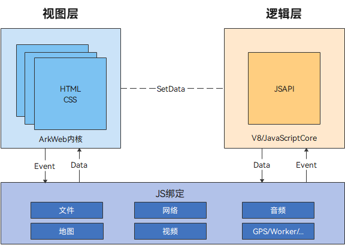
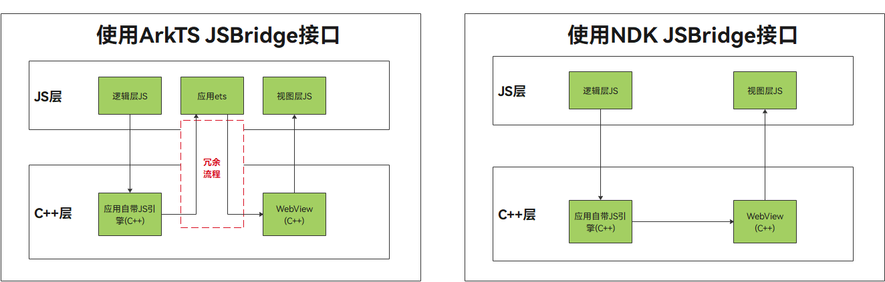

# 应用侧与前端页面的相互调用(C/C++)

本指导适用于ArkWeb应用侧与前端网页通信场景，开发者可根据应用架构选择使用ArkWeb native接口完成业务通信机制（以下简称JSBridge）。

## 适用的应用架构

应用使用ArkTS、C++语言混合开发，或本身应用架构较贴近于小程序架构，自带C++侧环境，推荐使用ArkWeb在native侧提供的[ArkWeb_ControllerAPI](../reference/apis-arkweb/_ark_web___controller_a_p_i.md#arkweb_controllerapi)、[ArkWeb_ComponentAPI](../reference/apis-arkweb/_ark_web___component_a_p_i.md#arkweb_componentapi)实现JSBridge功能。

  

  上图为具有普适性的小程序一般架构，其中逻辑层需要应用自带JavaScript运行时，本身已存在C++环境，通过native接口可直接在C++环境中完成与视图层（ArkWeb作为渲染器）的通信，无需再返回ArkTS环境调用JSBridge相关接口。

  

  native JSBridge方案可以解决ArkTS环境的冗余切换，同时允许回调在非UI线程上报，避免造成UI阻塞。

## 使用native接口实现JSBridge通信

### native侧ArkWeb绑定

* ArkWeb组件声明在ArkTS侧，需要用户自定义一个标识webTag，并将webTag通过NAPI传至应用C++侧，后续ArkWeb native接口使用，均需webTag作为对应组件的唯一标识。

* ArkTS侧

  ```js
  // 自定义webTag，在WebviewController创建时作为入参传入，建立controller与webTag的映射关系
  webTag: string = 'ArkWeb1';
  controller: web_webview.WebviewController = new web_webview.WebviewController(this.webTag);
  ...
  // aboutToAppear中将webTag通过NAPI接口传入C++侧，作为C++侧ArkWeb组件的唯一标识
  aboutToAppear() {
    console.info("aboutToAppear")
    //初始化web ndk
    testNapi.nativeWebInit(this.webTag);
  }
  ...
  ```

* C++侧

  ```c++
  // 解析存储webTag
  static napi_value NativeWebInit(napi_env env, napi_callback_info info) {
      OH_LOG_Print(LOG_APP, LOG_INFO, LOG_PRINT_DOMAIN, "ArkWeb", "ndk NativeWebInit start");
      size_t argc = 1;
      napi_value args[1] = {nullptr};
      napi_get_cb_info(env, info, &argc, args, nullptr, nullptr);
      // 获取第一个参数 webTag
      size_t webTagSize = 0;
      napi_get_value_string_utf8(env, args[0], nullptr, 0, &webTagSize);
      char *webTagValue = new (std::nothrow) char[webTagSize + 1];
      size_t webTagLength = 0;
      napi_get_value_string_utf8(env, args[0], webTagValue, webTagSize + 1, &webTagLength);
      OH_LOG_Print(LOG_APP, LOG_ERROR, LOG_PRINT_DOMAIN, "ArkWeb", "ndk NativeWebInit webTag:%{public}s", webTagValue);

      // 将webTag保存在实例对象中
      jsbridge_object_ptr = std::make_shared<JSBridgeObject>(webTagValue);
  ...
  ```

### native侧API结构体获取

ArkWeb native侧API通过函数[OH_ArkWeb_GetNativeAPI](../reference/apis-arkweb/_web.md#oh_arkweb_getnativeapi())获取，根据入参type不同，可分别获取[ArkWeb_ControllerAPI](../reference/apis-arkweb/_ark_web___controller_a_p_i.md#arkweb_controllerapi)、[ArkWeb_ComponentAPI](../reference/apis-arkweb/_ark_web___component_a_p_i.md#arkweb_componentapi)函数指针结构体。其中[ArkWeb_ControllerAPI](../reference/apis-arkweb/_ark_web___controller_a_p_i.md#arkweb_controllerapi)对应ArkTS侧[web_webview.WebviewController API](../reference/apis-arkweb/js-apis-webview.md)，[ArkWeb_ComponentAPI](../reference/apis-arkweb/_ark_web___component_a_p_i.md#arkweb_componentapi)对应ArkTS侧[ArkWeb组件API](../reference/apis-arkweb/ts-basic-components-web.md)。

  ```c++
  static ArkWeb_ControllerAPI *controller = nullptr;
  static ArkWeb_ComponentAPI *component = nullptr;
  ...
  controller = reinterpret_cast<ArkWeb_ControllerAPI *>(OH_ArkWeb_GetNativeAPI(ARKWEB_NATIVE_CONTROLLER));
  component = reinterpret_cast<ArkWeb_ComponentAPI *>(OH_ArkWeb_GetNativeAPI(ARKWEB_NATIVE_COMPONENT));
  ```

### native侧组件生命周期回调注册

通过[ArkWeb_ComponentAPI](../reference/apis-arkweb/_ark_web___component_a_p_i.md#arkweb_componentapi)注册组件生命周期回调，在调用API前建议通过[ARKWEB_MEMBER_MISSING](../reference/apis-arkweb/_web.md#arkweb_member_missing)校验该函数结构体是否有对应函数指针，避免SDK与设备ROM不匹配导致crash问题。

  ```c++
  if (!ARKWEB_MEMBER_MISSING(component, onControllerAttached)) {
      component->onControllerAttached(webTagValue, ValidCallback,
                                      static_cast<void *>(jsbridge_object_ptr->GetWeakPtr()));
  } else {
      OH_LOG_Print(LOG_APP, LOG_ERROR, LOG_PRINT_DOMAIN, "ArkWeb", "component onControllerAttached func not exist");
  }

  if (!ARKWEB_MEMBER_MISSING(component, onPageBegin)) {
      component->onPageBegin(webTagValue, LoadStartCallback,
                                      static_cast<void *>(jsbridge_object_ptr->GetWeakPtr()));
  } else {
      OH_LOG_Print(LOG_APP, LOG_ERROR, LOG_PRINT_DOMAIN, "ArkWeb", "component onPageBegin func not exist");
  }

  if (!ARKWEB_MEMBER_MISSING(component, onPageEnd)) {
      component->onPageEnd(webTagValue, LoadEndCallback,
                                      static_cast<void *>(jsbridge_object_ptr->GetWeakPtr()));
  } else {
      OH_LOG_Print(LOG_APP, LOG_ERROR, LOG_PRINT_DOMAIN, "ArkWeb", "component onPageEnd func not exist");
  }

  if (!ARKWEB_MEMBER_MISSING(component, onDestroy)) {
      component->onDestroy(webTagValue, DestroyCallback,
                                      static_cast<void *>(jsbridge_object_ptr->GetWeakPtr()));
  } else {
      OH_LOG_Print(LOG_APP, LOG_ERROR, LOG_PRINT_DOMAIN, "ArkWeb", "component onDestroy func not exist");
  }
  ```

### 前端页面调用应用侧函数

通过[registerJavaScriptProxy](../reference/apis-arkweb/_ark_web___controller_a_p_i.md#registerjavascriptproxy)将应用侧函数注册至前端页面，**推荐在[onControllerAttached](../reference/apis-arkweb/_ark_web___component_a_p_i.md#oncontrollerattached)回调中注册，其它时机注册需要手动调用[refresh](../reference/apis-arkweb/_ark_web___controller_a_p_i.md#refresh)才能生效。**

  ```c++
  // 注册对象
  OH_LOG_Print(LOG_APP, LOG_INFO, LOG_PRINT_DOMAIN, "ArkWeb", "ndk RegisterJavaScriptProxy begin");
  ArkWeb_ProxyMethod method1 = {"method1", ProxyMethod1, static_cast<void *>(jsbridge_object_ptr->GetWeakPt  ())};
  ArkWeb_ProxyMethod method2 = {"method2", ProxyMethod2, static_cast<void *>(jsbridge_object_ptr->GetWeakPt  ())};
  ArkWeb_ProxyMethod methodList[2] = {method1, method2};
  // 调用ndk接口注册对象
  // 如此注册的情况下，在H5页面就可以使用proxy.method1、proxy.method1调用此文件下的ProxyMethod1和ProxyMethod2方法了
  ArkWeb_ProxyObject proxyObject = {"ndkProxy", methodList, 2};
  controller->registerJavaScriptProxy(webTag, &proxyObject);
  ```

### 应用侧调用前端页面函数

通过[runJavaScript](../reference/apis-arkweb/_ark_web___controller_a_p_i.md#runjavascript)调用前端页面函数。

  ```c++
  // 构造runJS执行的结构体
  char* jsCode = "runJSRetStr()";
  ArkWeb_JavaScriptObject object = {(uint8_t *)jsCode, bufferSize, &JSBridgeObject::StaticRunJavaScriptCallback,
                                       static_cast<void *>(jsbridge_object_ptr->GetWeakPtr())};
  // 调用前端页面runJSRetStr()函数
  controller->runJavaScript(webTagValue, &object);
  ```

### 完整示例

* 前端页面代码`entry/src/main/resources/rawfile/runJS.html`

  ```html
  <!DOCTYPE html>
  <html lang="en-gb">
  <head>
      <meta name="viewport" content="width=device-width, initial-scale=1.0">
      <title>run javascript demo</title>
  </head>
  <body>
  <h1>run JavaScript Ext demo</h1>
  <p id="webDemo"></p>
  <br>
  <button type="button" style="height:30px;width:200px" onclick="testNdkProxyObjMethod1()">test ndk method1 ! </button>
  <br>
  <br>
  <button type="button" style="height:30px;width:200px" onclick="testNdkProxyObjMethod2()">test ndk method2 ! </button>
  <br>

  </body>
  <script type="text/javascript">

  function testNdkProxyObjMethod1() {
        if (window.ndkProxy == undefined) {
              document.getElementById("webDemo").innerHTML = "ndkProxy undefined"
              return "objName undefined"
        }

        if (window.ndkProxy.method1 == undefined) {
              document.getElementById("webDemo").innerHTML = "ndkProxy method1 undefined"
              return "objName  test undefined"
        }

        if (window.ndkProxy.method2 == undefined) {
              document.getElementById("webDemo").innerHTML = "ndkProxy method2 undefined"
              return "objName  test undefined"
        }
        window.ndkProxy.method1("hello", "world", [1.2, -3.4, 123.456], ["Saab", "Volvo", "BMW", undefined], 1.23456, 123789, true, false, 0,  undefined);
  }

  function testNdkProxyObjMethod2() {
        if (window.ndkProxy == undefined) {
              document.getElementById("webDemo").innerHTML = "ndkProxy undefined"
              return "objName undefined"
        }

        if (window.ndkProxy.method1 == undefined) {
              document.getElementById("webDemo").innerHTML = "ndkProxy method1 undefined"
              return "objName  test undefined"
        }

        if (window.ndkProxy.method2 == undefined) {
              document.getElementById("webDemo").innerHTML = "ndkProxy method2 undefined"
              return "objName  test undefined"
        }

      var student = {
              name:"zhang",
              sex:"man",
              age:25
      };
      var cars = [student, 456, false, 4.567];
      let params = "[\"{\\\"scope\\\"]";

      window.ndkProxy.method2("hello", "world", false, cars, params);
  }

  function runJSRetStr(data) {
      const d = new Date();
      let time = d.getTime();
      return JSON.stringify(time)
  }
  </script>
  </html>
  ```

* ArkTS侧代码`entry/src/main/ets/pages/Index.ets`

  ```javascript
  import testNapi from 'libentry.so';
  import { webview } from '@kit.ArkWeb';

  class testObj {
    constructor() {
    }

    test(): string {
      console.log('ArkUI Web Component');
      return "ArkUI Web Component";
    }

    toString(): void {
      console.log('Web Component toString');
    }
  }

  @Entry
  @Component
  struct Index {
    webTag: string = 'ArkWeb1';
    controller: webview.WebviewController = new webview.WebviewController(this.webTag);
    @State testObjtest: testObj = new testObj();

    aboutToAppear() {
      console.info("aboutToAppear")
      //初始化web ndk
      testNapi.nativeWebInit(this.webTag);
    }

    build() {
      Column() {
        Row() {
          Button('runJS hello')
            .fontSize(12)
            .onClick(() => {
              testNapi.runJavaScript(this.webTag, "runJSRetStr(\"" + "hello" + "\")");
            })
        }.height('20%')

        Row() {
          Web({ src: $rawfile('runJS.html'), controller: this.controller })
            .javaScriptAccess(true)
            .fileAccess(true)
            .onControllerAttached(() => {
              console.error("ndk onControllerAttached webId: " + this.controller.getWebId());
            })
        }.height('80%')
      }
    }
  }
  ```

* NAPI侧暴露ArkTS接口`entry/src/main/cpp/types/libentry/index.d.ts`

  ```javascript
  export const nativeWebInit: (webName: string) => void;
  export const runJavaScript: (webName: string, jsCode: string) => void;
  ```

* NAPI侧编译配置`entry/src/main/cpp/CMakeLists.txt`

  ```c++
  # the minimum version of CMake.
  cmake_minimum_required(VERSION 3.4.1)
  project(NDKJSBridg)

  set(NATIVERENDER_ROOT_PATH ${CMAKE_CURRENT_SOURCE_DIR})

  if(DEFINED PACKAGE_FIND_FILE)
      include(${PACKAGE_FIND_FILE})
  endif()

  include_directories(${NATIVERENDER_ROOT_PATH}
                      ${NATIVERENDER_ROOT_PATH}/include)

  add_library(entry SHARED hello.cpp jsbridge_object.cpp)

  find_library(
      # Sets the name of the path variable.
      hilog-lib
      # Specifies the name of the NDK library that
      # you want CMake to locate.
      hilog_ndk.z
  )

  target_link_libraries(entry PUBLIC libace_napi.z.so ${hilog-lib} libohweb.so)
  ```

* NAPI层代码`entry/src/main/cpp/hello.cpp`

  ```c++
  #include "napi/native_api.h"
  #include <bits/alltypes.h>
  #include <memory>
  #include <string>
  #include <sys/types.h>
  #include <thread>

  #include "hilog/log.h"
  #include "web/arkweb_interface.h"
  #include "jsbridge_object.h"

  constexpr unsigned int LOG_PRINT_DOMAIN = 0xFF00;
  std::shared_ptr<JSBridgeObject> jsbridge_object_ptr = nullptr;
  static ArkWeb_ControllerAPI *controller = nullptr;
  static ArkWeb_ComponentAPI *component = nullptr;

  // 发送JS脚本到H5侧执行，执行结果的回调。
  static void RunJavaScriptCallback(const char *webTag, const char *result, void *userData) {
      OH_LOG_Print(LOG_APP, LOG_INFO, LOG_PRINT_DOMAIN, "ArkWeb", "ndk RunJavaScriptCallback webTag:%{public}s", webTag);
      if (!userData) {
          OH_LOG_Print(LOG_APP, LOG_INFO, LOG_PRINT_DOMAIN, "ArkWeb", "ndk RunJavaScriptCallback userData is nullptr");
          return;
      }
      std::weak_ptr<JSBridgeObject> jsb_weak_ptr = *static_cast<std::weak_ptr<JSBridgeObject> *>(userData);
      if (auto jsb_ptr = jsb_weak_ptr.lock()) {
          jsb_ptr->RunJavaScriptCallback(result);
      } else {
          OH_LOG_Print(LOG_APP, LOG_INFO, LOG_PRINT_DOMAIN, "ArkWeb",
                       "ndk RunJavaScriptCallback jsb_weak_ptr lock failed");
      }
  }

  // 示例代码 ，注册了1个对象，2个方法
  static void ProxyMethod1(const char *webTag, const ArkWeb_JavaScriptBridgeData *dataArray, size_t arraySize, void *userData) {
      OH_LOG_Print(LOG_APP, LOG_INFO, LOG_PRINT_DOMAIN, "ArkWeb", "ndk ProxyMethod1 webTag:%{public}s", webTag);
      if (!userData) {
          OH_LOG_Print(LOG_APP, LOG_INFO, LOG_PRINT_DOMAIN, "ArkWeb", "ndk ProxyMethod1 userData is nullptr");
          return;
      }
      std::weak_ptr<JSBridgeObject> jsb_weak_ptr = *static_cast<std::weak_ptr<JSBridgeObject> *>(userData);
      if (auto jsb_ptr = jsb_weak_ptr.lock()) {
          jsb_ptr->ProxyMethod1(dataArray, arraySize);
      } else {
          OH_LOG_Print(LOG_APP, LOG_INFO, LOG_PRINT_DOMAIN, "ArkWeb", "ndk ProxyMethod1 jsb_weak_ptr lock failed");
      }
  }

  static void ProxyMethod2(const char *webTag, const ArkWeb_JavaScriptBridgeData *dataArray, size_t arraySize, void *userData) {
      OH_LOG_Print(LOG_APP, LOG_INFO, LOG_PRINT_DOMAIN, "ArkWeb", "ndk ProxyMethod2 webTag:%{public}s", webTag);
      if (!userData) {
          OH_LOG_Print(LOG_APP, LOG_INFO, LOG_PRINT_DOMAIN, "ArkWeb", "ndk ProxyMethod2 userData is nullptr");
          return;
      }
      std::weak_ptr<JSBridgeObject> jsb_weak_ptr = *static_cast<std::weak_ptr<JSBridgeObject> *>(userData);

      std::string jsCode = "runJSRetStr()";
      ArkWeb_JavaScriptObject object = {(uint8_t *)jsCode.c_str(), jsCode.size(),
                                       &JSBridgeObject::StaticRunJavaScriptCallback,
                                       static_cast<void *>(jsbridge_object_ptr->GetWeakPtr())};
      controller->runJavaScript(webTag, &object);

      if (auto jsb_ptr = jsb_weak_ptr.lock()) {
          jsb_ptr->ProxyMethod2(dataArray, arraySize);
      } else {
          OH_LOG_Print(LOG_APP, LOG_INFO, LOG_PRINT_DOMAIN, "ArkWeb", "ndk ProxyMethod2 jsb_weak_ptr lock failed");
      }
  }

  void ValidCallback(const char *webTag, void *userData) {
      OH_LOG_Print(LOG_APP, LOG_INFO, LOG_PRINT_DOMAIN, "ArkWeb", "ndk ValidCallback webTag: %{public}s", webTag);
      if (!userData) {
          OH_LOG_Print(LOG_APP, LOG_INFO, LOG_PRINT_DOMAIN, "ArkWeb", "ndk ValidCallback userData is nullptr");
          return;
      }
      std::weak_ptr<JSBridgeObject> jsb_weak_ptr = *static_cast<std::weak_ptr<JSBridgeObject> *>(userData);
      if (auto jsb_ptr = jsb_weak_ptr.lock()) {
          jsb_ptr->SaySomething("ValidCallback");
      } else {
          OH_LOG_Print(LOG_APP, LOG_INFO, LOG_PRINT_DOMAIN, "ArkWeb", "ndk ValidCallback jsb_weak_ptr lock failed");
      }

      // 注册对象
      OH_LOG_Print(LOG_APP, LOG_INFO, LOG_PRINT_DOMAIN, "ArkWeb", "ndk RegisterJavaScriptProxy begin");
      ArkWeb_ProxyMethod method1 = {"method1", ProxyMethod1, static_cast<void *>(jsbridge_object_ptr->GetWeakPtr())};
      ArkWeb_ProxyMethod method2 = {"method2", ProxyMethod2, static_cast<void *>(jsbridge_object_ptr->GetWeakPtr())};
      ArkWeb_ProxyMethod methodList[2] = {method1, method2};
      // 调用ndk接口注册对象
      // 如此注册的情况下，在H5页面就可以使用proxy.method1、proxy.method1调用此文件下的ProxyMethod1和ProxyMethod2方法了
      ArkWeb_ProxyObject proxyObject = {"ndkProxy", methodList, 2};
      controller->registerJavaScriptProxy(webTag, &proxyObject);

      OH_LOG_Print(LOG_APP, LOG_INFO, LOG_PRINT_DOMAIN, "ArkWeb", "ndk RegisterJavaScriptProxy end");
  }

  void LoadStartCallback(const char *webTag, void *userData) {
      OH_LOG_Print(LOG_APP, LOG_INFO, LOG_PRINT_DOMAIN, "ArkWeb", "ndk LoadStartCallback webTag: %{public}s", webTag);
      if (!userData) {
          OH_LOG_Print(LOG_APP, LOG_INFO, LOG_PRINT_DOMAIN, "ArkWeb", "ndk LoadStartCallback userData is nullptr");
          return;
      }
      std::weak_ptr<JSBridgeObject> jsb_weak_ptr = *static_cast<std::weak_ptr<JSBridgeObject> *>(userData);
      if (auto jsb_ptr = jsb_weak_ptr.lock()) {
          jsb_ptr->SaySomething("LoadStartCallback");
      } else {
          OH_LOG_Print(LOG_APP, LOG_INFO, LOG_PRINT_DOMAIN, "ArkWeb", "ndk LoadStartCallback jsb_weak_ptr lock failed");
      }
  }

  void LoadEndCallback(const char *webTag, void *userData) {
      OH_LOG_Print(LOG_APP, LOG_INFO, LOG_PRINT_DOMAIN, "ArkWeb", "ndk LoadEndCallback webTag: %{public}s", webTag);
      if (!userData) {
          OH_LOG_Print(LOG_APP, LOG_INFO, LOG_PRINT_DOMAIN, "ArkWeb", "ndk LoadEndCallback userData is nullptr");
          return;
      }
      std::weak_ptr<JSBridgeObject> jsb_weak_ptr = *static_cast<std::weak_ptr<JSBridgeObject> *>(userData);
      if (auto jsb_ptr = jsb_weak_ptr.lock()) {
          jsb_ptr->SaySomething("LoadEndCallback");
      } else {
          OH_LOG_Print(LOG_APP, LOG_INFO, LOG_PRINT_DOMAIN, "ArkWeb", "ndk LoadEndCallback jsb_weak_ptr lock failed");
      }
  }

  void DestroyCallback(const char *webTag, void *userData) {
      OH_LOG_Print(LOG_APP, LOG_INFO, LOG_PRINT_DOMAIN, "ArkWeb", "ndk DestoryCallback webTag: %{public}s", webTag);
      if (!userData) {
          OH_LOG_Print(LOG_APP, LOG_INFO, LOG_PRINT_DOMAIN, "ArkWeb", "ndk DestroyCallback userData is nullptr");
          return;
      }
      std::weak_ptr<JSBridgeObject> jsb_weak_ptr = *static_cast<std::weak_ptr<JSBridgeObject> *>(userData);
      if (auto jsb_ptr = jsb_weak_ptr.lock()) {
          jsb_ptr->SaySomething("DestroyCallback");
      } else {
          OH_LOG_Print(LOG_APP, LOG_INFO, LOG_PRINT_DOMAIN, "ArkWeb", "ndk DestroyCallback jsb_weak_ptr lock failed");
      }
  }

  void SetComponentCallback(ArkWeb_ComponentAPI * component, const char* webTagValue) {
      if (!ARKWEB_MEMBER_MISSING(component, onControllerAttached)) {
          component->onControllerAttached(webTagValue, ValidCallback,
                                          static_cast<void *>(jsbridge_object_ptr->GetWeakPtr()));
      } else {
          OH_LOG_Print(LOG_APP, LOG_ERROR, LOG_PRINT_DOMAIN, "ArkWeb", "component onControllerAttached func not exist");
      }

      if (!ARKWEB_MEMBER_MISSING(component, onPageBegin)) {
          component->onPageBegin(webTagValue, LoadStartCallback,
                                          static_cast<void *>(jsbridge_object_ptr->GetWeakPtr()));
      } else {
          OH_LOG_Print(LOG_APP, LOG_ERROR, LOG_PRINT_DOMAIN, "ArkWeb", "component onPageBegin func not exist");
      }

      if (!ARKWEB_MEMBER_MISSING(component, onPageEnd)) {
          component->onPageEnd(webTagValue, LoadEndCallback,
                                          static_cast<void *>(jsbridge_object_ptr->GetWeakPtr()));
      } else {
          OH_LOG_Print(LOG_APP, LOG_ERROR, LOG_PRINT_DOMAIN, "ArkWeb", "component onPageEnd func not exist");
      }

      if (!ARKWEB_MEMBER_MISSING(component, onDestroy)) {
          component->onDestroy(webTagValue, DestroyCallback,
                                          static_cast<void *>(jsbridge_object_ptr->GetWeakPtr()));
      } else {
          OH_LOG_Print(LOG_APP, LOG_ERROR, LOG_PRINT_DOMAIN, "ArkWeb", "component onDestroy func not exist");
      }
  }

  // 解析存储webTag
  static napi_value NativeWebInit(napi_env env, napi_callback_info info) {
      OH_LOG_Print(LOG_APP, LOG_INFO, LOG_PRINT_DOMAIN, "ArkWeb", "ndk NativeWebInit start");
      size_t argc = 1;
      napi_value args[1] = {nullptr};
      napi_get_cb_info(env, info, &argc, args, nullptr, nullptr);
      // 获取第一个参数 webTag
      size_t webTagSize = 0;
      napi_get_value_string_utf8(env, args[0], nullptr, 0, &webTagSize);
      char *webTagValue = new (std::nothrow) char[webTagSize + 1];
      size_t webTagLength = 0;
      napi_get_value_string_utf8(env, args[0], webTagValue, webTagSize + 1, &webTagLength);
      OH_LOG_Print(LOG_APP, LOG_ERROR, LOG_PRINT_DOMAIN, "ArkWeb", "ndk NativeWebInit webTag:%{public}s", webTagValue);

      // 将webTag保存在实例对象中
      jsbridge_object_ptr = std::make_shared<JSBridgeObject>(webTagValue);
      if (jsbridge_object_ptr)
          jsbridge_object_ptr->Init();

      controller = reinterpret_cast<ArkWeb_ControllerAPI *>(OH_ArkWeb_GetNativeAPI(ARKWEB_NATIVE_CONTROLLER));
      component = reinterpret_cast<ArkWeb_ComponentAPI *>(OH_ArkWeb_GetNativeAPI(ARKWEB_NATIVE_COMPONENT));
      SetComponentCallback(component, webTagValue);

      OH_LOG_Print(LOG_APP, LOG_INFO, LOG_PRINT_DOMAIN, "ArkWeb", "ndk NativeWebInit end");
      return nullptr;
  }

  // 发送JS脚本到H5侧执行
  static napi_value RunJavaScript(napi_env env, napi_callback_info info) {
      size_t argc = 2;
      napi_value args[2] = {nullptr};
      napi_get_cb_info(env, info, &argc, args, nullptr, nullptr);

      // 获取第一个参数 webTag
      size_t webTagSize = 0;
      napi_get_value_string_utf8(env, args[0], nullptr, 0, &webTagSize);
      char *webTagValue = new (std::nothrow) char[webTagSize + 1];
      size_t webTagLength = 0;
      napi_get_value_string_utf8(env, args[0], webTagValue, webTagSize + 1, &webTagLength);
      OH_LOG_Print(LOG_APP, LOG_INFO, LOG_PRINT_DOMAIN, "ArkWeb", "ndk OH_NativeArkWeb_RunJavaScript webTag:%{public}s",
                   webTagValue);

      // 获取第二个参数 jsCode
      size_t bufferSize = 0;
      napi_get_value_string_utf8(env, args[1], nullptr, 0, &bufferSize);
      char *jsCode = new (std::nothrow) char[bufferSize + 1];
      size_t byteLength = 0;
      napi_get_value_string_utf8(env, args[1], jsCode, bufferSize + 1, &byteLength);

      OH_LOG_Print(LOG_APP, LOG_INFO, LOG_PRINT_DOMAIN, "ArkWeb",
                   "ndk OH_NativeArkWeb_RunJavaScript jsCode len:%{public}zu", strlen(jsCode));

      // 构造runJS执行的结构体
      ArkWeb_JavaScriptObject object = {(uint8_t *)jsCode, bufferSize, &JSBridgeObject::StaticRunJavaScriptCallback,
                                       static_cast<void *>(jsbridge_object_ptr->GetWeakPtr())};
      controller->runJavaScript(webTagValue, &object);
      return nullptr;
  }

  EXTERN_C_START
  static napi_value Init(napi_env env, napi_value exports) {
      napi_property_descriptor desc[] = {
          {"nativeWebInit", nullptr, NativeWebInit, nullptr, nullptr, nullptr, napi_default, nullptr},
          {"runJavaScript", nullptr, RunJavaScript, nullptr, nullptr, nullptr, napi_default, nullptr},
      };
      napi_define_properties(env, exports, sizeof(desc) / sizeof(desc[0]), desc);
      return exports;
  }
  EXTERN_C_END

  static napi_module demoModule = {
      .nm_version = 1,
      .nm_flags = 0,
      .nm_filename = nullptr,
      .nm_register_func = Init,
      .nm_modname = "entry",
      .nm_priv = ((void *)0),
      .reserved = {0},
  };

  extern "C" __attribute__((constructor)) void RegisterEntryModule(void) { napi_module_register(&demoModule); }
  ```

* Native侧业务代码`entry/src/main/cpp/jsbridge_object.h`、`entry/src/main/cpp/jsbridge_object.cpp`

  ```c++
  #include "web/arkweb_type.h"
  #include <string>

  class JSBridgeObject : public std::enable_shared_from_this<JSBridgeObject> {
  public:
      JSBridgeObject(const char* webTag);
      ~JSBridgeObject() = default;
      void Init();
      std::weak_ptr<JSBridgeObject>* GetWeakPtr();
      static void StaticRunJavaScriptCallback(const char *webTag, const ArkWeb_JavaScriptBridgeData *data, void *userData);
      void RunJavaScriptCallback(const char *result);
      void ProxyMethod1(const ArkWeb_JavaScriptBridgeData *dataArray, int32_t arraySize);
      void ProxyMethod2(const ArkWeb_JavaScriptBridgeData *dataArray, int32_t arraySize);
      void SaySomething(const char* say);

  private:
      std::string webTag_;
      std::weak_ptr<JSBridgeObject> weak_ptr_;
  };
  ```

  ```c++
  #include "jsbridge_object.h"

  #include "hilog/log.h"

  constexpr unsigned int LOG_PRINT_DOMAIN = 0xFF00;

  JSBridgeObject::JSBridgeObject(const char *webTag) : webTag_(webTag) {}

  void JSBridgeObject::Init() { weak_ptr_ = shared_from_this(); }

  std::weak_ptr<JSBridgeObject> *JSBridgeObject::GetWeakPtr() { return &weak_ptr_; }

  void JSBridgeObject::StaticRunJavaScriptCallback(const char *webTag, const ArkWeb_JavaScriptBridgeData *data,
                                                   void *userData) {
      OH_LOG_Print(LOG_APP, LOG_INFO, LOG_PRINT_DOMAIN, "ArkWeb",
                   "JSBridgeObject StaticRunJavaScriptCallback webTag:%{public}s", webTag);
      if (!userData) {
          OH_LOG_Print(LOG_APP, LOG_INFO, LOG_PRINT_DOMAIN, "ArkWeb",
                       "JSBridgeObject StaticRunJavaScriptCallback userData is nullptr");
          return;
      }
      std::weak_ptr<JSBridgeObject> jsb_weak_ptr = *static_cast<std::weak_ptr<JSBridgeObject> *>(userData);
      if (auto jsb_ptr = jsb_weak_ptr.lock()) {
          std::string result((char *)data->buffer, data->size);
          jsb_ptr->RunJavaScriptCallback(result.c_str());
      } else {
          OH_LOG_Print(LOG_APP, LOG_INFO, LOG_PRINT_DOMAIN, "ArkWeb",
                       "JSBridgeObject StaticRunJavaScriptCallback jsb_weak_ptr lock failed");
      }
  }

  void JSBridgeObject::RunJavaScriptCallback(const char *result) {
      OH_LOG_Print(LOG_APP, LOG_INFO, LOG_PRINT_DOMAIN, "ArkWeb",
                   "JSBridgeObject OH_NativeArkWeb_RunJavaScript result:%{public}s", result);
  }

  void JSBridgeObject::ProxyMethod1(const ArkWeb_JavaScriptBridgeData *dataArray, int32_t arraySize) {
      OH_LOG_Print(LOG_APP, LOG_INFO, LOG_PRINT_DOMAIN, "ArkWeb", "JSBridgeObject ProxyMethod1 argc:%{public}d",
                   arraySize);
      for (int i = 0; i < arraySize; i++) {
          std::string result((char *)dataArray[i].buffer, dataArray[i].size);
          OH_LOG_Print(LOG_APP, LOG_INFO, LOG_PRINT_DOMAIN, "ArkWeb",
                       "JSBridgeObject ProxyMethod1 argv[%{public}d]:%{public}s, size:%{public}d", i, result.c_str(),
                       dataArray[i].size);
      }
  }

  void JSBridgeObject::ProxyMethod2(const ArkWeb_JavaScriptBridgeData *dataArray, int32_t arraySize) {
      OH_LOG_Print(LOG_APP, LOG_INFO, LOG_PRINT_DOMAIN, "ArkWeb", "JSBridgeObject ProxyMethod2 argc:%{public}d",
                   arraySize);
      for (int i = 0; i < arraySize; i++) {
          std::string result((char *)dataArray[i].buffer, dataArray[i].size);
          OH_LOG_Print(LOG_APP, LOG_INFO, LOG_PRINT_DOMAIN, "ArkWeb",
                       "JSBridgeObject ProxyMethod2 argv[%{public}d]:%{public}s, size:%{public}d", i, result.c_str(),
                       dataArray[i].size);
      }
  }

  void JSBridgeObject::SaySomething(const char *say) {
      OH_LOG_Print(LOG_APP, LOG_INFO, LOG_PRINT_DOMAIN, "ArkWeb", "JSBridgeObject SaySomething argc:%{public}s", say);
  }
  ```
