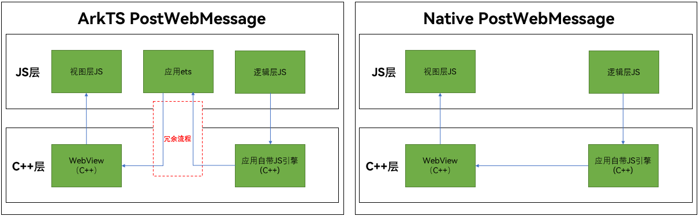

# 建立应用侧与前端页面数据通道(C/C++)

前端页面和应用侧之间可以使用Native方法实现两端通信（以下简称Native PostWebMessage），可解决ArkTS环境的冗余切换，同时允许发送消息、回调在非UI线程上运行，避免造成UI阻塞。当前只支持string和buffer数据类型。

## 适用的应用架构

应用使用ArkTS、C++语言混合开发，或本身应用架构较贴近于小程序架构，自带C++侧环境，推荐使用ArkWeb在Native侧提供的[ArkWeb_ControllerAPI](../reference/apis-arkweb/_ark_web___controller_a_p_i.md#arkweb_controllerapi)、[ArkWeb_WebMessageAPI](../reference/apis-arkweb/_ark_web___web_message_a_p_i.md#arkweb_webmessageapi)、[ArkWeb_WebMessagePortAPI](../reference/apis-arkweb/_ark_web___web_message_port_a_p_i.md#arkweb_webmessageportapi)实现PostWebMessage功能。

  

  上图展示了具有普遍适用性的小程序的通用架构。在这一架构中，逻辑层依赖于应用程序自带的JavaScript运行时，该运行时在一个已有的C++环境中运行。通过Native接口，逻辑层能够直接在C++环境中与视图层（其中ArkWeb充当渲染器）进行通信，无需回退至ArkTS环境使用ArkTS PostWebMessage接口。

  左图是使用ArkTS PostWebMessage接口构建小程序的方案，如红框所示，应用需要先调用到ArkTS环境，再调用到C++环境。右图是使用Native PostWebMessage接口构建小程序的方案，不需要ArkTS环境和C++环境的切换，执行效率更高。

  

## 使用Native接口实现PostWebMessage通信

### 使用Native接口绑定ArkWeb

- ArkWeb组件声明在ArkTS侧，需要用户自定义一个标识webTag，并将webTag通过Node-API传至应用C++侧。后续ArkWeb Native接口使用时，均需webTag作为对应组件的唯一标识。

- ArkTS侧

  ```ts
  import { webview } from '@kit.ArkWeb';
  // 自定义webTag，在WebviewController创建时作为入参传入，建立controller与webTag的映射关系
  webTag: string = 'ArkWeb1';
  controller: webview.WebviewController = new webview.WebviewController(this.webTag);
  // ...
  // aboutToAppear中将webTag通过Node-API接口传入C++侧，作为C++侧ArkWeb组件的唯一标识
  aboutToAppear() {
    console.info("aboutToAppear")
    // 初始化web ndk
    testNapi.nativeWebInit(this.webTag);
  }
  // ...
  ```

### 使用Native接口获取API结构体

ArkWeb Native侧需先获取API结构体，才能调用结构体里的Native API。ArkWeb Native侧API通过函数[OH_ArkWeb_GetNativeAPI](../reference/apis-arkweb/_web.md#oh_arkweb_getnativeapi)获取，根据入参type不同，可获取对应的函数指针结构体。其中本指导涉及[ArkWeb_ControllerAPI](../reference/apis-arkweb/_ark_web___controller_a_p_i.md#arkweb_controllerapi)、[ArkWeb_WebMessageAPI](../reference/apis-arkweb/_ark_web___web_message_a_p_i.md#arkweb_webmessageapi)、[ArkWeb_WebMessagePortAPI](../reference/apis-arkweb/_ark_web___web_message_port_a_p_i.md#arkweb_webmessageportapi)。

  ```c++
  static ArkWeb_ControllerAPI *controller = nullptr;
  static ArkWeb_WebMessagePortAPI *webMessagePort = nullptr;
  static ArkWeb_WebMessageAPI *webMessage = nullptr;
  // ...
  controller = reinterpret_cast<ArkWeb_ControllerAPI *>(OH_ArkWeb_GetNativeAPI(ARKWEB_NATIVE_CONTROLLER));
  webMessagePort =
      reinterpret_cast<ArkWeb_WebMessagePortAPI *>(OH_ArkWeb_GetNativeAPI(ARKWEB_NATIVE_WEB_MESSAGE_PORT));
  webMessage = reinterpret_cast<ArkWeb_WebMessageAPI *>(OH_ArkWeb_GetNativeAPI(ARKWEB_NATIVE_WEB_MESSAGE));
  ```

### 完整示例

在调用API前建议通过[ARKWEB_MEMBER_MISSING](../reference/apis-arkweb/_web.md#arkweb_member_missing)校验该函数结构体是否有对应函数指针，避免SDK与设备ROM不匹配导致crash问题。[createWebMessagePorts](../reference/apis-arkweb/_ark_web___controller_a_p_i.md#createwebmessageports)、[postWebMessage](../reference/apis-arkweb/_ark_web___controller_a_p_i.md#postwebmessage)、[close](../reference/apis-arkweb/_ark_web___web_message_port_a_p_i.md#close)需运行在UI线程。

* 前端页面代码

  ```html
  <!-- entry/src/main/resources/rawfile/index.html -->
  <!-- index.html -->
  <!DOCTYPE html>
  <html lang="en-gb">
  <body>
  <h1>etsRunJavaScriptExt测试demo</h1>
  <h1 id="h1"></h1>
  <h3 id="msg">Receive string:</h3>
  <h3 id="msg2">Receive arraybuffer:</h3>

  </body>
  <script type="text/javascript">
  var h5Port;

  window.addEventListener('message', function (event) {
      if (event.data == 'init_web_messageport') {
          const port = event.ports.at(0); // 1. 保存从应用侧发送过来的端口。
          if (port) {
              console.log("hwd In html got message");
              h5Port = port;
              port.onmessage = function (event) {
                  console.log("hwd In html got message");
                  // 2. 接收应用侧发送过来的消息.
                  var result = event.data;
                  var type_s = typeof (result)
                  switch (type_s) {
                      case "object":
                          if (result instanceof ArrayBuffer) {
                              type_s = "ArrayBuffer";
                              var view = new Uint8Array(result);
                              const decoder = new TextDecoder('utf-8');
                              result = decoder.decode(result);
                          } else if (result instanceof Error) {
                              type_s = "Error";
                          } else if (result instanceof Array) {
                              type_s = "Array";
                          }
                          break;
                      default:
                          break;
                  }
                  console.log("H5 recv type: " + type_s + "\nH5 recv result: " + result)
                  document.getElementById("msg").innerHTML = "recv type: " + type_s;
                  document.getElementById("msg2").innerHTML = "recv value: " + result;
              }
              h5Port.onmessageerror = (event) => {
                  console.error(`hwd In html Error receiving message: ${event}`);
              };
          }
      }
  })
  window.onerror = function(message, url, line, column, error) {
    console.log("JavaScript Error: " + message + " on line " + line + " in " + url);
    document.getElementById("h1").innerHTML = "执行函数失败"
  };

  // 3. 使用h5Port向应用侧发送消息。
  function postStringToApp() {
      if (h5Port) {
          h5Port.postMessage("send string from H5");
      } else {
          console.error("In html h5port is null, please init first");
      }
  }
  function postBufferToApp() {
      if (h5Port) {
          const str = "Hello, World!";
          const encoder = new TextEncoder();
          const uint8Array = encoder.encode(str);
          h5Port.postMessage(uint8Array.buffer);
      } else {
          console.error("In html h5port is null, please init first");
      }
  }

  function postJsonToApp() {
      if (h5Port) {
          var e = {"json": "json"};
          h5Port.postMessage(e);
      } else {
          console.error("In html h5port is null, please init first");
      }
  }

  function postArrayStringToApp() {
      if (h5Port) {
          h5Port.postMessage(["1", "2", "3"]);
      } else {
          console.error("In html h5port is null, please init first");
      }
  }

  function postNumberToApp() {
      if (h5Port) {
          h5Port.postMessage(123);
      } else {
          console.error("In html h5port is null, please init first");
      }
  }
  class MyClass {
    constructor() {
      // 构造器
      this.myProperty = 'Hello, World!';
    }

    myMethod() {
      // 实例方法
      console.log(this.myProperty);
    }

    static myStaticMethod() {
      // 静态方法
      console.log('This is a static method.');
    }
  }
  function postObjectToApp() {
      if (h5Port) {
          h5Port.postMessage(new MyClass());
      } else {
          console.error("In html h5port is null, please init first");
      }
  }

  </script>
  </html>
  ```

* ArkTS侧代码

  ```javascript
  // entry/src/main/ets/pages/Index.ets
  import testNapi from 'libentry.so'
  import web_webview from '@ohos.web.webview';
  import { BusinessError } from '@ohos.base';

  @Entry
  @Component
  struct Index {
    @State webTag: string = 'postMessage';
    controller: web_webview.WebviewController = new web_webview.WebviewController(this.webTag);
    @State h5Log: string = 'Display received message send from HTML';

    aboutToAppear() {
      web_webview.WebviewController.setWebDebuggingAccess(true);
      // 初始化web ndk
      testNapi.nativeWebInit(this.webTag);
    }

    aboutToDisAppear() {
      console.error("aboutToDisAppear")
    }

    build() {
      Scroll() {
        Column({ space: 10 }) {
          // 展示H5接收到的内容
          Text("H5侧接收到应用侧发送消息展示")
          TextArea({text: this.h5Log})
            .id("log_area")
            .width("100%")
            .height(100)
            .border({ width: 1 })
          Text("应用侧按钮")
          Row() {
            Button('createNoControllerTagPort')
              .id("create_no_tag_btn")
              .onClick(() => {
                try {
                  testNapi.createWebMessagePorts("noTag");
                } catch (error) {
                  console.error(`ErrorCode: ${(error as BusinessError).code},  Message: ${(error as BusinessError).message}`);
                }
              })
            Button('createPort')
              .id("create_port_btn")
              .onClick(() => {
                try {
                  testNapi.createWebMessagePorts(this.webTag);
                } catch (error) {
                  console.error(`ErrorCode: ${(error as BusinessError).code},  Message: ${(error as BusinessError).message}`);
                }
              })
          }

          Row({ space: 10 }) {

            Button('setHandler')
              .id("set_handler_btn")
              .onClick(() => {
                try {
                  testNapi.setMessageEventHandler(this.webTag);
                } catch (error) {
                  console.error(`ErrorCode: ${(error as BusinessError).code},  Message: ${(error as BusinessError).message}`);
                }
              })

            Button('setHandlerThread')
              .id("set_handler_thread_btn")
              .onClick(() => {
                try {
                  testNapi.setMessageEventHandlerThread(this.webTag);
                } catch (error) {
                  console.error(`ErrorCode: ${(error as BusinessError).code},  Message: ${(error as BusinessError).message}`);
                }
              })
          }

          Row({ space: 10 }) {
            Button('SendString')
              .id("send_string_btn")
              .onClick(() => {
                try {
                  this.h5Log = ""
                  testNapi.postMessage(this.webTag);
                } catch (error) {
                  console.error(`ErrorCode: ${(error as BusinessError).code},  Message: ${(error as BusinessError).message}`);
                }
              })
            Button('SendStringThread')
              .id("send_string_thread_btn")
              .onClick(() => {
                try {
                  this.h5Log = ""
                  testNapi.postMessageThread(this.webTag);
                } catch (error) {
                  console.error(`ErrorCode: ${(error as BusinessError).code},  Message: ${(error as BusinessError).message}`);
                }
              })
          }

          Row({ space: 10 }) {
            Button('SendBuffer')
              .id("send_buffer_btn")
              .onClick(() => {
                try {
                  this.h5Log = ""
                  testNapi.postBufferMessage(this.webTag);
                } catch (error) {
                  console.error(`ErrorCode: ${(error as BusinessError).code},  Message: ${(error as BusinessError).message}`);
                }
              })
            Button('SendNone')
              .id("send_none_btn")
              .onClick(() => {
                try {
                  this.h5Log = ""
                  testNapi.postNoneMessage(this.webTag);
                } catch (error) {
                  console.error(`ErrorCode: ${(error as BusinessError).code},  Message: ${(error as BusinessError).message}`);
                }
              })
          }

          Row({ space: 10 }) {

            Button('closePort')
              .id("close_port_btn")
              .onClick(() => {
                try {
                  testNapi.closeMessagePort(this.webTag);
                } catch (error) {
                  console.error(`ErrorCode: ${(error as BusinessError).code},  Message: ${(error as BusinessError).message}`);
                }
              })
            Button('destroyNullPort')
              .id("destroy_null_btn")
              .onClick(() => {
                try {
                  testNapi.destroyNullMessagePort(this.webTag);
                } catch (error) {
                  console.error(`ErrorCode: ${(error as BusinessError).code},  Message: ${(error as BusinessError).message}`);
                }
              })
            Button('destroyPort')
              .id("destroy_port_btn")
              .onClick(() => {
                try {
                  testNapi.destroyMessagePort(this.webTag);
                } catch (error) {
                  console.error(`ErrorCode: ${(error as BusinessError).code},  Message: ${(error as BusinessError).message}`);
                }
              })
          }
          .width("100%")
          .padding(10)
          .border({ width: 1 })

          Column({ space: 10 }) {
            Text("H5侧发送按钮")
            Row({ space: 10 }) {
              Button('H5String')
                .id("h5_send_string_btn")
                .onClick(() => {
                  try {
                    this.controller.runJavaScript("for(var i = 0; i < 2000; i++) postStringToApp()")
                  } catch (error) {
                    console.error(`ErrorCode: ${(error as BusinessError).code},  Message: ${(error as BusinessError).message}`);
                  }
                })
              Button('H5Buffer')
                .id("h5_send_buffer_btn")
                .onClick(() => {
                  try {
                    this.controller.runJavaScript("postBufferToApp()")
                  } catch (error) {
                    console.error(`ErrorCode: ${(error as BusinessError).code},  Message: ${(error as BusinessError).message}`);
                  }
                })
              Button('H5Number')
                .id("h5_send_number_btn")
                .onClick(() => {
                  try {
                    this.controller.runJavaScript("postNumberToApp()")
                  } catch (error) {
                    console.error(`ErrorCode: ${(error as BusinessError).code},  Message: ${(error as BusinessError).message}`);
                  }
                })
            }

            Row({ space: 10 }) {
              Button('H5Json')
                .id("h5_send_json_btn")
                .onClick(() => {
                  try {
                    this.controller.runJavaScript("postJsonToApp()")
                  } catch (error) {
                    console.error(`ErrorCode: ${(error as BusinessError).code},  Message: ${(error as BusinessError).message}`);
                  }
                })
              Button('H5Array')
                .id("h5_send_array_btn")
                .onClick(() => {
                  try {
                    this.controller.runJavaScript("postArrayStringToApp()")
                  } catch (error) {
                    console.error(`ErrorCode: ${(error as BusinessError).code},  Message: ${(error as BusinessError).message}`);
                  }
                })
              Button('H5Object')
                .id("h5_send_object_btn")
                .onClick(() => {
                  try {
                    this.controller.runJavaScript("postObjectToApp()")
                  } catch (error) {
                    console.error(`ErrorCode: ${(error as BusinessError).code},  Message: ${(error as BusinessError).message}`);
                  }
                })
            }
          }
          .width("100%")
          .margin(10)
          .padding(10)
          .border({ width: 1 })

          Web({ src: $rawfile('index.html'), controller: this.controller })
            .onConsole((event) => {
              if (event) {
                let msg = event.message.getMessage()
                if (msg.startsWith("H5")) {
                  this.h5Log = event.message.getMessage() + "\n" + this.h5Log
                }
              }
              return false;
            })
        }
      }.height('100%')
      .scrollable(ScrollDirection.Vertical)
      .scrollBar(BarState.Off)
      .edgeEffect(EdgeEffect.Spring)
    }
  }
  ```

* Node-API侧暴露ArkTS接口

  ```javascript
  // entry/src/main/cpp/types/libentry/index.d.ts
  export const nativeWebInit: (webName: string) => void;
  export const createWebMessagePorts: (webName: string) => void;
  export const postMessage: (webName: string) => void;
  export const postNoneMessage: (webName: string) => void;
  export const setMessageEventHandler: (webName: string) => void;
  export const closeMessagePort: (webName: string) => void;
  export const destroyMessagePort: (webName: string) => void;
  export const postBufferMessage: (webName: string) => void;
  export const destroyNullMessagePort: (webName: string) => void;
  export const setMessageEventHandlerThread: (webName: string) => void;
  export const postMessageThread: (webName: string) => void;
  ```

* Node-API侧编译配置

  ```c++
  # entry/src/main/cpp/CMakeLists.txt
  # the minimum version of CMake.
  cmake_minimum_required(VERSION 3.4.1)
  project(NDKPostMessage)

  set(NATIVERENDER_ROOT_PATH ${CMAKE_CURRENT_SOURCE_DIR})

  if(DEFINED PACKAGE_FIND_FILE)
      include(${PACKAGE_FIND_FILE})
  endif()

  include_directories(${NATIVERENDER_ROOT_PATH}
                      ${NATIVERENDER_ROOT_PATH}/include)

  add_library(entry SHARED hello.cpp)

  find_library(
      # Sets the name of the path variable.
      hilog-lib
      # Specifies the name of the NDK library that
      # you want CMake to locate.
      hilog_ndk.z
  )

  target_link_libraries(entry PUBLIC libace_napi.z.so ${hilog-lib} libohweb.so)
  ```

* Node-API层代码

  ```c++
  // entry/src/main/cpp/hello.cpp
  #include "napi/native_api.h"
  #include <bits/alltypes.h>
  #include <memory>
  #include <string>
  #include <sys/types.h>
  #include <iostream>
  #include <map>
  #include "hilog/log.h"
  #include "web/arkweb_interface.h"
  #include <thread>

  constexpr unsigned int LOG_PRINT_DOMAIN = 0xFF00;
  ArkWeb_ControllerAPI *controller = nullptr;

  ArkWeb_WebMessagePortAPI *webMessagePort = nullptr;
  ArkWeb_WebMessageAPI *webMessage = nullptr;
  size_t web_message_port_size = 0;
  ArkWeb_WebMessagePortPtr *g_web_message_port_arr = nullptr;

  static void WebMessagePortCallback(const char *webTag, const ArkWeb_WebMessagePortPtr port,
                                    const ArkWeb_WebMessagePtr message, void *userData) {
      OH_LOG_Print(LOG_APP, LOG_INFO, LOG_PRINT_DOMAIN, "ArkWeb",
                  "ndk WebMesagePortCallback webTag:%{public}s,messageType:%{public}d", webTag,
                  webMessage->getType(message));
      size_t len = 0;
      void *back = webMessage->getData(message, &len);
      if (webMessage->getType(message) == ArkWeb_WebMessageType::ARKWEB_STRING) {
          OH_LOG_Print(LOG_APP, LOG_INFO, LOG_PRINT_DOMAIN, "ArkWeb",
                      "ndk WebMesagePortCallback message:%{public}s,messageSize:%{public}d", back, len);
      } else if (webMessage->getType(message) == ArkWeb_WebMessageType::ARKWEB_BUFFER) {
          OH_LOG_Print(LOG_APP, LOG_INFO, LOG_PRINT_DOMAIN, "ArkWeb",
                      "ndk WebMesagePortCallback messageSize:%{public}d", len);
      }
  }

  static napi_value NativeWebInit(napi_env env, napi_callback_info info) {
      OH_LOG_Print(LOG_APP, LOG_INFO, LOG_PRINT_DOMAIN, "ArkWeb", "ndk NativeWebInit start");
      size_t argc = 1;
      napi_value args[1] = {nullptr};
      napi_get_cb_info(env, info, &argc, args, nullptr, nullptr);
      // 获取第一个参数webTag
      size_t webTagSize = 0;
      napi_get_value_string_utf8(env, args[0], nullptr, 0, &webTagSize);
      char *webTagValue = new (std::nothrow) char[webTagSize + 1];
      size_t webTagLength = 0;
      napi_get_value_string_utf8(env, args[0], webTagValue, webTagSize + 1, &webTagLength);
      OH_LOG_Print(LOG_APP, LOG_ERROR, LOG_PRINT_DOMAIN, "ArkWeb", "ndk NativeWebInit webTag:%{public}s", webTagValue);

      controller = reinterpret_cast<ArkWeb_ControllerAPI *>(OH_ArkWeb_GetNativeAPI(ARKWEB_NATIVE_CONTROLLER));
      if (controller)
          OH_LOG_Print(LOG_APP, LOG_ERROR, LOG_PRINT_DOMAIN, "ArkWeb", "get ArkWeb_ControllerAPI success");

      webMessagePort =
          reinterpret_cast<ArkWeb_WebMessagePortAPI *>(OH_ArkWeb_GetNativeAPI(ARKWEB_NATIVE_WEB_MESSAGE_PORT));
      if (webMessagePort)
          OH_LOG_Print(LOG_APP, LOG_ERROR, LOG_PRINT_DOMAIN, "ArkWeb", "get ArkWeb_WebMessagePortAPI success");

      webMessage = reinterpret_cast<ArkWeb_WebMessageAPI *>(OH_ArkWeb_GetNativeAPI(ARKWEB_NATIVE_WEB_MESSAGE));
      if (webMessage)
          OH_LOG_Print(LOG_APP, LOG_ERROR, LOG_PRINT_DOMAIN, "ArkWeb", "get ArkWeb_WebMessageAPI success");

      OH_LOG_Print(LOG_APP, LOG_INFO, LOG_PRINT_DOMAIN, "ArkWeb", "ndk NativeWebInit end");

      return nullptr;
  }

  static napi_value createWebMessagePorts(napi_env env, napi_callback_info info) {
      size_t argc = 2;
      napi_value args[2] = {nullptr};
      napi_get_cb_info(env, info, &argc, args, nullptr, nullptr);

      // 获取第一个参数webTag
      size_t webTagSize = 0;
      napi_get_value_string_utf8(env, args[0], nullptr, 0, &webTagSize);
      char *webTagValue = new (std::nothrow) char[webTagSize + 1];
      size_t webTagLength = 0;
      napi_get_value_string_utf8(env, args[0], webTagValue, webTagSize + 1, &webTagLength);
      OH_LOG_Print(LOG_APP, LOG_INFO, LOG_PRINT_DOMAIN, "ArkWeb", "ndk Refresh webTag:%{public}s", webTagValue);

      // 初始化端口
      OH_LOG_Print(LOG_APP, LOG_INFO, LOG_PRINT_DOMAIN, "ArkWeb", "ndk createWebMessagePorts begin");
      g_web_message_port_arr = controller->createWebMessagePorts(webTagValue, &web_message_port_size);
      // 把其中一个端口发送给HTML
      ArkWeb_ErrorCode code =
          controller->postWebMessage(webTagValue, "init_web_messageport", g_web_message_port_arr, 1, "*");
      OH_LOG_Print(LOG_APP, LOG_INFO, LOG_PRINT_DOMAIN, "ArkWeb", "ndk postWebMessage ArkWeb_ErrorCode:%{public}d", code);
      OH_LOG_Print(LOG_APP, LOG_INFO, LOG_PRINT_DOMAIN, "ArkWeb",
                  "ndk createWebMessagePorts end, web message port size:%{public}d", web_message_port_size);
      return nullptr;
  }

  static napi_value postMessage(napi_env env, napi_callback_info info) {
      size_t argc = 2;
      napi_value args[2] = {nullptr};
      napi_get_cb_info(env, info, &argc, args, nullptr, nullptr);

      // 获取第一个参数webTag
      size_t webTagSize = 0;
      napi_get_value_string_utf8(env, args[0], nullptr, 0, &webTagSize);
      char *webTagValue = new (std::nothrow) char[webTagSize + 1];
      size_t webTagLength = 0;
      napi_get_value_string_utf8(env, args[0], webTagValue, webTagSize + 1, &webTagLength);
      OH_LOG_Print(LOG_APP, LOG_INFO, LOG_PRINT_DOMAIN, "ArkWeb", "ndk Refresh webTag:%{public}s", webTagValue);

      // 发送消息
      OH_LOG_Print(LOG_APP, LOG_INFO, LOG_PRINT_DOMAIN, "ArkWeb", "ndk postMessage begin");

      if (g_web_message_port_arr == nullptr) {
          OH_LOG_Print(LOG_APP, LOG_ERROR, LOG_PRINT_DOMAIN, "ArkWeb", "webMessagePort is nullptr");
          return nullptr;
      }
      ArkWeb_WebMessagePtr message = webMessage->createWebMessage();
      webMessage->setType(message, ArkWeb_WebMessageType::ARKWEB_STRING);
      std::string str = "send string from native";
      webMessage->setData(message, (void *)str.c_str(), str.length() + 1);
      ArkWeb_ErrorCode code = webMessagePort->postMessage(g_web_message_port_arr[1], webTagValue, message);
      OH_LOG_Print(LOG_APP, LOG_INFO, LOG_PRINT_DOMAIN, "ArkWeb", "ndk postMessage ArkWeb_ErrorCode:%{public}d", code);
      webMessage->destroyWebMessage(&message);
      OH_LOG_Print(LOG_APP, LOG_INFO, LOG_PRINT_DOMAIN, "ArkWeb", "ndk postMessage end, web message port size:%{public}d",
                  web_message_port_size);
      return nullptr;
  }


  // 在线程中发消息
  void sendMessage(const char *webTag, const ArkWeb_WebMessagePtr message) {
      // 发送1000次
      for (int i = 0; i < 1000; i++) {
          OH_LOG_Print(LOG_APP, LOG_INFO, LOG_PRINT_DOMAIN, "ArkWeb", "sendMessage in thread %{public}d", i);
          if (g_web_message_port_arr && webTag && message) {
            webMessagePort->postMessage(g_web_message_port_arr[1], webTag, message);
          }
      }
  }
  static napi_value postMessageThread(napi_env env, napi_callback_info info) {
      size_t argc = 2;
      napi_value args[2] = {nullptr};
      napi_get_cb_info(env, info, &argc, args, nullptr, nullptr);

      // 获取第一个参数webTag
      size_t webTagSize = 0;
      napi_get_value_string_utf8(env, args[0], nullptr, 0, &webTagSize);
      char *webTagValue = new (std::nothrow) char[webTagSize + 1];
      size_t webTagLength = 0;
      napi_get_value_string_utf8(env, args[0], webTagValue, webTagSize + 1, &webTagLength);
      OH_LOG_Print(LOG_APP, LOG_INFO, LOG_PRINT_DOMAIN, "ArkWeb", "ndk Refresh webTag:%{public}s", webTagValue);

      // 构造消息
      OH_LOG_Print(LOG_APP, LOG_INFO, LOG_PRINT_DOMAIN, "ArkWeb", "ndk postMessage begin");

      if (g_web_message_port_arr == nullptr) {
          OH_LOG_Print(LOG_APP, LOG_ERROR, LOG_PRINT_DOMAIN, "ArkWeb", "webMessagePort is nullptr");
          return nullptr;
      }
      ArkWeb_WebMessagePtr message = webMessage->createWebMessage();
      webMessage->setType(message, ArkWeb_WebMessageType::ARKWEB_STRING);
      std::string str = "thread message";
      webMessage->setData(message, (void *)str.c_str(), str.length() + 1);
      const int numThreads = 5;
      std::thread threads[numThreads];

      // 创建线程
      for (int i = 0; i < numThreads; ++i) {
          threads[i] = std::thread(sendMessage, webTagValue, message);
      }

      // 等待所有线程完成
      for (int i = 0; i < numThreads; ++i) {
          threads[i].detach();
      }
      return nullptr;
  }

  // 在线程中注册回调
  void setHandler(const char *webTag) {
      OH_LOG_Print(LOG_APP, LOG_INFO, LOG_PRINT_DOMAIN, "ArkWeb", "setMessageEventHandler in thread");
      webMessagePort->setMessageEventHandler(g_web_message_port_arr[1], webTag, WebMessagePortCallback, NULL);
  }

  static napi_value setMessageEventHandlerThread(napi_env env, napi_callback_info info) {
      size_t argc = 2;
      napi_value args[2] = {nullptr};
      napi_get_cb_info(env, info, &argc, args, nullptr, nullptr);

      // 获取第一个参数webTag
      size_t webTagSize = 0;
      napi_get_value_string_utf8(env, args[0], nullptr, 0, &webTagSize);
      char *webTagValue = new (std::nothrow) char[webTagSize + 1];
      size_t webTagLength = 0;
      napi_get_value_string_utf8(env, args[0], webTagValue, webTagSize + 1, &webTagLength);
      OH_LOG_Print(LOG_APP, LOG_INFO, LOG_PRINT_DOMAIN, "ArkWeb", "ndk Refresh webTag:%{public}s", webTagValue);

      // 注册回调
      OH_LOG_Print(LOG_APP, LOG_INFO, LOG_PRINT_DOMAIN, "ArkWeb", "ndk SetMessageEventHandler begin");
      if (g_web_message_port_arr == nullptr) {
          OH_LOG_Print(LOG_APP, LOG_ERROR, LOG_PRINT_DOMAIN, "ArkWeb", "webMessagePort is nullptr");
          return nullptr;
      }
      std::thread thread(setHandler, webTagValue);
      thread.detach();
      webMessagePort->setMessageEventHandler(g_web_message_port_arr[1], webTagValue, WebMessagePortCallback, NULL);
      OH_LOG_Print(LOG_APP, LOG_INFO, LOG_PRINT_DOMAIN, "ArkWeb",
                  "ndk SetMessageEventHandler end, web message port size:%{public}d", web_message_port_size);
      return nullptr;
  }
  static napi_value postNoneMessage(napi_env env, napi_callback_info info) {
      size_t argc = 2;
      napi_value args[2] = {nullptr};
      napi_get_cb_info(env, info, &argc, args, nullptr, nullptr);

      // 获取第一个参数webTag
      size_t webTagSize = 0;
      napi_get_value_string_utf8(env, args[0], nullptr, 0, &webTagSize);
      char *webTagValue = new (std::nothrow) char[webTagSize + 1];
      size_t webTagLength = 0;
      napi_get_value_string_utf8(env, args[0], webTagValue, webTagSize + 1, &webTagLength);
      OH_LOG_Print(LOG_APP, LOG_INFO, LOG_PRINT_DOMAIN, "ArkWeb", "ndk Refresh webTag:%{public}s", webTagValue);

      // 发送消息
      OH_LOG_Print(LOG_APP, LOG_INFO, LOG_PRINT_DOMAIN, "ArkWeb", "ndk postMessage begin");

      if (g_web_message_port_arr == nullptr) {
          OH_LOG_Print(LOG_APP, LOG_ERROR, LOG_PRINT_DOMAIN, "ArkWeb", "webMessagePort is nullptr");
          return nullptr;
      }
      ArkWeb_WebMessagePtr message = webMessage->createWebMessage();
      webMessage->setType(message, ArkWeb_WebMessageType::ARKWEB_NONE);
      std::string str = "send string from native";
      webMessage->setData(message, (void *)str.c_str(), str.length() + 1);
      webMessagePort->postMessage(g_web_message_port_arr[1], webTagValue, message);
      webMessage->destroyWebMessage(&message);
      OH_LOG_Print(LOG_APP, LOG_INFO, LOG_PRINT_DOMAIN, "ArkWeb", "ndk postMessage end, web message port size:%{public}d",
                  web_message_port_size);
      return nullptr;
  }

  static napi_value postBufferMessage(napi_env env, napi_callback_info info) {
      size_t argc = 2;
      napi_value args[2] = {nullptr};
      napi_get_cb_info(env, info, &argc, args, nullptr, nullptr);

      // 获取第一个参数webTag
      size_t webTagSize = 0;
      napi_get_value_string_utf8(env, args[0], nullptr, 0, &webTagSize);
      char *webTagValue = new (std::nothrow) char[webTagSize + 1];
      size_t webTagLength = 0;
      napi_get_value_string_utf8(env, args[0], webTagValue, webTagSize + 1, &webTagLength);
      OH_LOG_Print(LOG_APP, LOG_INFO, LOG_PRINT_DOMAIN, "ArkWeb", "ndk Refresh webTag:%{public}s", webTagValue);

      // 发送消息
      OH_LOG_Print(LOG_APP, LOG_INFO, LOG_PRINT_DOMAIN, "ArkWeb", "ndk postMessage begin");

      if (g_web_message_port_arr == nullptr) {
          OH_LOG_Print(LOG_APP, LOG_ERROR, LOG_PRINT_DOMAIN, "ArkWeb", "webMessagePort is nullptr");
          return nullptr;
      }
      ArkWeb_WebMessagePtr message1 = webMessage->createWebMessage();
      webMessage->setType(message1, ArkWeb_WebMessageType::ARKWEB_BUFFER);
      std::string str1 = "send buffer from native";
      webMessage->setData(message1, (void *)str1.c_str(), str1.length());
      webMessagePort->postMessage(g_web_message_port_arr[1], webTagValue, message1);
      webMessage->destroyWebMessage(&message1);
      OH_LOG_Print(LOG_APP, LOG_INFO, LOG_PRINT_DOMAIN, "ArkWeb", "ndk postMessage end, web message port size:%{public}d",
                  web_message_port_size);
      return nullptr;
  }

  static napi_value setMessageEventHandler(napi_env env, napi_callback_info info) {
      size_t argc = 2;
      napi_value args[2] = {nullptr};
      napi_get_cb_info(env, info, &argc, args, nullptr, nullptr);

      // 获取第一个参数webTag
      size_t webTagSize = 0;
      napi_get_value_string_utf8(env, args[0], nullptr, 0, &webTagSize);
      char *webTagValue = new (std::nothrow) char[webTagSize + 1];
      size_t webTagLength = 0;
      napi_get_value_string_utf8(env, args[0], webTagValue, webTagSize + 1, &webTagLength);
      OH_LOG_Print(LOG_APP, LOG_INFO, LOG_PRINT_DOMAIN, "ArkWeb", "ndk Refresh webTag:%{public}s", webTagValue);

      // 注册回调
      OH_LOG_Print(LOG_APP, LOG_INFO, LOG_PRINT_DOMAIN, "ArkWeb", "ndk SetMessageEventHandler begin");
      if (g_web_message_port_arr == nullptr) {
          OH_LOG_Print(LOG_APP, LOG_ERROR, LOG_PRINT_DOMAIN, "ArkWeb", "webMessagePort is nullptr");
          return nullptr;
      }
      webMessagePort->setMessageEventHandler(g_web_message_port_arr[1], webTagValue, WebMessagePortCallback, NULL);
      OH_LOG_Print(LOG_APP, LOG_INFO, LOG_PRINT_DOMAIN, "ArkWeb",
                  "ndk SetMessageEventHandler end, web message port size:%{public}d", web_message_port_size);
      return nullptr;
  }

  static napi_value closeMessagePort(napi_env env, napi_callback_info info) {
      size_t argc = 2;
      napi_value args[2] = {nullptr};
      napi_get_cb_info(env, info, &argc, args, nullptr, nullptr);

      // 获取第一个参数webTag
      size_t webTagSize = 0;
      napi_get_value_string_utf8(env, args[0], nullptr, 0, &webTagSize);
      char *webTagValue = new (std::nothrow) char[webTagSize + 1];
      size_t webTagLength = 0;
      napi_get_value_string_utf8(env, args[0], webTagValue, webTagSize + 1, &webTagLength);
      OH_LOG_Print(LOG_APP, LOG_INFO, LOG_PRINT_DOMAIN, "ArkWeb", "ndk Refresh webTag:%{public}s", webTagValue);

      // 关闭端口，先调用close，再调用destroyWebMessagePorts
      OH_LOG_Print(LOG_APP, LOG_INFO, LOG_PRINT_DOMAIN, "ArkWeb", "ndk SetMessageEventHandler begin");
      if (g_web_message_port_arr == nullptr) {
          OH_LOG_Print(LOG_APP, LOG_ERROR, LOG_PRINT_DOMAIN, "ArkWeb", "webMessagePort is nullptr");
          return nullptr;
      }
      webMessagePort->close(g_web_message_port_arr[0], webTagValue);
      OH_LOG_Print(LOG_APP, LOG_INFO, LOG_PRINT_DOMAIN, "ArkWeb",
                  "ndk SetMessageEventHandler end, web message port size:%{public}d", web_message_port_size);
      controller->refresh(webTagValue);
      return nullptr;
  }

  static napi_value destroyMessagePort(napi_env env, napi_callback_info info) {
      size_t argc = 2;
      napi_value args[2] = {nullptr};
      napi_get_cb_info(env, info, &argc, args, nullptr, nullptr);

      // 获取第一个参数webTag
      size_t webTagSize = 0;
      napi_get_value_string_utf8(env, args[0], nullptr, 0, &webTagSize);
      char *webTagValue = new (std::nothrow) char[webTagSize + 1];
      size_t webTagLength = 0;
      napi_get_value_string_utf8(env, args[0], webTagValue, webTagSize + 1, &webTagLength);
      OH_LOG_Print(LOG_APP, LOG_INFO, LOG_PRINT_DOMAIN, "ArkWeb", "ndk Refresh webTag:%{public}s", webTagValue);

      // 释放内存，先调用close，再调用destroyWebMessagePorts
      OH_LOG_Print(LOG_APP, LOG_INFO, LOG_PRINT_DOMAIN, "ArkWeb", "ndk SetMessageEventHandler begin");
      if (g_web_message_port_arr == nullptr) {
          OH_LOG_Print(LOG_APP, LOG_ERROR, LOG_PRINT_DOMAIN, "ArkWeb", "webMessagePort is nullptr");
          return nullptr;
      }
      controller->destroyWebMessagePorts(&g_web_message_port_arr, web_message_port_size);
      OH_LOG_Print(LOG_APP, LOG_INFO, LOG_PRINT_DOMAIN, "ArkWeb",
                  "ndk SetMessageEventHandler end, web message port size:%{public}d", web_message_port_size);
      return nullptr;
  }

  static napi_value destroyNullMessagePort(napi_env env, napi_callback_info info) {
      size_t argc = 2;
      napi_value args[2] = {nullptr};
      napi_get_cb_info(env, info, &argc, args, nullptr, nullptr);

      // 获取第一个参数webTag
      size_t webTagSize = 0;
      napi_get_value_string_utf8(env, args[0], nullptr, 0, &webTagSize);
      char *webTagValue = new (std::nothrow) char[webTagSize + 1];
      size_t webTagLength = 0;
      napi_get_value_string_utf8(env, args[0], webTagValue, webTagSize + 1, &webTagLength);
      OH_LOG_Print(LOG_APP, LOG_INFO, LOG_PRINT_DOMAIN, "ArkWeb", "ndk Refresh webTag:%{public}s", webTagValue);

      // 释放内存，先调用close，再调用destroyWebMessagePorts
      OH_LOG_Print(LOG_APP, LOG_INFO, LOG_PRINT_DOMAIN, "ArkWeb", "ndk SetMessageEventHandler begin");

      controller->destroyWebMessagePorts(&g_web_message_port_arr, web_message_port_size);

      OH_LOG_Print(LOG_APP, LOG_INFO, LOG_PRINT_DOMAIN, "ArkWeb",
                  "ndk SetMessageEventHandler end, web message port size:%{public}d", web_message_port_size);
      return nullptr;
  }

  EXTERN_C_START
  static napi_value Init(napi_env env, napi_value exports) {
      napi_property_descriptor desc[] = {
          {"nativeWebInit", nullptr, NativeWebInit, nullptr, nullptr, nullptr, napi_default, nullptr},
          {"createWebMessagePorts", nullptr, createWebMessagePorts, nullptr, nullptr, nullptr, napi_default, nullptr},
          {"postMessage", nullptr, postMessage, nullptr, nullptr, nullptr, napi_default, nullptr},
          {"postNoneMessage", nullptr, postNoneMessage, nullptr, nullptr, nullptr, napi_default, nullptr},
          {"postBufferMessage", nullptr, postBufferMessage, nullptr, nullptr, nullptr, napi_default, nullptr},
          {"setMessageEventHandler", nullptr, setMessageEventHandler, nullptr, nullptr, nullptr, napi_default, nullptr},
          {"closeMessagePort", nullptr, closeMessagePort, nullptr, nullptr, nullptr, napi_default, nullptr},
          {"destroyMessagePort", nullptr, destroyMessagePort, nullptr, nullptr, nullptr, napi_default, nullptr},
          {"postMessageThread", nullptr, postMessageThread, nullptr, nullptr, nullptr, napi_default, nullptr},
          {"setMessageEventHandlerThread", nullptr, setMessageEventHandlerThread, nullptr, nullptr, nullptr, napi_default,
          nullptr},
          {"destroyNullMessagePort", nullptr, destroyNullMessagePort, nullptr, nullptr, nullptr, napi_default, nullptr},
      };
      napi_define_properties(env, exports, sizeof(desc) / sizeof(desc[0]), desc);
      return exports;
  }
  EXTERN_C_END

  static napi_module demoModule = {
      .nm_version = 1,
      .nm_flags = 0,
      .nm_filename = nullptr,
      .nm_register_func = Init,
      .nm_modname = "entry",
      .nm_priv = ((void *)0),
      .reserved = {0},
  };

  extern "C" __attribute__((constructor)) void RegisterEntryModule(void) { napi_module_register(&demoModule); }
  ```