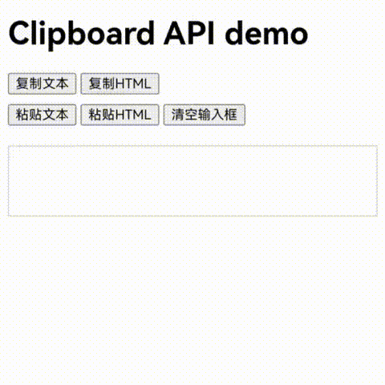
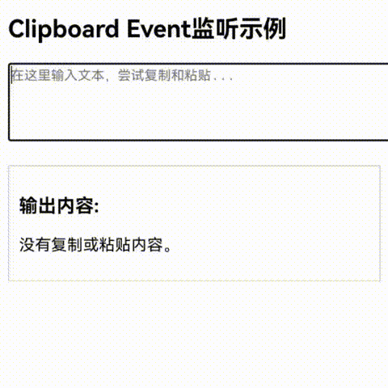

# 使用Web组件与系统剪贴板交互处理网页内容
<!--Kit: ArkWeb-->
<!--Subsystem: Web-->
<!--Owner: @zourongchun-->
<!--Designer: @zhufenghao-->
<!--Tester: @ghiker-->
<!--Adviser: @HelloCrease-->

开发者能够通过Web组件和系统剪贴板进行交互，实现各种类型数据的复制和粘贴。支持通过[菜单](web_menu.md)、键盘快捷键以及[W3C剪贴板接口](https://www.w3.org/TR/clipboard-apis/)对网页内容执行剪切、复制和粘贴操作。

## 通过菜单或键盘快捷键与系统剪贴板交互

开发者能够自定义菜单中的功能选项，当用户选择特定选项时，开发者可以通过调用[cut](../reference/apis-arkweb/arkts-basic-components-web-WebContextMenuResult.md#cut9)、[copy](../reference/apis-arkweb/arkts-basic-components-web-WebContextMenuResult.md#copy9)、[copyImage](../reference/apis-arkweb/arkts-basic-components-web-WebContextMenuResult.md#copyimage9)、[paste](../reference/apis-arkweb/arkts-basic-components-web-WebContextMenuResult.md#paste9)、[pasteAndMatchStyle](../reference/apis-arkweb/arkts-basic-components-web-WebContextMenuResult.md#pasteandmatchstyle20)等接口，将网页中的文本、HTML或图片数据复制到系统剪贴板，或从系统剪贴板粘贴到网页的可输入区域。

菜单功能接口的使用可参考[使用Web组件菜单处理网页内容](web_menu.md)。

当设备有物理键盘时，用户也能够通过键盘快捷键：CTRL + X（剪切）、CTRL + C（复制）、CTRL + V（粘贴），与剪贴板进行交互。

> **说明：**
>
> 通过[paste](../reference/apis-arkweb/arkts-basic-components-web-WebContextMenuResult.md#paste9)、[pasteAndMatchStyle](../reference/apis-arkweb/arkts-basic-components-web-WebContextMenuResult.md#pasteandmatchstyle20)接口访问系统剪贴板内容，需[申请访问剪贴板权限](../basic-services/pasteboard/get-pastedata-permission-guidelines.md)：ohos.permission.READ_PASTEBOARD。

## 通过W3C异步剪贴板接口与系统剪贴板交互

[异步剪贴板接口（Async Clipboard API）](https://www.w3.org/TR/clipboard-apis/#async-clipboard-api)提供给网页开发者读写系统剪贴板的方法，这让Web应用程序可以实现剪切、复制和粘贴的功能。

- writeText：将文本内容写入系统剪贴板。

```javascript
// 写入文本到剪贴板
await navigator.clipboard.writeText("文本内容");
```

- write：将任意类型内容写入系统剪贴板。

```javascript
// 写入 HTML到剪贴板
const clipboardItem = new ClipboardItem({
    'text/html': new Blob(["HTML内容"], { type: 'text/html' })
});
await navigator.clipboard.write([clipboardItem]);
```

- readText：从系统剪贴板读取文本内容。

```javascript
// 从剪贴板读取文本
const text = await navigator.clipboard.readText()
```

- read()：从系统剪贴板读取任意类型内容。

```javascript
// 从剪贴板读取 HTML
const clipboardItems = await navigator.clipboard.read();
const htmlBlob = await clipboardItems[0].getType('text/html');
```

> **说明：**
>
> 通过异步剪贴板接口read()和readText()方法访问系统剪贴板内容，需[申请访问剪贴板权限](../basic-services/pasteboard/get-pastedata-permission-guidelines.md)：ohos.permission.READ_PASTEBOARD。

```ts
// xxx.ets
import { webview } from '@kit.ArkWeb';

@Entry
@Component
struct WebComponent {
  controller: webview.WebviewController = new webview.WebviewController();

  build() {
    Column() {
      Web({ src: $rawfile("clipboard.html"), controller: this.controller })
    }
  }
}
```

加载的html：

```html
<!--clipboard.html-->
<!DOCTYPE html>
<html lang="zh">
<head>
    <meta charset="UTF-8">
    <meta name="viewport" content="width=device-width, initial-scale=1.0">
    <title>Clipboard API demo</title>
    <style>
        #output {
            margin-top: 20px;
            border: 1px solid #ccc;
            padding: 10px;
            min-height: 50px;
        }
        .button-group {
            margin-bottom: 10px;
        }
    </style>
</head>
<body>
<h1>Clipboard API demo</h1>
<div class="button-group">
    <button id="copyTextButton">复制文本</button>
    <button id="copyHtmlButton">复制HTML</button>
</div>

<div class="button-group">
    <button id="pasteTextButton">粘贴文本</button>
    <button id="pasteHtmlButton">粘贴HTML</button>
    <button id="clearOutputButton">清空输入框</button>
</div>

<div id="result"></div>
<div id="output" contenteditable="true"></div>

<script>
    const textContent = "这是一些文本内容";
    const htmlContent = `<strong><em>这是一些 HTML 内容</em></strong>`;

    // writeText()接口
    async function copyText() {
        await navigator.clipboard.writeText(textContent);
        document.getElementById('result').innerText = "文本已复制到剪贴板！";
    }

    // write()接口
    async function copyHtml() {
        const clipboardItem = new ClipboardItem({
            'text/html': new Blob([htmlContent], { type: 'text/html' })
        });
        await navigator.clipboard.write([clipboardItem]);
        document.getElementById('result').innerText = "HTML 已复制到剪贴板！";
    }

    // readText()接口
    async function pasteText() {
        const text = await navigator.clipboard.readText();
        document.getElementById('output').innerText = text;
    }

    // read()接口
    async function pasteHtml() {
        const items = await navigator.clipboard.read();
        for (const item of items) {
            const types = item.types;
            if (types.includes('text/html')) {
                const blob = await item.getType('text/html');
                const html = await blob.text();
                document.getElementById('output').innerHTML = html;
                return;
            }
        }
        document.getElementById('result').innerText = "剪贴板中没有 HTML 内容。";
    }

    function clearOutput() {
        document.getElementById('result').innerText = " ";
        document.getElementById('output').innerHTML = '';
    }

    // 事件监听
    document.getElementById('copyTextButton').addEventListener('click', copyText);
    document.getElementById('copyHtmlButton').addEventListener('click', copyHtml);
    document.getElementById('pasteTextButton').addEventListener('click', pasteText);
    document.getElementById('pasteHtmlButton').addEventListener('click', pasteHtml);
    document.getElementById('clearOutputButton').addEventListener('click', clearOutput);
</script>
</body>
</html>
```

module.json5权限配置：

```json
// module.json5
{
  "module" : {
    // ...
    "requestPermissions":[
      {
        "name" : "ohos.permission.READ_PASTEBOARD",
        "reason": "$string:module_desc",
        "usedScene": {
          "abilities": [
            "FormAbility"
          ],
          "when":"inuse"
        }
      }
    ]
  }
}
```



## 通过W3C剪贴板事件接口与系统剪贴板交互

[剪贴板事件（Clipboard Event）](https://www.w3.org/TR/clipboard-apis/#clipboard-events-and-interfaces)描述了与剪切板相关的cut、copy和paste事件。当用户执行剪切、复制或粘贴操作时，相应的事件将被触发。开发者可以通过监听这些事件，对系统剪贴板进行读写操作，或拦截默认行为，以更改复制或粘贴的结果。

```ts
// xxx.ets
import { webview } from '@kit.ArkWeb';

@Entry
@Component
struct WebComponent {
  controller: webview.WebviewController = new webview.WebviewController();

  build() {
    Column() {
      Web({ src: $rawfile("clipboard_event.html"), controller: this.controller })
    }
  }
}
```

加载的html：

```html
<!--clipboard_event.html-->
<!DOCTYPE html>
<html lang="zh">
<head>
    <meta charset="UTF-8">
    <meta name="viewport" content="width=device-width, initial-scale=1.0">
    <title>Clipboard Event demo</title>
    <style>
        .output {
            margin-top: 20px;
            border: 1px solid #ccc;
            padding: 10px;
            max-width: 400px;
        }
    </style>
</head>
<body>
<h2>Clipboard Event监听示例</h2>
<textarea id="inputArea" rows="4" cols="50" placeholder="在这里输入文本，尝试复制和粘贴..."></textarea>

<div class="output" id="output">
    <h3>输出内容:</h3>
    <p id="resultText">没有复制或粘贴内容。</p>
</div>

<script>
    const inputArea = document.getElementById('inputArea');
    const resultText = document.getElementById('resultText');

    // 监听复制事件
    inputArea.addEventListener('copy', (event) => {
        const selection = document.getSelection();
        const copiedText = selection.toString() + "(复制自ArkWeb)"
        event.clipboardData.setData("text/plain", copiedText);
        event.preventDefault();
        resultText.textContent = `复制的内容: "${copiedText}"`;
    });

    // 监听粘贴事件
    inputArea.addEventListener('paste', (event) => {
        const pastedData = event.clipboardData.getData('text');
        resultText.textContent = `粘贴的内容: "${pastedData}"`;
    });

    // 监听剪切事件
    inputArea.addEventListener('cut', (event) => {
        const selection = document.getSelection();
        const cutText = selection.toString() + "(剪切自ArkWeb)"
        event.clipboardData.setData("text/plain", cutText);
        selection.deleteFromDocument();
        event.preventDefault();
        resultText.textContent = `剪切的内容: "${cutText}"`;
    });
</script>
</body>
</html>
```



## 设置剪贴板复制范围选项

开发者可以通过设置Web组件的[copyOptions](../reference/apis-arkweb/arkts-basic-components-web-attributes.md#copyoptions11)属性，来指定Web组件上剪贴板复制的范围。可以指定的选项有：CopyOptions.None（不支持复制）、CopyOptions.InApp（支持应用内复制）以及CopyOptions.LocalDevice（支持设备内复制）。默认值为：CopyOptions.LocalDevice，即默认支持设备内部的复制。

```ts
// xxx.ets
import { webview } from '@kit.ArkWeb';

@Entry
@Component
struct WebComponent {
  controller: webview.WebviewController = new webview.WebviewController();
  @State copyOption: CopyOptions = CopyOptions.LocalDevice;

  build() {
    Column() {
      Web({ src: $rawfile("copyOptions.html"), controller: this.controller })
        .copyOptions(this.copyOption)
    }
  }
}
```

加载的html：

```html
<!--copyOptions.html-->
<!DOCTYPE html>
<html lang="zh">
<head>
    <meta charset="UTF-8">
    <meta name="viewport" content="width=device-width, initial-scale=1.0">
    <title>Clipboard CopyOption demo</title>
</head>
<body>
<h2>Clipboard CopyOption示例</h2>
<textarea id="inputArea"></textarea>
</body>
</html>
```
